<div align="center">


**Carrera**: Ingeniería de Software

**Periodo**: 2026-20

**Curso**: Diseño de Experimentos

**NRC**: 9112

**Profesor**: Lennin Percy Cenas Vasquez

**Informe deL Trabajo Final**

**Startup**: Foundex

**Producto**: ArquiTech

**Integrantes**:

Chacaliaza Minaya, Eduardo Fabian - U202324129

Espino Rossi, Victor Manuel - U202411567

Garcia Cerpa, Braden Raid - u202415618

Mendoza Moreano, Mariel Lucero - u20231a418

Quispe Barzola, Fabricio Fabian - U202320442

**Septiembre, 2026**

</div>

<div style="page-break-before: always;"></div>

# Registro de Versiones del Informe

| Versión |   Fecha    | Autor                             | Descripción de modificación                                                                                                                                                                                                                                                                                                                        |
| :-----: | :--------: | :-------------------------------- | :------------------------------------------------------------------------------------------------------------------------------------------------------------------------------------------------------------------------------------------------------------------------------------------------------------------------------------------------- |
|  1.0.0  | 14/09/2026 | Mendoza Moreano, Mariel Lucero    | <span style="display:block; text-align:justify;">Elaboración de las secciones 1.1.1 Descripción de la Startup, 1.1.2 Perfiles de integrantes del equipo, 1.2.1 Antecedentes y problemática, 1.2.2 Lean UX Process, 2.3.1 User Personas, 2.3.2 User Task Matrix, 4.7 Web Applications Prototyping y 4.8 Domain-Driven Software Architecture.</span> |
|  1.0.1  | 14/09/2026 | Chacaliaza Minaya, Eduardo Fabian | <span style="display:block; text-align:justify;">Elaboración de las secciones 1.3 Segmentos objetivo, 2.1.1 Análisis competitivo, 2.1.2 Estrategias y tácticas frente a competidores, 3.3 Product Backlog, 4.3 Landing Page UI Design y 4.4 Mobile Applications UX/UI Design.</span>                                                               |
|  1.0.2  | 14/09/2026 | Quispe Barzola, Fabricio Fabian   | <span style="display:block; text-align:justify;">Elaboración de las secciones 2.2.1 Diseño de entrevistas, 2.2.2 Registro de entrevistas, 2.2.3 Análisis de entrevistas, 3.2 User Stories, 4.9 Software Object-Oriented Design, 4.10 Database Design y 5.1 Software Configuration Management.</span>                                               |
|  1.0.3  | 14/09/2026 | Espino Rossi, Victor Manuel       | <span style="display:block; text-align:justify;">Elaboración de las secciones 2.3.3 User Journey Mapping, 2.3.4 Empathy Mapping, 3.4 Impact Mapping, 4.5 Mobile Applications Prototyping, 4.6 Web Applications UX/UI Design y 5.2 Product Implementation & Deployment.</span>                                                                      |
|  1.0.4  | 14/09/2026 | Garcia Cerpa, Braden Raid         | <span style="display:block; text-align:justify;">Elaboración de las secciones 2.3.5 As-is Scenario Mapping, 2.4 Ubiquitous Language, 3.1 To-Be Scenario Mapping, 4.1 Style Guidelines, 4.2 Information Architecture y 5.3 Video About-the-Product.</span>                                                                                          |

# Project Report Collaboration Insights

A continuación, capturas del procesos, commits y elaboración de nuestro proyecto en cada entrega.

**Entrega Nº1: TB1**

<div style="page-break-before: always;"></div>

# Contenido

## Tabla de contenido

### [Capítulo I: Introducción](#capítulo-i-introducción)

- [1.1. Startup Profile](#11-startup-profile)
  - [1.1.1. Descripción de la Startup](#111-descripción-de-la-startup)

  - [1.1.2. Perfiles de integrantes del equipo](#112-perfiles-de-integrantes-del-equipo)

- [1.2. Solution Profile](#12-solution-profile)
  - [1.2.1. Antecedentes y problemática](#121-antecedentes-y-problemática)

  - [1.2.2. Lean UX Process](#122-lean-ux-process)
    - [1.2.2.1. Lean UX Problem Statements](#1221-lean-ux-problem-statements)

    - [1.2.2.2. Lean UX Assumptions](#1222-lean-ux-assumptions)

    - [1.2.2.3. Lean UX Hypothesis Statements](#1223-lean-ux-hypothesis-statements)

    - [1.2.2.4. Lean UX Canvas](#1224-lean-ux-canvas)

- [1.3. Segmentos objetivo](#13-segmentos-objetivo)

### [Capítulo II: Requirements Elicitation & Analysis](#capítulo-ii-requirements-elicitation--analysis)

- [2.1. Competidores](#21-competidores)
  - [2.1.1. Análisis competitivo](#211-análisis-competitivo)

  - [2.1.2. Estrategias y tácticas frente a competidores](#212-estrategias-y-tácticas-frente-a-competidores)

- [2.2. Entrevistas](#22-entrevistas)
  - [2.2.1. Diseño de entrevistas](#221-diseño-de-entrevistas)

  - [2.2.2. Registro de entrevistas](#222-registro-de-entrevistas)

  - [2.2.3. Análisis de entrevistas](#223-análisis-de-entrevistas)

- [2.3. Needfinding](#23-needfinding)
  - [2.3.1. User Personas](#231-user-personas)

  - [2.3.2. User Task Matrix](#232-user-task-matrix)

  - [2.3.3. User Journey Mapping](#233-user-journey-mapping)

  - [2.3.4. Empathy Mapping](#234-empathy-mapping)

  - [2.3.5. As-is Scenario Mapping](#235-as-is-scenario-mapping)

- [2.4. Ubiquitous Language](#24-ubiquitous-language)

### [Capítulo III: Requirements Specification](#capítulo-iii-requirements-specification)

- [3.1. To-Be Scenario Mapping](#31-to-be-scenario-mapping)

- [3.2. User Stories](#32-user-stories)

- [3.3. Product Backlog](#33-product-backlog)

- [3.4. Impact Mapping](#34-impact-mapping)

### [Capítulo IV: Product Design](#capítulo-iv-product-design)

- [4.1. Style Guidelines](#41-style-guidelines)
  - [4.1.1. General Style Guidelines](#411-general-style-guidelines)

  - [4.1.2. Web Style Guidelines](#412-web-style-guidelines)

  - [4.1.3. Mobile Style Guidelines](#413-mobile-style-guidelines)
    - [4.1.3.1. iOS Mobile Style Guidelines](#4131-ios-mobile-style-guidelines)

    - [4.1.3.2. Android Mobile Style Guidelines](#4132-android-mobile-style-guidelines)

- [4.2. Information Architecture](#42-information-architecture)
  - [4.2.1. Organization Systems](#421-organization-systems)

  - [4.2.2. Labeling Systems](#422-labeling-systems)

  - [4.2.3. SEO Tags and Meta Tags](#423-seo-tags-and-meta-tags)

  - [4.2.4. Searching Systems](#424-searching-systems)

  - [4.2.5. Navigation Systems](#425-navigation-systems)

- [4.3. Landing Page UI Design](#43-landing-page-ui-design)
  - [4.3.1. Landing Page Wireframe](#431-landing-page-wireframe)

  - [4.3.2. Landing Page Mock-up](#432-landing-page-mock-up)

- [4.4. Mobile Applications UX/UI Design](#44-mobile-applications-uxui-design)
  - [4.4.1. Mobile Applications Wireframes](#441-mobile-applications-wireframes)

  - [4.4.2. Mobile Applications Wireflow Diagrams](#442-mobile-applications-wireflow-diagrams)

  - [4.4.3. Mobile Applications Mock-ups](#443-mobile-applications-mock-ups)

  - [4.4.4. Mobile Applications User Flow Diagrams](#444-mobile-applications-user-flow-diagrams)

- [4.5. Mobile Applications Prototyping](#45-mobile-applications-prototyping)
  - [4.5.1. Android Mobile Applications Prototyping](#451-android-mobile-applications-prototyping)

  - [4.5.2. iOS Mobile Applications Prototyping](#452-ios-mobile-applications-prototyping)

- [4.6. Web Applications UX/UI Design](#46-web-applications-uxui-design)
  - [4.6.1. Web Applications Wireframes](#461-web-applications-wireframes)

  - [4.6.2. Web Applications Wireflow Diagrams](#462-web-applications-wireflow-diagrams)

  - [4.6.3. Web Applications Mock-ups](#463-web-applications-mock-ups)

  - [4.6.4. Web Applications User Flow Diagrams](#464-web-applications-user-flow-diagrams)

- [4.7. Web Applications Prototyping](#47-web-applications-prototyping)

- [4.8. Domain-Driven Software Architecture](#48-domain-driven-software-architecture)
  - [4.8.1. Software Architecture Context Diagram](#481-software-architecture-context-diagram)

  - [4.8.2. Software Architecture Container Diagrams](#482-software-architecture-container-diagrams)

  - [4.8.3. Software Architecture Components Diagrams](#483-software-architecture-components-diagrams)

- [4.9. Software Object-Oriented Design](#49-software-object-oriented-design)
  - [4.9.1. Class Diagrams](#491-class-diagrams)

  - [4.9.2. Class Dictionary](#492-class-dictionary)

- [4.10. Database Design](#410-database-design)
  - [4.10.1. Relational/Non-Relational Database Diagram](#4101-relationalnon-relational-database-diagram)

### [Capítulo V: Product Implementation](#capítulo-v-product-implementation)

- [5.1. Software Configuration Management](#51-software-configuration-management)
  - [5.1.1. Software Development Environment Configuration](#511-software-development-environment-configuration)

  - [5.1.2. Source Code Management](#512-source-code-management)

  - [5.1.3. Source Code Style Guide & Conventions](#513-source-code-style-guide--conventions)

  - [5.1.4. Software Deployment Configuration](#514-software-deployment-configuration)

- [5.2. Product Implementation & Deployment](#52-product-implementation--deployment)
  - [5.2.1. Sprint Backlogs](#521-sprint-backlogs)

  - [5.2.2. Implemented Landing Page Evidence](#522-implemented-landing-page-evidence)

  - [5.2.3. Implemented Frontend-Web Application Evidence](#523-implemented-frontend-web-application-evidence)

  - [5.2.4. Implemented Native-Mobile Application Evidence](#524-implemented-native-mobile-application-evidence)

  - [5.2.5. Implemented RESTful API and/or Serverless Backend Evidence](#525-implemented-restful-api-andor-serverless-backend-evidence)

  - [5.2.6. RESTful API documentation](#526-restful-api-documentation)

  - [5.2.7. Team Collaboration Insights](#527-team-collaboration-insights)

- [5.3. Video About-the-Product](#53-video-about-the-product)

### [Conclusion](#conclusiones)

### [Bibliografía](#bibliografia)

### [Anexos](#anexo)

<div style="page-break-before: always;"></div>

# Student Outcome

El curso contribuye al cumplimiento del siguiente Student Outcome ABET:

**ABET – EAC - Student Outcome 4**  
Criterio: _La capacidad de reconocer responsabilidades éticas y profesionales en situaciones de ingeniería y hacer juicios informados, que deben considerar el impacto de las soluciones de ingeniería en contextos globales, económicos, ambientales y sociales._

<table style="width:100%; table-layout:fixed; border-collapse:collapse;">
  <colgroup><col style="width:18%;"><col style="width:60%;"><col style="width:22%;"></colgroup>
  <thead><tr><th align="center" style="text-align:center !important;">Criterio específico</th><th align="center" style="text-align:center !important;">Acciones realizadas</th><th align="center" style="text-align:center !important;">Conclusiones</th></tr></thead>
  <tbody>
    <tr>
      <td valign="middle" style="text-align:justify; vertical-align:middle !important; padding:8px;"><strong>4.c.1 Reconoce responsabilidad ética y profesional en situaciones de ingeniería de software</strong></td>
      <td style="text-align:justify; vertical-align:top; padding:8px;"><strong>Mendoza Moreano, Mariel Lucero</strong><br><strong>AV1:</strong> Participó en la elaboración de la descripción de la startup, perfiles de integrantes, antecedentes y problemática, Lean UX Process, User Personas, User Task Matrix, Web Applications Prototyping y Domain-Driven Software Architecture. Estas actividades permitieron identificar de manera responsable las necesidades de los usuarios, evitar diseñar funcionalidades basadas únicamente en supuestos y plantear una solución alineada con los problemas reales del dominio de construcción.<br><br><strong>Chacaliaza Minaya, Eduardo Fabian</strong><br><strong>AV1:</strong> Elaboró los segmentos objetivo, el análisis competitivo, las estrategias y tácticas frente a competidores, el Product Backlog, Landing Page UI Design y Mobile Applications UX/UI Design. Estas actividades implicaron documentar de manera transparente las fortalezas y limitaciones de ArquiTech frente a otras soluciones, priorizar requisitos de acuerdo con las necesidades de los usuarios y considerar criterios de claridad, accesibilidad y responsabilidad en el diseño de las interfaces.<br><br><strong>Quispe Barzola, Fabricio Fabian</strong><br><strong>AV1:</strong> Desarrolló el diseño, registro y análisis de entrevistas, User Stories, Software Object-Oriented Design, Database Design y Software Configuration Management. La realización de entrevistas permitió obtener información directamente de los segmentos objetivo y reducir decisiones basadas en suposiciones. Asimismo, la definición de requisitos, modelos de datos y prácticas de configuración contribuyó a una documentación responsable y trazable del sistema.<br><br><strong>Espino Rossi, Victor Manuel</strong><br><strong>AV1:</strong> Elaboró User Journey Mapping, Empathy Mapping, Impact Mapping, Mobile Applications Prototyping, Web Applications UX/UI Design y Product Implementation &amp; Deployment. Estas actividades permitieron representar de forma responsable las necesidades, frustraciones y experiencias de los usuarios, evitando que el diseño de la solución se centre únicamente en aspectos técnicos y considerando la experiencia de los distintos actores involucrados.<br><br><strong>Garcia Cerpa, Braden Raid</strong><br><strong>AV1:</strong> Elaboró As-is Scenario Mapping, Ubiquitous Language, To-Be Scenario Mapping, Style Guidelines, Information Architecture y Video About-the-Product. Estas actividades contribuyeron a mantener una comunicación clara y sin ambigüedades dentro del proyecto, así como a diseñar una experiencia comprensible y consistente para los usuarios, considerando principios de accesibilidad, claridad de información y comunicación responsable del producto.</td>
      <td valign="middle" style="text-align:justify; vertical-align:middle !important; padding:8px;"><strong>AV1:</strong> Durante el desarrollo del primer avance, el equipo reconoció que la construcción de ArquiTech no debe limitarse a implementar funcionalidades, sino que requiere comprender las consecuencias de las decisiones tomadas durante el ciclo de vida del software. La investigación con usuarios, la definición responsable de requisitos, la documentación de decisiones y el diseño orientado a la accesibilidad permitieron reducir suposiciones y establecer una base ética para el desarrollo de la solución. El equipo concluye que la responsabilidad profesional implica mantener transparencia sobre las capacidades y limitaciones del producto, proteger la información gestionada y priorizar las necesidades reales de los usuarios.</td>
    </tr>
    <tr>
      <td valign="middle" style="text-align:justify; vertical-align:middle !important; padding:8px;"><strong>4.c.2 Emite juicios informados considerando el impacto de las soluciones de ingeniería de software en contextos globales, económicos, ambientales y sociales</strong></td>
      <td style="text-align:justify; vertical-align:top; padding:8px;"><strong>Mendoza Moreano, Mariel Lucero</strong><br><strong>AV1:</strong> Mediante el análisis de la problemática, Lean UX Process, User Personas y User Task Matrix, identificó cómo los procesos manuales utilizados actualmente pueden afectar la productividad y coordinación de las obras. Sus aportes permitieron considerar el impacto social de facilitar el trabajo de supervisores y personal administrativo, así como el impacto económico asociado a una mejor gestión del tiempo y de los recursos utilizados en los proyectos.<br><br><strong>Chacaliaza Minaya, Eduardo Fabian</strong><br><strong>AV1:</strong> A través del análisis de segmentos, competidores, estrategias competitivas y Product Backlog, evaluó el contexto económico en el que ArquiTech busca posicionarse. El análisis permitió reconocer la necesidad de ofrecer una solución accesible para pequeñas y medianas empresas constructoras, así como considerar el impacto económico de reducir errores de inventario, mejorar el seguimiento de proyectos y evitar el uso innecesario de recursos.<br><br><strong>Quispe Barzola, Fabricio Fabian</strong><br><strong>AV1:</strong> Mediante las entrevistas y el análisis de los datos obtenidos de los usuarios, identificó problemas relacionados con duplicidad de información, retrasos en reportes y dificultades de coordinación. Estos hallazgos permiten emitir juicios sobre el impacto social y económico de la solución, debido a que una gestión más eficiente puede reducir pérdidas de tiempo, errores administrativos y decisiones basadas en información desactualizada.<br><br><strong>Espino Rossi, Victor Manuel</strong><br><strong>AV1:</strong> Mediante User Journey Mapping, Empathy Mapping e Impact Mapping, analizó cómo la solución podría modificar la experiencia de los usuarios y generar cambios en la forma en que supervisores y contratantes acceden a la información. Estos artefactos permitieron considerar impactos sociales relacionados con la comunicación y transparencia entre los actores del proyecto, además de impactos económicos derivados de una toma de decisiones más oportuna.<br><br><strong>Garcia Cerpa, Braden Raid</strong><br><strong>AV1:</strong> A través del As-is Scenario Mapping y To-Be Scenario Mapping, comparó la situación actual con la experiencia propuesta mediante ArquiTech. Esta comparación permitió identificar posibles mejoras en la eficiencia operativa y en la reducción del uso de documentos físicos, considerando tanto el impacto económico como el ambiental asociado a la digitalización de procesos. Asimismo, las decisiones de Information Architecture y Style Guidelines contribuyeron a considerar el impacto social de ofrecer una plataforma comprensible y accesible para diferentes tipos de usuarios.</td>
      <td valign="middle" style="text-align:justify; vertical-align:middle !important; padding:8px;"><strong>AV1:</strong> El equipo concluye que ArquiTech puede generar impactos positivos en diferentes dimensiones. En el contexto económico, puede contribuir a disminuir errores de inventario, duplicidad de compras y tiempo invertido en tareas administrativas. En el contexto social, puede mejorar la coordinación y transparencia entre supervisores, áreas administrativas y contratantes. Desde una perspectiva ambiental, la digitalización de registros y reportes puede reducir el uso de documentos físicos, aunque también deberá considerarse posteriormente el consumo de recursos tecnológicos asociado a la plataforma. En el contexto global, el equipo reconoce que una solución digital orientada al sector construcción debe considerar escalabilidad, protección de información, accesibilidad e internacionalización para poder adaptarse a distintos contextos y usuarios.</td>
    </tr>
  </tbody>
</table>

<div style="page-break-before: always;"></div>

# Capítulo I: Introducción

## 1.1. Startup Profile

### 1.1.1 Descripción de la Startup

<div style="text-align: justify;">

Foundex es una startup impulsada por jóvenes universitarios de la Universidad Peruana de Ciencias Aplicadas (UPC), orientada a facilitar la gestión eficiente de proyectos de construcción en pequeñas y medianas empresas constructoras, así como para el personal encargado de su administración. A través de ArquiTech, nuestra herramienta digital, los usuarios podrán gestionar solicitudes de servicios, monitorear el avance de las obras y controlar los gastos asociados a cada proyecto.

La solución busca facilitar la administración y mejorar la transparencia de los procesos constructivos mediante la gestión de trabajadores, materiales, presupuestos y tiempos de ejecución, además del seguimiento en tiempo real del progreso de cada obra.

En Foundex, consideramos que la digitalización de estos procesos es fundamental para agilizar la gestión de las obras, reducir los tiempos de ejecución, optimizar los recursos y facilitar la toma de decisiones informadas. Por ello, apostamos por la tecnología como una herramienta para transformar el sector de la construcción y permitir que las pequeñas y medianas empresas accedan a una gestión más organizada, eficiente y profesional.

**Misión:** Brindar soluciones digitales innovadoras que permitan optimizar la gestión de proyectos de construcción en pequeñas y medianas empresas, facilitando la administración de recursos, el seguimiento de avances, el control de gastos y otros procesos relacionados, con el propósito de impulsar la eficiencia, la transparencia y la toma de decisiones estratégicas en el sector construcción.

**Visión:** Ser la plataforma líder en Latinoamérica en la digitalización de procesos constructivos para pequeñas y medianas empresas, transformando la manera en que se gestionan las obras mediante una tecnología accesible, eficaz y enfocada en las necesidades de nuestros usuarios.

</div>

### 1.1.2. Perfiles de integrantes del equipo

| Foto                                                                                                                                   | Integrante                                                                                                                                                                                                                                                                                                                                                                                                                                                                                                                                                                                                                                                                                    |
| -------------------------------------------------------------------------------------------------------------------------------------- | --------------------------------------------------------------------------------------------------------------------------------------------------------------------------------------------------------------------------------------------------------------------------------------------------------------------------------------------------------------------------------------------------------------------------------------------------------------------------------------------------------------------------------------------------------------------------------------------------------------------------------------------------------------------------------------------- |
|  | <div style="text-align: justify;"><strong>Chacaliaza Minaya, Eduardo Fabian - U202324129</strong><br>Estudiante de Ingeniería de Software, interesado en el desarrollo de aplicaciones y soluciones tecnológicas orientadas a resolver necesidades reales de los usuarios. Me caracterizo por tener un enfoque analítico, capacidad para adaptarme a nuevos entornos y disposición para aprender nuevas tecnologías y herramientas de desarrollo. En este proyecto, busco contribuir en el análisis, diseño y definición de soluciones que mejoren la experiencia de los usuarios.</div>                                                                                                      |
|            | <div style="text-align: justify;"><strong>Espino Rossi, Victor Manuel - U202411567</strong><br>Estudiante de Ingeniería de Software en la Universidad Peruana de Ciencias Aplicadas, con interés en el desarrollo de aplicaciones, diseño de soluciones digitales y nuevas tecnologías. Me encuentro en constante aprendizaje y busco fortalecer mis conocimientos técnicos y habilidades de trabajo colaborativo. En este proyecto, aporto en la elaboración de artefactos de experiencia de usuario, prototipado y desarrollo de la solución.</div>                                                                                                                                         |
|            | <div style="text-align: justify;"><strong>Garcia Cerpa, Braden Raid - U202415618</strong><br>Estudiante de Ingeniería de Software con interés en el desarrollo de soluciones tecnológicas orientadas a resolver problemas reales. Me caracterizo por mantener una actitud responsable, organizada y colaborativa durante el desarrollo de proyectos. Asimismo, busco fortalecer mis conocimientos en diseño de software, experiencia de usuario y desarrollo de aplicaciones, aportando ideas que contribuyan a obtener soluciones funcionales y de calidad.</div>                                                                                                                            |
|         | <div style="text-align: justify;"><strong>Mendoza Moreano, Mariel Lucero - U20231A418</strong><br>Estudiante de Ingeniería de Software con interés en el análisis de problemas, diseño de soluciones centradas en el usuario y arquitectura de software. Me caracterizo por mantener una actitud responsable, organizada y orientada al aprendizaje continuo. En este proyecto, busco aportar en la definición de las necesidades de los usuarios, el diseño de la solución y la estructuración de los principales componentes de ArquiTech.</div>                                                                                                                                            |
|        | <div style="text-align: justify;"><strong>Quispe Barzola, Fabricio Fabian - U202320442</strong><br>Estudiante de Ingeniería de Software con interés en el desarrollo de aplicaciones y soluciones tecnológicas orientadas a resolver problemas reales. Me caracterizo por tener disposición para aprender nuevas herramientas y tecnologías, así como por mantener un enfoque responsable y organizado durante el desarrollo de proyectos. Asimismo, busco fortalecer mis conocimientos en programación, diseño de software y buenas prácticas de desarrollo, contribuyendo activamente en el trabajo en equipo y en la elaboración de soluciones funcionales, eficientes y de calidad.</div> |

## 1.2. Solution Profile

### 1.2.1. Antecedentes y problemática

<div style="text-align: justify;">

En el contexto actual del sector construcción en Lima Metropolitana, muchas pequeñas y medianas empresas enfrentan dificultades al momento de administrar sus proyectos de forma eficiente. La mayoría de estos procesos, como la gestión de materiales, personal, presupuestos y avances de obra, aún se realizan de manera manual o a través de herramientas poco integradas, como hojas de cálculo, notas físicas o mensajería informal, lo que genera desorganización, pérdida de información y errores costosos.

Particularmente, los supervisores de obra (quienes en muchos casos también cumplen funciones de jefes de obra) se enfrentan a múltiples retos. Deben coordinar equipos, controlar recursos, reportar avances y tomar decisiones en tiempo real, todo esto con herramientas limitadas y en entornos que no siempre cuentan con buena conectividad. Por otro lado, los contratantes de empresas privadas necesitan transparencia, cumplimiento normativo y visibilidad del progreso de la obra, pero suelen recibir información fragmentada y poco clara, lo que puede generar desconfianza y retrasos en los pagos o decisiones.

Frente a este panorama, surge la necesidad de una solución digital adaptada a esta realidad: accesible, intuitiva, y enfocada en automatizar tareas críticas como el control de inventario, la gestión de personal, y la generación de reportes. Una herramienta que no solo ayude a optimizar procesos, sino que también facilite la toma de decisiones estratégicas, mejore la comunicación y permita a estas empresas competir en un mercado cada vez más exigente.

**What (¿Qué problema existe?)**

El principal problema que enfrentan muchas pequeñas y medianas empresas del sector construcción es la falta de una herramienta digital centralizada que permita gestionar eficientemente sus obras. Actualmente, gran parte de la gestión operativa , como el control de inventario, la asistencia del personal, el avance del proyecto y la generación de reportes, se realiza de forma manual o desorganizada, utilizando hojas de cálculo, aplicaciones no integradas o canales de mensajería informal. Esta situación genera desorden, pérdida de información, errores administrativos y retrasos en la toma de decisiones.

**Why (¿Por qué es importante gestionar bien una obra?)**

Porque una buena gestión de obra garantiza que los proyectos se desarrollen dentro del presupuesto, en el tiempo estimado y cumpliendo los estándares de calidad y seguridad. Cuando estos procesos no se administran adecuadamente, se corre el riesgo de incurrir en sobrecostos, retrasos, accidentes laborales, reclamos de los contratantes y una menor rentabilidad del proyecto. Además, una gestión eficiente fortalece la transparencia y la confianza entre los supervisores de obra y los contratantes, lo cual es clave para futuras oportunidades de negocio.

**When (¿Cuándo ocurre?)**

Este problema ocurre principalmente durante las etapas de ejecución y supervisión de las obras, donde se requiere una coordinación constante entre personal, materiales, plazos y reportes. Sucede tanto al inicio del día (planificación y distribución de tareas), como durante el desarrollo del proyecto (seguimiento en campo) y al cierre del día (informes de avance).

**Where (¿Dónde sucede?)**

Principalmente en obras ubicadas en zonas urbanas y semiurbanas de Lima Metropolitana, como San Juan de Lurigancho, Villa El Salvador, Ate y San Martín de Porres. Estas áreas concentran una alta actividad de pequeñas y medianas empresas constructoras que aún no han adoptado herramientas digitales especializadas.

**Who (¿A quién afecta?)**

Afecta directamente a los supervisores de obra, quienes deben cumplir múltiples roles en la gestión operativa, y a los contratantes de empresas privadas, quienes exigen cumplimiento de plazos, transparencia y seguridad en la ejecución del proyecto. También impacta a los trabajadores administrativos que deben organizar, comunicar y reportar toda la información relacionada con los avances de la obra.

**How (¿Cómo se manifiesta el problema?)**

Se manifiesta mediante la falta de control en el inventario, errores en la asistencia de personal, demoras en la entrega de reportes, dificultades en la comunicación entre actores involucrados y poca capacidad para tomar decisiones basadas en datos. Además, el uso de canales informales como WhatsApp o Excel disperso impide centralizar la información y genera retrabajo.

**How much (¿Qué tan grave es?)**

La gravedad del problema radica en que una gestión deficiente de los recursos puede generar consecuencias económicas y operativas para las empresas constructoras. Según Michue Francia (2025), las deficiencias y la falta de control sobre los suministros y proveedores tienen un impacto directo en la ejecución de los proyectos, ocasionando retrasos en los plazos de entrega, incrementos imprevistos de los costos y no conformidades técnicas en la obra. Estas situaciones pueden traducirse en pérdidas económicas, compras innecesarias por un inadecuado control de materiales, menor productividad del personal y descontento de los clientes.

Asimismo, las soluciones existentes en el mercado, como Procore o Buildertrend, ofrecen funcionalidades para la gestión de proyectos de construcción, pero sus costos pueden representar una barrera de acceso para determinadas pequeñas y medianas empresas. Esto evidencia una oportunidad para desarrollar una solución digital accesible y adaptada a las necesidades de este segmento.

</div>

### 1.2.2. Lean UX Process

En esta sección se aplica el Lean UX Process con el propósito de identificar las principales suposiciones relacionadas con el problema de negocio, los usuarios, sus necesidades y las posibles soluciones asociadas a ArquiTech.

#### 1.2.2.1. Lean UX Problem Statements

**Domain**

ArquiTech se desarrolla dentro del dominio de la gestión y seguimiento de proyectos de construcción. Dentro de este contexto se realizan actividades relacionadas con el control de trabajadores, materiales, inventario, actividades, avance de obra, incidencias y elaboración de reportes.

**Customer Segments**

Para la formulación inicial del problema se consideran responsables de la supervisión y gestión cotidiana de las obras, así como personas responsables de contratar proyectos de construcción y realizar seguimiento de su ejecución.

La caracterización y análisis detallado de los segmentos objetivo se desarrolla posteriormente en la sección 1.3 del presente informe.

**Pain Points**

Actualmente, la gestión y seguimiento de una obra puede involucrar diferentes mecanismos y herramientas para registrar, consultar y comunicar información.

Entre los principales problemas identificados se encuentran:

- Información distribuida entre hojas de cálculo, documentos físicos o digitales, correo electrónico, aplicaciones de mensajería y otros registros.
- Dificultad para mantener actualizado el inventario y conocer oportunamente la disponibilidad de materiales.
- Uso de mecanismos manuales para registrar y consultar información de trabajadores.
- Duplicación de trabajo al registrar o consolidar información procedente de diferentes fuentes.
- Tiempo y esfuerzo necesarios para reunir información antes de elaborar reportes.
- Dificultades para mantener información consistente entre las actividades realizadas en campo y la información utilizada para el seguimiento del proyecto.
- Falta de visibilidad oportuna sobre el estado de las obras.
- Comunicación tardía de retrasos, incidencias o problemas que pueden afectar el desarrollo del proyecto.
- Dificultad para conocer de manera continua información relacionada con materiales, personal, actividades y avances.
- Falta de trazabilidad respecto a cuándo se registró determinada información y quién fue responsable de hacerlo.

**Gap**

Las herramientas utilizadas actualmente permiten resolver determinadas actividades de manera independiente, pero no siempre proporcionan un entorno integrado para mantener y consultar la información relevante de una obra.

Los responsables de supervisión pueden depender de hojas de tareo, Kardex, hojas de cálculo, documentos, fotografías, correo electrónico y aplicaciones de mensajería para desarrollar diferentes actividades de gestión.

De manera similar, quienes realizan seguimiento de una obra pueden depender de reportes periódicos, fotografías, mensajes, correos electrónicos y visitas presenciales para conocer el estado del proyecto.

Esta fragmentación representa una oportunidad para facilitar la centralización, actualización, consulta y trazabilidad de la información asociada con una obra.

**Vision / Strategy**

Foundex, mediante ArquiTech, busca facilitar la gestión y seguimiento de proyectos de construcción a través de una solución digital que centralice información relevante de cada obra y permita a los usuarios acceder a ella de acuerdo con sus responsabilidades.

La estrategia consiste en facilitar el registro y actualización de información operativa y proporcionar mayor visibilidad sobre el estado de las obras, disminuyendo progresivamente la dependencia de herramientas, documentos y canales de comunicación dispersos.

**Initial Segment**

El enfoque inicial estará dirigido a responsables de supervisión de obras que actualmente utilizan diferentes registros y herramientas para controlar información operativa y a responsables de proyectos contratados que dependen de reportes, mensajes, fotografías o visitas para conocer el estado de una obra.

**Measurable Criteria**

Sabremos que ArquiTech contribuye a resolver el problema cuando observemos que:

- Los responsables de supervisión utilizan recurrentemente ArquiTech para registrar y consultar información relacionada con sus obras.
- Los usuarios requieren menos fuentes independientes para obtener información relacionada con trabajadores, materiales, actividades y avances.
- La información registrada puede ser consultada posteriormente sin necesidad de volver a recopilarla desde diferentes medios.
- Las personas encargadas del seguimiento utilizan ArquiTech para consultar el estado de sus proyectos.
- Los usuarios pueden identificar responsables y fechas asociadas con las actualizaciones de información.
- Los usuarios disminuyen su dependencia de reportes, documentos o mensajes aislados para conocer el estado de una obra.

**Problem Statement**

El estado actual de la gestión y seguimiento de proyectos de construcción se caracteriza por el uso de diferentes herramientas y mecanismos para registrar, consultar y comunicar información relacionada con las obras.

Los responsables de supervisar una obra necesitan controlar trabajadores, materiales, actividades y avances durante la ejecución del proyecto. Sin embargo, gran parte de esta información puede encontrarse distribuida entre registros físicos, hojas de cálculo, documentos digitales, fotografías, correo electrónico y aplicaciones de mensajería, dificultando mantener una fuente de información actualizada y consistente.

Por otro lado, quienes contratan y realizan seguimiento de proyectos de construcción necesitan conocer si las obras avanzan según lo previsto, pero pueden depender de reportes periódicos, fotografías, mensajes y visitas presenciales para obtener dicha información. Esto puede ocasionar una detección tardía de retrasos, incidencias o problemas asociados con los recursos y actividades de la obra.

Las alternativas actuales permiten resolver partes específicas del proceso, pero no siempre facilitan la centralización y trazabilidad de la información. ArquiTech busca abordar esta brecha proporcionando un entorno digital que facilite el registro, consulta y seguimiento de información relevante de las obras.

Inicialmente, ArquiTech se enfocará en usuarios que actualmente dependen de herramientas y canales de información independientes. Sabremos que la propuesta genera valor cuando estos usuarios incorporen recurrentemente ArquiTech en sus actividades y disminuyan la dependencia de fuentes dispersas para gestionar o conocer el estado de una obra.

**How Might We**

> ¿Cómo podríamos facilitar la gestión y el seguimiento de proyectos de construcción para que los responsables de una obra mantengan información actualizada y quienes realizan su seguimiento puedan conocer oportunamente su estado, reduciendo la dependencia de herramientas y canales de información dispersos?

#### 1.2.2.2. Lean UX Assumptions

##### Assumptions Worksheet

##### Business Assumptions

1. **Creemos que nuestros clientes necesitan**

   Disponer de información organizada, actualizada y accesible sobre las obras para reducir errores, retrasos, pérdida de información y dificultades de coordinación durante la gestión y seguimiento de los proyectos.

2. **Estas necesidades se pueden resolver con**

   Un mecanismo centralizado que facilite el registro, consulta y seguimiento de información relacionada con trabajadores, materiales, actividades, avances e incidencias de cada obra.

3. **Nuestros clientes iniciales son**

   Organizaciones y responsables vinculados con proyectos de construcción que actualmente utilizan registros manuales, hojas de cálculo, documentos, correo electrónico, aplicaciones de mensajería y reportes independientes para gestionar o realizar seguimiento de sus obras.

4. **El valor #1 que nuestros clientes quieren obtener de nuestro servicio es**

   Disponer de información confiable y actualizada que facilite el control y seguimiento de una obra y permita identificar oportunamente situaciones que puedan afectar su ejecución.

5. **Los clientes también pueden obtener los siguientes beneficios adicionales**
   - Reducir el tiempo utilizado para recopilar información procedente de diferentes fuentes.
   - Mejorar la visibilidad sobre materiales, trabajadores, actividades y avances.
   - Facilitar la coordinación entre las personas involucradas en una obra.
   - Incrementar la transparencia durante el seguimiento del proyecto.
   - Disponer de mayor trazabilidad sobre los registros y actualizaciones realizadas.
   - Facilitar la elaboración y consulta de reportes.
   - Detectar con mayor anticipación incidencias, retrasos o necesidades de recursos.

6. **Adquiriremos la mayoría de nuestros clientes a través de**

   Contacto con empresas y profesionales relacionados con el sector construcción, marketing digital dirigido, demostraciones de ArquiTech y periodos de prueba o pilotos que permitan comprobar la utilidad de la solución en proyectos reales.

7. **Generaremos ingresos mediante**

   Planes de suscripción periódica escalables de acuerdo con las necesidades y el nivel de uso de ArquiTech.

8. **Nuestra principal competencia en el mercado será**

   Otras plataformas orientadas a la gestión y seguimiento de proyectos de construcción, además de las herramientas y procedimientos que actualmente utilizan los usuarios para resolver estas necesidades, como hojas de cálculo, documentos físicos, correo electrónico, aplicaciones de mensajería y otros mecanismos de registro y comunicación.

9. **Creemos que podremos diferenciarnos debido a**

   Un enfoque centrado en las actividades cotidianas de gestión y seguimiento de una obra, proporcionando una experiencia sencilla de adoptar y orientada a centralizar información relevante para los usuarios.

10. **Nuestro mayor riesgo de producto es**

    Que los usuarios continúen utilizando sus herramientas y procedimientos actuales porque consideren que registrar información en una nueva plataforma requiere más esfuerzo que el beneficio obtenido.

11. **Creemos que podemos reducir este riesgo mediante**

    Flujos sencillos para las tareas frecuentes, una incorporación inicial clara, retroalimentación continua con usuarios y pruebas que permitan identificar y reducir dificultades durante la utilización de ArquiTech.

12. **Otras suposiciones que, de resultar falsas, podrían causar que el proyecto fracase son**
    - Los usuarios consideran suficientemente problemático trabajar con información distribuida entre diferentes registros y herramientas.
    - Los responsables de supervisión están dispuestos a incorporar una solución digital si esta facilita sus actividades actuales.
    - Las personas que realizan seguimiento de una obra consideran valioso disponer de acceso más directo y frecuente a información del proyecto.
    - Los usuarios confiarán en información digital cuando puedan identificar responsables, fechas de actualización y evidencias asociadas.
    - Los responsables registrarán información con suficiente frecuencia para mantener los datos actualizados.
    - Los usuarios cuentan con dispositivos adecuados para utilizar ArquiTech durante sus actividades habituales.
    - Las condiciones de conectividad permitirán realizar las principales actividades o será posible mitigar su impacto sobre las tareas críticas.
    - Los clientes estarán dispuestos a pagar por ArquiTech si la solución demuestra suficiente valor frente a sus procedimientos actuales.

##### User Assumptions

1. **¿Quién es el usuario?**

   Uno de los principales usuarios de ArquiTech es el **supervisor de obra**, responsable de organizar y supervisar las actividades diarias del proyecto, controlar trabajadores y recursos, verificar materiales y realizar seguimiento del avance.

   Otro usuario es el **contratante de una empresa privada**, quien necesita realizar seguimiento de una obra contratada y consultar información relacionada con avance, materiales, personal, incidencias y otros aspectos relevantes del proyecto.

2. **¿Dónde encaja nuestro producto en su trabajo o vida?**

   Para el supervisor de obra, ArquiTech se integra en las actividades cotidianas de planificación, registro, supervisión y seguimiento. Puede ser utilizado para revisar recursos y actividades, actualizar información durante la jornada y consultar información cuando sea necesario.

   Para el contratante, ArquiTech se integra en las actividades de seguimiento del proyecto, permitiéndole consultar el estado de la obra cuando lo requiera y complementar la información recibida mediante reportes o comunicaciones de la empresa responsable.

3. **¿Qué problemas resuelve nuestro producto?**

   Para los supervisores de obra, ArquiTech busca reducir:
   - La dispersión de información entre registros físicos y herramientas digitales independientes.
   - Las dificultades para mantener actualizado el inventario.
   - La duplicación de trabajo al registrar o consolidar información.
   - La dificultad para conocer oportunamente la disponibilidad de trabajadores y materiales.
   - El esfuerzo necesario para reunir información y elaborar reportes.
   - Los problemas de coordinación ocasionados por información desactualizada.

   Para los contratantes, ArquiTech busca reducir:
   - La falta de visibilidad sobre el estado de una obra.
   - La dependencia de reportes periódicos y solicitudes constantes de información.
   - El conocimiento tardío de retrasos, incidencias o problemas.
   - La falta de claridad sobre materiales, personal y actividades desarrolladas.
   - La dificultad para comprobar cuándo determinada información fue actualizada y quién fue responsable del registro.

4. **¿Cuándo y cómo es usado nuestro producto?**

   Los supervisores pueden utilizar ArquiTech durante diferentes momentos de la jornada. Al inicio pueden revisar recursos y actividades; durante la ejecución pueden registrar o actualizar trabajadores, materiales, tareas, incidencias y avances; y posteriormente pueden consultar información consolidada o generar reportes.

   Los contratantes pueden utilizar ArquiTech cuando necesiten conocer el estado de una obra, revisar su avance, consultar información sobre recursos e incidencias y comprobar si existen situaciones que puedan afectar el proyecto.

5. **¿Qué características son importantes?**

   Consideramos inicialmente importantes las siguientes características:
   - Gestión y consulta de materiales e inventario.
   - Gestión y consulta de trabajadores.
   - Registro y seguimiento de actividades o tareas.
   - Registro y consulta del avance de obra.
   - Consulta de información relevante para el seguimiento del proyecto.
   - Registro y consulta de incidencias.
   - Generación y consulta de reportes.
   - Alertas ante eventos relevantes.
   - Identificación de responsables y fechas de actualización.
   - Historial o trazabilidad de los registros realizados.
   - Permisos diferenciados de acuerdo con las responsabilidades del usuario.
   - Capacidad de mantener disponibles determinadas operaciones críticas ante condiciones limitadas de conectividad.

6. **¿Cómo debe verse nuestro producto y cómo debe comportarse?**

   ArquiTech debe presentar una interfaz clara, consistente, responsive y sencilla de utilizar tanto desde dispositivos móviles como desde computadoras.

   Para los supervisores debe facilitar el registro de información durante las actividades realizadas en campo y evitar pasos o registros innecesarios.

   Para los contratantes debe priorizar una presentación comprensible del estado de las obras, permitiendo identificar con facilidad información relacionada con avances, materiales, personal e incidencias.

   El sistema debe comunicar claramente los estados de las operaciones, las fechas de actualización y los responsables de los registros. Asimismo, debe transmitir confianza, proteger la información y mantener tiempos de respuesta adecuados.

##### Assumption Prioritization

Una vez declaradas las Business Assumptions y User Assumptions, las suposiciones se priorizan considerando dos factores principales: el impacto que tendría para ArquiTech que una suposición resultara falsa y el nivel de incertidumbre que todavía existe alrededor de ella.

Las suposiciones con mayor riesgo e incertidumbre deben validarse antes que aquellas para las cuales ya existe mayor evidencia o cuyo impacto sobre la propuesta de valor es menor.

| Suposición                                                                                                                            | Riesgo | Incertidumbre | Prioridad |
| ------------------------------------------------------------------------------------------------------------------------------------- | ------ | ------------- | --------- |
| Los usuarios registrarán información con suficiente frecuencia para mantener ArquiTech actualizado y útil.                            | Alto   | Alto          | Crítica   |
| Los usuarios incorporarán ArquiTech en sus actividades habituales si la solución reduce la dependencia de herramientas dispersas.     | Alto   | Medio         | Alta      |
| Los contratantes utilizarán directamente la información disponible en ArquiTech para realizar seguimiento de las obras.               | Alto   | Medio         | Alta      |
| La trazabilidad de responsables y fechas aumentará la confianza de los usuarios en la información disponible.                         | Alto   | Medio         | Alta      |
| Los clientes estarán dispuestos a pagar una suscripción si ArquiTech demuestra suficiente valor frente a sus procedimientos actuales. | Alto   | Alto          | Crítica   |
| Las limitaciones de conectividad pueden gestionarse sin impedir la realización de las principales tareas de los usuarios.             | Medio  | Medio         | Media     |
| Una experiencia sencilla permitirá que nuevos usuarios aprendan las principales tareas sin requerir capacitación extensa.             | Medio  | Medio         | Media     |

Las suposiciones priorizadas sirven como base para formular los Hypothesis Statements y determinar posteriormente qué aspectos requieren validación mediante experimentos.

#### 1.2.2.3. Lean UX Hypothesis Statements

Los Hypothesis Statements convierten las principales suposiciones en afirmaciones que pueden ser comprobadas mediante evidencia.

Cada hipótesis se concentra en una característica o experiencia específica para facilitar su posterior validación.

##### Hypothesis Statement 1 — Gestión de materiales e inventario

Creemos que proporcionar un mecanismo centralizado para registrar y consultar movimientos de materiales a los supervisores de obra logrará facilitar la actualización del inventario y reducir la dependencia de registros independientes.

Sabremos que esto es cierto cuando observemos que los supervisores pueden registrar y consultar el estado de los materiales utilizando menos tiempo y menos fuentes de información que mediante su proceso actual.

##### Hypothesis Statement 2 — Gestión de trabajadores

Creemos que proporcionar un mecanismo centralizado para registrar y consultar información de trabajadores a los supervisores de obra logrará facilitar el control del personal asociado con cada obra y reducir la dependencia de registros manuales independientes.

Sabremos que esto es cierto cuando observemos que los supervisores pueden registrar y consultar información de los trabajadores con menor esfuerzo que mediante sus mecanismos actuales.

##### Hypothesis Statement 3 — Seguimiento de actividades y avance

Creemos que proporcionar un mecanismo para registrar y actualizar actividades y avances a los supervisores de obra logrará facilitar el mantenimiento de información oportuna sobre el estado del proyecto.

Sabremos que esto es cierto cuando observemos que los supervisores actualizan recurrentemente las actividades de una obra y pueden conocer su estado sin recopilar nuevamente información procedente de distintos registros.

##### Hypothesis Statement 4 — Consulta del estado de la obra

Creemos que proporcionar acceso directo a información actualizada sobre avance, materiales, personal e incidencias a los contratantes logrará reducir la incertidumbre y aumentar la transparencia durante la ejecución de una obra.

Sabremos que esto es cierto cuando observemos que los contratantes pueden conocer el estado de sus proyectos mediante ArquiTech y requieren menos solicitudes adicionales de actualización mediante correo electrónico, aplicaciones de mensajería u otros medios.

##### Hypothesis Statement 5 — Trazabilidad de la información

Creemos que proporcionar información sobre responsables, fechas de actualización e historial de los registros a supervisores y contratantes logrará aumentar su confianza en la información disponible en ArquiTech.

Sabremos que esto es cierto cuando observemos que los usuarios utilizan estos elementos para identificar el origen y vigencia de la información y pueden evaluar su confiabilidad sin requerir verificaciones adicionales.

##### Hypothesis Statement 6 — Generación de reportes

Creemos que proporcionar reportes generados a partir de la información previamente registrada en ArquiTech a los responsables de supervisión logrará reducir el esfuerzo necesario para recopilar y consolidar información sobre el estado de una obra.

Sabremos que esto es cierto cuando observemos que, después de establecer una línea base del procedimiento actual, los usuarios pueden obtener la información necesaria para un reporte utilizando menos tiempo y menos fuentes independientes.

##### Hypothesis Statement 7 — Alertas sobre eventos relevantes

Creemos que proporcionar alertas sobre incidencias o eventos relevantes a supervisores y contratantes logrará facilitar que conozcan oportunamente situaciones que requieren su atención.

Sabremos que esto es cierto cuando observemos que los usuarios identifican eventos relevantes mediante las alertas antes de recurrir a la revisión manual de diferentes registros o canales de comunicación.

##### Hypothesis Statement 8 — Uso en condiciones de conectividad limitada

Creemos que permitir que determinadas operaciones críticas permanezcan disponibles durante interrupciones temporales de conectividad para los supervisores de obra logrará reducir el impacto de la dependencia de Internet durante las actividades realizadas en campo.

Sabremos que esto es cierto cuando observemos que, en escenarios de conectividad limitada, los supervisores pueden completar las tareas críticas definidas y conservar la información necesaria hasta que pueda sincronizarse correctamente.

##### Hypothesis Statement 9 — Facilidad de adopción

Creemos que proporcionar una experiencia sencilla y una orientación inicial breve a nuevos usuarios logrará que puedan aprender a realizar las principales tareas de ArquiTech sin requerir una capacitación extensa.

Sabremos que esto es cierto cuando observemos que usuarios nuevos pueden completar de manera independiente las principales tareas correspondientes a sus responsabilidades después de recibir una orientación inicial breve.

#### 1.2.2.4. Lean UX Canvas

El Lean UX Canvas de ArquiTech consolida los principales elementos definidos previamente durante el Lean UX Process, integrando el problema de negocio, los resultados esperados, los usuarios, sus beneficios, las ideas de solución, las hipótesis y los principales aspectos que deben validarse mediante experimentación.

El canvas se encuentra organizado en ocho bloques. El **Business Problem** reúne los principales problemas relacionados con la fragmentación, actualización y trazabilidad de la información de las obras. Los **Business Outcomes** representan los cambios de comportamiento que permitirían evidenciar que ArquiTech está generando valor, como un mayor uso recurrente de la plataforma y una menor dependencia de fuentes de información externas.

En **Users & Customers** se consideran inicialmente dos roles principales: el **Supervisor de obra**, responsable de gestionar y actualizar información operativa del proyecto, y el **Contratante de empresa privada**, interesado en realizar seguimiento y disponer de mayor visibilidad sobre el estado de la obra.

Para facilitar la interpretación visual del canvas, se utilizó una diferenciación por colores en las tarjetas asociadas directamente con estos usuarios. Las tarjetas de color **verde** corresponden al **Supervisor de obra**, mientras que las tarjetas de color **azul** corresponden al **Contratante de empresa privada**. Esta convención se mantiene principalmente en los bloques **Users & Customers** y **User Benefits**, permitiendo identificar con mayor facilidad qué necesidades y beneficios corresponden a cada tipo de usuario.

Los **User Benefits** representan los resultados que ambos usuarios esperan alcanzar. Para el Supervisor de obra se consideran beneficios como reducir el trabajo duplicado, consultar información centralizada, conocer oportunamente la disponibilidad de materiales y trabajadores y detectar incidencias con mayor anticipación. Para el Contratante de empresa privada se consideran beneficios relacionados con una mayor visibilidad del proyecto, menor dependencia de solicitudes constantes de información, detección oportuna de problemas y mayor transparencia durante la ejecución de la obra.

Las **Solution Ideas** plantean posibles mecanismos para alcanzar dichos beneficios, incluyendo gestión de materiales, trabajadores, actividades y avances, seguimiento para el contratante, trazabilidad, reportes, alertas, soporte ante conectividad limitada y orientación inicial para nuevos usuarios.

A partir de la relación entre los Business Outcomes, Users, User Benefits y Solution Ideas se formularon las **Hypotheses** del canvas. Estas hipótesis permiten expresar qué cambios se espera conseguir mediante cada solución y sirven como base para determinar los aspectos que requieren validación.

En **What's the most important thing we need to learn first?** se identifican las suposiciones de mayor riesgo asociadas con las hipótesis. El principal aprendizaje requerido consiste en comprobar si los supervisores incorporarán ArquiTech de manera recurrente en sus actividades y mantendrán actualizada la información de las obras, debido a que el valor de funcionalidades como reportes, alertas, trazabilidad y seguimiento para el contratante depende directamente de la disponibilidad de información confiable y actualizada.

Finalmente, en **What's the least amount of work we need to do to learn the next most important thing?** se plantea un experimento de alcance reducido orientado a validar dicha suposición antes de realizar una implementación de mayor alcance. El experimento contempla establecer una línea base del procedimiento actual, utilizar un prototipo limitado con tareas representativas, observar el comportamiento de los supervisores y comparar el esfuerzo requerido con sus procedimientos habituales.

**Figura 1**  
_Lean UX Canvas de ArquiTech._

<p align="center">
  
</p>

_Nota._ Elaboración propia en Miro a partir de los Lean UX Problem Statements, Lean UX Assumptions y Lean UX Hypothesis Statements definidos para ArquiTech.

**Enlace al Lean UX Canvas en Miro:**  
[https://miro.com/app/board/uXjVHncj1ew=/?share_link_id=890507134570](https://miro.com/app/board/uXjVHncj1ew=/?share_link_id=890507134570)

## 1.3. Segmentos objetivo

<div style="text-align: justify;">

Para garantizar que nuestra solución tecnológica responda de manera efectiva a las necesidades presentes en la gestión de proyectos de construcción, se han identificado dos segmentos clave que participan directamente en el desarrollo, supervisión y seguimiento de las obras.

A continuación, se describen los perfiles estratégicos asociados al dominio del problema de ArquiTech, considerando sus características demográficas, geográficas y psicográficas, así como los principales problemas, intereses y necesidades vinculados con la gestión de proyectos de construcción.

### Segmento objetivo #1: Supervisores de obra

Este segmento está conformado por los profesionales o responsables encargados de supervisar y coordinar las actividades realizadas durante la ejecución de una obra. Entre sus principales responsabilidades se encuentran el control del personal, el registro de asistencia de los trabajadores, la gestión de materiales, el seguimiento del avance de la construcción y la comunicación con las áreas administrativas.

**Aspectos demográficos:**

- **Sexo:** Masculino y femenino.
- **Rango de edad:** 28 años a más.
- **Nivel socioeconómico:** Principalmente clase media.
- **Ocupación:** Supervisores de obra, residentes de obra, jefes de obra, asistentes de obra y profesionales relacionados con la supervisión y gestión de proyectos de construcción.

**Aspectos geográficos:**

- **Nacionalidad:** Peruana.
- **Zona geográfica:** Principalmente zonas urbanas de Lima Metropolitana y otros sectores con presencia de proyectos de construcción.

**Aspectos psicográficos:**

- **Dolor principal:** Dificultad para mantener actualizada y centralizada la información relacionada con la asistencia del personal, el inventario de materiales y el avance de la obra, debido al uso de diferentes medios como registros físicos, hojas de cálculo, documentos y aplicaciones de mensajería.

- **Intereses:** Mejorar el control de las actividades realizadas en obra, reducir errores en el registro de información, optimizar el uso de materiales y facilitar la comunicación entre el personal de campo y las áreas administrativas.

- **Actitudes:** Buscan soluciones prácticas, ágiles y fáciles de utilizar que puedan incorporarse a sus actividades diarias sin requerir conocimientos técnicos avanzados.

- **Necesidades clave:** Contar con información centralizada sobre trabajadores, materiales y avances de obra, generar reportes de manera más eficiente y disponer de alertas que permitan identificar oportunamente ausencias de trabajadores o problemas relacionados con el abastecimiento de materiales.

### Segmento objetivo #2: Contratantes de empresas privadas

Este segmento está conformado por personas, empresarios, administradores, propietarios de inmuebles o representantes de organizaciones privadas que contratan empresas constructoras para desarrollar proyectos como locales comerciales, oficinas, viviendas, remodelaciones u otras obras de infraestructura.

Los integrantes de este segmento necesitan conocer el estado de los proyectos contratados y verificar que la empresa constructora cumpla con los plazos, recursos y condiciones establecidas durante la ejecución de la obra.

**Aspectos demográficos:**

- **Sexo:** Masculino y femenino.
- **Rango de edad:** 30 años a más.
- **Nivel socioeconómico:** Principalmente clase media y media-alta.
- **Ocupación:** Empresarios, administradores, propietarios de inmuebles, representantes de empresas privadas o responsables de la contratación y seguimiento de proyectos de construcción.

**Aspectos geográficos:**

- **Nacionalidad:** Peruana.
- **Zona geográfica:** Principalmente zonas urbanas de Lima Metropolitana y otros sectores donde se desarrollan proyectos privados de construcción.

**Aspectos psicográficos:**

- **Dolor principal:** Dificultad para obtener visibilidad constante y actualizada sobre el avance real de la obra, especialmente cuando la información se encuentra fragmentada o depende de reportes proporcionados posteriormente por la empresa constructora.

- **Intereses:** Cumplimiento de los plazos establecidos, transparencia en el uso de materiales y recursos, seguimiento del avance del proyecto y reducción de riesgos económicos asociados a retrasos o errores.

- **Actitudes:** Valoran la transparencia, la información clara y actualizada, y las herramientas que les permitan realizar seguimiento de sus proyectos sin depender constantemente de solicitudes de información a la constructora.

- **Necesidades clave:** Visualizar el progreso de la obra, consultar información relacionada con materiales y personal, verificar el cumplimiento de los plazos establecidos y disponer de reportes comprensibles que faciliten la toma de decisiones.

</div>

# Capítulo II: Requirements Elicitation & Analysis

## 2.1. Competidores

### 2.1.1. Análisis competitivo

Para poder conocer y analizar mejor a nuestros posibles competidores, realizamos el siguiente Landscape:

<table style="background-color:transparent; border-collapse:collapse; width:100%; table-layout:fixed; font-family:Arial,sans-serif; font-size:12px; line-height:16px; color:inherit; border:1px solid currentColor;">
  <colgroup>
    <col style="width:12%;">
    <col style="width:10%;">
    <col style="width:10%;">
    <col style="width:17%;">
    <col style="width:17%;">
    <col style="width:17%;">
    <col style="width:17%;">
  </colgroup>

  <tr style="background-color:transparent; ">
    <th colspan="7" style="background-color:transparent; color:inherit; border:1px solid currentColor; padding:0 7px; text-align:left; height:17px;">
      Competitive Analysis Landscape
    </th>
  </tr>
  <tr style="background-color:transparent; height:49px;">
    <td colspan="2" style="background-color:transparent; color:inherit; border:1px solid currentColor; padding:0 7px; vertical-align:middle; text-align:center;">
      ¿Por qué llevar a cabo este análisis?
    </td>
    <td colspan="5" style="background-color:transparent; color:inherit; border:1px solid currentColor; padding:0 7px; vertical-align:middle; text-align:justify;">Determinar las ventajas competitivas de ArquiTech frente a otras plataformas orientadas a la gestión de proyectos de construcción, con el objetivo de identificar oportunidades de diferenciación en la gestión de personal, materiales, avances y reportes. Este análisis permitirá reconocer las fortalezas y debilidades de nuestra propuesta y de los principales competidores, facilitando la definición de estrategias dirigidas a supervisores de obra y contratantes de empresas privadas.</td>
  </tr>

  <tr style="background-color:transparent; height:50px;">
    <td colspan="3" style="background-color:transparent; color:inherit; border:1px solid currentColor; padding:0 7px; vertical-align:middle;">
      &nbsp;
    </td>
    <td style="background-color:transparent; color:inherit; border:1px solid currentColor; padding:0 7px; vertical-align:middle; text-align:center;">ArquiTech<br></td>
    <td style="background-color:transparent; color:inherit; border:1px solid currentColor; padding:0 7px; vertical-align:middle; text-align:center;">Procore<br></td>
    <td style="background-color:transparent; color:inherit; border:1px solid currentColor; padding:0 7px; vertical-align:middle; text-align:center;">Buildertrend<br></td>
    <td style="background-color:transparent; color:inherit; border:1px solid currentColor; padding:0 7px; vertical-align:middle; text-align:center;">Buildwise<br></td>
  </tr>

  <tr style="background-color:transparent; height:65px;">
    <td rowspan="2" style="background-color:transparent; color:inherit; border:1px solid currentColor; text-align:center; vertical-align:middle;">
      <span>Perfil</span>
    </td>
    <td colspan="2" style="background-color:transparent; color:inherit; border:1px solid currentColor; padding:0 7px; vertical-align:middle; text-align:center;">Overview</td>
    <td style="background-color:transparent; color:inherit; border:1px solid currentColor; padding:0 7px; vertical-align:middle; text-align:justify;">ArquiTech es una plataforma digital orientada a la gestión de proyectos de construcción. Permite centralizar información relacionada con asistencia del personal, inventario de materiales, avances de obra y reportes, facilitando la coordinación entre supervisores, áreas administrativas y contratantes.</td>
    <td style="background-color:transparent; color:inherit; border:1px solid currentColor; padding:0 7px; vertical-align:middle; text-align:justify;">Procore es una plataforma integral para la gestión de proyectos de construcción que permite administrar procesos relacionados con proyectos, documentos, costos, recursos, calidad y seguridad.</td>
    <td style="background-color:transparent; color:inherit; border:1px solid currentColor; padding:0 7px; vertical-align:middle; text-align:justify;">Buildertrend es una plataforma de gestión de construcción orientada principalmente a constructores de viviendas, remodeladores y contratistas. Integra herramientas relacionadas con planificación, presupuestos, clientes, pagos y seguimiento de proyectos.</td>
    <td style="background-color:transparent; color:inherit; border:1px solid currentColor; padding:0 7px; vertical-align:middle; text-align:justify;">Buildwise es una plataforma orientada a la gestión de proyectos de construcción que facilita el seguimiento de presupuestos, costos, gastos, facturación y cambios producidos durante la ejecución de una obra.</td>
  </tr>
  <tr style="background-color:transparent; height:82px;">
    <td colspan="2" style="background-color:transparent; color:inherit; border:1px solid currentColor; padding:0 7px; vertical-align:middle; text-align:center;">
      Ventaja competitiva<br>¿Qué valor ofrece a los clientes?
    </td>
    <td style="background-color:transparent; color:inherit; border:1px solid currentColor; padding:0 7px; vertical-align:middle; text-align:justify;">Centraliza las principales actividades operativas de una obra en una solución sencilla y accesible. Busca reducir el uso de registros físicos y herramientas dispersas, facilitando la gestión cotidiana de pequeñas y medianas empresas constructoras.</td>
    <td style="background-color:transparent; color:inherit; border:1px solid currentColor; padding:0 7px; vertical-align:middle; text-align:justify;">Plataforma robusta y escalable que integra múltiples procesos asociados a la construcción y permite gestionar proyectos de diferente complejidad desde una solución centralizada.</td>
    <td style="background-color:transparent; color:inherit; border:1px solid currentColor; padding:0 7px; vertical-align:middle; text-align:justify;">Integra gestión de proyectos, clientes, presupuestos y operaciones dentro de una misma plataforma, con un enfoque especializado en construcción residencial y remodelaciones.</td>
    <td style="background-color:transparent; color:inherit; border:1px solid currentColor; padding:0 7px; vertical-align:middle; text-align:justify;">Facilita el control financiero y administrativo de las obras mediante herramientas para seguimiento de costos, presupuestos, gastos y órdenes de cambio.</td>
  </tr>

  <tr style="background-color:transparent; height:66px;">
    <td rowspan="2" style="background-color:transparent; color:inherit; border:1px solid currentColor; text-align:center; vertical-align:middle;">
      <span>Perfil de Marketing</span>
    </td>
    <td colspan="2" style="background-color:transparent; color:inherit; border:1px solid currentColor; padding:0 7px; vertical-align:middle; text-align:center;">Mercado objetivo</td>
    <td style="background-color:transparent; color:inherit; border:1px solid currentColor; padding:0 7px; vertical-align:middle; text-align:justify;">Supervisores de obra y contratantes de empresas privadas, principalmente vinculados con pequeñas y medianas empresas constructoras que necesitan mejorar el control y seguimiento de sus proyectos.</td>
    <td style="background-color:transparent; color:inherit; border:1px solid currentColor; padding:0 7px; vertical-align:middle; text-align:justify;">Empresas constructoras, contratistas generales, gerentes de proyectos, desarrolladores inmobiliarios y organizaciones que gestionan proyectos de construcción.</td>
    <td style="background-color:transparent; color:inherit; border:1px solid currentColor; padding:0 7px; vertical-align:middle; text-align:justify;">Constructores de viviendas, remodeladores, contratistas especializados y pequeñas y medianas empresas dedicadas principalmente a construcción residencial.</td>
    <td style="background-color:transparent; color:inherit; border:1px solid currentColor; padding:0 7px; vertical-align:middle; text-align:justify;">Constructores, remodeladores y empresas que requieren herramientas digitales para gestionar presupuestos, costos y ejecución de proyectos.</td>
  </tr>
  <tr style="background-color:transparent; height:66px;">
    <td colspan="2" style="background-color:transparent; color:inherit; border:1px solid currentColor; padding:0 7px; vertical-align:middle; text-align:center;">Estrategias de marketing</td>
    <td style="background-color:transparent; color:inherit; border:1px solid currentColor; padding:0 7px; vertical-align:middle; text-align:justify;">Pruebas gratuitas, precios accesibles, demostraciones de la plataforma, contenido digital relacionado con la gestión eficiente de obras, presencia en redes sociales y atención personalizada a potenciales clientes.</td>
    <td style="background-color:transparent; color:inherit; border:1px solid currentColor; padding:0 7px; vertical-align:middle; text-align:justify;">Marketing de contenidos, demostraciones empresariales, casos de éxito, participación en eventos del sector construcción y alianzas estratégicas con organizaciones relacionadas con la industria.</td>
    <td style="background-color:transparent; color:inherit; border:1px solid currentColor; padding:0 7px; vertical-align:middle; text-align:justify;">Marketing digital, contenido educativo, recursos para empresas constructoras, demostraciones del producto, posicionamiento web y presencia en redes sociales.</td>
    <td style="background-color:transparent; color:inherit; border:1px solid currentColor; padding:0 7px; vertical-align:middle; text-align:justify;">Marketing digital dirigido a constructores y remodeladores, demostraciones de funcionalidades y comunicación enfocada en la simplificación del control financiero de los proyectos.</td>
  </tr>

  <tr style="background-color:transparent; height:66px;">
    <td rowspan="3" style="background-color:transparent; color:inherit; border:1px solid currentColor; text-align:center; vertical-align:middle;">
      <span>Perfil de Producto</span>
    </td>
    <td colspan="2" style="background-color:transparent; color:inherit; border:1px solid currentColor; padding:0 7px; vertical-align:middle; text-align:center;">Productos &amp; Servicios</td>
    <td style="background-color:transparent; color:inherit; border:1px solid currentColor; padding:0 7px; vertical-align:middle; text-align:justify;">Gestión de proyectos de construcción, registro de asistencia, gestión de personal, control de inventario y materiales, seguimiento del avance de obra, generación de reportes y alertas relacionadas con trabajadores o disponibilidad de materiales.</td>
    <td style="background-color:transparent; color:inherit; border:1px solid currentColor; padding:0 7px; vertical-align:middle; text-align:justify;">Gestión de proyectos, administración financiera, documentos, planificación, calidad, seguridad, recursos y herramientas colaborativas para los participantes de una obra.</td>
    <td style="background-color:transparent; color:inherit; border:1px solid currentColor; padding:0 7px; vertical-align:middle; text-align:justify;">Planificación de proyectos, presupuestos, gestión de clientes, facturación, pagos, órdenes de cambio, comunicación con clientes y generación de informes.</td>
    <td style="background-color:transparent; color:inherit; border:1px solid currentColor; padding:0 7px; vertical-align:middle; text-align:justify;">Gestión de presupuestos, estimaciones, gastos, órdenes de cambio, facturación y seguimiento financiero de los proyectos de construcción.</td>
  </tr>
  <tr style="background-color:transparent; height:49px;">
    <td colspan="2" style="background-color:transparent; color:inherit; border:1px solid currentColor; padding:0 7px; vertical-align:middle; text-align:center;">Precios &amp; Costos</td>
    <td style="background-color:transparent; color:inherit; border:1px solid currentColor; padding:0 7px; vertical-align:middle; text-align:justify;">Modelo de suscripción orientado principalmente a pequeñas y medianas empresas constructoras, brindando acceso a las principales funcionalidades de ArquiTech.</td>
    <td style="background-color:transparent; color:inherit; border:1px solid currentColor; padding:0 7px; vertical-align:middle; text-align:justify;">Modelo de precios personalizado de acuerdo con las características de la empresa, el volumen de construcción y los productos o funcionalidades requeridos.</td>
    <td style="background-color:transparent; color:inherit; border:1px solid currentColor; padding:0 7px; vertical-align:middle; text-align:justify;">Modelo de precios personalizado según las características, tamaño y necesidades particulares de cada empresa constructora.</td>
    <td style="background-color:transparent; color:inherit; border:1px solid currentColor; padding:0 7px; vertical-align:middle; text-align:justify;">Modelo de costos asociado a las funcionalidades y necesidades de gestión de cada empresa o proyecto.</td>
  </tr>
  <tr style="background-color:transparent; height:66px;">
    <td colspan="2" style="background-color:transparent; color:inherit; border:1px solid currentColor; padding:0 7px; vertical-align:middle; text-align:center;">
      Canales de distribución<br>(Web y/o Móvil)
    </td>
    <td style="background-color:transparent; color:inherit; border:1px solid currentColor; padding:0 7px; vertical-align:middle; text-align:justify;">Landing Page, plataforma web y aplicación móvil orientada a supervisores, personal relacionado con la obra y contratantes responsables del seguimiento de los proyectos.</td>
    <td style="background-color:transparent; color:inherit; border:1px solid currentColor; padding:0 7px; vertical-align:middle; text-align:justify;">Plataforma web, aplicación móvil, canales de venta empresarial e integraciones con plataformas y servicios externos.</td>
    <td style="background-color:transparent; color:inherit; border:1px solid currentColor; padding:0 7px; vertical-align:middle; text-align:justify;">Plataforma web, aplicación móvil, canales digitales de venta y servicios de soporte y capacitación para sus clientes.</td>
    <td style="background-color:transparent; color:inherit; border:1px solid currentColor; padding:0 7px; vertical-align:middle; text-align:justify;">Plataforma web para la administración y seguimiento de la información financiera y operativa de los proyectos.</td>
  </tr>

  <tr style="background-color:transparent; height:66px;">
    <td rowspan="4" style="background-color:transparent; color:inherit; border:1px solid currentColor; text-align:center; vertical-align:middle;">
      <span>Análisis SWOT</span>
    </td>
    <td colspan="2" style="background-color:transparent; color:inherit; border:1px solid currentColor; padding:0 7px; vertical-align:middle; text-align:center;">Fortalezas</td>
    <td style="background-color:transparent; color:inherit; border:1px solid currentColor; padding:0 7px; vertical-align:middle; text-align:justify;">Enfoque en las necesidades de supervisores de obra; centralización de información; facilidad de uso; gestión de personal, materiales y avances desde una misma plataforma; orientación a pequeñas y medianas empresas constructoras.</td>
    <td style="background-color:transparent; color:inherit; border:1px solid currentColor; padding:0 7px; vertical-align:middle; text-align:justify;">Marca consolidada; amplia variedad de funcionalidades; escalabilidad; capacidad de integración con otras soluciones y experiencia en proyectos de construcción de gran tamaño.</td>
    <td style="background-color:transparent; color:inherit; border:1px solid currentColor; padding:0 7px; vertical-align:middle; text-align:justify;">Especialización en construcción residencial; integración de ventas y operaciones; variedad de herramientas de gestión y disponibilidad de recursos de capacitación.</td>
    <td style="background-color:transparent; color:inherit; border:1px solid currentColor; padding:0 7px; vertical-align:middle; text-align:justify;">Enfoque en el control financiero de proyectos; administración de costos, presupuestos y gastos desde una solución centralizada.</td>
  </tr>
  <tr style="background-color:transparent; height:50px;">
    <td colspan="2" style="background-color:transparent; color:inherit; border:1px solid currentColor; padding:0 7px; vertical-align:middle; text-align:center;">Debilidades</td>
    <td style="background-color:transparent; color:inherit; border:1px solid currentColor; padding:0 7px; vertical-align:middle; text-align:justify;">Producto en etapa inicial; menor reconocimiento de marca; necesidad de incrementar la validación con usuarios reales y recursos más limitados en comparación con competidores internacionales consolidados.</td>
    <td style="background-color:transparent; color:inherit; border:1px solid currentColor; padding:0 7px; vertical-align:middle; text-align:justify;">La amplitud de funcionalidades y complejidad de la plataforma puede resultar excesiva para pequeñas empresas que únicamente necesitan herramientas básicas para gestionar sus obras.</td>
    <td style="background-color:transparent; color:inherit; border:1px solid currentColor; padding:0 7px; vertical-align:middle; text-align:justify;">Puede presentar una curva de aprendizaje inicial y disponer de funcionalidades que no sean necesarias para empresas constructoras pequeñas.</td>
    <td style="background-color:transparent; color:inherit; border:1px solid currentColor; padding:0 7px; vertical-align:middle; text-align:justify;">Menor amplitud funcional en comparación con plataformas integrales y menor reconocimiento internacional frente a soluciones consolidadas.</td>
  </tr>
  <tr style="background-color:transparent; height:49px;">
    <td colspan="2" style="background-color:transparent; color:inherit; border:1px solid currentColor; padding:0 7px; vertical-align:middle; text-align:center;">Oportunidades</td>
    <td style="background-color:transparent; color:inherit; border:1px solid currentColor; padding:0 7px; vertical-align:middle; text-align:justify;">Crecimiento de la digitalización del sector construcción; necesidad de reemplazar procesos manuales; aumento del uso de dispositivos móviles y oportunidad de atender pequeñas y medianas empresas que buscan herramientas sencillas y accesibles.</td>
    <td style="background-color:transparent; color:inherit; border:1px solid currentColor; padding:0 7px; vertical-align:middle; text-align:justify;">Expansión hacia nuevos mercados, incorporación de nuevas tecnologías y desarrollo de integraciones adicionales con servicios relacionados con la gestión de construcción.</td>
    <td style="background-color:transparent; color:inherit; border:1px solid currentColor; padding:0 7px; vertical-align:middle; text-align:justify;">Crecimiento del mercado de construcción residencial, remodelaciones y aumento de la adopción de herramientas digitales por parte de contratistas y empresas constructoras.</td>
    <td style="background-color:transparent; color:inherit; border:1px solid currentColor; padding:0 7px; vertical-align:middle; text-align:justify;">Incremento de la digitalización financiera y administrativa de pequeñas y medianas empresas relacionadas con el sector construcción.</td>
  </tr>
  <tr style="background-color:transparent; height:49px;">
    <td colspan="2" style="background-color:transparent; color:inherit; border:1px solid currentColor; padding:0 7px; vertical-align:middle; text-align:center;">Amenazas</td>
    <td style="background-color:transparent; color:inherit; border:1px solid currentColor; padding:0 7px; vertical-align:middle; text-align:justify;">Entrada de competidores internacionales con mayores recursos; resistencia al cambio de empresas acostumbradas a procesos manuales y aparición de nuevas soluciones digitales de gestión de construcción.</td>
    <td style="background-color:transparent; color:inherit; border:1px solid currentColor; padding:0 7px; vertical-align:middle; text-align:justify;">Aparición de plataformas especializadas con menores costos y evolución constante de nuevas tecnologías aplicadas al sector construcción.</td>
    <td style="background-color:transparent; color:inherit; border:1px solid currentColor; padding:0 7px; vertical-align:middle; text-align:justify;">Entrada de nuevos competidores con soluciones más económicas y funcionalidades especializadas para pequeñas empresas y contratistas.</td>
    <td style="background-color:transparent; color:inherit; border:1px solid currentColor; padding:0 7px; vertical-align:middle; text-align:justify;">Competencia de plataformas integrales, herramientas financieras especializadas y nuevas soluciones digitales de menor costo.</td>
  </tr>
</table>

### 2.1.2. Estrategias y tácticas frente a competidores

ArquiTech se diferenciará de competidores como Procore, Buildertrend y Buildwise mediante una propuesta enfocada en las necesidades operativas de pequeñas y medianas empresas constructoras. Frente a la amplia variedad de funcionalidades, escalabilidad y posicionamiento que poseen estas plataformas, nuestra estrategia será priorizar una solución más sencilla y especializada en actividades frecuentes de obra, como la gestión de personal, control de asistencia, inventario de materiales, seguimiento de avances y generación de reportes.

Para aprovechar las debilidades identificadas en soluciones de mayor alcance, ArquiTech aplicará una estrategia de adopción simplificada. La plataforma contará con una interfaz intuitiva, recursos de capacitación breves y un periodo de prueba que permita conocer sus principales funcionalidades antes de contratar el servicio. De esta manera, se busca reducir la resistencia al cambio de empresas que todavía administran parte de sus operaciones mediante registros físicos, hojas de cálculo, documentos y aplicaciones de mensajería.

Asimismo, ArquiTech aprovechará la oportunidad generada por la creciente digitalización del sector construcción mediante funcionalidades orientadas a problemas cotidianos de la obra. Entre ellas se consideran alertas relacionadas con la disponibilidad de materiales, registro y seguimiento de asistencia, actualización del progreso de los proyectos y centralización de información. Esta especialización permitirá brindar mayor utilidad a los supervisores de obra y, al mismo tiempo, ofrecer a los contratantes una mayor visibilidad sobre el estado de los proyectos.

Como táctica comercial, se ofrecerán planes escalables de acuerdo con las necesidades de cada empresa, considerando factores como la cantidad de obras activas, usuarios y funcionalidades requeridas. Esto permitirá que pequeñas y medianas empresas comiencen utilizando las funciones necesarias para su operación y amplíen posteriormente el servicio conforme aumenten sus proyectos, evitando contratar desde el inicio una solución sobredimensionada.

Para afrontar la amenaza representada por plataformas internacionales con mayor reconocimiento y recursos, ArquiTech buscará diferenciarse mediante una atención más cercana y adaptada al contexto de sus segmentos objetivo. Se brindará soporte mediante canales digitales, demostraciones de la plataforma y contenido educativo relacionado con la digitalización y gestión de obras. Para los supervisores de obra, la comunicación se enfocará en la centralización del personal, materiales y avances; mientras que para los contratantes de empresas privadas se destacará la transparencia, el seguimiento de los proyectos y el acceso a información actualizada.

Finalmente, ArquiTech mantendrá un proceso de mejora continua basado en las necesidades identificadas en sus usuarios y en los cambios del sector construcción. Esto permitirá incorporar progresivamente nuevas funcionalidades sin perder el enfoque en facilidad de uso, accesibilidad y gestión centralizada, buscando construir una ventaja competitiva sostenible frente a soluciones de mayor complejidad.

## 2.2. Entrevistas

### 2.2.1. Diseño de entrevistas

Para el proceso de investigación de ArquiTech se diseñó un conjunto de entrevistas dirigido a representantes de los dos segmentos objetivo identificados: supervisores de obra y contratantes de empresas privadas.

El objetivo de estas entrevistas es comprender las actividades que actualmente realizan los participantes durante la gestión y seguimiento de proyectos de construcción, las herramientas que utilizan, las principales dificultades que enfrentan y sus necesidades respecto al acceso, organización y comunicación de la información de una obra.

Las preguntas fueron organizadas en cuatro grupos principales: introducción y contexto, procesos actuales, puntos de dolor, necesidades y expectativas, además de preguntas de cierre. Esta estructura permite recopilar información relacionada con el contexto del participante, sus actividades habituales, problemas experimentados durante la ejecución o seguimiento de una obra y su percepción respecto al uso de herramientas digitales.

Para mantener la consistencia del proceso de investigación, todos los participantes pertenecientes a un mismo segmento serán entrevistados utilizando el mismo conjunto base de preguntas y variables de investigación. Durante la ejecución de las entrevistas, las preguntas podrán ser reformuladas ligeramente o acompañadas de preguntas de seguimiento con el propósito de mantener un flujo conversacional natural, sin modificar la información que se busca recopilar. De esta manera, las respuestas podrán ser posteriormente comparadas e interpretadas para identificar patrones y características recurrentes dentro de cada segmento objetivo.

Antes de iniciar cada entrevista, se informará al participante sobre el propósito académico de la investigación y se solicitará su consentimiento para participar y para registrar la sesión en video.

#### Segmento objetivo #1: Supervisores de obra

**Introducción y contexto**

- ¿Cuál es su nombre y apellido?
- ¿Cuántos años tiene?
- ¿En qué distrito reside?
- ¿Podría contarme sobre su rol como supervisor de obra y las actividades que realiza durante un día habitual de trabajo?
- ¿Aproximadamente cuántos trabajadores y qué tipos de materiales suele gestionar en una obra?

**Procesos actuales**

- ¿Cómo realiza actualmente el control de asistencia de los trabajadores? ¿Qué procedimiento sigue cuando alguien falta?
- ¿Cómo lleva actualmente el control del inventario de materiales? ¿Qué herramientas o métodos utiliza?
- ¿Cómo registra los avances de una obra y prepara los reportes correspondientes? ¿Cuánto tiempo suele dedicar a estas actividades?
- ¿Cómo comparte actualmente la información relacionada con el avance de la obra con otras personas involucradas en el proyecto?

**Puntos de dolor**

- ¿Qué actividades relacionadas con la gestión de trabajadores, materiales o avances considera más complicadas o demandantes? ¿Podría contarme un caso reciente?
- ¿Ha tenido problemas relacionados con errores en el inventario, asistencia o reportes? ¿Qué ocurrió y cómo lo resolvió?
- ¿Qué dificultades suele encontrar al coordinar con otros roles involucrados en la gestión de la obra, como asistentes administrativos o responsables del proyecto?
- ¿Hay alguna información que normalmente necesite durante la obra y que resulte difícil obtener o mantener actualizada?

**Necesidades y expectativas**

- ¿Cómo considera que podría mejorarse actualmente la gestión de asistencia, inventario y reportes de una obra?
- ¿Qué información considera más importante consultar durante la ejecución de una obra y con qué frecuencia necesita acceder a ella?
- ¿Qué características debería tener una herramienta digital para resultarle útil en la gestión y seguimiento de una obra?
- ¿Qué condiciones o características le generarían confianza al utilizar una nueva plataforma digital?
- ¿Qué aspectos podrían dificultar o impedir que utilice una herramienta de este tipo?

**Cierre**

- ¿Hay algún problema o necesidad relacionada con la gestión de obras que no hayamos mencionado y que considere importante resolver?
- ¿Qué condiciones tendrían que cumplirse para que considere probar una plataforma digital orientada a la gestión de una obra?

#### Segmento objetivo #2: Contratantes de empresas privadas

**Introducción y contexto**

- ¿Cuál es su nombre y apellido?
- ¿Cuántos años tiene?
- ¿En qué distrito reside?
- ¿Qué tipo de proyectos de construcción suele contratar, por ejemplo, locales comerciales, oficinas, edificios u otros?
- ¿Cómo realiza normalmente el proceso de selección de una empresa constructora? ¿Qué aspectos toma en cuenta para elegirla?

**Procesos actuales**

- ¿Cómo se mantiene informado actualmente sobre el avance de una obra que ha contratado?
- ¿Qué tipo de información recibe sobre el proyecto y con qué frecuencia?
- ¿Qué herramientas o medios utiliza normalmente la constructora para comunicarle el avance de la obra?
- ¿Cómo verifica actualmente el cumplimiento de aspectos como plazos, licencias, normas de seguridad u otras condiciones del proyecto?
- ¿Cómo realiza el seguimiento del uso de materiales y del personal involucrado en la obra?

**Puntos de dolor**

- ¿Qué dificultades ha experimentado anteriormente al trabajar con empresas constructoras? ¿Podría contarme algún caso?
- ¿Qué nivel de visibilidad suele tener sobre el uso de materiales, el personal y el avance de una obra?
- ¿Ha tenido alguna dificultad debido a información incompleta, desactualizada o poco clara durante un proyecto? ¿Qué ocurrió?
- ¿Ha experimentado retrasos, errores o situaciones que hayan generado costos adicionales durante una obra? ¿Cómo afectaron al proyecto?
- ¿Qué aspectos del seguimiento de una obra le generan actualmente mayor preocupación o incertidumbre?

**Necesidades y expectativas**

- ¿Qué información considera más importante recibir durante el desarrollo de una obra?
- ¿Con qué frecuencia considera necesario recibir información sobre el avance del proyecto?
- ¿Qué aspectos podrían mejorar la forma en que una constructora comunica y presenta la información de una obra?
- ¿Qué papel considera que pueden tener las herramientas digitales en el seguimiento de un proyecto de construcción?
- ¿Qué características debería tener una herramienta digital para aumentar su confianza en la información proporcionada por una constructora?
- ¿Qué aspectos podrían generarle desconfianza o dificultar el uso de una plataforma de este tipo?

**Cierre**

- ¿Qué considera que podrían mejorar las empresas constructoras para brindarle mayor tranquilidad durante el desarrollo de una obra?
- ¿Qué condiciones deberían cumplirse para que el uso de una plataforma digital por parte de una constructora influya positivamente en su decisión de contratarla?
- ¿Hay algún aspecto relacionado con el seguimiento de una obra que no hayamos mencionado y que considere importante?

#### Preguntas complementarias de caracterización para ambos segmentos

Las siguientes preguntas complementarias serán integradas de manera natural dentro del flujo de las entrevistas de ambos segmentos objetivo. Su propósito es recopilar características objetivas y subjetivas que permitan comprender mejor el perfil, contexto, comportamiento y preferencias de los participantes.

Aunque estas preguntas se presentan de manera agrupada en el diseño de entrevistas para facilitar su documentación, durante la ejecución de las entrevistas podrán ubicarse en distintos momentos de la conversación con el propósito de mantener una secuencia coherente y natural, sin alterar la información que se busca recopilar.

- ¿Con qué género se identifica?
- ¿Cuál es su estado civil?
- ¿Tiene responsabilidades familiares que influyan en su rutina o en la forma en que toma decisiones?
- ¿Cuál es su ocupación o cargo actual?
- ¿Cuántos años de experiencia tiene en el sector construcción o contratando proyectos de construcción?
- ¿Cómo describiría su personalidad y su forma habitual de trabajar o tomar decisiones?
- ¿Qué habilidades considera más importantes para desarrollar sus actividades?
- ¿Qué personas, empresas, marcas o referentes suelen influir en sus decisiones relacionadas con proyectos de construcción?
- ¿Qué dispositivo utiliza principalmente para realizar actividades relacionadas con su trabajo o con el seguimiento de proyectos: smartphone, laptop, tablet u otro? ¿Cuál prefiere utilizar y por qué?
- ¿Qué aplicaciones o canales digitales utiliza con mayor frecuencia para comunicarse o gestionar información relacionada con su trabajo?
- ¿Qué navegador web utiliza habitualmente?
- ¿Cuál es su principal objetivo cuando participa en la gestión o seguimiento de una obra?
- ¿Cuál es la principal dificultad o frustración que experimenta durante dicho proceso?
- ¿Podría contarme brevemente sobre su trayectoria y experiencia relacionada con proyectos de construcción?

### 2.2.2. Registro de entrevistas

Como parte del proceso de investigación de ArquiTech, se contemplan entrevistas a representantes de los dos segmentos objetivo definidos: supervisores de obra y contratantes de empresas privadas. Para esta etapa se consideran tres participantes por cada segmento, obteniendo un total de seis entrevistas.

Cada entrevista será registrada en video como evidencia del proceso de investigación. Posteriormente, las seis entrevistas serán consolidadas en un único video editado de Entrevistas, utilizando Clipchamp y publicándolo en Microsoft Stream mediante un enlace privado. Para cada participante se registran sus nombres y apellidos, edad, distrito de residencia, segmento objetivo, fecha de entrevista, un cuadro representativo del video, el timing exacto en el que inicia su participación dentro del video consolidado y la duración correspondiente.

El video consolidado incluirá una pantalla inicial de presentación, elementos visuales relacionados con la identidad de Foundex y ArquiTech, una secuencia coherente entre entrevistas y títulos que identifiquen al participante, el segmento objetivo y la fecha de realización de cada entrevista. La edición considerará aproximadamente entre tres y cinco minutos por participante.

Los resúmenes presentados para cada entrevista recogen las principales respuestas obtenidas mediante el guion principal y las preguntas complementarias de caracterización. Se consideran tanto características objetivas como subjetivas, incluyendo información demográfica, ocupación, trayectoria, personalidad, habilidades, marcas e influencias, tecnología utilizada, dispositivos de preferencia, canales digitales de interacción, navegador, objetivos, frustraciones, procesos actuales, dificultades, necesidades y expectativas.

Esta información servirá posteriormente como fuente para el análisis estadístico de entrevistas y para la construcción de los User Personas, manteniendo trazabilidad entre las características incorporadas en los arquetipos y la información obtenida durante las entrevistas.

**Video consolidado de Needfinding:** https://upcedupe-my.sharepoint.com/:v:/g/personal/u202320442_upc_edu_pe/IQDWnJj67oWOTaeKQVq4DaOPAXX9DFuqJ-kxtlCUQ-2Lsos?nav=eyJyZWZlcnJhbEluZm8iOnsicmVmZXJyYWxBcHAiOiJPbmVEcml2ZUZvckJ1c2luZXNzIiwicmVmZXJyYWxBcHBQbGF0Zm9ybSI6IldlYiIsInJlZmVycmFsTW9kZSI6InZpZXciLCJyZWZlcnJhbFZpZXciOiJNeUZpbGVzTGlua0NvcHkifX0&e=8BvJOp

**Nombre del video:** `upc-pre-202620-1asi0732-9112-Foundex-needfinding-interviews.mp4`

**Formato:** `.mp4`

**Duración total:** 38:31

---

#### Segmento objetivo #1: Supervisores de obra

En esta sección se presentan los Epics, User Stories, Technical Stories y Spike Stories definidos para ArquiTech a partir de los requisitos identificados durante el proceso de Requirements Elicitation & Analysis y de las capacidades del producto reutilizado como línea base.

Las historias funcionales representan las necesidades de los principales segmentos de usuario del producto digital: supervisores de obra, contratantes y visitantes de la Landing Page. Las Technical Stories representan capacidades técnicas necesarias para soportar las funcionalidades del producto y utilizan el rol `Developer`. Finalmente, las Spike Stories representan actividades de investigación, análisis o validación técnica orientadas a reducir incertidumbre antes de realizar modificaciones o extensiones sobre la solución.

Debido a que ArquiTech reutiliza los productos digitales desarrollados previamente por Foundex, se conserva la trazabilidad con el alcance funcional, la arquitectura y la numeración del backlog existente. La inclusión de una User Story representa un requisito identificado para el producto y no constituye por sí misma evidencia de que la funcionalidad ya se encuentre implementada. Las evidencias de implementación se documentan posteriormente en las secciones correspondientes al desarrollo y despliegue del producto.

Dentro del contexto de ArquiTech se mantiene un lenguaje ubicuo consistente empleando términos como Proyecto, Supervisor de Obra, Contratante, Material, Movimiento de Material, Trabajador, Asistencia, Tarea, Maquinaria, Incidencia, Avance de Obra y Reporte Semanal. Estos términos se utilizan de manera uniforme en las historias y representan conceptos propios del dominio de gestión y seguimiento de obras de construcción.

Los Acceptance Criteria se expresan mediante la estructura Given-When-Then (Dado-Cuando-Entonces), utilizando tiempo presente y tercera persona. Los criterios describen condiciones verificables y evitan depender de detalles específicos de la interfaz de usuario. Para las historias relacionadas con APIs REST, los criterios representan escenarios de interacción request/response. Para las Spike Stories, los criterios establecen resultados verificables que determinan cuándo la investigación o validación se considera completada.

La numeración conserva la trazabilidad con el backlog del proyecto reutilizado. Por este motivo existen saltos entre algunos identificadores, correspondientes a historias previamente eliminadas, fusionadas o reclasificadas. Las nuevas historias incorporadas para cubrir requisitos ya identificados en el dominio continúan la numeración existente.

| Story ID | User                         | Priority | Epic | Title                                                              | Description                                                                                                                                                                                                                     | Acceptance Criteria                                                                                                                                                                                                                                                                                                                                                                                                                                                                  |
| -------- | ---------------------------- | -------- | ---- | ------------------------------------------------------------------ | ------------------------------------------------------------------------------------------------------------------------------------------------------------------------------------------------------------------------------- | ------------------------------------------------------------------------------------------------------------------------------------------------------------------------------------------------------------------------------------------------------------------------------------------------------------------------------------------------------------------------------------------------------------------------------------------------------------------------------------ |
| EP01     | —                            | Alta     | —    | Gestión de inventarios y materiales                                | Agrupa las funcionalidades relacionadas con materiales, movimientos de inventario y maquinaria utilizada en los proyectos.                                                                                                      | —                                                                                                                                                                                                                                                                                                                                                                                                                                                                                    |
| HU01     | Supervisor de obra           | Alta     | EP01 | Registrar entrada de materiales                                    | Como supervisor de obra, deseo registrar la entrada de materiales para mantener actualizado el inventario de una obra.                                                                                                          | AC1: Dado que el supervisor gestiona un proyecto válido, cuando registra una entrada de material con datos válidos, entonces el sistema almacena el movimiento y actualiza la disponibilidad del material.<br><br>AC2: Dado que la información requerida para la entrada es inválida o incompleta, cuando el supervisor intenta registrar el movimiento, entonces el sistema rechaza la operación y conserva el inventario sin modificaciones.                                       |
| HU02     | Supervisor de obra           | Alta     | EP01 | Registrar uso o salida de materiales                               | Como supervisor de obra, deseo registrar los materiales utilizados en una obra para mantener actualizado el stock disponible.                                                                                                   | AC1: Dado que un material posee stock suficiente, cuando el supervisor registra una cantidad utilizada válida, entonces el sistema descuenta dicha cantidad y registra la salida correspondiente.<br><br>AC2: Dado que la cantidad solicitada supera el stock disponible, cuando el supervisor intenta registrar la salida, entonces el sistema rechaza la operación y conserva el stock existente.                                                                                  |
| HU04     | Supervisor de obra           | Alta     | EP01 | Consultar historial de movimientos de materiales                   | Como supervisor de obra, deseo consultar las entradas y salidas de materiales para realizar seguimiento de los movimientos del inventario.                                                                                      | AC1: Dado que existen movimientos asociados al proyecto, cuando el supervisor consulta el historial, entonces el sistema devuelve las entradas y salidas registradas con su información correspondiente.<br><br>AC2: Dado que el proyecto no posee movimientos registrados, cuando el supervisor consulta el historial, entonces el sistema devuelve un resultado vacío.                                                                                                             |
| HU05     | Supervisor de obra           | Alta     | EP01 | Registrar maquinaria                                               | Como supervisor de obra, deseo registrar maquinaria asociada a una obra para mantener control sobre los recursos utilizados en el proyecto.                                                                                     | AC1: Dado que el proyecto existe, cuando el supervisor registra una maquinaria con información válida, entonces el sistema almacena la maquinaria asociada al proyecto.<br><br>AC2: Dado que la información requerida de la maquinaria es inválida o incompleta, cuando se solicita su registro, entonces el sistema rechaza la operación y no crea el recurso.                                                                                                                      |
| HU28     | Supervisor de obra           | Alta     | EP01 | Consultar materiales                                               | Como supervisor de obra, deseo consultar los materiales registrados en una obra para conocer su disponibilidad e información asociada.                                                                                          | AC1: Dado que existen materiales registrados, cuando el supervisor consulta los materiales de una obra, entonces el sistema devuelve la información correspondiente.<br><br>AC2: Dado que no existen materiales asociados al proyecto, cuando el supervisor realiza la consulta, entonces el sistema devuelve un resultado vacío.                                                                                                                                                    |
| HU29     | Supervisor de obra           | Alta     | EP01 | Actualizar información de materiales                               | Como supervisor de obra, deseo actualizar la información de un material para mantener correctos los datos del inventario.                                                                                                       | AC1: Dado que el material existe, cuando el supervisor proporciona nuevos datos válidos, entonces el sistema actualiza la información del material.<br><br>AC2: Dado que el material no existe o los nuevos datos son inválidos, cuando se solicita la actualización, entonces el sistema rechaza la operación y conserva la información previa.                                                                                                                                     |
| HU30     | Supervisor de obra           | Alta     | EP01 | Consultar maquinaria                                               | Como supervisor de obra, deseo consultar la maquinaria registrada en una obra para conocer los recursos disponibles y su estado.                                                                                                | AC1: Dado que existe maquinaria asociada al proyecto, cuando el supervisor realiza la consulta, entonces el sistema devuelve la información de la maquinaria registrada.<br><br>AC2: Dado que no existe maquinaria asociada al proyecto, cuando el supervisor realiza la consulta, entonces el sistema devuelve un resultado vacío.                                                                                                                                                  |
| HU31     | Supervisor de obra           | Alta     | EP01 | Actualizar información de maquinaria                               | Como supervisor de obra, deseo actualizar la información de una maquinaria para mantener vigente su información operativa.                                                                                                      | AC1: Dado que la maquinaria existe, cuando el supervisor proporciona información válida, entonces el sistema actualiza sus datos.<br><br>AC2: Dado que la maquinaria no existe o la información proporcionada es inválida, cuando se solicita la actualización, entonces el sistema rechaza la operación y conserva la información existente.                                                                                                                                        |
| HU40     | Contratante                  | Alta     | EP01 | Consultar materiales de una obra                                   | Como contratante, deseo consultar los materiales asociados a una obra para conocer los recursos registrados en el proyecto.                                                                                                     | AC1: Dado que el contratante posee acceso al proyecto, cuando consulta sus materiales, entonces el sistema devuelve los materiales asociados a la obra.<br><br>AC2: Dado que el proyecto no posee materiales registrados, cuando el contratante realiza la consulta, entonces el sistema devuelve un resultado vacío.                                                                                                                                                                |
| HU41     | Contratante                  | Alta     | EP01 | Consultar maquinaria de una obra                                   | Como contratante, deseo consultar la maquinaria asociada a una obra para conocer los recursos utilizados en el proyecto.                                                                                                        | AC1: Dado que el contratante posee acceso al proyecto, cuando consulta la maquinaria, entonces el sistema devuelve los recursos de maquinaria asociados a la obra.<br><br>AC2: Dado que no existe maquinaria registrada, cuando el contratante realiza la consulta, entonces el sistema devuelve un resultado vacío.                                                                                                                                                                 |
| HU47     | Supervisor de obra           | Alta     | EP01 | Eliminar material                                                  | Como supervisor de obra, deseo eliminar un material que ya no debe formar parte del registro para mantener actualizado el inventario.                                                                                           | AC1: Dado que el material existe, cuando el supervisor solicita su eliminación, entonces el sistema elimina el material registrado.<br><br>AC2: Dado que el material no existe, cuando se solicita su eliminación, entonces el sistema rechaza la operación y no modifica el inventario.                                                                                                                                                                                             |
| HU48     | Supervisor de obra           | Alta     | EP01 | Eliminar maquinaria                                                | Como supervisor de obra, deseo eliminar una maquinaria que ya no debe permanecer registrada para mantener actualizados los recursos de la obra.                                                                                 | AC1: Dado que la maquinaria existe, cuando el supervisor solicita su eliminación, entonces el sistema elimina el registro correspondiente.<br><br>AC2: Dado que la maquinaria no existe, cuando se solicita su eliminación, entonces el sistema informa que el recurso no se encuentra disponible y no realiza modificaciones.                                                                                                                                                       |
| EP02     | —                            | Alta     | —    | Gestión de trabajadores, tareas y asistencia                       | Agrupa las funcionalidades relacionadas con trabajadores, asistencia del personal y actividades asignadas durante la ejecución de los proyectos.                                                                                | —                                                                                                                                                                                                                                                                                                                                                                                                                                                                                    |
| HU06     | Supervisor de obra           | Alta     | EP02 | Registrar trabajadores                                             | Como supervisor de obra, deseo registrar trabajadores para mantener actualizada la información del personal asociado a las obras.                                                                                               | AC1: Dado que existe un proyecto válido, cuando el supervisor registra un trabajador con información válida, entonces el sistema almacena al trabajador asociado al proyecto.<br><br>AC2: Dado que la información del trabajador es inválida o incompleta, cuando se solicita su registro, entonces el sistema rechaza la operación y no crea el trabajador.                                                                                                                         |
| HU07     | Supervisor de obra           | Alta     | EP02 | Asignar tareas a trabajadores                                      | Como supervisor de obra, deseo asignar tareas a los trabajadores para organizar las actividades necesarias durante la ejecución de la obra.                                                                                     | AC1: Dado que el trabajador está registrado, cuando el supervisor crea una tarea válida asociada al trabajador, entonces el sistema registra la tarea y su asignación.<br><br>AC2: Dado que el trabajador no existe o la información requerida de la tarea es inválida, cuando se intenta realizar la asignación, entonces el sistema rechaza la operación.                                                                                                                          |
| HU08     | Supervisor de obra           | Alta     | EP02 | Consultar tareas                                                   | Como supervisor de obra, deseo consultar las tareas registradas para conocer sus responsables, fechas y estado de ejecución.                                                                                                    | AC1: Dado que existen tareas registradas, cuando el supervisor consulta las tareas, entonces el sistema devuelve la información correspondiente a cada actividad.<br><br>AC2: Dado que no existen tareas asociadas al proyecto, cuando se realiza la consulta, entonces el sistema devuelve un resultado vacío.                                                                                                                                                                      |
| HU10     | Supervisor de obra           | Alta     | EP02 | Consultar trabajadores de una obra                                 | Como supervisor de obra, deseo consultar los trabajadores asociados a una obra para conocer el personal participante en el proyecto.                                                                                            | AC1: Dado que existen trabajadores asociados al proyecto, cuando el supervisor realiza la consulta, entonces el sistema devuelve la información del personal registrado.<br><br>AC2: Dado que el proyecto no posee trabajadores registrados, cuando se realiza la consulta, entonces el sistema devuelve un resultado vacío.                                                                                                                                                         |
| HU32     | Supervisor de obra           | Alta     | EP02 | Actualizar información de trabajadores                             | Como supervisor de obra, deseo actualizar la información de un trabajador para mantener correctos los datos del personal.                                                                                                       | AC1: Dado que el trabajador existe, cuando el supervisor proporciona datos válidos actualizados, entonces el sistema modifica la información correspondiente.<br><br>AC2: Dado que el trabajador no existe o los datos proporcionados son inválidos, cuando se solicita la modificación, entonces el sistema rechaza la operación y conserva los datos previos.                                                                                                                      |
| HU42     | Contratante                  | Alta     | EP02 | Consultar trabajadores de una obra                                 | Como contratante, deseo consultar los trabajadores asociados a una obra para conocer el personal registrado en el proyecto.                                                                                                     | AC1: Dado que el contratante posee acceso al proyecto, cuando consulta los trabajadores, entonces el sistema devuelve el personal asociado a la obra.<br><br>AC2: Dado que no existen trabajadores registrados en el proyecto, cuando se realiza la consulta, entonces el sistema devuelve un resultado vacío.                                                                                                                                                                       |
| HU43     | Contratante                  | Alta     | EP02 | Consultar tareas de una obra                                       | Como contratante, deseo consultar las tareas asociadas a una obra para conocer las actividades registradas y su estado.                                                                                                         | AC1: Dado que existen tareas asociadas al proyecto, cuando el contratante las consulta, entonces el sistema devuelve sus datos y estado actual.<br><br>AC2: Dado que no existen tareas asociadas, cuando el contratante realiza la consulta, entonces el sistema devuelve un resultado vacío.                                                                                                                                                                                        |
| HU49     | Supervisor de obra           | Alta     | EP02 | Eliminar trabajador                                                | Como supervisor de obra, deseo eliminar el registro de un trabajador que ya no corresponde a la obra para mantener actualizado el personal del proyecto.                                                                        | AC1: Dado que el trabajador existe, cuando el supervisor solicita su eliminación, entonces el sistema elimina el registro correspondiente.<br><br>AC2: Dado que el trabajador no existe, cuando se solicita su eliminación, entonces el sistema rechaza la operación y conserva los datos existentes.                                                                                                                                                                                |
| HU50     | Supervisor de obra           | Alta     | EP02 | Eliminar tarea                                                     | Como supervisor de obra, deseo eliminar una tarea que ya no corresponde al plan de trabajo para mantener actualizadas las actividades de la obra.                                                                               | AC1: Dado que la tarea existe, cuando el supervisor solicita su eliminación, entonces el sistema elimina la tarea registrada.<br><br>AC2: Dado que la tarea no existe, cuando se solicita su eliminación, entonces el sistema no modifica las tareas existentes.                                                                                                                                                                                                                     |
| HU53     | Supervisor de obra           | Alta     | EP02 | Actualizar tarea                                                   | Como supervisor de obra, deseo actualizar la información y estado de una tarea para reflejar correctamente el avance de las actividades.                                                                                        | AC1: Dado que la tarea existe, cuando el supervisor proporciona información válida actualizada, entonces el sistema modifica los datos y estado de la tarea.<br><br>AC2: Dado que la tarea no existe o los nuevos datos son inválidos, cuando se solicita la actualización, entonces el sistema rechaza la operación y conserva la información anterior.                                                                                                                             |
| HU54     | Supervisor de obra           | Alta     | EP02 | Registrar asistencia de trabajadores                               | Como supervisor de obra, deseo registrar la asistencia de los trabajadores para mantener actualizada la disponibilidad del personal durante la ejecución de la obra.                                                            | AC1: Dado que el trabajador se encuentra asociado a un proyecto, cuando el supervisor registra su asistencia para una fecha válida, entonces el sistema almacena el estado de asistencia asociado al trabajador y a la fecha correspondiente.<br><br>AC2: Dado que el trabajador no pertenece al proyecto o la información de asistencia es inválida, cuando el supervisor intenta registrar la asistencia, entonces el sistema rechaza la operación y no crea el registro.          |
| HU55     | Supervisor de obra           | Alta     | EP02 | Consultar asistencia de trabajadores                               | Como supervisor de obra, deseo consultar la asistencia registrada para conocer la disponibilidad del personal de una obra.                                                                                                      | AC1: Dado que existen registros de asistencia para el proyecto y periodo consultados, cuando el supervisor realiza la consulta, entonces el sistema devuelve los trabajadores, fechas y estados de asistencia correspondientes.<br><br>AC2: Dado que no existen registros para el periodo consultado, cuando el supervisor realiza la consulta, entonces el sistema devuelve un resultado vacío.                                                                                     |
| HU56     | Contratante                  | Alta     | EP02 | Consultar asistencia de una obra                                   | Como contratante, deseo consultar la asistencia registrada en una obra para conocer la disponibilidad del personal asociado al proyecto.                                                                                        | AC1: Dado que el contratante posee acceso al proyecto, cuando consulta la asistencia registrada, entonces el sistema devuelve la información de asistencia correspondiente a los trabajadores de dicha obra.<br><br>AC2: Dado que el contratante no posee acceso al proyecto, cuando solicita consultar su información de asistencia, entonces el sistema impide el acceso a los registros.                                                                                          |
| EP03     | —                            | Alta     | —    | Gestión y seguimiento de proyectos                                 | Agrupa las funcionalidades necesarias para registrar y consultar proyectos de construcción, sus responsables y el avance general de las obras.                                                                                  | —                                                                                                                                                                                                                                                                                                                                                                                                                                                                                    |
| HU09     | Supervisor de obra           | Alta     | EP03 | Registrar proyecto de construcción                                 | Como supervisor de obra, deseo registrar un proyecto para gestionar la información correspondiente a una nueva obra.                                                                                                            | AC1: Dado que los responsables y la información del proyecto son válidos, cuando el supervisor registra el proyecto, entonces el sistema almacena la nueva obra con sus datos correspondientes.<br><br>AC2: Dado que la información obligatoria es inválida o incompleta, cuando se intenta registrar el proyecto, entonces el sistema rechaza la operación y no crea la obra.                                                                                                       |
| HU22     | Supervisor de obra           | Alta     | EP03 | Consultar proyectos bajo supervisión                               | Como supervisor de obra, deseo consultar los proyectos asociados a mi gestión para realizar seguimiento de las obras bajo mi responsabilidad.                                                                                   | AC1: Dado que existen proyectos asociados al supervisor, cuando este consulta sus proyectos, entonces el sistema devuelve las obras correspondientes.<br><br>AC2: Dado que no existen proyectos asociados al supervisor, cuando realiza la consulta, entonces el sistema devuelve un resultado sin proyectos disponibles.                                                                                                                                                            |
| HU33     | Contratante                  | Alta     | EP03 | Consultar proyectos contratados                                    | Como contratante, deseo consultar los proyectos asociados a mi participación para realizar seguimiento de las obras contratadas.                                                                                                | AC1: Dado que existen proyectos asociados al contratante, cuando este consulta sus proyectos, entonces el sistema devuelve las obras correspondientes.<br><br>AC2: Dado que no existen proyectos asociados al contratante, cuando realiza la consulta, entonces el sistema devuelve un resultado sin proyectos disponibles.                                                                                                                                                          |
| HU57     | Supervisor de obra           | Alta     | EP03 | Actualizar avance de obra                                          | Como supervisor de obra, deseo actualizar el porcentaje de avance de un proyecto para mantener vigente el estado general de ejecución de la obra.                                                                               | AC1: Dado que el proyecto existe, cuando el supervisor registra un porcentaje de avance comprendido entre 0 y 100, entonces el sistema actualiza el avance asociado al proyecto.<br><br>AC2: Dado que el valor proporcionado se encuentra fuera del rango permitido o el proyecto no existe, cuando se solicita la actualización, entonces el sistema rechaza la operación y conserva el avance previamente registrado.                                                              |
| HU58     | Contratante                  | Alta     | EP03 | Consultar avance de obra                                           | Como contratante, deseo consultar el avance de un proyecto para conocer el estado general de ejecución de la obra contratada.                                                                                                   | AC1: Dado que el contratante posee acceso al proyecto, cuando consulta su información, entonces el sistema devuelve el porcentaje de avance registrado para la obra.<br><br>AC2: Dado que el contratante no posee acceso al proyecto, cuando solicita consultar su avance, entonces el sistema impide el acceso a la información.                                                                                                                                                    |
| EP04     | —                            | Media    | —    | Landing Page y comunicación                                        | Agrupa las historias relacionadas con la presentación pública de ArquiTech, sus características, propuesta de valor y canales de comunicación.                                                                                  | —                                                                                                                                                                                                                                                                                                                                                                                                                                                                                    |
| HU11     | Visitante                    | Media    | EP04 | Conocer ArquiTech                                                  | Como visitante, deseo conocer la propuesta de ArquiTech para comprender el propósito de la solución y los problemas que busca resolver.                                                                                         | AC1: Dado que el visitante accede al contenido público de ArquiTech, cuando consulta la información de la solución, entonces el sistema presenta el propósito y la propuesta de valor de ArquiTech.<br><br>AC2: Dado que el visitante consulta la información general de la solución, cuando revisa su contenido, entonces el sistema identifica los segmentos a los que está dirigida y las principales capacidades ofrecidas para la gestión de obras.                             |
| HU12     | Visitante                    | Media    | EP04 | Consultar medios de contacto                                       | Como visitante, deseo conocer los medios de contacto de ArquiTech para disponer de canales mediante los cuales comunicarme con el equipo responsable.                                                                           | AC1: Dado que existen medios de contacto configurados para ArquiTech, cuando el visitante consulta la información de contacto, entonces el sistema proporciona los canales disponibles.<br><br>AC2: Dado que un medio de contacto se encuentra disponible, cuando el visitante utiliza la información proporcionada, entonces el sistema dispone de los datos necesarios para iniciar la comunicación mediante dicho canal.                                                          |
| HU13     | Visitante                    | Media    | EP04 | Explorar características y beneficios                              | Como visitante, deseo conocer las principales características y beneficios de ArquiTech para evaluar si la solución responde a mis necesidades.                                                                                 | AC1: Dado que el visitante desea conocer las capacidades de ArquiTech, cuando consulta la información del producto, entonces el sistema presenta sus principales características.<br><br>AC2: Dado que el visitante consulta los beneficios de la solución, cuando revisa la información disponible, entonces el sistema presenta los beneficios relacionados con la centralización y seguimiento de la información de las obras.                                                    |
| HU34     | Visitante                    | Media    | EP04 | Acceder a la plataforma desde la Landing Page                      | Como visitante, deseo acceder a la plataforma de ArquiTech desde el sitio público para comenzar a utilizar el producto digital.                                                                                                 | AC1: Dado que el visitante decide utilizar ArquiTech, cuando solicita acceder a la plataforma, entonces el sistema lo dirige al punto de acceso de la aplicación web.<br><br>AC2: Dado que se completa la navegación desde el sitio público hacia el producto digital, cuando el visitante accede a la aplicación web, entonces puede continuar con el proceso de autenticación.                                                                                                     |
| EP05     | —                            | Media    | —    | Perfil, preferencias y accesibilidad                               | Agrupa las funcionalidades relacionadas con información personal, preferencias de visualización, accesibilidad e idioma del producto.                                                                                           | —                                                                                                                                                                                                                                                                                                                                                                                                                                                                                    |
| HU16     | Usuario registrado           | Media    | EP05 | Actualizar información del perfil                                  | Como usuario registrado, deseo actualizar la información de mi perfil para mantener mis datos personales configurados de acuerdo con mis preferencias.                                                                          | AC1: Dado que el usuario posee un perfil registrado, cuando proporciona nuevos datos válidos, entonces el sistema conserva la información actualizada.<br><br>AC2: Dado que la información del perfil ha sido actualizada, cuando el usuario vuelve a consultar su perfil, entonces el sistema recupera los datos previamente conservados.                                                                                                                                           |
| HU19     | Usuario registrado           | Media    | EP05 | Ajustar tamaño de fuente                                           | Como usuario registrado, deseo ajustar el tamaño de la fuente del producto para adaptar la lectura del contenido a mis necesidades.                                                                                             | AC1: Dado que el usuario utiliza el ajuste de aumento de fuente disponible, cuando aplica dicha preferencia, entonces el sistema incrementa el tamaño del texto mostrado durante su interacción.<br><br>AC2: Dado que el usuario ha modificado el tamaño de fuente, cuando solicita restablecer la configuración, entonces el sistema recupera el tamaño de texto predeterminado.                                                                                                    |
| HU46     | Usuario del producto digital | Media    | EP05 | Cambiar idioma del producto                                        | Como usuario del producto digital, deseo cambiar entre los idiomas disponibles para comprender el contenido de ArquiTech en el idioma de mi preferencia.                                                                        | AC1: Dado que ArquiTech dispone de contenido traducido al inglés y al español, cuando el usuario selecciona uno de estos idiomas, entonces el sistema presenta el contenido traducible en el idioma seleccionado.<br><br>AC2: Dado que el usuario ha seleccionado un idioma disponible, cuando continúa navegando por contenido que dispone de traducción durante la misma interacción, entonces el sistema utiliza el idioma seleccionado.                                          |
| EP06     | —                            | Alta     | —    | Incidencias y reportes                                             | Agrupa las funcionalidades relacionadas con el registro y seguimiento de incidencias y con la consulta y descarga de reportes de proyecto.                                                                                      | —                                                                                                                                                                                                                                                                                                                                                                                                                                                                                    |
| HU20     | Contratante                  | Alta     | EP06 | Consultar reporte semanal de una obra                              | Como contratante, deseo consultar un reporte semanal de una obra para conocer los principales acontecimientos y actividades registrados durante la semana.                                                                      | AC1: Dado que existen datos correspondientes al proyecto, cuando el contratante consulta el reporte semanal, entonces el sistema consolida la información principal del proyecto, las tareas completadas, las entradas y salidas de materiales y las incidencias registradas.<br><br>AC2: Dado que alguna categoría del reporte no posee registros, cuando se genera la información semanal, entonces el sistema presenta los datos disponibles sin impedir la consulta del reporte. |
| HU35     | Supervisor de obra           | Alta     | EP06 | Registrar incidencia                                               | Como supervisor de obra, deseo registrar una incidencia ocurrida durante la ejecución del proyecto para mantener evidencia de los problemas de la obra.                                                                         | AC1: Dado que existe un proyecto válido, cuando el supervisor registra una incidencia con información válida, entonces el sistema almacena la incidencia asociada a la obra.<br><br>AC2: Dado que la información requerida es inválida o incompleta, cuando se intenta registrar una incidencia, entonces el sistema rechaza la operación y no crea el registro.                                                                                                                     |
| HU36     | Supervisor de obra           | Alta     | EP06 | Actualizar incidencia                                              | Como supervisor de obra, deseo actualizar una incidencia para mantener vigente su información, severidad y estado.                                                                                                              | AC1: Dado que la incidencia existe, cuando el supervisor proporciona información válida actualizada, entonces el sistema modifica los datos de la incidencia.<br><br>AC2: Dado que la incidencia no existe o los datos proporcionados son inválidos, cuando se solicita la actualización, entonces el sistema rechaza la operación y conserva la información anterior.                                                                                                               |
| HU37     | Supervisor de obra           | Alta     | EP06 | Consultar incidencias                                              | Como supervisor de obra, deseo consultar las incidencias registradas para realizar seguimiento de los problemas ocurridos en una obra.                                                                                          | AC1: Dado que existen incidencias registradas, cuando el supervisor las consulta, entonces el sistema devuelve su información, severidad y estado.<br><br>AC2: Dado que no existen incidencias registradas para el proyecto, cuando se realiza la consulta, entonces el sistema devuelve un resultado vacío.                                                                                                                                                                         |
| HU39     | Contratante                  | Alta     | EP06 | Consultar incidencias de una obra                                  | Como contratante, deseo consultar las incidencias de una obra para conocer los problemas registrados durante la ejecución del proyecto.                                                                                         | AC1: Dado que el contratante posee acceso al proyecto y existen incidencias asociadas, cuando las consulta, entonces el sistema devuelve la información disponible.<br><br>AC2: Dado que no existen incidencias registradas para el proyecto, cuando el contratante realiza la consulta, entonces el sistema devuelve un resultado vacío.                                                                                                                                            |
| HU51     | Supervisor de obra           | Alta     | EP06 | Eliminar incidencia                                                | Como supervisor de obra, deseo eliminar una incidencia registrada incorrectamente para mantener consistente la información del proyecto.                                                                                        | AC1: Dado que la incidencia existe, cuando el supervisor solicita su eliminación, entonces el sistema elimina el registro correspondiente.<br><br>AC2: Dado que la incidencia no existe, cuando se solicita su eliminación, entonces el sistema no modifica las incidencias registradas.                                                                                                                                                                                             |
| HU52     | Contratante                  | Alta     | EP06 | Descargar reporte semanal                                          | Como contratante, deseo descargar el reporte semanal de una obra para conservar una copia de la información consolidada del proyecto.                                                                                           | AC1: Dado que el reporte semanal dispone de información del proyecto, cuando el contratante solicita su descarga, entonces el sistema genera un documento con el contenido consolidado del reporte.<br><br>AC2: Dado que la generación del documento concluye correctamente, cuando el reporte es producido, entonces el sistema proporciona un archivo en formato PDF para su conservación.                                                                                         |
| EP07     | —                            | Alta     | —    | Autenticación y seguridad                                          | Agrupa las funcionalidades relacionadas con autenticación, autorización, sesión y acceso a recursos según el rol del usuario.                                                                                                   | —                                                                                                                                                                                                                                                                                                                                                                                                                                                                                    |
| HU23     | Usuario registrado           | Alta     | EP07 | Iniciar sesión de forma segura                                     | Como usuario registrado, deseo iniciar sesión de forma segura para acceder a las funcionalidades correspondientes a mi cuenta.                                                                                                  | AC1: Dado que el usuario proporciona credenciales válidas, cuando solicita iniciar sesión, entonces el sistema autentica al usuario y establece una sesión válida.<br><br>AC2: Dado que las credenciales proporcionadas son inválidas, cuando el usuario intenta iniciar sesión, entonces el sistema rechaza la autenticación y no establece una sesión.                                                                                                                             |
| HU27     | Usuario registrado           | Alta     | EP07 | Acceder a funcionalidades según el rol                             | Como usuario registrado, deseo acceder únicamente a las funcionalidades autorizadas para mi rol para utilizar ArquiTech de acuerdo con mis responsabilidades.                                                                   | AC1: Dado que el usuario se encuentra autenticado con un rol autorizado, cuando solicita acceder a una funcionalidad permitida, entonces el sistema concede el acceso.<br><br>AC2: Dado que el rol del usuario no posee autorización, cuando solicita acceder a una funcionalidad restringida, entonces el sistema impide el acceso al recurso.                                                                                                                                      |
| HU44     | Usuario registrado           | Alta     | EP07 | Cerrar sesión                                                      | Como usuario registrado, deseo cerrar mi sesión para finalizar de forma segura el acceso a mi cuenta.                                                                                                                           | AC1: Dado que existe una sesión autenticada, cuando el usuario solicita finalizarla, entonces el sistema elimina la información utilizada para mantener la sesión activa.<br><br>AC2: Dado que la sesión ha finalizado, cuando se intenta acceder nuevamente a un recurso protegido, entonces el sistema requiere una nueva autenticación.                                                                                                                                           |
| EP08     | —                            | Alta     | —    | Integración y evolución técnica                                    | Agrupa capacidades y actividades técnicas transversales necesarias para integrar, validar, documentar y evolucionar los componentes reutilizados de ArquiTech.                                                                  | —                                                                                                                                                                                                                                                                                                                                                                                                                                                                                    |
| TS01     | Developer                    | Alta     | EP01 | Implementar servicio para registrar entradas de materiales         | Como Developer, deseo disponer de servicios REST para registrar entradas de materiales y mantener actualizado el inventario del proyecto.                                                                                       | AC1: Dado que una solicitud autenticada contiene información válida de una entrada, cuando el servicio procesa la solicitud, entonces crea el registro y devuelve la información resultante.<br><br>AC2: Dado que la solicitud contiene información inválida, cuando el servicio la procesa, entonces devuelve una respuesta de error y no modifica el inventario.                                                                                                                   |
| TS02     | Developer                    | Alta     | EP01 | Implementar servicio para registrar uso de materiales              | Como Developer, deseo disponer de un servicio REST para registrar salidas de materiales y actualizar el stock disponible.                                                                                                       | AC1: Dado que existe stock suficiente, cuando el servicio recibe una solicitud válida de salida, entonces registra el movimiento y actualiza el stock.<br><br>AC2: Dado que no existe stock suficiente, cuando el servicio procesa la solicitud, entonces devuelve una respuesta de error y conserva el stock anterior.                                                                                                                                                              |
| TS03     | Developer                    | Alta     | EP01 | Validar disponibilidad de stock                                    | Como Developer, deseo validar la disponibilidad de materiales antes de procesar una salida para mantener la consistencia del inventario.                                                                                        | AC1: Dado que la cantidad solicitada es menor o igual al stock disponible, cuando se procesa la validación, entonces el servicio permite continuar con la salida.<br><br>AC2: Dado que la cantidad solicitada supera el stock disponible, cuando se ejecuta la validación, entonces el servicio rechaza la operación antes de modificar los datos.                                                                                                                                   |
| TS04     | Developer                    | Alta     | EP01 | Implementar consulta de movimientos de materiales                  | Como Developer, deseo disponer de servicios REST para consultar movimientos de materiales y recuperar el historial del inventario.                                                                                              | AC1: Dado que existen movimientos almacenados, cuando se realiza una solicitud de consulta válida, entonces el servicio devuelve los movimientos correspondientes.<br><br>AC2: Dado que no existen movimientos para el criterio solicitado, cuando se realiza la consulta, entonces el servicio devuelve una colección vacía válida.                                                                                                                                                 |
| TS05     | Developer                    | Alta     | EP01 | Implementar registro de maquinaria                                 | Como Developer, deseo disponer de un servicio REST para registrar maquinaria asociada a proyectos y soportar su gestión desde el producto.                                                                                      | AC1: Dado que la solicitud contiene información válida, cuando el servicio procesa el registro, entonces crea la maquinaria y devuelve el recurso creado.<br><br>AC2: Dado que la solicitud contiene información inválida, cuando se procesa el registro, entonces el servicio devuelve una respuesta de error y no crea la maquinaria.                                                                                                                                              |
| TS24     | Developer                    | Alta     | EP01 | Implementar consulta de materiales                                 | Como Developer, deseo disponer de servicios REST para recuperar los materiales registrados y soportar su consulta desde las funcionalidades del producto.                                                                       | AC1: Dado que existen materiales almacenados, cuando se realiza una solicitud de consulta válida, entonces el servicio devuelve los recursos correspondientes.<br><br>AC2: Dado que no existen materiales, cuando se realiza la consulta, entonces el servicio devuelve una colección vacía válida.                                                                                                                                                                                  |
| TS25     | Developer                    | Alta     | EP01 | Implementar actualización de materiales                            | Como Developer, deseo disponer de un servicio REST para actualizar materiales existentes y mantener vigente la información del inventario.                                                                                      | AC1: Dado que el material existe y la solicitud contiene datos válidos, cuando el servicio procesa la actualización, entonces modifica el recurso y devuelve su nueva información.<br><br>AC2: Dado que el material no existe o la solicitud es inválida, cuando se procesa la actualización, entonces el servicio devuelve una respuesta de error y no altera el recurso.                                                                                                           |
| TS26     | Developer                    | Alta     | EP01 | Implementar consulta de maquinaria                                 | Como Developer, deseo disponer de servicios REST para recuperar la maquinaria registrada y soportar su consulta desde los proyectos.                                                                                            | AC1: Dado que existen recursos de maquinaria, cuando se realiza una solicitud válida, entonces el servicio devuelve los recursos correspondientes.<br><br>AC2: Dado que un identificador solicitado no corresponde a una maquinaria existente, cuando se realiza la consulta individual, entonces el servicio devuelve una respuesta indicando que el recurso no existe.                                                                                                             |
| TS27     | Developer                    | Alta     | EP01 | Implementar actualización de maquinaria                            | Como Developer, deseo disponer de un servicio REST para actualizar la información de maquinaria existente y mantener vigentes sus datos.                                                                                        | AC1: Dado que la maquinaria existe y los datos son válidos, cuando se procesa la solicitud de actualización, entonces el servicio modifica y devuelve el recurso actualizado.<br><br>AC2: Dado que la maquinaria no existe o los datos son inválidos, cuando se procesa la solicitud, entonces el servicio devuelve una respuesta de error sin alterar la información existente.                                                                                                     |
| TS34     | Developer                    | Alta     | EP01 | Implementar eliminación de materiales                              | Como Developer, deseo disponer de un servicio REST para eliminar materiales existentes y soportar la gestión del inventario.                                                                                                    | AC1: Dado que el material existe, cuando se procesa una solicitud válida de eliminación, entonces el servicio elimina el recurso y devuelve una respuesta satisfactoria.<br><br>AC2: Dado que el material no existe, cuando se solicita su eliminación, entonces el servicio devuelve una respuesta de error y no modifica otros recursos.                                                                                                                                           |
| TS35     | Developer                    | Alta     | EP01 | Implementar eliminación de maquinaria                              | Como Developer, deseo disponer de un servicio REST para eliminar registros de maquinaria existentes y mantener actualizados los recursos del proyecto.                                                                          | AC1: Dado que la maquinaria existe, cuando el servicio procesa una solicitud válida de eliminación, entonces elimina el recurso y confirma la operación.<br><br>AC2: Dado que la maquinaria no existe, cuando se solicita su eliminación, entonces el servicio devuelve una respuesta indicando que el recurso no se encuentra disponible.                                                                                                                                           |
| TS06     | Developer                    | Alta     | EP02 | Implementar registro de trabajadores                               | Como Developer, deseo disponer de un servicio REST para registrar trabajadores asociados a proyectos y soportar la gestión del personal.                                                                                        | AC1: Dado que la solicitud posee información válida de un trabajador, cuando el servicio procesa el registro, entonces crea y devuelve el trabajador correspondiente.<br><br>AC2: Dado que la información enviada es inválida, cuando se procesa la solicitud, entonces el servicio rechaza el registro y no crea el recurso.                                                                                                                                                        |
| TS07     | Developer                    | Alta     | EP02 | Implementar creación y asignación de tareas                        | Como Developer, deseo disponer de servicios REST para crear tareas y asociarlas al personal correspondiente para soportar la planificación de actividades.                                                                      | AC1: Dado que los recursos asociados son válidos, cuando se procesa una solicitud de creación de tarea, entonces el servicio almacena la tarea con su información y asignación correspondientes.<br><br>AC2: Dado que los datos de la tarea o sus referencias no son válidos, cuando se procesa la solicitud, entonces el servicio rechaza la operación y no crea la tarea.                                                                                                          |
| TS08     | Developer                    | Alta     | EP02 | Implementar consulta de tareas                                     | Como Developer, deseo disponer de servicios REST para recuperar las tareas registradas y soportar el seguimiento de sus actividades.                                                                                            | AC1: Dado que existen tareas registradas, cuando se realiza una solicitud válida, entonces el servicio devuelve las tareas correspondientes.<br><br>AC2: Dado que no existen tareas para el criterio solicitado, cuando se realiza la consulta, entonces el servicio devuelve una colección vacía válida.                                                                                                                                                                            |
| TS10     | Developer                    | Alta     | EP02 | Implementar consulta de trabajadores                               | Como Developer, deseo disponer de servicios REST para recuperar trabajadores y soportar su consulta y asociación con proyectos.                                                                                                 | AC1: Dado que existen trabajadores registrados, cuando se realiza una solicitud válida, entonces el servicio devuelve la información correspondiente.<br><br>AC2: Dado que el trabajador solicitado no existe, cuando se realiza una consulta individual, entonces el servicio devuelve una respuesta indicando que el recurso no se encuentra disponible.                                                                                                                           |
| TS28     | Developer                    | Alta     | EP02 | Implementar actualización de trabajadores                          | Como Developer, deseo disponer de un servicio REST para modificar información de trabajadores existentes y mantener vigentes sus datos.                                                                                         | AC1: Dado que el trabajador existe y los datos son válidos, cuando el servicio procesa la actualización, entonces modifica y devuelve el recurso actualizado.<br><br>AC2: Dado que el trabajador no existe o la información es inválida, cuando se procesa la solicitud, entonces el servicio devuelve una respuesta de error y conserva la información anterior.                                                                                                                    |
| TS29     | Developer                    | Alta     | EP02 | Implementar actualización de tareas                                | Como Developer, deseo disponer de un servicio REST para actualizar los datos y estado de una tarea y soportar su seguimiento.                                                                                                   | AC1: Dado que la tarea existe, cuando se procesa una actualización válida, entonces el servicio modifica y devuelve la información actualizada.<br><br>AC2: Dado que la tarea no existe o los datos son inválidos, cuando se solicita la actualización, entonces el servicio devuelve una respuesta de error y conserva la información anterior.                                                                                                                                     |
| TS36     | Developer                    | Alta     | EP02 | Implementar eliminación de trabajadores                            | Como Developer, deseo disponer de un servicio REST para eliminar trabajadores existentes y soportar la actualización del personal registrado.                                                                                   | AC1: Dado que el trabajador existe, cuando se procesa una solicitud válida de eliminación, entonces el servicio elimina el recurso y confirma la operación.<br><br>AC2: Dado que el trabajador no existe, cuando se solicita su eliminación, entonces el servicio devuelve una respuesta de error sin modificar otros trabajadores.                                                                                                                                                  |
| TS37     | Developer                    | Alta     | EP02 | Implementar eliminación de tareas                                  | Como Developer, deseo disponer de un servicio REST para eliminar tareas existentes y mantener actualizadas las actividades del proyecto.                                                                                        | AC1: Dado que la tarea existe, cuando se procesa una solicitud válida de eliminación, entonces el servicio elimina la tarea y confirma la operación.<br><br>AC2: Dado que la tarea no existe, cuando se procesa la solicitud, entonces el servicio devuelve una respuesta indicando que el recurso solicitado no se encuentra disponible.                                                                                                                                            |
| TS40     | Developer                    | Alta     | EP02 | Implementar registro de asistencia                                 | Como Developer, deseo disponer de un servicio REST para registrar la asistencia de trabajadores y soportar el control del personal de una obra.                                                                                 | AC1: Dado que la solicitud contiene un trabajador asociado al proyecto, una fecha válida y un estado de asistencia válido, cuando el servicio procesa el registro, entonces almacena la asistencia y devuelve el recurso creado.<br><br>AC2: Dado que el trabajador no pertenece al proyecto o la solicitud contiene información inválida, cuando el servicio la procesa, entonces rechaza la operación y no crea el registro de asistencia.                                         |
| TS41     | Developer                    | Alta     | EP02 | Implementar consulta de asistencia                                 | Como Developer, deseo disponer de servicios REST para recuperar registros de asistencia y soportar su consulta por proyecto y periodo.                                                                                          | AC1: Dado que existen registros de asistencia para los criterios solicitados, cuando se procesa una solicitud de consulta válida, entonces el servicio devuelve los registros correspondientes.<br><br>AC2: Dado que no existen registros para los criterios solicitados, cuando se realiza la consulta, entonces el servicio devuelve una colección vacía válida.                                                                                                                   |
| TS09     | Developer                    | Alta     | EP03 | Implementar registro de proyectos                                  | Como Developer, deseo disponer de un servicio REST para registrar proyectos de construcción y soportar su gestión en ArquiTech.                                                                                                 | AC1: Dado que la solicitud contiene información válida del proyecto y sus responsables, cuando el servicio procesa el registro, entonces crea el proyecto y devuelve el recurso creado.<br><br>AC2: Dado que la información requerida es inválida, cuando se procesa la solicitud, entonces el servicio rechaza la operación y no crea el proyecto.                                                                                                                                  |
| TS13     | Developer                    | Alta     | EP03 | Implementar consulta de proyectos                                  | Como Developer, deseo disponer de servicios REST para recuperar proyectos registrados y permitir su consulta según el usuario correspondiente.                                                                                  | AC1: Dado que existen proyectos compatibles con el criterio y autorización solicitados, cuando se realiza la consulta, entonces el servicio devuelve los proyectos correspondientes.<br><br>AC2: Dado que no existen proyectos compatibles, cuando se realiza la consulta, entonces el servicio devuelve una colección vacía válida.                                                                                                                                                 |
| TS42     | Developer                    | Alta     | EP03 | Implementar actualización de avance de proyecto                    | Como Developer, deseo disponer de un servicio REST para actualizar el porcentaje de avance de los proyectos y mantener vigente su estado de ejecución.                                                                          | AC1: Dado que el proyecto existe y la solicitud contiene un porcentaje entre 0 y 100, cuando el servicio procesa la actualización, entonces modifica el avance del proyecto y devuelve la información actualizada.<br><br>AC2: Dado que el proyecto no existe o el porcentaje se encuentra fuera del rango permitido, cuando se procesa la solicitud, entonces el servicio devuelve una respuesta de error y conserva el avance anterior.                                            |
| TS43     | Developer                    | Alta     | EP03 | Implementar consulta de avance de proyecto                         | Como Developer, deseo disponer de un servicio REST para recuperar el avance de los proyectos y soportar su seguimiento por usuarios autorizados.                                                                                | AC1: Dado que el proyecto existe y el usuario posee acceso autorizado, cuando el servicio procesa la consulta, entonces devuelve el porcentaje de avance correspondiente.<br><br>AC2: Dado que el usuario no posee acceso al proyecto, cuando solicita consultar su avance, entonces el servicio rechaza la solicitud.                                                                                                                                                               |
| TS11     | Developer                    | Alta     | EP06 | Implementar consulta de incidencias                                | Como Developer, deseo disponer de servicios REST para recuperar las incidencias registradas y permitir su seguimiento.                                                                                                          | AC1: Dado que existen incidencias almacenadas, cuando se realiza una solicitud de consulta válida, entonces el servicio devuelve los recursos correspondientes.<br><br>AC2: Dado que no existen incidencias para el criterio solicitado, cuando se realiza la consulta, entonces el servicio devuelve una colección vacía válida.                                                                                                                                                    |
| TS30     | Developer                    | Alta     | EP06 | Implementar registro de incidencias                                | Como Developer, deseo disponer de un servicio REST para registrar incidencias asociadas a proyectos y mantener evidencia de los problemas identificados.                                                                        | AC1: Dado que la solicitud contiene información válida, cuando el servicio procesa el registro, entonces crea la incidencia y devuelve el recurso correspondiente.<br><br>AC2: Dado que la información de la incidencia es inválida, cuando se procesa la solicitud, entonces el servicio devuelve una respuesta de error y no crea el recurso.                                                                                                                                      |
| TS31     | Developer                    | Alta     | EP06 | Implementar actualización de incidencias                           | Como Developer, deseo disponer de un servicio REST para actualizar la información y estado de incidencias existentes y soportar su seguimiento.                                                                                 | AC1: Dado que la incidencia existe y los datos son válidos, cuando el servicio procesa la actualización, entonces modifica y devuelve la incidencia actualizada.<br><br>AC2: Dado que la incidencia no existe o los datos son inválidos, cuando se solicita la actualización, entonces el servicio devuelve una respuesta de error y conserva la información anterior.                                                                                                               |
| TS38     | Developer                    | Alta     | EP06 | Implementar eliminación de incidencias                             | Como Developer, deseo disponer de un servicio REST para eliminar incidencias existentes y mantener consistente la información del proyecto.                                                                                     | AC1: Dado que la incidencia existe, cuando el servicio procesa una solicitud válida de eliminación, entonces elimina el recurso y confirma la operación.<br><br>AC2: Dado que la incidencia no existe, cuando se solicita su eliminación, entonces el servicio devuelve una respuesta de error sin modificar otros registros.                                                                                                                                                        |
| TS14     | Developer                    | Alta     | EP07 | Implementar autenticación mediante JWT                             | Como Developer, deseo generar tokens de autenticación para identificar de manera segura las solicitudes realizadas por usuarios autenticados.                                                                                   | AC1: Dado que las credenciales son válidas, cuando el servicio procesa una solicitud de autenticación, entonces genera un token asociado al usuario autenticado y devuelve la información necesaria para establecer la sesión.<br><br>AC2: Dado que las credenciales son inválidas, cuando se procesa la solicitud, entonces el servicio rechaza la autenticación y no genera un token válido.                                                                                       |
| TS15     | Developer                    | Alta     | EP07 | Implementar autorización por roles en el backend                   | Como Developer, deseo aplicar permisos diferenciados en los servicios protegidos según el rol del usuario para impedir operaciones no autorizadas sobre los recursos.                                                           | AC1: Dado que una solicitud autenticada pertenece a un usuario cuyo rol posee autorización para la operación, cuando el backend evalúa el acceso al recurso, entonces permite procesar la solicitud.<br><br>AC2: Dado que el rol autenticado no posee autorización para la operación, cuando el backend evalúa la solicitud, entonces rechaza el acceso al recurso protegido.                                                                                                        |
| TS16     | Developer                    | Alta     | EP07 | Integrar autenticación entre frontend y backend                    | Como Developer, deseo integrar el cliente web con el servicio de autenticación para mantener una sesión coherente entre ambos componentes.                                                                                      | AC1: Dado que el backend devuelve una autenticación válida, cuando el frontend procesa la respuesta, entonces conserva la información necesaria para las siguientes solicitudes autenticadas.<br><br>AC2: Dado que el servicio de autenticación devuelve una respuesta inválida o de error, cuando el frontend la procesa, entonces no establece una sesión autenticada.                                                                                                             |
| TS17     | Developer                    | Alta     | EP07 | Implementar gestión de sesión                                      | Como Developer, deseo gestionar el estado de autenticación en el cliente para mantener la sesión del usuario durante el uso autorizado de la aplicación.                                                                        | AC1: Dado que existe una autenticación válida, cuando el usuario continúa utilizando recursos protegidos, entonces el cliente conserva la información necesaria para identificar la sesión.<br><br>AC2: Dado que la sesión se finaliza, cuando se procesa el cierre, entonces el cliente elimina la información utilizada para identificarla.                                                                                                                                        |
| TS20     | Developer                    | Alta     | EP07 | Validar JWT en solicitudes protegidas                              | Como Developer, deseo validar los tokens enviados en solicitudes protegidas para rechazar accesos no autenticados o solicitudes con tokens inválidos.                                                                           | AC1: Dado que una solicitud contiene un token válido, cuando el backend procesa el acceso a un recurso protegido, entonces reconoce la autenticación de la solicitud y continúa con las validaciones de autorización correspondientes.<br><br>AC2: Dado que el token es inválido, inexistente o no puede validarse, cuando el backend procesa la solicitud, entonces rechaza el acceso al recurso protegido.                                                                         |
| TS21     | Developer                    | Alta     | EP07 | Proteger rutas del cliente según el rol                            | Como Developer, deseo controlar el acceso a las rutas protegidas del cliente web según el rol autenticado para evitar la navegación hacia funcionalidades no autorizadas.                                                       | AC1: Dado que el usuario posee el rol requerido para una ruta protegida, cuando intenta acceder a dicha ruta, entonces el cliente permite continuar con la navegación.<br><br>AC2: Dado que el usuario no posee el rol requerido, cuando intenta acceder a una ruta protegida, entonces el cliente impide continuar hacia dicho recurso.                                                                                                                                             |
| TS32     | Developer                    | Media    | EP07 | Implementar servicio de registro de usuarios                       | Como Developer, deseo disponer de un servicio REST de registro de usuarios para permitir la creación técnica de cuentas con la información correspondiente.                                                                     | AC1: Dado que una solicitud de registro contiene información válida y no duplicada, cuando el servicio la procesa, entonces crea el usuario y devuelve la información permitida del recurso creado.<br><br>AC2: Dado que la solicitud contiene información inválida o incompatible con una cuenta existente, cuando se procesa, entonces el servicio rechaza la creación y no genera una nueva cuenta.                                                                               |
| TS33     | Developer                    | Media    | EP07 | Implementar consulta de usuarios                                   | Como Developer, deseo disponer de servicios REST para recuperar información de usuarios requerida por otras funcionalidades del producto.                                                                                       | AC1: Dado que el usuario solicitado existe y la solicitud se encuentra autorizada, cuando se realiza la consulta, entonces el servicio devuelve la información permitida del usuario.<br><br>AC2: Dado que el usuario solicitado no existe, cuando se realiza la consulta, entonces el servicio devuelve una respuesta indicando que el recurso no se encuentra disponible.                                                                                                          |
| TS39     | Developer                    | Media    | EP08 | Documentar la API REST mediante OpenAPI                            | Como Developer, deseo disponer de documentación OpenAPI de los servicios REST para facilitar la comprensión y validación de los contratos expuestos por el backend.                                                             | AC1: Dado que los controladores REST se encuentran disponibles, cuando se genera la documentación de la API, entonces se describen los recursos, operaciones, parámetros y respuestas expuestos por el backend.<br><br>AC2: Dado que se modifica un contrato REST documentado, cuando se actualiza su definición, entonces la documentación refleja el contrato vigente.                                                                                                             |
| SP-01    | Developer                    | Alta     | EP08 | Analizar compatibilidad de contratos REST entre frontend y backend | Como Developer, deseo analizar los contratos utilizados por el frontend y los expuestos por el backend para determinar las incompatibilidades que deben resolverse antes de extender el producto.                               | AC1: Dado que existen servicios consumidos por el frontend y endpoints expuestos por el backend, cuando se comparan rutas, parámetros, payloads y respuestas, entonces se produce una matriz de compatibilidad con los hallazgos identificados.<br><br>AC2: Dado que la comparación ha finalizado, cuando se consolidan los hallazgos, entonces se documentan las incompatibilidades encontradas y las acciones técnicas recomendadas.                                               |
| SP-02    | Developer                    | Alta     | EP07 | Validar estrategia de autorización por roles                       | Como Developer, deseo validar el comportamiento de autenticación y autorización por roles para determinar si la estrategia existente protege correctamente los recursos antes de incorporar nuevas funcionalidades.             | AC1: Dado que existen los roles Supervisor y Contratante y recursos protegidos asociados, cuando se ejecutan pruebas de acceso permitido y denegado, entonces se documentan los resultados obtenidos.<br><br>AC2: Dado que las pruebas de autorización han finalizado, cuando se analizan sus resultados, entonces se documentan los riesgos encontrados y las recomendaciones técnicas correspondientes.                                                                            |
| SP-03    | Developer                    | Media    | EP05 | Evaluar persistencia de perfil y preferencias de accesibilidad     | Como Developer, deseo evaluar la estrategia utilizada para conservar la información de perfil y las preferencias de accesibilidad para determinar si resulta adecuada para la evolución del producto.                           | AC1: Dado que el producto conserva información de perfil y preferencias en el entorno del cliente, cuando se evalúan su persistencia, seguridad, alcance y recuperación, entonces se documentan los resultados de la evaluación.<br><br>AC2: Dado que la evaluación ha finalizado, cuando se analizan los resultados obtenidos, entonces se documenta una conclusión técnica y una recomendación para el siguiente incremento.                                                       |
| SP-04    | Developer                    | Alta     | EP08 | Validar despliegue integrado de los componentes de ArquiTech       | Como Developer, deseo validar la integración desplegada entre Landing Page, Frontend Web App y Backend Web App para determinar si los componentes reutilizados pueden utilizarse como línea base del nuevo ciclo de desarrollo. | AC1: Dado que existen los componentes desplegables del producto, cuando se ejecuta una prueba de navegación e integración de extremo a extremo, entonces se documenta el resultado de la prueba y las dependencias encontradas.<br><br>AC2: Dado que la validación integrada ha finalizado, cuando se consolidan sus resultados, entonces se documentan los problemas detectados y las acciones requeridas antes de continuar con nuevas funcionalidades.                            |

## 3.3. Product Backlog

**Datos del entrevistado**

- **Nombres y apellidos:** Alvaro Cristian Gonzales Yupanqui
- **Edad:** 61 años
- **Distrito de residencia:** San Juan de Lurigancho
- **Segmento objetivo:** Supervisor de obra
- **Fecha de entrevista:** 14/09/26
- **Timing de inicio:** 00:00
- **Duración:** 07:24
- **Video consolidado:** https://upcedupe-my.sharepoint.com/:v:/g/personal/u202320442_upc_edu_pe/IQDWnJj67oWOTaeKQVq4DaOPAXX9DFuqJ-kxtlCUQ-2Lsos?nav=eyJyZWZlcnJhbEluZm8iOnsicmVmZXJyYWxBcHAiOiJPbmVEcml2ZUZvckJ1c2luZXNzIiwicmVmZXJyYWxBcHBQbGF0Zm9ybSI6IldlYiIsInJlZmVycmFsTW9kZSI6InZpZXciLCJyZWZlcnJhbFZpZXciOiJNeUZpbGVzTGlua0NvcHkifX0&e=8BvJOp

**Figura 1**  
_Cuadro de video del entrevistado #1 del segmento Supervisores de obra._

<p align="center">
  
</p>

_Nota._ Elaboración propia a partir de la entrevista realizada.

**Resumen de la entrevista**

Alvaro Cristian Gonzales Yupanqui es un supervisor de obra de 61 años, identificado con el género masculino, casado y con responsabilidades familiares que influyen en la organización de su tiempo. Cuenta con más de treinta años de experiencia en el sector construcción y ha participado principalmente en edificaciones, ampliaciones y proyectos de infraestructura, desempeñando actividades relacionadas con supervisión, control técnico y administración de recursos.

Durante una jornada habitual inicia revisando las actividades programadas y verificando la disponibilidad del personal y los materiales necesarios. También comprueba que los trabajos sean ejecutados de acuerdo con el expediente técnico, coordina con el residente de obra y realiza seguimiento de metrados, calidad y avance. Dependiendo de la magnitud del proyecto, trabaja con diferentes cuadrillas y gestiona materiales como cemento, acero, agregados, ladrillo y concreto.

Para controlar la asistencia utiliza hojas de tareo en las que se registra la presencia y las horas trabajadas. Cuando algún trabajador falta, la situación es comunicada al responsable de la cuadrilla y se evalúa si es necesario realizar un reemplazo. El inventario se controla mediante Kardex y registros de movimientos de almacén, utilizados para registrar entradas y salidas de materiales.

El avance es medido principalmente mediante metrados diarios y posteriormente consolidado en reportes semanales y mensuales. La preparación y revisión de estos documentos puede tomar varias horas debido a que la información proviene de diferentes registros. Para compartirla con otros responsables utiliza reuniones, reportes, correo electrónico y WhatsApp.

Entre sus principales dificultades se encuentra mantener actualizada toda la información operativa. Indicó que la ausencia de trabajadores o los retrasos de proveedores pueden modificar inmediatamente la planificación. También ha experimentado inconsistencias entre el stock registrado y el stock físico cuando las salidas de materiales no son registradas oportunamente. Asimismo, considera que pueden producirse diferencias entre campo y administración cuando la información no se comunica a tiempo.

Su principal objetivo es lograr que la obra sea ejecutada de acuerdo con el expediente técnico, dentro de los plazos establecidos y utilizando adecuadamente los recursos. Su principal frustración es trabajar con información desactualizada o detectar demasiado tarde la falta de algún material o recurso.

Considera que la gestión podría mejorarse mediante la centralización de asistencia, inventario, metrados y reportes. Necesita consultar diariamente información relacionada con avance, stock y disponibilidad de personal. Espera que una herramienta digital sea sencilla, confiable y evite la duplicación de trabajo. También considera valiosas funciones relacionadas con el control de maquinaria y combustible y con la generación de reportes valorizados.

Respecto a la adopción de tecnología, considera importante que existan permisos diferenciados para los usuarios, registros confiables y trazabilidad sobre quién realiza cada actualización. Una herramienta excesivamente complicada o que requiera más tiempo de registro que el procedimiento actual constituiría una barrera para su utilización.

En cuanto a sus características personales, se describe como una persona metódica y cuidadosa que prefiere verificar la información antes de tomar decisiones. Considera especialmente importantes las habilidades de organización, supervisión, comunicación, interpretación de documentación técnica, control de recursos y resolución de imprevistos.

Entre sus principales influencias profesionales menciona las buenas prácticas difundidas por CAPECO y SENCICO, además de la experiencia de otros ingenieros con los que ha trabajado. En cuanto a tecnología, utiliza smartphone y laptop, aunque prefiere la laptop para revisar documentos y elaborar reportes. Emplea principalmente WhatsApp, correo electrónico y herramientas de Microsoft Office, y utiliza Google Chrome como navegador habitual.

Finalmente, considera que una solución digital también debería permitir comparar automáticamente lo planificado con lo ejecutado y con los recursos consumidos. Estaría dispuesto a probar una plataforma orientada a la gestión de obras siempre que sea fácil de implementar y reduzca efectivamente el trabajo administrativo.

---

##### Entrevista #2

**Datos del entrevistado**

- **Nombres y apellidos:** Juan José Meza Huanacune
- **Edad:** 55 años
- **Distrito de residencia:** San Juan de Lurigancho
- **Segmento objetivo:** Supervisora de obra
- **Fecha de entrevista:** 14/09/26
- **Timing de inicio:** 07:24
- **Duración:** 05:42
- **Video consolidado:** https://upcedupe-my.sharepoint.com/:v:/g/personal/u202320442_upc_edu_pe/IQDWnJj67oWOTaeKQVq4DaOPAXX9DFuqJ-kxtlCUQ-2Lsos?nav=eyJyZWZlcnJhbEluZm8iOnsicmVmZXJyYWxBcHAiOiJPbmVEcml2ZUZvckJ1c2luZXNzIiwicmVmZXJyYWxBcHBQbGF0Zm9ybSI6IldlYiIsInJlZmVycmFsTW9kZSI6InZpZXciLCJyZWZlcnJhbFZpZXciOiJNeUZpbGVzTGlua0NvcHkifX0&e=8BvJOp

**Figura 2**  
_Cuadro de video del entrevistado #2 del segmento Supervisores de obra._

<p align="center">
  
</p>

_Nota._ Elaboración propia a partir de la entrevista realizada.

**Resumen de la entrevista**

Juan José Meza Huanacune es una ingeniera civil de 55 años que se identifica con el género femenino, es casada y tiene responsabilidades familiares. Cuenta con aproximadamente veinticinco años de experiencia en construcción y ha trabajado supervisando distintas etapas de proyectos, especialmente en actividades relacionadas con control de calidad, seguridad y ejecución de trabajos.

Durante una jornada habitual revisa las actividades programadas, verifica la calidad de los materiales y las condiciones de seguridad, supervisa el uso adecuado de equipos de protección personal y comprueba el cumplimiento de las funciones asignadas al equipo técnico. La cantidad de trabajadores y materiales que debe gestionar varía de acuerdo con las actividades programadas para cada jornada.

El control de asistencia se realiza mediante hojas de tareo administradas principalmente por el asistente técnico y el maestro de obra. Cuando se produce una ausencia, esta debe comunicarse inmediatamente debido a que puede afectar una actividad crítica del proyecto.

Para el control del inventario se utilizan notas de entrada y salida que posteriormente son registradas en Excel. El avance se controla mediante valorizaciones físicas y reportes semanales y mensuales. La información es compartida mediante reuniones, correo electrónico, documentos digitales y WhatsApp.

Entre las principales dificultades menciona la coordinación de recursos y la necesidad de mantener actualizada la información. Los retrasos en el registro de entradas o salidas pueden generar diferencias en el inventario. Asimismo, considera fundamental que técnicos, residentes, personal administrativo y responsables de almacén trabajen utilizando información consistente.

La información que considera más difícil de mantener actualizada es el inventario y el estado de los requerimientos de materiales. Su principal objetivo es asegurar que las actividades sean desarrolladas correctamente y con el nivel de calidad requerido, mientras que sus principales frustraciones están relacionadas con los retrasos en materiales y las inconsistencias en los registros.

Considera que la gestión podría mejorar mediante una herramienta que integre asistencia, almacén, requerimientos y reportes. Necesita consultar diariamente información relacionada con avance, materiales y disponibilidad del personal. Espera que una plataforma digital sea integral pero sencilla y que permita generar diferentes tipos de reportes según las necesidades de cada responsable.

Para confiar en una herramienta digital considera necesario que la información esté protegida, que los responsables de cada registro estén identificados y que pueda verificarse cuándo se actualizó cada dato. Una interfaz complicada o la falta de orientación inicial al personal podrían dificultar su adopción.

Se describe como una persona organizada, preventiva y rigurosa con los procedimientos. Entre sus principales habilidades reconoce la comunicación, liderazgo, coordinación, control de calidad e interpretación de documentación técnica.

Entre sus referentes profesionales se encuentran SENCICO, CAPECO y las normas técnicas aplicables al sector construcción. Utiliza principalmente laptop y smartphone, aunque prefiere la laptop para actividades documentales. Entre sus herramientas y canales digitales habituales se encuentran Excel, Outlook y WhatsApp, y utiliza Google Chrome como navegador.

Finalmente, considera importante que una plataforma permita realizar seguimiento al estado de los requerimientos de materiales, identificando si se encuentran pendientes, aprobados o atendidos. Estaría dispuesta a utilizar una solución digital si facilita las actividades y centraliza la información relevante de la obra.

---

##### Entrevista #3

**Datos del entrevistado**

- **Nombres y apellidos:** Álvaro Salazar
- **Edad:** 31 años
- **Distrito de residencia:** Callao
- **Segmento objetivo:** Supervisora de obra
- **Fecha de entrevista:** 14/09/26
- **Timing de inicio:** 13:07
- **Duración:** 06:30
- **Video consolidado:** https://upcedupe-my.sharepoint.com/:v:/g/personal/u202320442_upc_edu_pe/IQDWnJj67oWOTaeKQVq4DaOPAXX9DFuqJ-kxtlCUQ-2Lsos?nav=eyJyZWZlcnJhbEluZm8iOnsicmVmZXJyYWxBcHAiOiJPbmVEcml2ZUZvckJ1c2luZXNzIiwicmVmZXJyYWxBcHBQbGF0Zm9ybSI6IldlYiIsInJlZmVycmFsTW9kZSI6InZpZXciLCJyZWZlcnJhbFZpZXciOiJNeUZpbGVzTGlua0NvcHkifX0&e=8BvJOp

**Figura 3**  
_Cuadro de video del entrevistado #3 del segmento Supervisores de obra._

<p align="center">
  
</p>

_Nota._ Elaboración propia a partir de la entrevista realizada.

**Resumen de la entrevista**

Álvaro Salazar es una ingeniera civil de 31 años que se identifica con el género femenino y es soltera. No tiene personas que dependan económicamente de ella. Cuenta con aproximadamente siete años de experiencia en el sector construcción y ha participado principalmente en proyectos de edificaciones y remodelaciones.

Su jornada habitual comprende la organización de actividades, supervisión de cuadrillas, revisión de materiales y coordinación con el área administrativa al finalizar el día. Dependiendo del proyecto, suele trabajar con aproximadamente entre diez y dieciocho trabajadores y gestionar materiales como ladrillo, cemento, fierro y concreto premezclado.

La asistencia del personal se registra mediante firmas y las ausencias suelen comunicarse a través de WhatsApp. Para controlar el inventario utiliza Excel y, en determinadas situaciones, cuadernos físicos. El avance de la obra es documentado mediante fotografías y posteriormente se elaboran reportes en Word.

La información relacionada con la obra es compartida mediante WhatsApp, correo electrónico y documentos digitales compartidos. Una de sus principales dificultades es mantener toda la información actualizada mientras desarrolla actividades en campo.

Ha experimentado situaciones de compras duplicadas debido a que los registros de inventario no fueron actualizados oportunamente. También identifica dificultades en la coordinación entre campo y administración, debido a que la información generada en obra no siempre llega inmediatamente a la oficina.

La información que necesita con mayor rapidez se encuentra relacionada con stock de materiales, ausencias del personal y avance de las actividades. Su principal objetivo es mantener organizadas las operaciones y evitar interrupciones innecesarias, mientras que sus principales frustraciones son registrar repetidamente la misma información y trabajar con datos desactualizados.

Considera que la gestión podría mejorar mediante una herramienta que pueda utilizar directamente desde el smartphone y que centralice la información de obra. Entre las características que considera especialmente importantes se encuentran las alertas por ausencias o niveles bajos de materiales, reportes resumidos y una interfaz sencilla.

Para confiar en una solución digital espera que sea intuitiva, confiable y que almacene adecuadamente la información. Entre las posibles barreras identifica la dependencia de una buena conexión a Internet y un rendimiento lento de la aplicación.

Se describe como una persona práctica, dinámica y orientada a resolver problemas. Considera importantes las habilidades de organización, comunicación, resolución de problemas y manejo de herramientas digitales.

Entre sus influencias se encuentran contenidos técnicos de **SENCICO**, experiencias compartidas por colegas y comunidades profesionales. También utiliza herramientas de Microsoft Office y Autodesk.

Utiliza smartphone y laptop. En actividades realizadas directamente en campo prefiere el smartphone, mientras que para preparar reportes prefiere la laptop. Sus aplicaciones y canales más utilizados son WhatsApp, Excel, Word y Google Drive. Su navegador habitual es Google Chrome.

Finalmente, considera que sería útil recibir alertas automáticas ante eventos relevantes. Estaría dispuesta a utilizar una plataforma de gestión siempre que pueda emplearla fácilmente durante las actividades desarrolladas en campo.

---

#### Segmento objetivo #2: Contratantes de empresas privadas

##### Entrevista #4

**Datos del entrevistado**

- **Nombres y apellidos:** Yul Nuñez
- **Edad:** 27 años
- **Distrito de residencia:** Cercado de Lima
- **Segmento objetivo:** Contratante de empresa privada
- **Fecha de entrevista:** 14/09/26
- **Timing de inicio:** 19:38
- **Duración:** 06:22
- **Video consolidado:** https://upcedupe-my.sharepoint.com/:v:/g/personal/u202320442_upc_edu_pe/IQDWnJj67oWOTaeKQVq4DaOPAXX9DFuqJ-kxtlCUQ-2Lsos?nav=eyJyZWZlcnJhbEluZm8iOnsicmVmZXJyYWxBcHAiOiJPbmVEcml2ZUZvckJ1c2luZXNzIiwicmVmZXJyYWxBcHBQbGF0Zm9ybSI6IldlYiIsInJlZmVycmFsTW9kZSI6InZpZXciLCJyZWZlcnJhbFZpZXciOiJNeUZpbGVzTGlua0NvcHkifX0&e=8BvJOp

**Figura 4**  
_Cuadro de video del entrevistado #1 del segmento Contratantes de empresas privadas._

<p align="center">
  
</p>

_Nota._ Elaboración propia a partir de la entrevista realizada.

**Resumen de la entrevista**

Yul Nuñez es una administradora de un pequeño negocio comercial de 27 años, residente en Cercado de Lima. Se identifica con el género femenino, es soltera y no tiene hijos ni personas que dependan económicamente de ella. Cuenta con aproximadamente cuatro años de experiencia contratando proyectos relacionados con remodelaciones y adecuaciones de locales comerciales.

Suele contratar principalmente remodelaciones de locales comerciales, oficinas y pequeños almacenes. Para seleccionar una empresa constructora revisa recomendaciones, trabajos anteriores, presupuesto y cumplimiento de plazos.

Actualmente se mantiene informada sobre sus proyectos mediante WhatsApp y correo electrónico. Recibe principalmente fotografías y listados semanales, aunque considera que esta información puede ser informal y no siempre permite determinar con claridad cuánto se ha avanzado.

Para verificar licencias y condiciones normativas revisa la documentación con apoyo de un abogado y, cuando lo considera necesario, contrata inspecciones externas. En relación con materiales y personal, depende principalmente de la información proporcionada por la constructora y de las visitas realizadas a la obra.

Entre sus experiencias negativas menciona retrasos, acabados con una calidad menor a la esperada y reportes poco claros. En una experiencia previa, el retraso en una obra ocasionó aproximadamente S/ 10 000 de pérdidas debido a que no pudo abrir un negocio en la fecha programada.

Su principal objetivo es que los proyectos finalicen dentro del plazo y presupuesto establecidos. Su principal frustración es no conocer con claridad lo que está ocurriendo durante la ejecución hasta que aparece un problema.

Considera especialmente importante disponer de información sobre avance, materiales, personal e incidentes. Le gustaría poder consultar esta información cuando la necesite y recibir adicionalmente un resumen semanal.

Considera que las constructoras deberían comunicar los problemas con mayor claridad y anticipación. Una herramienta digital podría permitirle consultar directamente la información sin solicitar actualizaciones constantemente. Para confiar en una plataforma espera disponer de reportes claros, fotografías, seguimiento de materiales y personal e información sobre licencias. Los datos desactualizados o la falta de trazabilidad sobre el origen de la información le generarían desconfianza.

Se describe como una persona práctica que compara alternativas y revisa referencias antes de tomar decisiones, debido a que busca reducir riesgos. Considera importantes las habilidades de organización, negociación y revisión de presupuestos.

Entre sus principales influencias se encuentran las recomendaciones de otros empresarios, referencias de clientes anteriores y el portafolio de trabajos realizados por las constructoras.

Utiliza smartphone y laptop. Prefiere el smartphone para comunicaciones rápidas y la laptop para revisar documentos. Entre sus principales canales y aplicaciones digitales se encuentran WhatsApp, Gmail y Google Drive. Su navegador habitual es Google Chrome.

Finalmente, considera que una empresa constructora que utilice herramientas digitales para ofrecer mayor transparencia y organización generaría mayor confianza e influiría positivamente en su decisión de contratación.

---

##### Entrevista #5

**Datos del entrevistado**

- **Nombres y apellidos:** Gerardo Rojas Quispe
- **Edad:** 35 años
- **Distrito de residencia:** San Martín de Porres
- **Segmento objetivo:** Contratante de empresa privada
- **Fecha de entrevista:** 14/09/26
- **Timing de inicio:** 25:55
- **Duración:** 06:24
- **Video consolidado:** https://upcedupe-my.sharepoint.com/:v:/g/personal/u202320442_upc_edu_pe/IQDWnJj67oWOTaeKQVq4DaOPAXX9DFuqJ-kxtlCUQ-2Lsos?nav=eyJyZWZlcnJhbEluZm8iOnsicmVmZXJyYWxBcHAiOiJPbmVEcml2ZUZvckJ1c2luZXNzIiwicmVmZXJyYWxBcHBQbGF0Zm9ybSI6IldlYiIsInJlZmVycmFsTW9kZSI6InZpZXciLCJyZWZlcnJhbFZpZXciOiJNeUZpbGVzTGlua0NvcHkifX0&e=8BvJOp

**Figura 5**  
_Cuadro de video del entrevistado #2 del segmento Contratantes de empresas privadas._

<p align="center">
  
</p>

_Nota._ Elaboración propia a partir de la entrevista realizada.

**Resumen de la entrevista**

Gerardo Rojas Quispe es un gerente de operaciones de 35 años, residente en San Martín de Porres. Se identifica con el género masculino, es casado y tiene responsabilidades familiares, aspecto que influye en la organización de sus horarios y en la precaución con la que evalúa decisiones que pueden representar riesgos económicos.

Cuenta con aproximadamente ocho años de experiencia participando en proyectos relacionados con remodelaciones industriales, oficinas y almacenes. Para seleccionar una empresa constructora considera principalmente la experiencia específica, el cumplimiento normativo, la transparencia, el presupuesto y los plazos.

Actualmente recibe reportes sobre el avance mediante correo electrónico aproximadamente cada diez días. Esta información se complementa con fotografías y visitas quincenales, mientras que para las comunicaciones rápidas utiliza WhatsApp. Algunas constructoras proporcionan gráficos, aunque una parte importante continúa utilizando documentos básicos elaborados en Word o Excel.

Para verificar licencias y normas de seguridad recurre al equipo legal de su empresa y, cuando es necesario, solicita la participación de un ingeniero especializado. A pesar de ello, no cuenta con visibilidad directa y permanente sobre los materiales y personal, por lo que depende en gran medida de los reportes y visitas.

Entre las principales dificultades que ha experimentado se encuentran una planificación deficiente de materiales, retrasos y comunicación tardía de los problemas. También ha recibido reportes que ya no representaban adecuadamente la situación actual de la obra.

En determinados proyectos, las penalidades y acciones necesarias para acelerar la ejecución han generado aproximadamente S/ 15 000 de costos adicionales. También ha experimentado situaciones en las que se utilizaron materiales de calidad inferior a la acordada.

Su principal objetivo es que los proyectos sean ejecutados dentro del presupuesto y cronograma establecidos. Su principal frustración es enterarse tarde de riesgos que podrían haber sido gestionados previamente.

Considera indispensable consultar información sobre avance, presupuesto, materiales, personal, incidentes y licencias. Para él, la información crítica debería estar disponible permanentemente.

Considera que una plataforma digital podría aportar trazabilidad y permitirle consultar información sin esperar al siguiente reporte por correo. Para confiar en una herramienta de este tipo considera necesarios mecanismos de seguridad, historial de cambios, registros detallados y responsables claramente identificados. La posibilidad de que cualquier usuario modifique información o la presencia de datos desactualizados le generarían desconfianza.

Se describe como una persona analítica que evalúa costos, riesgos e impacto sobre el cronograma antes de tomar decisiones. Entre las habilidades que considera más importantes se encuentran planificación, negociación, análisis presupuestal y gestión de riesgos.

Sus decisiones están influenciadas principalmente por su equipo técnico, asesores legales, otros gerentes y referencias proporcionadas por empresas que hayan trabajado anteriormente con una constructora.

Utiliza laptop y smartphone, aunque prefiere la laptop para desarrollar sus actividades profesionales. Entre sus herramientas y canales digitales se encuentran Outlook, Microsoft Teams, WhatsApp y Excel. Su navegador habitual es Microsoft Edge.

Finalmente, considera que una plataforma de seguimiento podría influir positivamente en su decisión de contratar una constructora, debido a que representaría una señal de mayor organización y madurez en sus procesos. También considera valioso disponer de alertas automáticas ante eventos críticos.

---

##### Entrevista #6

**Datos del entrevistado**

- **Nombres y apellidos:** Delicia Aguilar Vega
- **Edad:** 28 años
- **Distrito de residencia:** San Juan de Miraflores
- **Segmento objetivo:** Contratante de empresa privada
- **Fecha de entrevista:** 14/09/26
- **Timing de inicio:** 32:19
- **Duración:** 06:12
- **Video consolidado:** https://upcedupe-my.sharepoint.com/:v:/g/personal/u202320442_upc_edu_pe/IQDWnJj67oWOTaeKQVq4DaOPAXX9DFuqJ-kxtlCUQ-2Lsos?nav=eyJyZWZlcnJhbEluZm8iOnsicmVmZXJyYWxBcHAiOiJPbmVEcml2ZUZvckJ1c2luZXNzIiwicmVmZXJyYWxBcHBQbGF0Zm9ybSI6IldlYiIsInJlZmVycmFsTW9kZSI6InZpZXciLCJyZWZlcnJhbFZpZXciOiJNeUZpbGVzTGlua0NvcHkifX0&e=8BvJOp

**Figura 6**  
_Cuadro de video del entrevistado #3 del segmento Contratantes de empresas privadas._

<p align="center">
  
</p>

_Nota._ Elaboración propia a partir de la entrevista realizada.

**Resumen de la entrevista**

Delicia Aguilar Vega es una administradora de una pequeña empresa de 28 años, residente en San Juan de Miraflores. Se identifica con el género femenino, es conviviente y tiene responsabilidades familiares, ya que contribuye económicamente en su hogar. Esta situación influye en la precaución con la que toma decisiones financieras.

Cuenta con aproximadamente cinco años de experiencia contratando remodelaciones y adecuaciones de locales. Los proyectos que suele contratar incluyen remodelaciones, pequeños locales comerciales y edificaciones de hasta tres pisos.

Para seleccionar una empresa constructora considera principalmente la experiencia, cumplimiento de plazos, presupuesto y transparencia. Actualmente recibe reportes semanales por correo electrónico y fotografías ocasionales mediante WhatsApp. Los reportes son elaborados principalmente en Word o Excel.

Para verificar licencias y cumplimiento normativo solicita la documentación mediante correo electrónico y complementa este proceso con verificaciones presenciales de su equipo. No obstante, reconoce que no tiene capacidad para verificar directamente y de manera continua el uso de materiales y el personal presente en obra, por lo que depende en gran medida de la información proporcionada por la constructora.

Entre las principales dificultades que ha experimentado se encuentran la comunicación poco proactiva, informes incompletos y poca claridad sobre el uso de materiales. También ha experimentado situaciones en las que se comunicaron retrasos después de que estos ya habían afectado considerablemente el cronograma.

En una experiencia anterior, problemas relacionados con planificación y comunicación impidieron entregar una obra dentro del plazo establecido, lo que ocasionó la pérdida de un contrato y el pago de una penalidad.

Su principal objetivo es comprobar que la obra avance de acuerdo con lo acordado. Su mayor frustración es recibir información sobre los problemas cuando estos ya han ocurrido y existen menos posibilidades de corregirlos.

Considera especialmente importante disponer de información sobre avance, materiales, personal, incidentes, retrasos y actividades pendientes. Le gustaría poder consultar estos datos en cualquier momento y recibir, además, un resumen semanal del estado general del proyecto.

Considera que la comunicación podría mejorar mediante la centralización de la información y el envío de avisos cuando ocurra algún evento importante. Una herramienta digital podría proporcionarle una visión más estructurada y reducir su dependencia de mensajes aislados.

Para confiar en una plataforma considera importante disponer de evidencias, fechas de actualización, responsables identificados y reportes comprensibles. Una plataforma complicada o con datos desactualizados disminuiría su disposición a utilizarla.

Se describe como una persona organizada y precavida que prefiere conocer los problemas con anticipación antes de tomar decisiones. Considera importantes las habilidades de organización, control de gastos, comunicación y negociación.

Sus decisiones están influenciadas principalmente por recomendaciones de personas conocidas, referencias de otros clientes y evidencia de trabajos anteriores desarrollados por la constructora.

Utiliza laptop y smartphone, prefiriendo la laptop para la revisión de documentos. Sus principales herramientas y canales digitales son correo electrónico, WhatsApp, Excel y Google Drive. Utiliza Google Chrome como navegador habitual.

Finalmente, considera que una empresa constructora que permita realizar un seguimiento transparente mediante una plataforma digital generaría mayor confianza e influiría positivamente en su decisión de contratación. También considera útil contar con alertas automáticas ante eventos importantes sin necesidad de revisar constantemente el sistema.

---

### 2.2.3. Análisis de entrevistas

A partir de las entrevistas registradas se realizó un análisis independiente de los dos segmentos objetivo de ArquiTech: supervisores de obra y contratantes de empresas privadas. El análisis busca identificar, mediante sustento estadístico, las características objetivas y subjetivas más representativas de cada segmento, tomando como fuente las respuestas y resúmenes documentados en el registro de entrevistas.

Para cada segmento se consideraron tres participantes. En consecuencia, una característica identificada en un participante representa el 33.3 % del segmento, una característica compartida por dos participantes representa el 66.7 %, y una característica presente en los tres participantes representa el 100 %.

Las características analizadas comprenden aspectos demográficos y profesionales, experiencia, contexto familiar, preferencias tecnológicas, personalidad, habilidades, influencias, canales de interacción, objetivos, frustraciones, necesidades y expectativas. Estos resultados servirán posteriormente como base para la construcción de los User Personas y los demás artefactos de Needfinding.

---

#### Segmento objetivo #1: Supervisores de obra

##### Características objetivas predominantes

Las entrevistas muestran que el segmento está conformado por profesionales con experiencia directa en la supervisión y gestión de proyectos de construcción. El 100 % de los participantes se desempeña como supervisor o supervisora de obra y participa directamente en actividades relacionadas con personal, materiales, avance y coordinación de los proyectos.

Respecto al género, el 66.7 % de los participantes se identifica con el género femenino y el 33.3 % con el género masculino.

En cuanto a la edad, el 66.7 % tiene 55 años o más, mientras que el 33.3 % se encuentra alrededor de los 31 años. Esto evidencia la presencia predominante de profesionales con una trayectoria extensa, aunque también existe representación de perfiles más jóvenes con experiencia en herramientas digitales.

El 66.7 % de los participantes se encuentra casado y tiene responsabilidades familiares, mientras que el 33.3 % es soltero y no presenta personas económicamente dependientes.

En relación con la experiencia profesional, el 66.7 % cuenta con más de veinte años de experiencia en el sector construcción, mientras que el 33.3 % cuenta con aproximadamente siete años de experiencia. En todos los casos, equivalente al 100 %, la trayectoria está directamente relacionada con supervisión, construcción, edificaciones, remodelaciones o control técnico de obras.

Respecto al uso de tecnología, el 100 % utiliza tanto smartphone como laptop durante sus actividades profesionales. El 66.7 % manifiesta una preferencia principal por la laptop para revisar documentación o preparar reportes, mientras que el 33.3 % destaca el smartphone como dispositivo preferido para las actividades realizadas directamente en campo.

El 100 % utiliza WhatsApp como canal de comunicación laboral y el 100 % utiliza correo electrónico o herramientas equivalentes para compartir información y documentación. Asimismo, el 100 % utiliza Google Chrome como navegador habitual.

Los distritos de residencia serán incorporados al análisis estadístico una vez que los tres participantes completen esta información durante las entrevistas. Este dato no se considera todavía dentro de los porcentajes para evitar incorporar información que no haya sido registrada.

Figura X  
_Características objetivas predominantes en supervisores de obra_

<!-- DATOS PARA LA GRÁFICA:

Rol de supervisor/a de obra: 100 %
Uso de laptop: 100 %
Uso de smartphone: 100 %
Uso de WhatsApp: 100 %
Uso de correo electrónico: 100 %
Uso de Google Chrome: 100 %
55 años o más: 66.7 %
Género femenino: 66.7 %
Casados/as: 66.7 %
Con responsabilidades familiares: 66.7 %
Más de 20 años de experiencia: 66.7 %
Preferencia principal por laptop: 66.7 %

-->

<p align="center">
  
</p>

_Nota._ Elaboración propia a partir de las entrevistas realizadas.

Los resultados objetivos permiten identificar un segmento profesional con experiencia significativa en el sector, acostumbrado a combinar herramientas tradicionales de gestión con dispositivos y canales digitales de uso general. La laptop y el smartphone forman parte de las herramientas habituales de los tres participantes, aunque la elección del dispositivo depende del contexto de trabajo: la laptop se utiliza principalmente para documentación y reportes, mientras que el smartphone facilita la comunicación y el trabajo en campo.

---

##### Características subjetivas predominantes

Las respuestas también muestran patrones comunes relacionados con la forma de trabajar, las habilidades, objetivos, frustraciones y expectativas de los supervisores.

El 100 % considera fundamental disponer de información actualizada sobre el estado de la obra. Los tres participantes mencionaron problemas asociados con información desactualizada, inconsistencias en registros o dificultades para conocer oportunamente el estado del inventario, personal o avance.

El 100 % manifestó interés en centralizar información relacionada con asistencia, inventario, recursos, avance y reportes. La fragmentación entre registros físicos, hojas de cálculo, comunicaciones y documentos constituye una dificultad común dentro del segmento.

Asimismo, el 100 % considera importante que una herramienta digital sea sencilla y confiable. Los participantes señalaron que una solución demasiado compleja, lenta o difícil de utilizar podría convertirse en una barrera de adopción.

La coordinación y comunicación entre personas y áreas constituye otra característica representativa. El 100 % reconoce la importancia de mantener una comunicación efectiva entre campo, administración, residentes, responsables técnicos y almacén.

En relación con las habilidades, el 100 % menciona la comunicación o coordinación como una competencia relevante. El 66.7 % destaca explícitamente habilidades relacionadas con organización y control, y el 66.7 % menciona capacidades vinculadas con resolución de problemas o prevención de incidencias.

Respecto a la personalidad, los tres perfiles presentan una orientación hacia el control y resolución de situaciones operativas. El 100 % evidencia una forma de trabajo orientada a comprobar información, prevenir problemas o reaccionar ante situaciones que puedan afectar el proyecto.

En cuanto a influencias profesionales, SENCICO es mencionado por el 100 % de los participantes como fuente o referente técnico. CAPECO aparece en el 66.7 % de los casos y herramientas o productos asociados con Microsoft se encuentran presentes en el 100 % de los perfiles tecnológicos. Autodesk aparece como herramienta o referencia tecnológica en el 66.7 %.

El 100 % tiene como objetivo mantener control sobre la ejecución de la obra y evitar que problemas relacionados con personal, materiales o información interrumpan el desarrollo de las actividades.

Finalmente, el 100 % presenta frustraciones relacionadas con información que no se encuentra actualizada oportunamente, mientras que el 66.7 % menciona directamente retrasos o problemas asociados con materiales y el 66.7 % evidencia preocupación por la coordinación entre distintas áreas.

Figura X  
_Características subjetivas predominantes en supervisores de obra_

<!-- DATOS PARA LA GRÁFICA:

Valora información actualizada: 100 %
Busca centralización de la información: 100 %
Prioriza comunicación y coordinación: 100 %
Prefiere herramientas simples y confiables: 100 %
Orientación al control y resolución de problemas: 100 %
Información desactualizada como frustración: 100 %
SENCICO como referente: 100 %
Uso/influencia de herramientas Microsoft: 100 %
Organización y control como habilidades relevantes: 66.7 %
Resolución o prevención de problemas: 66.7 %
CAPECO como referente: 66.7 %
Autodesk como herramienta o referente: 66.7 %
Retrasos/problemas de materiales: 66.7 %

-->

<p align="center">
  
</p>

_Nota._ Elaboración propia a partir de las entrevistas realizadas.

En conjunto, el segmento de supervisores se caracteriza por una orientación hacia el control operativo, organización, disponibilidad de información y coordinación de recursos. Los participantes necesitan mantener información actualizada sobre personal, materiales y avance, y muestran una percepción favorable hacia herramientas digitales siempre que estas simplifiquen el trabajo y no añadan complejidad a las actividades realizadas en campo.

Estas características deberán reflejarse posteriormente en el User Persona correspondiente al segmento, especialmente en sus objetivos, habilidades, comportamiento tecnológico, necesidades y frustraciones.

---

#### Segmento objetivo #2: Contratantes de empresas privadas

##### Características objetivas predominantes

Los contratantes entrevistados desempeñan funciones administrativas o gerenciales desde las cuales participan directamente en la selección de constructoras y en el seguimiento de proyectos.

Respecto al género, el 66.7 % se identifica con el género femenino y el 33.3 % con el género masculino.

En relación con la edad, el 66.7 % tiene menos de 30 años, mientras que el 33.3 % tiene 35 años. Esto representa un segmento predominantemente adulto joven que combina responsabilidades administrativas con seguimiento de proyectos de construcción.

El 66.7 % tiene responsabilidades familiares, mientras que el 33.3 % no presenta personas económicamente dependientes. Respecto al estado civil, los tres participantes presentan condiciones distintas: el 33.3 % es soltero, el 33.3 % casado y el 33.3 % conviviente, por lo que no existe una situación civil predominante.

El 100 % desarrolla funciones administrativas, gerenciales o de toma de decisiones dentro de una empresa. Asimismo, el 100 % cuenta con experiencia previa contratando o realizando seguimiento a proyectos de construcción, con una experiencia comprendida aproximadamente entre cuatro y ocho años.

Los tres participantes residen en Lima Metropolitana, equivalente al 100 % del segmento: Cercado de Lima, San Martín de Porres y San Juan de Miraflores.

En cuanto a tecnología, el 100 % utiliza laptop y smartphone. El 100 % utiliza la laptop para revisar documentos o realizar actividades profesionales relacionadas con el seguimiento de sus proyectos, mientras que el smartphone se utiliza principalmente para comunicaciones rápidas.

El 100 % utiliza WhatsApp y correo electrónico como canales de comunicación relacionados con los proyectos. Respecto al navegador, el 66.7 % utiliza Google Chrome y el 33.3 % utiliza Microsoft Edge.

Figura X  
_Características objetivas predominantes en contratantes de empresas privadas_

<!-- DATOS PARA LA GRÁFICA:

Residencia en Lima Metropolitana: 100 %
Funciones administrativas o gerenciales: 100 %
Experiencia previa contratando proyectos: 100 %
Uso de laptop: 100 %
Uso de smartphone: 100 %
Uso de WhatsApp: 100 %
Uso de correo electrónico: 100 %
Laptop para revisión documental: 100 %
Género femenino: 66.7 %
Menores de 30 años: 66.7 %
Con responsabilidades familiares: 66.7 %
Google Chrome como navegador: 66.7 %

-->

<p align="center">
  
</p>

_Nota._ Elaboración propia a partir de las entrevistas realizadas.

Los datos objetivos permiten identificar un segmento compuesto por personas con responsabilidades administrativas y capacidad de decisión, que utilizan habitualmente herramientas digitales convencionales para revisar documentación y comunicarse con las constructoras. Todos los participantes poseen experiencia previa con proyectos de construcción, lo que les permite evaluar aspectos como cumplimiento de plazos, presupuesto, calidad y transparencia.

---

##### Características subjetivas predominantes

Las entrevistas muestran una coincidencia significativa respecto a la importancia de disponer de información clara, actualizada y verificable durante la ejecución de los proyectos.

El 100 % considera la transparencia como una característica fundamental al trabajar con una empresa constructora. Los tres participantes relacionan una mayor transparencia con una mayor confianza y capacidad para tomar decisiones.

El 100 % manifiesta la necesidad de acceder a información actualizada sobre el avance de la obra. Asimismo, los tres participantes consideran importante conocer información relacionada con materiales, personal, incidentes o situaciones que puedan afectar el desarrollo del proyecto.

La comunicación proactiva constituye otro patrón común. El 100 % expresa frustración frente a problemas comunicados tardíamente o información incompleta, y considera importante conocer los riesgos antes de que estos produzcan consecuencias importantes.

Respecto a la forma de tomar decisiones, el 100 % presenta un comportamiento orientado a la reducción de riesgos. Los participantes revisan referencias, antecedentes, costos, cumplimiento o evidencia antes de elegir o continuar trabajando con una empresa constructora.

El 100 % considera que una herramienta digital de seguimiento podría mejorar su experiencia, especialmente si proporciona trazabilidad, evidencia y acceso directo a la información.

En relación con las habilidades, la negociación aparece en el 100 % de los perfiles, mientras que las capacidades relacionadas con organización, planificación o control financiero están presentes en el 100 % de los participantes.

Las recomendaciones, referencias o antecedentes de terceros constituyen una influencia relevante en el 100 % de los casos. Los participantes indicaron que consideran referencias de clientes, otros empresarios, equipos técnicos, asesores o experiencias anteriores antes de tomar decisiones.

En cuanto a los factores de confianza, el 100 % valora que la información presentada incluya evidencia o mecanismos que permitan comprobar su procedencia. Los registros actualizados, fotografías, responsables identificados, historial de cambios o documentación constituyen elementos importantes para el segmento.

El cumplimiento de plazos constituye un objetivo o criterio de decisión para el 100 % de los participantes. Asimismo, el 100 % busca reducir la incertidumbre y evitar consecuencias económicas ocasionadas por retrasos, falta de planificación o comunicación tardía.

Como principal frustración, el 100 % menciona situaciones relacionadas con información incompleta, poco clara o comunicada después de que el problema ya se ha producido.

Figura X  
_Características subjetivas predominantes en contratantes de empresas privadas_

<!-- DATOS PARA LA GRÁFICA:

Valora la transparencia: 100 %
Necesita información actualizada: 100 %
Busca comunicación proactiva: 100 %
Orientación a reducción de riesgos: 100 %
Valoración positiva del seguimiento digital: 100 %
Negociación como habilidad relevante: 100 %
Organización/planificación/control financiero: 100 %
Referencias externas influyen en decisiones: 100 %
Valora evidencia y trazabilidad: 100 %
Cumplimiento de plazos como prioridad: 100 %
Busca reducir incertidumbre: 100 %
Información tardía o incompleta como frustración: 100 %

-->

<p align="center">
  
</p>

_Nota._ Elaboración propia a partir de las entrevistas realizadas.

El segmento de contratantes se caracteriza principalmente por una necesidad de transparencia, visibilidad, reducción de riesgos y acceso oportuno a información verificable. Los participantes valoran positivamente la tecnología cuando esta les permite conocer el estado real de una obra sin depender exclusivamente de reportes enviados manualmente por la constructora.

Estas características deberán reflejarse posteriormente en el User Persona correspondiente al segmento, particularmente en su comportamiento orientado al análisis de riesgos, sus necesidades de información, sus factores de confianza, sus canales digitales y sus principales frustraciones.

---

#### Síntesis del análisis

Los resultados permiten observar diferencias claras entre los dos segmentos objetivo.

Los supervisores de obra presentan necesidades principalmente relacionadas con el control operativo y la actualización de información. El 100 % busca disponer de información actualizada, el 100 % considera necesaria una mejor centralización de datos y el 100 % destaca la importancia de la coordinación entre los diferentes responsables del proyecto.

En contraste, los contratantes de empresas privadas concentran sus necesidades en la transparencia, visibilidad y reducción de incertidumbre. El 100 % considera importante contar con información actualizada, el 100 % valora la transparencia y el 100 % presenta preocupación por recibir información o alertas demasiado tarde.

A nivel tecnológico, ambos segmentos utilizan dispositivos y herramientas digitales de uso cotidiano, pero con finalidades distintas. Los supervisores emplean principalmente estas herramientas para registrar, consolidar y comunicar información operativa, mientras que los contratantes las utilizan para recibir documentación, revisar el estado de sus proyectos y comunicarse con la constructora.

En consecuencia, el arquetipo correspondiente al supervisor de obra deberá reflejar principalmente necesidades de eficiencia operativa, control, coordinación y reducción de registros fragmentados. Por otro lado, el arquetipo correspondiente al contratante de empresa privada deberá reflejar necesidades de transparencia, seguimiento, evidencia, confianza y reducción de riesgos.

La información obtenida en este análisis mantiene relación directa con los registros y resúmenes de las entrevistas y constituirá la base para la construcción de los User Personas y los demás artefactos de Needfinding.

---

## 2.3. Needfinding

### 2.3.1. User Personas

**Figura 22**  
_User persona del segmento #1: Supervisor de Obra_

<p align="center">
  
</p>

_Nota._ Elaboración propia.

**Figura 23**  
_User persona del segmento #2: Contratista de Empresas privadas_

<p align="center">
  
</p>

_Nota._ Elaboración propia.

### 2.3.2. User Task Matrix

| Área                               | Tarea                                                              | Juan Carlos Zegarra |             | Verónica Delgado    |             |
| :--------------------------------- | :----------------------------------------------------------------- | ------------------- | ----------- | ------------------- | ----------- |
|                                    |                                                                    | Frecuencia          | Importancia | Frecuencia          | Importancia |
| Supervisión de Avances             | Monitorear el avance de la obra en tiempo real                     | Diaria              | Alta        | \-                  | \-          |
| Supervisión de Avances             | Revisar reportes semanales detallados con métricas personalizadas  | \-                  | \-          | Semanal             | Alta        |
| Gestión de Materiales y Personal   | Verificar el uso de materiales y evitar desperdicio                | Diaria              | Alta        | \-                  | \-          |
| Gestión de Materiales y Personal   | Supervisar la asistencia de obreros y detectar ausencias           | \-                  | \-          | Diaria              | Alta        |
| Cumplimiento de Normas y Licencias | Validar que las licencias estén en orden y vigentes                | Mensual             | Media       | \-                  | \-          |
| Cumplimiento de Normas y Licencias | Recibir alertas sobre vencimientos de licencias                    | \-                  | \-          | Según vencimientos  | Alta        |
| Comunicación y Reportes            | Compartir avances con stakeholders (ej. cliente, equipo legal)     | Semanal             | Alta        | \-                  | \-          |
| Comunicación y Reportes            | Recibir notificaciones de problemas críticos (ej. bajo inventario) | \-                  | \-          | Inmediata (alertas) | Alta        |

### 2.3.3. User Journey Mapping

_User Journey Mapping del segmento #1: Supervisor de Obra_


_Nota._ Elaboración propia.

_User Journey Mapping del segmento #2: Contratista de Empresas privadas_

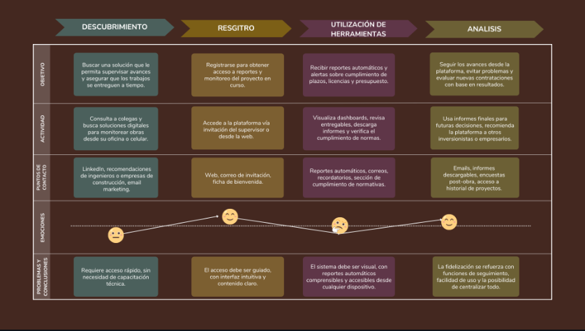

_Nota._ Elaboración propia.

### 2.3.4. Empathy Mapping

**Figura 26**
_Empathy Mapping del segmento #1: Supervisor de Obra_

<p align="center">
  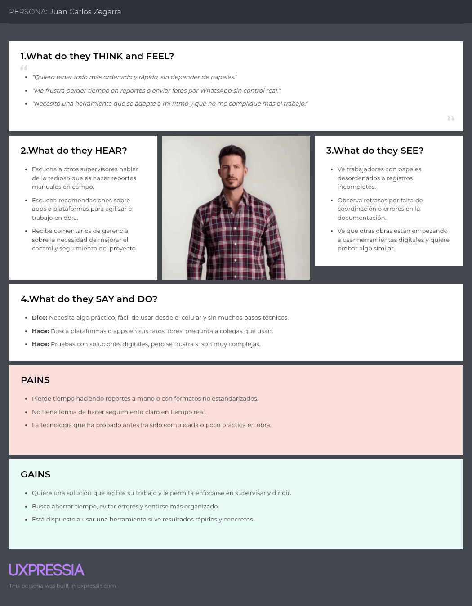
</p>

_Nota._ Elaboración propia.

**Figura 27**
_Empathy Mapping del segmento #2: Contratista de Empresas privadas_

<p align="center">
  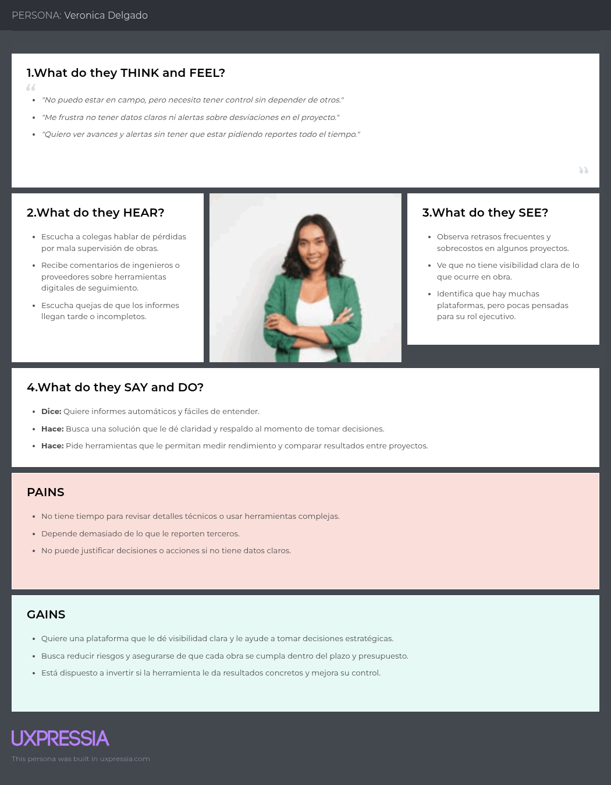
</p>

_Nota._ Elaboración propia.

### 2.3.5. As-is Scenario Mapping

<ins>**As-Is Scenario Mapping del segmento #1: Supervisores de Obra**</ins>

**Figura 28**  
_As-Is Scenario Mapping para segmento #1_

<p align="center">
  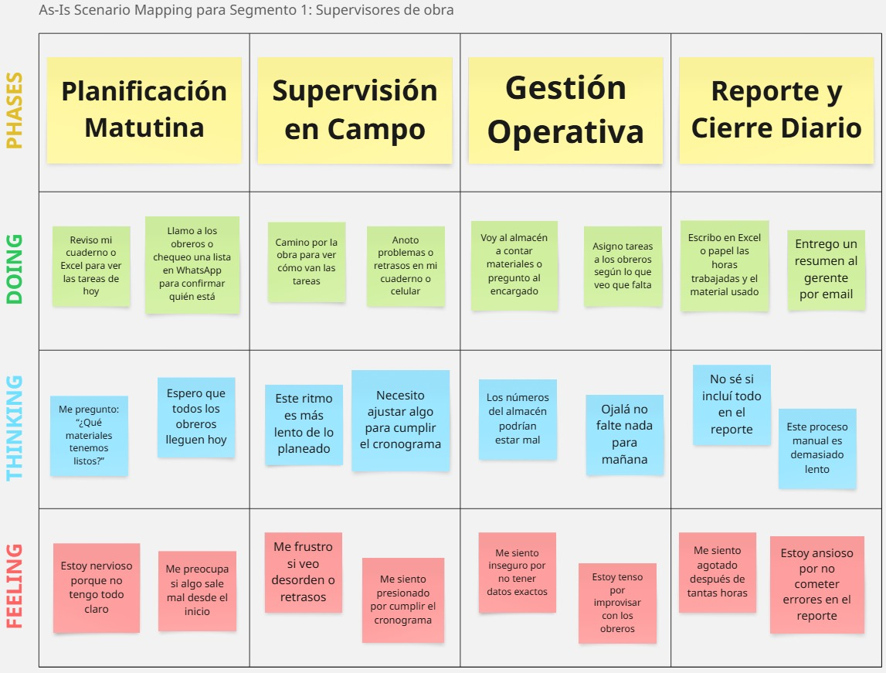
</p>

**Figura 29**  
_Áreas positivas del As-Is Scenario Mapping para segmento #1_

<p align="center">
  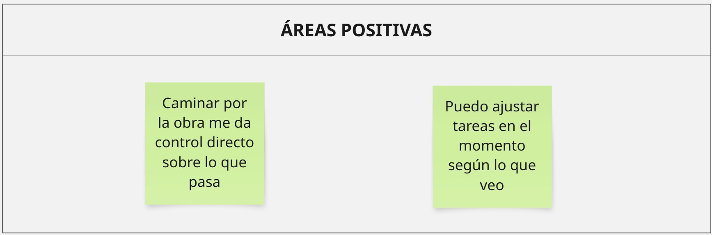
</p>

**Figura 30**  
_Áreas negativas del As-Is Scenario Mapping para segmento #1_

<p align="center">
  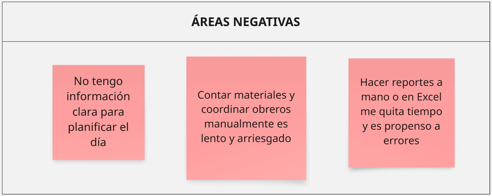
</p>

**Figura 31**  
_Blank areas del As-Is Scenario Mapping para segmento \#1_

<p align="center">
  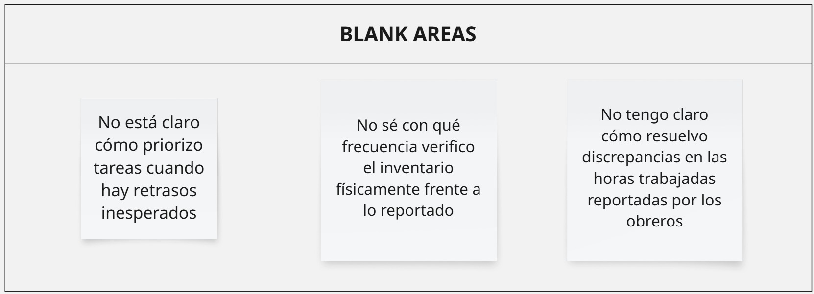
</p>

<ins>**As-Is Scenario Mapping para Segmento \# 2: Contratantes de Empresas Privadas**</ins>

**Figura 32**  
_As-Is Scenario Mapping para segmento #2_

<p align="center">
  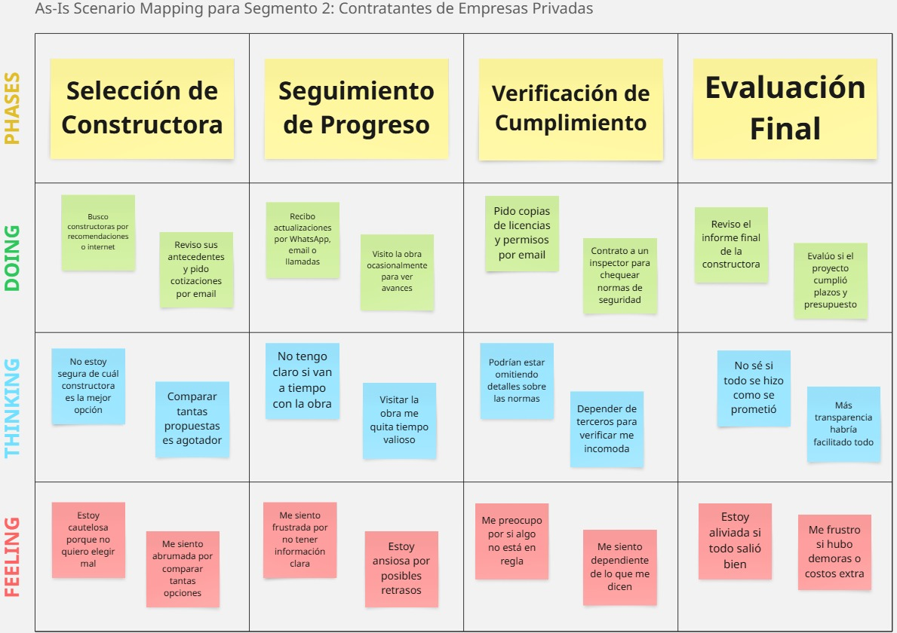
</p>

**Figura 33**  
_Áreas positivas del As-Is Scenario Mapping para segmento #2_

<p align="center">
  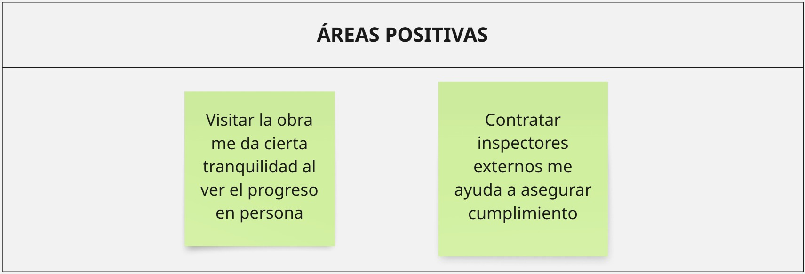
</p>

**Figura 34**  
_Áreas negativas del As-Is Scenario Mapping para segmento #2_

<p align="center">
  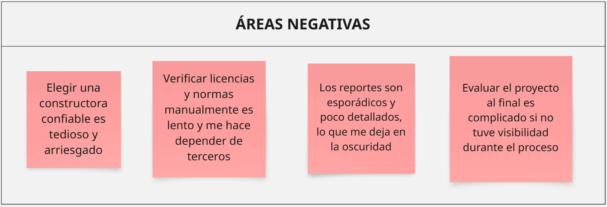
</p>

**Figura 35**  
_Blank areas del As-Is Scenario Mapping para segmento #2_

<p align="center">
  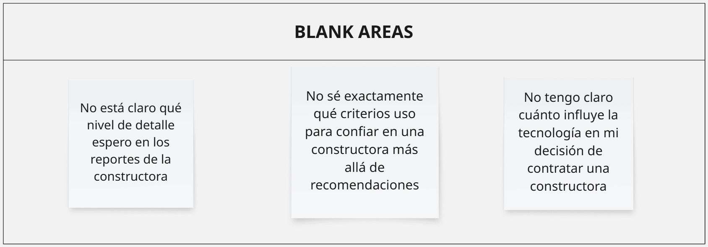
</p>

## 2.4. Ubiquitous Language

| Término (Inglés)    | Término (Español)                   | Definición                                                                                                                                 |
| :------------------ | :---------------------------------- | :----------------------------------------------------------------------------------------------------------------------------------------- |
| Construction Site   | Obra de construcción                | Lugar físico donde se ejecuta un proyecto de construcción, gestionado por supervisores y equipos operativos.                               |
| Supervisor          | Supervisor                          | Persona responsable de coordinar y controlar las actividades diarias en la obra, incluyendo personal, materiales y cumplimiento de plazos. |
| Contractor          | Contratante                         | Empresa o persona que encarga una obra y espera su ejecución conforme a los estándares, plazos y regulaciones establecidos.                |
| Resource            | Recurso                             | Elemento necesario para el desarrollo de la obra, como materiales de construcción, maquinaria o personal.                                  |
| Attendance          | Asistencia                          | Registro diario de la presencia del personal obrero o técnico en la obra.                                                                  |
| Offline Mode        | Modo sin conexión                   | Funcionalidad que permite usar la aplicación sin {acceso a internet, sincronizando los datos al reconectarse.                              |
| Progress Report     | Reporte de avance                   | Documento o visualización que resume el estado actual del proyecto, incluyendo tareas realizadas, tiempos y uso de recursos.               |
| Workforce           | Mano de obra / Personal             | Grupo de trabajadores (obreros y técnicos) que participan activamente en la ejecución de la obra.                                          |
| Material Entry      | Registro de materiales              | Acción de añadir nuevos materiales o equipos al inventario dentro del sistema.                                                             |
| Stock Update        | Actualización de stock              | Modificación de las cantidades de materiales disponibles, ya sea por consumo o nueva adquisición.                                          |
| Construction Budget | Presupuesto de obra                 | Estimación financiera que define los costos proyectados del proyecto, incluyendo materiales, personal y otros gastos.                      |
| Work Order          | Orden de trabajo                    | Documento o instrucción digital que detalla tareas a realizar por el personal en obra.                                                     |
| Company Profile     | Perfil de la empresa                | Información registrada sobre la empresa constructora: nombre, contacto, tipo de proyectos, etc.                                            |
| Onboarding          | Introducción / Capacitación inicial | Proceso mediante el cual nuevos usuarios aprenden a usar la plataforma por medio de videos y tutoriales guiados.                           |

# Capítulo III: Requirements Specification

## 3.1. To-Be Scenario Mapping

<ins>**To-Be Scenario Mapping del segmento #1: Supervisores de obra**</ins>

**Figura 36**  
_To-Be Scenario Mapping del segmento #1_

<p align="center">
  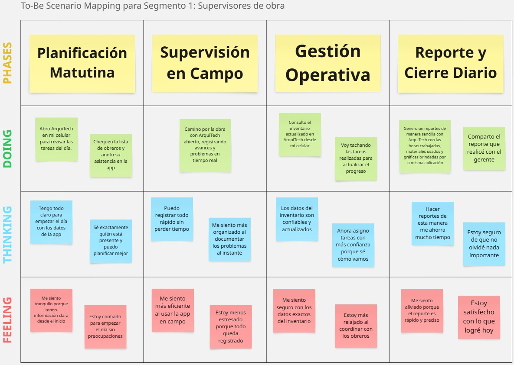
</p>

**Figura 37**  
_Áreas positivas del To-Be Scenario Mapping para segmento #1_

<p align="center">
  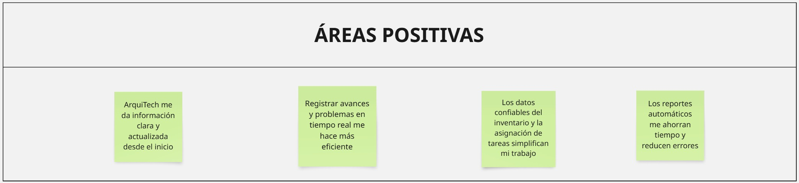
</p>

**Figura 38**  
_Áreas negativas del To-Be Scenario Mapping para segmento #1_

<p align="center">
  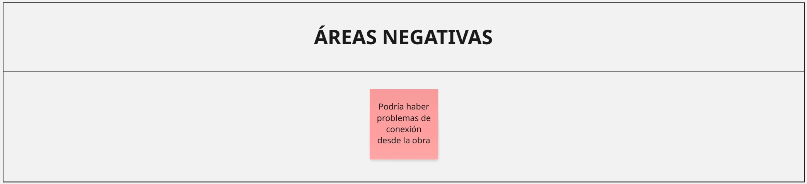
</p>

**Figura XX**

<p align="center">
  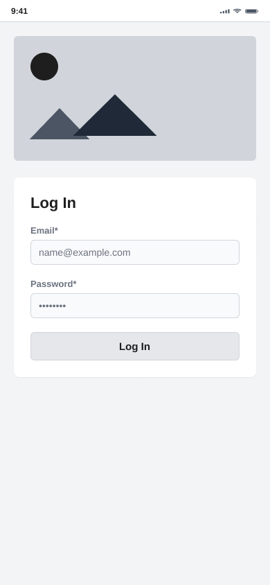
<br><i>Nota.</i> Elaboración propia.
</p>

<br>

**Figura XX**

<p align="center">
  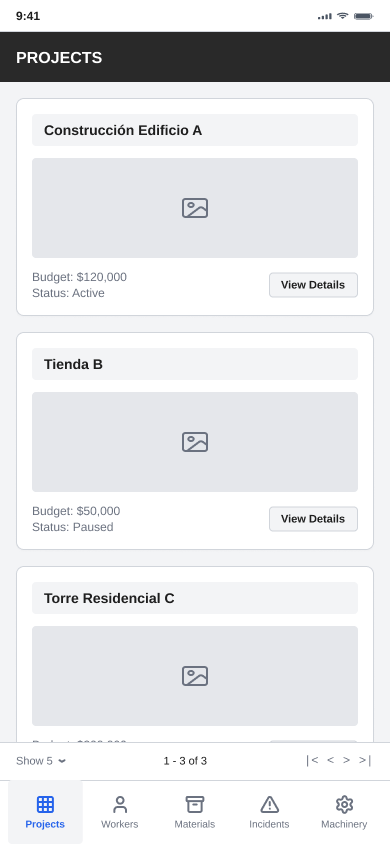
<br><i>Nota.</i> Elaboración propia.
</p>

<br>

**Figura XX**

<p align="center">
  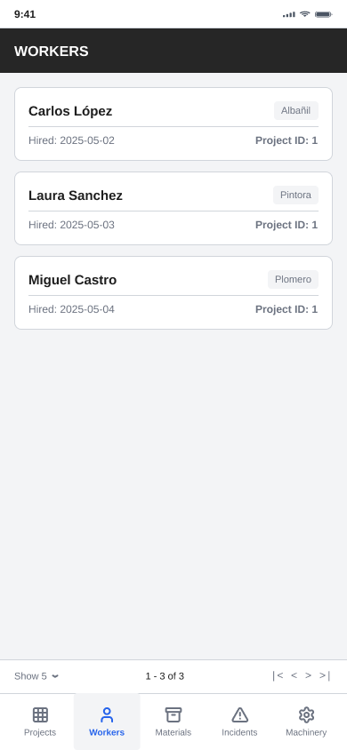
<br><i>Nota.</i> Elaboración propia.
</p>

<br>

**Figura XX**

<p align="center">
  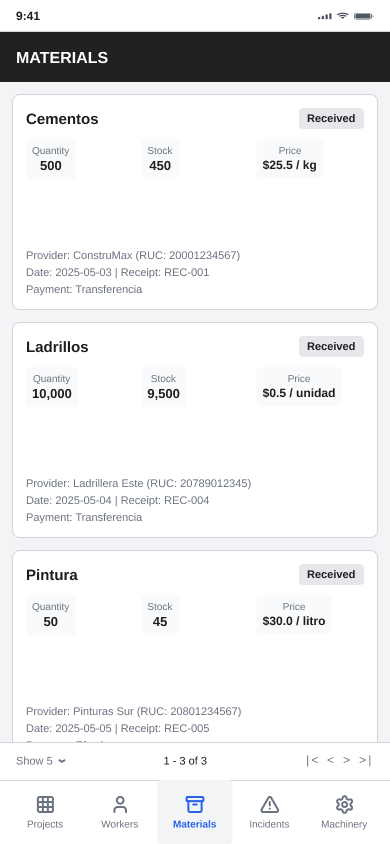
<br><i>Nota.</i> Elaboración propia.
</p>

<br>

**Figura XX**

<p align="center">
  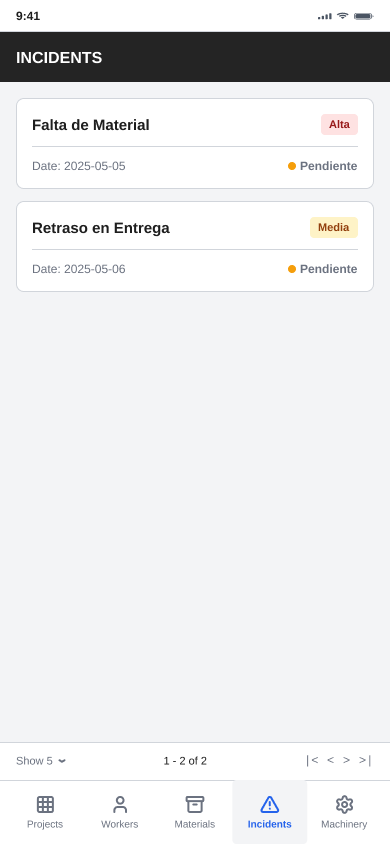
<br><i>Nota.</i> Elaboración propia.
</p>

<br>

**Figura XX**

<p align="center">
  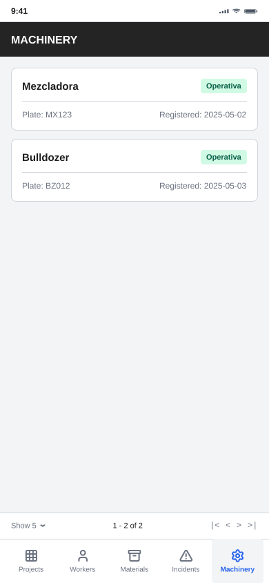
<br><i>Nota.</i> Elaboración propia.
</p>

### 4.4.2. Mobile Applications Wireflow Diagrams

**Segmento #2: Contratantes de empresas privadas**

**User Goal 1: Supervisión de materiales y personal de obra**

Como usuario, quiero poder visualizar desde la aplicación móvil la lista de proyectos que posee mi empresa junto con la información de materiales y trabajadores asociados, para mantener un mejor control y supervisión de los recursos y del personal de cada obra.

**Wireflow:**

**Figura XX**

<p align="center">

  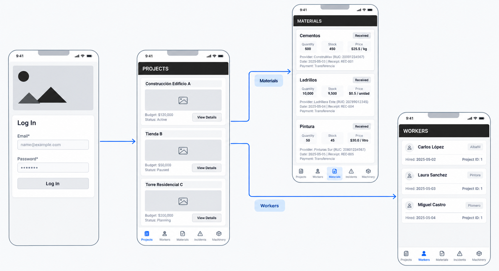

<br>*Nota.* Elaboración propia.

</p>

Para obtener la información de materiales y trabajadores que brinda ArquiTech desde la aplicación móvil, el usuario debe acceder primero mediante la pantalla de inicio de sesión. Luego, puede visualizar la lista de proyectos asociados a su empresa desde la pantalla principal de proyectos. A partir de esta vista, el usuario puede dirigirse a la sección de materiales, donde se muestran datos como la cantidad registrada, el stock disponible, el precio y el proveedor. Del mismo modo, puede acceder a la sección de trabajadores, donde se presenta información como el nombre del trabajador, su rol, la fecha de contratación y el proyecto al que se encuentra asociado.


**Segmento #1: Supervisores de obra**

**User Goal 1: Gestión de maquinarias e incidentes**

Como usuario, quiero consultar desde la aplicación móvil las maquinarias utilizadas en los proyectos y los incidentes registrados durante la ejecución de las obras, para mantener una visión general sobre la disponibilidad de los equipos y las situaciones que pueden afectar la seguridad y el desarrollo del proyecto.

**Wireflow:**

**Figura XX**

<p align="center">

  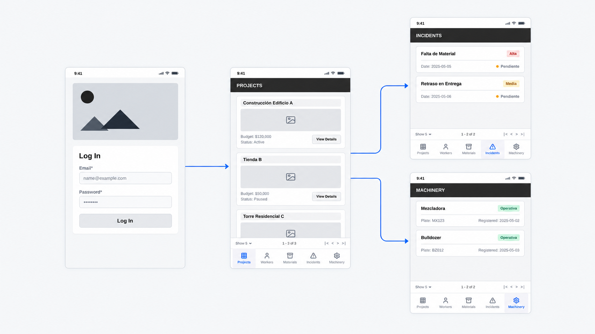

<br>*Nota.* Elaboración propia.

</p>

Para acceder a las secciones de maquinarias e incidentes desde la aplicación móvil, el supervisor debe iniciar sesión y acceder a la pantalla principal de proyectos. Desde esta vista, puede dirigirse a la sección de incidentes para consultar información como la fecha en la que ocurrió cada evento, su tipo, nivel de severidad y estado de resolución. Asimismo, puede acceder a la sección de maquinaria para visualizar los equipos registrados, incluyendo datos como el nombre de la maquinaria, su licencia o placa, la fecha de registro y su estado de funcionamiento.

### 4.4.3. Mobile Applications Mock-ups

**Figura XX**

<p align="center">
  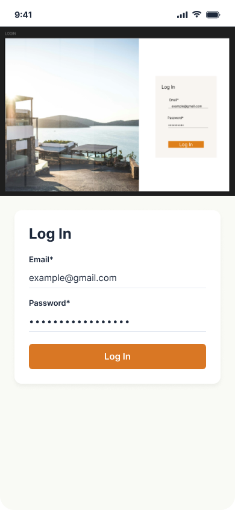
<br><i>Nota.</i> Elaboración propia.
</p>

<br>

**Figura XX**

<p align="center">
  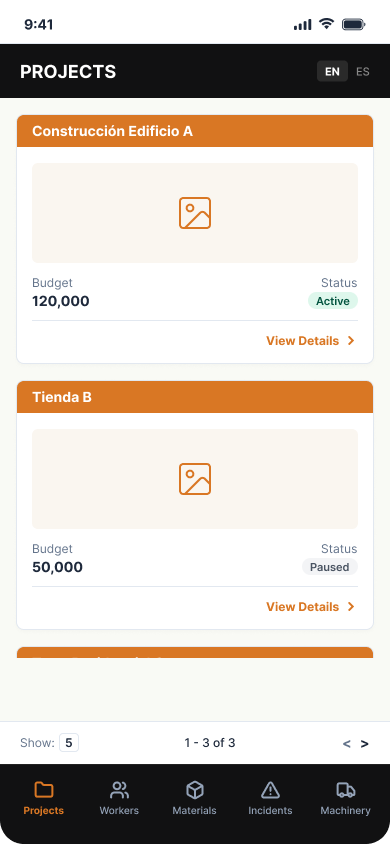
<br><i>Nota.</i> Elaboración propia.
</p>

<br>

**Figura XX**

<p align="center">
  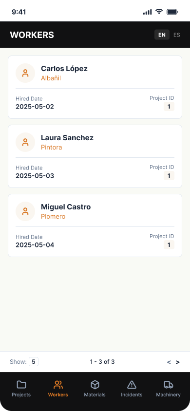
<br><i>Nota.</i> Elaboración propia.
</p>

<br>

**Figura XX**

<p align="center">
  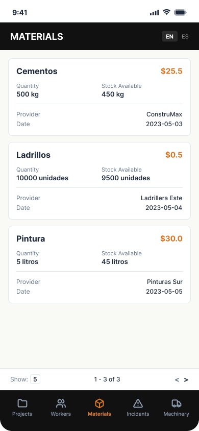
<br><i>Nota.</i> Elaboración propia.
</p>

<br>

**Figura XX**

<p align="center">
  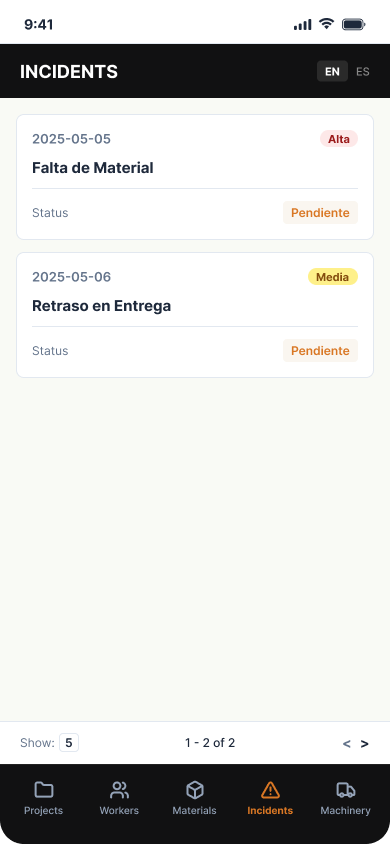
<br><i>Nota.</i> Elaboración propia.
</p>

<br>

**Figura XX**

<p align="center">
  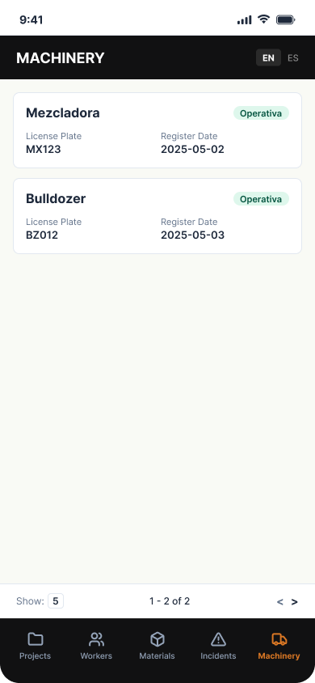
<br><i>Nota.</i> Elaboración propia.
</p>

### 4.4.4. Mobile Applications User Flow Diagrams

**Segmento 1: Supervisores de obra**

**User Goal 1:** Gestionar y controlar materiales de construcción  
**Descripción:** El supervisor desea consultar y controlar desde la aplicación móvil la disponibilidad, stock y demás información de los materiales asociados a una obra para mantener un mejor control de los recursos utilizados durante el desarrollo del proyecto.

**Figura XX**  
*Mobile User Flow 1*

<p align="center">

  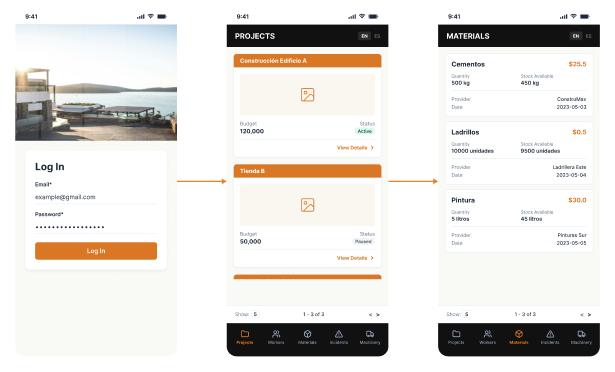

<br>*Nota.* Elaboración propia.

</p>


**User Goal 2:** Controlar la asistencia y roles de los trabajadores  
**Descripción:** El supervisor necesita consultar y gestionar desde la aplicación móvil la información de los trabajadores asignados a la obra, incluyendo sus roles, asistencia, tareas y responsabilidades dentro del proyecto.

**Figura XX**  
*Mobile User Flow 2*

<p align="center">

  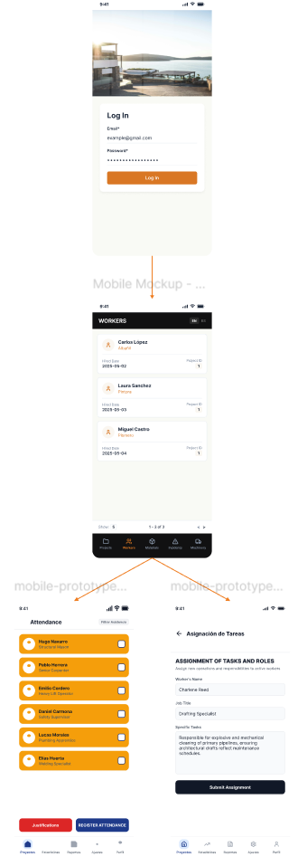

<br>*Nota.* Elaboración propia.

</p>


**User Goal 3:** Consultar incidencias en obra  
**Descripción:** El supervisor desea consultar desde la aplicación móvil los incidentes registrados durante la ejecución de la obra para conocer su tipo, fecha, nivel de severidad y estado de resolución.

**Figura XX**  
*Mobile User Flow 3*

<p align="center">

  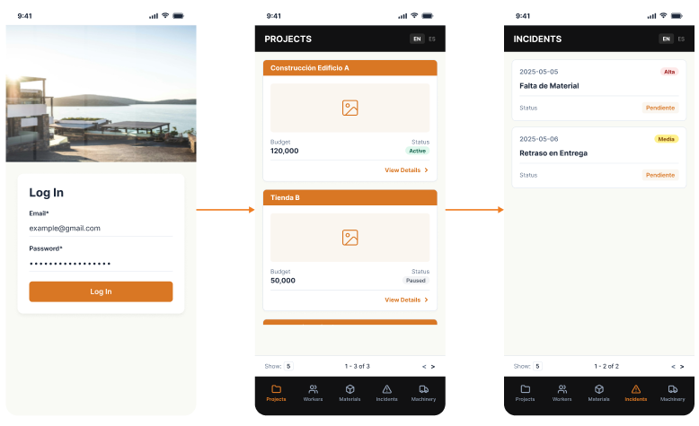

<br>*Nota.* Elaboración propia.

</p>

**Segmento Objetivo #2: Contratantes de Empresas Privadas**

**User Goal 1:** Visualizar el estado y progreso de mis obras contratadas
**Descripción:** El contratante necesita consultar desde la aplicación móvil las obras asociadas a su empresa, con acceso a información clara y actualizada sobre el estado general de cada proyecto.

**Figura XX**  
*Mobile User Flow 4*

<p align="center">

  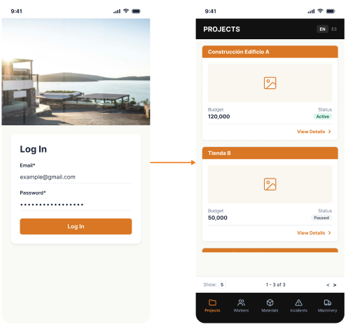

<br>*Nota.* Elaboración propia.

</p>


**User Goal 2:** Visualizar el uso y estado de la maquinaria asignada a la obra  
**Descripción:** El contratante desea consultar desde la aplicación móvil las maquinarias asociadas a sus obras para conocer los equipos disponibles, su identificación, fecha de registro y estado operativo.

**Figura XX**  
*Mobile User Flow 5*

<p align="center">

  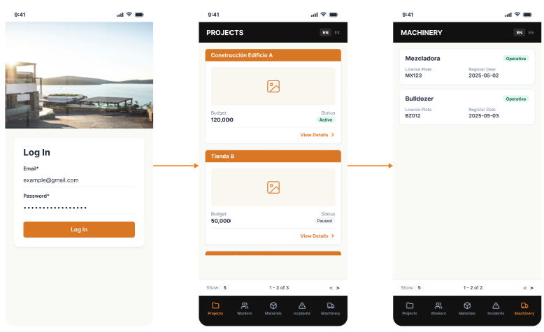

<br>*Nota.* Elaboración propia.

</p>


**User Goal 3:** Ver detalles del consumo y disponibilidad de materiales 
**Descripción:** El contratante desea consultar desde la aplicación móvil la información de los materiales asociados a las obras para evaluar la cantidad registrada, el stock disponible, los proveedores y el uso de los recursos del proyecto.

**Figura XX**  
*Mobile User Flow 6*

<p align="center">

  

<br>*Nota.* Elaboración propia.

</p>

## 4.5. Mobile Applications Prototyping

Nuestro producto encaja al momento de iniciar la supervisión de un aspecto del proyecto que se está administrando en ese momento o se quiere revisar el avance y buen manejo.

- **¿Qué problemas tiene nuestro producto y cómo se pueden resolver?**
  - La dependencia del internet en la obra para poder utilizar el aplicativo el cual se puede solucionar incluyendo un modo offline que sincronice datos al reconectarse a una red de internet.
  - El soporte técnico insuficiente para picos de demanda, en caso de un aumento repentino de usuarios se podría saturar el soporte técnico, frustrando a clientes que esperan respuestas rápidas. Este problema lo podremos solucionar creando una base de conocimientos con videos y guías para resolver dudas comunes y evitar un número masivo de consultas.
  <p align="center">
    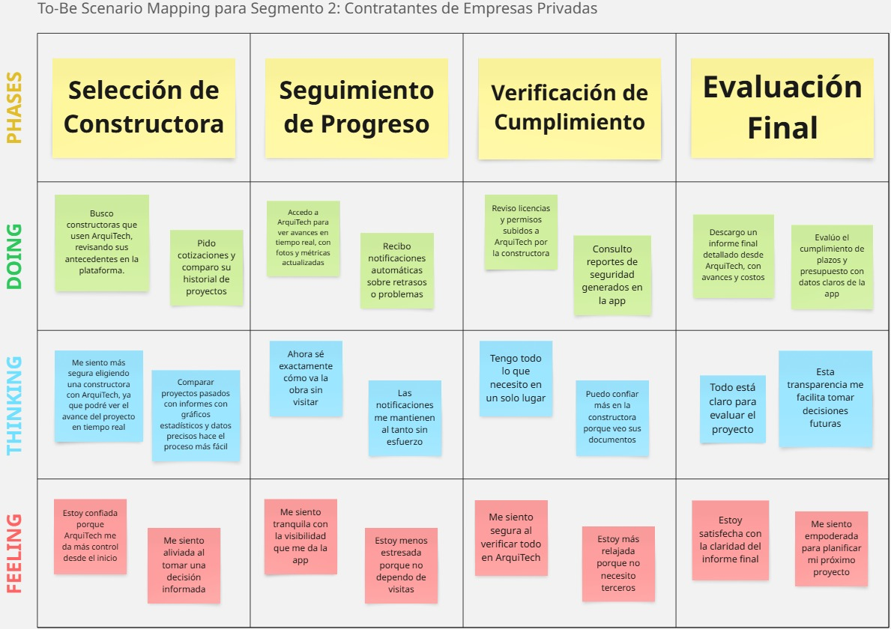
  </p>

**Figura 41**  
_Áreas positivas del To-Be Scenario Mapping para segmento #2_

<p align="center">
  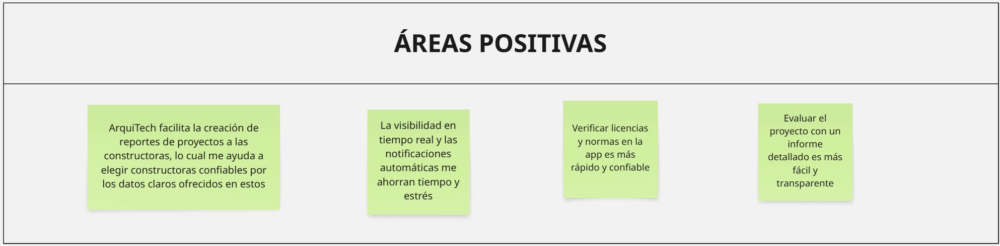
</p>

Nuestro producto puede ser usado al inicio del día para planificar (confirmar asistencia, revisar inventario), durante el día para monitorear (actualizar avances) y al final para generar y/o revisar reportes.
**Figura 42**  
_Áreas negativas del To-Be Scenario Mapping para segmento #2_

<p align="center">
  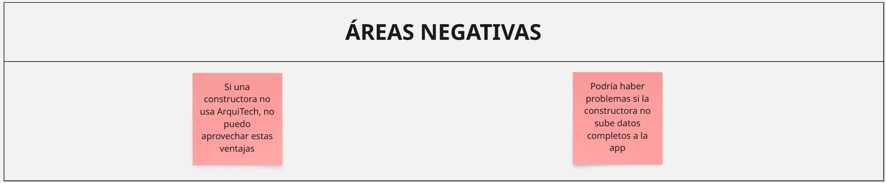
</p>

Nuestro producto debe contar con una interfaz intuitiva, fácil de usar y aprender por nuestros usuarios, también debe contar con una buena sincronización de datos para poder tener un buen seguimiento de los distintos aspectos de la obra.

<ins>**Segmento 1: Supervisores de obra**</ins>

**User Goal 1:** Gestionar y controlar materiales de construcción  
**Descripción:** El supervisor desea registrar el ingreso, uso y nivel de materiales en obra para evitar desperdicios y garantizar continuidad en las actividades.

**Figura 67**  
_User flow 1_

<p align="center">
   
	
<br>*Nota.* Elaboración propia. 
</p>

**User Goal 2:** Controlar la asistencia y roles de los trabajadores  
**Descripción:** El supervisor debe tener control total sobre el personal: quién está presente, qué tarea cumple y qué rol desempeña.

**Figura 68**  
_User flow 2_

<p align="center">

	
<br>*Nota.* Elaboración propia.

**User Goal 3:** Reportar incidencias en obra  
**Descripción:** El supervisor reporta eventos importantes en campo (fallas de maquinaria, ausencias masivas, problemas logísticos).

**Figura 69**  
_User flow 3_

<p align="center">


<br>_Nota._ Elaboración propia.

<ins>**Segmento Objetivo #2: Contratantes de Empresas Privadas**</ins>

**User Goal 1:** Visualizar el estado y progreso de mis obras contratadas (solo lectura)  
**Descripción:** El contratante necesita consultar las obras activas donde ha contratado los servicios, con acceso a información clara y actualizada.

**Figura 70**  
_User flow 4_

<p align="center">


<br>_Nota._ Elaboración propia.

**User Goal 2:** Visualizar el uso y estado de la maquinaria asignada a la obra  
**Descripción:** Permitir que el contratante consulte, en tiempo real y de forma clara, qué maquinarias están siendo utilizadas en sus obras, cuál es su estado operativo y cómo impactan en el avance del proyecto.

**Figura 71**  
_User flow 5_

<p align="center">

</p>

_Nota._ Elaboración propia.

**User Goal 3:** Ver detalles del consumo de materiales y reportes de avance (en modo solo lectura)  
**Descripción:** El contratante desea evaluar cómo se están utilizando los recursos materiales y verificar si el avance reportado está alineado con lo esperado.

**Figura 72**  
_User flow 6_

<p align="center">

</p>

_Nota._ Elaboración propia.

## 4.7. Web Applications Prototyping

La interfaz de nuestro producto debe ser intuitiva y resposive con un diseño que transmita confianza y profesionalismo y que sea de respuesta rápida.

<p align="center">
  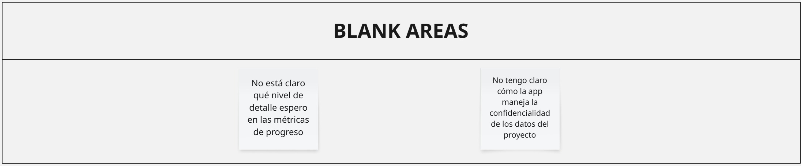
</p>

## 3.2. User Stories

En esta sección se presentan los Epics, User Stories, Technical Stories y Spike Stories definidos para ArquiTech. Las historias funcionales representan las necesidades de los principales segmentos de usuario del producto digital: supervisores de obra, contratantes y visitantes de la Landing Page. Las Technical Stories representan capacidades técnicas necesarias para soportar dichas funcionalidades y utilizan el rol `Developer`. Finalmente, las Spike Stories representan actividades de investigación, análisis o validación técnica necesarias para reducir incertidumbre antes de realizar modificaciones o extensiones sobre el producto.

Dentro del contexto de ArquiTech se mantiene un lenguaje ubicuo consistente empleando términos como Proyecto, Supervisor de Obra, Contratante, Material, Movimiento de Material, Trabajador, Tarea, Maquinaria, Incidencia y Reporte Semanal. Estos términos se utilizan de manera uniforme en las historias y representan conceptos propios del dominio de gestión y seguimiento de obras de construcción.

Los Acceptance Criteria se expresan mediante la estructura Given-When-Then (Dado-Cuando-Entonces), utilizando tiempo presente y tercera persona. Para las historias relacionadas con APIs REST, los criterios representan escenarios de interacción request/response. Para las Spike Stories, los criterios establecen los resultados verificables que determinan la finalización de la investigación.

La numeración conserva la trazabilidad con el backlog del proyecto reutilizado. Por este motivo existen saltos entre algunos identificadores, correspondientes a historias previamente eliminadas, fusionadas o reclasificadas.

| Story ID | User                         | Priority | Epic | Title                                                              | Description                                                                                                                                                                                                             | Acceptance Criteria                                                                                                                                                                                                                                                                                                                                                                                                                                                                  |
| -------- | ---------------------------- | -------- | ---- | ------------------------------------------------------------------ | ----------------------------------------------------------------------------------------------------------------------------------------------------------------------------------------------------------------------- | ------------------------------------------------------------------------------------------------------------------------------------------------------------------------------------------------------------------------------------------------------------------------------------------------------------------------------------------------------------------------------------------------------------------------------------------------------------------------------------ |
| EP01     | —                            | Alta     | —    | Gestión de inventarios y materiales                                | Agrupa las funcionalidades relacionadas con materiales, movimientos de inventario y maquinaria utilizada en los proyectos.                                                                                              | —                                                                                                                                                                                                                                                                                                                                                                                                                                                                                    |
| HU01     | Supervisor de obra           | Alta     | EP01 | Registrar entrada de materiales                                    | Como supervisor de obra, deseo registrar la entrada de materiales para mantener actualizado el inventario de una obra.                                                                                                  | AC1: Dado que el supervisor gestiona un proyecto válido, cuando registra una entrada de material con datos válidos, entonces el sistema almacena el movimiento y actualiza la disponibilidad del material.<br><br>AC2: Dado que la información requerida para la entrada es inválida o incompleta, cuando el supervisor intenta registrar el movimiento, entonces el sistema rechaza la operación y conserva el inventario sin modificaciones.                                       |
| HU02     | Supervisor de obra           | Alta     | EP01 | Registrar uso o salida de materiales                               | Como supervisor de obra, deseo registrar los materiales utilizados en una obra para mantener actualizado el stock disponible.                                                                                           | AC1: Dado que un material posee stock suficiente, cuando el supervisor registra una cantidad utilizada válida, entonces el sistema descuenta dicha cantidad y registra la salida correspondiente.<br><br>AC2: Dado que la cantidad solicitada supera el stock disponible, cuando el supervisor intenta registrar la salida, entonces el sistema rechaza la operación y conserva el stock existente.                                                                                  |
| HU04     | Supervisor de obra           | Alta     | EP01 | Consultar historial de movimientos de materiales                   | Como supervisor de obra, deseo consultar las entradas y salidas de materiales para realizar seguimiento de los movimientos del inventario.                                                                              | AC1: Dado que existen movimientos asociados al proyecto, cuando el supervisor consulta el historial, entonces el sistema presenta las entradas y salidas registradas con su información correspondiente.<br><br>AC2: Dado que el proyecto no posee movimientos registrados, cuando el supervisor consulta el historial, entonces el sistema devuelve un resultado vacío sin alterar la información existente.                                                                        |
| HU05     | Supervisor de obra           | Alta     | EP01 | Registrar maquinaria                                               | Como supervisor de obra, deseo registrar maquinaria asociada a una obra para mantener control sobre los recursos utilizados en el proyecto.                                                                             | AC1: Dado que el proyecto existe, cuando el supervisor registra una maquinaria con información válida, entonces el sistema almacena la maquinaria asociada al proyecto.<br><br>AC2: Dado que los datos de la maquinaria no cumplen las condiciones requeridas, cuando se solicita su registro, entonces el sistema rechaza la operación y no crea el recurso.                                                                                                                        |
| HU28     | Supervisor de obra           | Alta     | EP01 | Consultar materiales                                               | Como supervisor de obra, deseo consultar los materiales registrados en una obra para conocer su disponibilidad e información asociada.                                                                                  | AC1: Dado que existen materiales registrados, cuando el supervisor consulta los materiales de una obra, entonces el sistema devuelve la información correspondiente a los materiales disponibles.<br><br>AC2: Dado que no existen materiales asociados, cuando el supervisor realiza la consulta, entonces el sistema devuelve un resultado vacío sin generar modificaciones.                                                                                                        |
| HU29     | Supervisor de obra           | Alta     | EP01 | Actualizar información de materiales                               | Como supervisor de obra, deseo actualizar la información de un material para mantener correctos los datos del inventario.                                                                                               | AC1: Dado que el material existe, cuando el supervisor proporciona nuevos datos válidos, entonces el sistema actualiza la información del material.<br><br>AC2: Dado que el material no existe o los nuevos datos son inválidos, cuando se solicita la actualización, entonces el sistema rechaza la operación y conserva la información previa.                                                                                                                                     |
| HU30     | Supervisor de obra           | Alta     | EP01 | Consultar maquinaria                                               | Como supervisor de obra, deseo consultar la maquinaria registrada en una obra para conocer los recursos disponibles y su estado.                                                                                        | AC1: Dado que existe maquinaria asociada al proyecto, cuando el supervisor realiza la consulta, entonces el sistema devuelve la información de las maquinarias registradas.<br><br>AC2: Dado que no existe maquinaria asociada, cuando el supervisor realiza la consulta, entonces el sistema devuelve un resultado vacío.                                                                                                                                                           |
| HU31     | Supervisor de obra           | Alta     | EP01 | Actualizar información de maquinaria                               | Como supervisor de obra, deseo actualizar la información de una maquinaria para mantener vigente su información operativa.                                                                                              | AC1: Dado que la maquinaria existe, cuando el supervisor proporciona información válida, entonces el sistema actualiza sus datos.<br><br>AC2: Dado que la maquinaria no existe o la información es inválida, cuando se solicita la actualización, entonces el sistema rechaza la operación y conserva la información existente.                                                                                                                                                      |
| HU40     | Contratante                  | Alta     | EP01 | Consultar materiales de una obra                                   | Como contratante, deseo consultar los materiales asociados a una obra para conocer los recursos registrados en el proyecto.                                                                                             | AC1: Dado que el contratante tiene acceso al proyecto, cuando consulta sus materiales, entonces el sistema devuelve los materiales asociados al proyecto.<br><br>AC2: Dado que no existen materiales registrados, cuando el contratante realiza la consulta, entonces el sistema devuelve un resultado vacío.                                                                                                                                                                        |
| HU41     | Contratante                  | Alta     | EP01 | Consultar maquinaria de una obra                                   | Como contratante, deseo consultar la maquinaria asociada a una obra para conocer los recursos utilizados en el proyecto.                                                                                                | AC1: Dado que el contratante tiene acceso al proyecto, cuando consulta la maquinaria, entonces el sistema devuelve los recursos de maquinaria asociados.<br><br>AC2: Dado que no existe maquinaria registrada, cuando se realiza la consulta, entonces el sistema devuelve un resultado vacío.                                                                                                                                                                                       |
| HU47     | Supervisor de obra           | Alta     | EP01 | Eliminar material                                                  | Como supervisor de obra, deseo eliminar un material que ya no debe formar parte del registro para mantener actualizado el inventario.                                                                                   | AC1: Dado que el material existe y puede eliminarse, cuando el supervisor solicita su eliminación, entonces el sistema elimina el material registrado.<br><br>AC2: Dado que el material no existe, cuando se solicita su eliminación, entonces el sistema rechaza la operación y no modifica el inventario.                                                                                                                                                                          |
| HU48     | Supervisor de obra           | Alta     | EP01 | Eliminar maquinaria                                                | Como supervisor de obra, deseo eliminar una maquinaria que ya no debe permanecer registrada para mantener actualizados los recursos de la obra.                                                                         | AC1: Dado que la maquinaria existe, cuando el supervisor solicita su eliminación, entonces el sistema elimina el registro correspondiente.<br><br>AC2: Dado que la maquinaria no existe, cuando se solicita su eliminación, entonces el sistema informa que el recurso no se encuentra disponible y no realiza modificaciones.                                                                                                                                                       |
| EP02     | —                            | Alta     | —    | Gestión de trabajadores y tareas                                   | Agrupa las funcionalidades relacionadas con trabajadores y las actividades asignadas durante la ejecución de los proyectos.                                                                                             | —                                                                                                                                                                                                                                                                                                                                                                                                                                                                                    |
| HU06     | Supervisor de obra           | Alta     | EP02 | Registrar trabajadores                                             | Como supervisor de obra, deseo registrar trabajadores para mantener actualizada la información del personal asociado a las obras.                                                                                       | AC1: Dado que existe un proyecto válido, cuando el supervisor registra un trabajador con información válida, entonces el sistema almacena al trabajador asociado al proyecto.<br><br>AC2: Dado que la información del trabajador es inválida o incompleta, cuando se solicita su registro, entonces el sistema rechaza la operación y no crea el trabajador.                                                                                                                         |
| HU07     | Supervisor de obra           | Alta     | EP02 | Asignar tareas a trabajadores                                      | Como supervisor de obra, deseo asignar tareas a los trabajadores para organizar las actividades necesarias durante la ejecución de la obra.                                                                             | AC1: Dado que el trabajador está registrado, cuando el supervisor crea una tarea válida asociada al trabajador, entonces el sistema registra la tarea y su asignación.<br><br>AC2: Dado que el trabajador no existe o la información de la tarea es inválida, cuando se intenta realizar la asignación, entonces el sistema rechaza la operación.                                                                                                                                    |
| HU08     | Supervisor de obra           | Alta     | EP02 | Consultar tareas                                                   | Como supervisor de obra, deseo consultar las tareas registradas para conocer sus responsables, fechas y estado de ejecución.                                                                                            | AC1: Dado que existen tareas registradas, cuando el supervisor consulta las tareas, entonces el sistema devuelve la información correspondiente a cada actividad.<br><br>AC2: Dado que no existen tareas asociadas, cuando se realiza la consulta, entonces el sistema devuelve un resultado vacío.                                                                                                                                                                                  |
| HU10     | Supervisor de obra           | Alta     | EP02 | Consultar trabajadores de una obra                                 | Como supervisor de obra, deseo consultar los trabajadores asociados a una obra para conocer el personal participante en el proyecto.                                                                                    | AC1: Dado que existen trabajadores asociados al proyecto, cuando el supervisor realiza la consulta, entonces el sistema devuelve la información del personal registrado.<br><br>AC2: Dado que el proyecto no posee trabajadores registrados, cuando se realiza la consulta, entonces el sistema devuelve un resultado vacío.                                                                                                                                                         |
| HU32     | Supervisor de obra           | Alta     | EP02 | Actualizar información de trabajadores                             | Como supervisor de obra, deseo actualizar la información de un trabajador para mantener correctos los datos del personal.                                                                                               | AC1: Dado que el trabajador existe, cuando el supervisor proporciona datos válidos actualizados, entonces el sistema modifica la información correspondiente.<br><br>AC2: Dado que el trabajador no existe o los datos son inválidos, cuando se solicita la modificación, entonces el sistema rechaza la operación y conserva los datos previos.                                                                                                                                     |
| HU42     | Contratante                  | Alta     | EP02 | Consultar trabajadores de una obra                                 | Como contratante, deseo consultar los trabajadores asociados a una obra para conocer el personal registrado en el proyecto.                                                                                             | AC1: Dado que el contratante posee acceso al proyecto, cuando consulta los trabajadores, entonces el sistema devuelve el personal asociado a la obra.<br><br>AC2: Dado que no existen trabajadores registrados, cuando se realiza la consulta, entonces el sistema devuelve un resultado vacío.                                                                                                                                                                                      |
| HU43     | Contratante                  | Alta     | EP02 | Consultar tareas de una obra                                       | Como contratante, deseo consultar las tareas asociadas a una obra para conocer las actividades registradas y su estado.                                                                                                 | AC1: Dado que existen tareas asociadas al proyecto, cuando el contratante las consulta, entonces el sistema devuelve sus datos y estado actual.<br><br>AC2: Dado que no existen tareas asociadas, cuando el contratante realiza la consulta, entonces el sistema devuelve un resultado vacío.                                                                                                                                                                                        |
| HU49     | Supervisor de obra           | Alta     | EP02 | Eliminar trabajador                                                | Como supervisor de obra, deseo eliminar el registro de un trabajador que ya no corresponde a la obra para mantener actualizado el personal del proyecto.                                                                | AC1: Dado que el trabajador existe y puede eliminarse, cuando el supervisor solicita su eliminación, entonces el sistema elimina el registro correspondiente.<br><br>AC2: Dado que el trabajador no existe, cuando se solicita su eliminación, entonces el sistema rechaza la operación y conserva los datos existentes.                                                                                                                                                             |
| HU50     | Supervisor de obra           | Alta     | EP02 | Eliminar tarea                                                     | Como supervisor de obra, deseo eliminar una tarea que ya no corresponde al plan de trabajo para mantener actualizadas las actividades de la obra.                                                                       | AC1: Dado que la tarea existe, cuando el supervisor solicita su eliminación, entonces el sistema elimina la tarea registrada.<br><br>AC2: Dado que la tarea no existe, cuando se solicita su eliminación, entonces el sistema no modifica las tareas existentes.                                                                                                                                                                                                                     |
| HU53     | Supervisor de obra           | Alta     | EP02 | Actualizar tarea                                                   | Como supervisor de obra, deseo actualizar la información y estado de una tarea para reflejar correctamente el avance de las actividades.                                                                                | AC1: Dado que la tarea existe, cuando el supervisor proporciona información válida actualizada, entonces el sistema modifica los datos y estado de la tarea.<br><br>AC2: Dado que la tarea no existe o los nuevos datos son inválidos, cuando se solicita la actualización, entonces el sistema rechaza la operación y conserva la información anterior.                                                                                                                             |
| EP03     | —                            | Alta     | —    | Gestión de proyectos                                               | Agrupa las funcionalidades necesarias para registrar y consultar proyectos de construcción y sus responsables.                                                                                                          | —                                                                                                                                                                                                                                                                                                                                                                                                                                                                                    |
| HU09     | Supervisor de obra           | Alta     | EP03 | Registrar proyecto de construcción                                 | Como supervisor de obra, deseo registrar un proyecto para gestionar la información correspondiente a una nueva obra.                                                                                                    | AC1: Dado que los responsables y la información del proyecto son válidos, cuando el supervisor registra el proyecto, entonces el sistema almacena la nueva obra con sus datos correspondientes.<br><br>AC2: Dado que la información obligatoria es inválida o incompleta, cuando se intenta registrar el proyecto, entonces el sistema rechaza la operación y no crea el proyecto.                                                                                                   |
| HU22     | Supervisor de obra           | Alta     | EP03 | Consultar proyectos bajo supervisión                               | Como supervisor de obra, deseo consultar los proyectos asociados a mi gestión para realizar seguimiento de las obras bajo mi responsabilidad.                                                                           | AC1: Dado que existen proyectos asociados al supervisor, cuando este consulta sus proyectos, entonces el sistema devuelve las obras correspondientes.<br><br>AC2: Dado que no existen proyectos asociados, cuando el supervisor realiza la consulta, entonces el sistema informa que no existen proyectos registrados para dicho usuario.                                                                                                                                            |
| HU33     | Contratante                  | Alta     | EP03 | Consultar proyectos contratados                                    | Como contratante, deseo consultar los proyectos asociados a mi participación para realizar seguimiento de las obras contratadas.                                                                                        | AC1: Dado que existen proyectos asociados al contratante, cuando este consulta sus proyectos, entonces el sistema devuelve las obras correspondientes.<br><br>AC2: Dado que no existen proyectos asociados, cuando se realiza la consulta, entonces el sistema devuelve un resultado sin proyectos disponibles.                                                                                                                                                                      |
| EP04     | —                            | Media    | —    | Landing Page y comunicación                                        | Agrupa las historias relacionadas con la presentación pública de ArquiTech, sus características, propuesta de valor y canales de comunicación.                                                                          | —                                                                                                                                                                                                                                                                                                                                                                                                                                                                                    |
| HU11     | Visitante                    | Media    | EP04 | Conocer ArquiTech                                                  | Como visitante, deseo conocer la propuesta de ArquiTech para comprender el propósito de la solución y los problemas que busca resolver.                                                                                 | AC1: Dado que el visitante accede al contenido público de ArquiTech, cuando consulta la información de la solución, entonces el sistema presenta su propósito y propuesta de valor.<br><br>AC2: Dado que el visitante desea obtener mayor contexto sobre la solución, cuando consulta la información institucional, entonces el sistema presenta información que permite comprender el enfoque de ArquiTech.                                                                         |
| HU12     | Visitante                    | Media    | EP04 | Consultar medios de contacto                                       | Como visitante, deseo conocer los medios de contacto de ArquiTech para disponer de canales mediante los cuales comunicarme con el equipo responsable.                                                                   | AC1: Dado que el visitante desea contactar a ArquiTech, cuando consulta la información de contacto, entonces el sistema proporciona los medios de comunicación disponibles.<br><br>AC2: Dado que el visitante consulta la información pública de contacto, cuando revisa los datos disponibles, entonces el sistema mantiene accesible información de contacto comprensible y vigente.                                                                                               |
| HU13     | Visitante                    | Media    | EP04 | Explorar características y beneficios                              | Como visitante, deseo conocer las principales características y beneficios de ArquiTech para evaluar si la solución responde a mis necesidades.                                                                         | AC1: Dado que el visitante desea conocer las capacidades de ArquiTech, cuando consulta la información del producto, entonces el sistema presenta sus principales características.<br><br>AC2: Dado que el visitante evalúa el valor de la solución, cuando consulta sus beneficios, entonces el sistema presenta información sobre los resultados que ArquiTech busca aportar a la gestión de obras.                                                                                 |
| HU34     | Visitante                    | Media    | EP04 | Acceder a la plataforma desde la Landing Page                      | Como visitante, deseo acceder a la plataforma de ArquiTech desde el sitio público para comenzar a utilizar el producto digital.                                                                                         | AC1: Dado que el visitante decide utilizar ArquiTech, cuando solicita acceder a la plataforma, entonces el sistema lo dirige al punto de acceso de la aplicación web.<br><br>AC2: Dado que el visitante accede al producto digital, cuando se completa la navegación desde el sitio público, entonces la aplicación web queda disponible para continuar con el proceso de autenticación.                                                                                             |
| EP05     | —                            | Media    | —    | Perfil, preferencias y accesibilidad                               | Agrupa las funcionalidades relacionadas con información personal, preferencias de visualización, accesibilidad e idioma del producto.                                                                                   | —                                                                                                                                                                                                                                                                                                                                                                                                                                                                                    |
| HU16     | Usuario registrado           | Media    | EP05 | Actualizar información del perfil                                  | Como usuario registrado, deseo actualizar la información de mi perfil para mantener mis datos personales configurados de acuerdo con mis preferencias.                                                                  | AC1: Dado que el usuario posee información de perfil disponible, cuando proporciona nuevos datos válidos, entonces el sistema conserva la información actualizada.<br><br>AC2: Dado que el usuario vuelve a utilizar el producto desde el mismo entorno, cuando consulta su configuración de perfil, entonces el sistema recupera la información previamente conservada.                                                                                                             |
| HU19     | Usuario registrado           | Media    | EP05 | Configurar preferencias de accesibilidad                           | Como usuario registrado, deseo configurar preferencias de accesibilidad para adaptar la experiencia de uso a mis necesidades.                                                                                           | AC1: Dado que el usuario requiere una configuración visual diferente, cuando modifica una preferencia de accesibilidad disponible, entonces el sistema aplica la configuración seleccionada.<br><br>AC2: Dado que una preferencia ha sido configurada, cuando el usuario continúa utilizando el producto, entonces el sistema mantiene la configuración aplicable al entorno actual.                                                                                                 |
| HU46     | Usuario del producto digital | Media    | EP05 | Cambiar idioma del producto                                        | Como usuario del producto digital, deseo cambiar el idioma disponible para comprender el contenido de ArquiTech en el idioma de mi preferencia.                                                                         | AC1: Dado que el contenido dispone de traducciones compatibles, cuando el usuario selecciona otro idioma, entonces el sistema presenta el contenido traducido al idioma seleccionado.<br><br>AC2: Dado que el usuario cambia el idioma durante su interacción, cuando continúa utilizando el producto, entonces el sistema conserva el contexto funcional disponible.                                                                                                                |
| EP06     | —                            | Alta     | —    | Incidencias y reportes                                             | Agrupa las funcionalidades relacionadas con el registro y seguimiento de incidencias y con la generación y consulta de reportes de proyecto.                                                                            | —                                                                                                                                                                                                                                                                                                                                                                                                                                                                                    |
| HU20     | Contratante                  | Alta     | EP06 | Consultar reporte semanal de una obra                              | Como contratante, deseo consultar un reporte semanal de una obra para conocer los principales acontecimientos y avances registrados durante la semana.                                                                  | AC1: Dado que existen datos correspondientes a la semana actual, cuando el contratante consulta el reporte de un proyecto, entonces el sistema consolida la información principal del proyecto, tareas completadas, entradas y salidas de materiales e incidencias registradas.<br><br>AC2: Dado que alguna categoría no posee registros durante la semana, cuando se genera el reporte, entonces el sistema presenta la información disponible sin impedir la consulta del reporte. |
| HU35     | Supervisor de obra           | Alta     | EP06 | Registrar incidencia                                               | Como supervisor de obra, deseo registrar una incidencia ocurrida durante la ejecución del proyecto para mantener evidencia de los problemas de la obra.                                                                 | AC1: Dado que existe un proyecto válido, cuando el supervisor registra una incidencia con información válida, entonces el sistema almacena la incidencia asociada a la obra.<br><br>AC2: Dado que la información requerida es inválida o incompleta, cuando se intenta registrar una incidencia, entonces el sistema rechaza la operación y no crea el registro.                                                                                                                     |
| HU36     | Supervisor de obra           | Alta     | EP06 | Actualizar incidencia                                              | Como supervisor de obra, deseo actualizar una incidencia para mantener vigente su información, severidad y estado.                                                                                                      | AC1: Dado que la incidencia existe, cuando el supervisor proporciona información válida actualizada, entonces el sistema modifica los datos de la incidencia.<br><br>AC2: Dado que la incidencia no existe o los datos son inválidos, cuando se solicita la actualización, entonces el sistema rechaza la operación y conserva la información anterior.                                                                                                                              |
| HU37     | Supervisor de obra           | Alta     | EP06 | Consultar incidencias                                              | Como supervisor de obra, deseo consultar las incidencias registradas para realizar seguimiento de los problemas ocurridos en una obra.                                                                                  | AC1: Dado que existen incidencias registradas, cuando el supervisor las consulta, entonces el sistema devuelve su información, severidad y estado.<br><br>AC2: Dado que no existen incidencias, cuando se realiza la consulta, entonces el sistema devuelve un resultado vacío.                                                                                                                                                                                                      |
| HU39     | Contratante                  | Alta     | EP06 | Consultar incidencias de una obra                                  | Como contratante, deseo consultar las incidencias de una obra para conocer los problemas registrados durante la ejecución del proyecto.                                                                                 | AC1: Dado que existen incidencias asociadas al proyecto, cuando el contratante las consulta, entonces el sistema devuelve la información disponible.<br><br>AC2: Dado que no existen incidencias registradas, cuando el contratante realiza la consulta, entonces el sistema devuelve un resultado vacío.                                                                                                                                                                            |
| HU51     | Supervisor de obra           | Alta     | EP06 | Eliminar incidencia                                                | Como supervisor de obra, deseo eliminar una incidencia registrada incorrectamente para mantener consistente la información del proyecto.                                                                                | AC1: Dado que la incidencia existe y puede eliminarse, cuando el supervisor solicita su eliminación, entonces el sistema elimina el registro correspondiente.<br><br>AC2: Dado que la incidencia no existe, cuando se solicita su eliminación, entonces el sistema no modifica la información disponible.                                                                                                                                                                            |
| HU52     | Contratante                  | Alta     | EP06 | Descargar reporte semanal                                          | Como contratante, deseo descargar el reporte semanal de una obra para conservar una copia de la información consolidada del proyecto.                                                                                   | AC1: Dado que el reporte semanal ha sido generado con información disponible, cuando el contratante solicita su descarga, entonces el sistema genera un documento que contiene la información del reporte.<br><br>AC2: Dado que el proceso de generación concluye correctamente, cuando el documento es producido, entonces el sistema proporciona el reporte en un formato portable para su conservación.                                                                           |
| EP07     | —                            | Alta     | —    | Autenticación y seguridad                                          | Agrupa las funcionalidades relacionadas con autenticación, autorización, sesión y acceso a recursos según el rol del usuario.                                                                                           | —                                                                                                                                                                                                                                                                                                                                                                                                                                                                                    |
| HU23     | Usuario registrado           | Alta     | EP07 | Iniciar sesión de forma segura                                     | Como usuario registrado, deseo iniciar sesión de forma segura para acceder a las funcionalidades correspondientes a mi cuenta.                                                                                          | AC1: Dado que el usuario proporciona credenciales válidas, cuando solicita iniciar sesión, entonces el sistema autentica al usuario y establece una sesión válida.<br><br>AC2: Dado que las credenciales proporcionadas son inválidas, cuando el usuario intenta iniciar sesión, entonces el sistema rechaza la autenticación y no establece una sesión.                                                                                                                             |
| HU27     | Usuario registrado           | Alta     | EP07 | Acceder a funcionalidades según el rol                             | Como usuario registrado, deseo acceder únicamente a las funcionalidades autorizadas para mi rol para utilizar ArquiTech de acuerdo con mis responsabilidades.                                                           | AC1: Dado que el usuario se encuentra autenticado con un rol autorizado, cuando solicita acceder a una funcionalidad permitida, entonces el sistema concede el acceso.<br><br>AC2: Dado que el rol del usuario no posee autorización, cuando solicita acceder a una funcionalidad restringida, entonces el sistema impide el acceso al recurso.                                                                                                                                      |
| HU44     | Usuario registrado           | Alta     | EP07 | Cerrar sesión                                                      | Como usuario registrado, deseo cerrar mi sesión para finalizar de forma segura el acceso a mi cuenta.                                                                                                                   | AC1: Dado que existe una sesión autenticada, cuando el usuario solicita finalizarla, entonces el sistema elimina la información utilizada para mantener la sesión activa.<br><br>AC2: Dado que la sesión ha finalizado, cuando se intenta acceder nuevamente a un recurso protegido, entonces el sistema requiere una nueva autenticación.                                                                                                                                           |
| EP08     | —                            | Alta     | —    | Integración y evolución técnica                                    | Agrupa capacidades y actividades técnicas transversales necesarias para integrar, validar, documentar y evolucionar los componentes reutilizados de ArquiTech.                                                          | —                                                                                                                                                                                                                                                                                                                                                                                                                                                                                    |
| TS01     | Developer                    | Alta     | EP01 | Implementar servicio para registrar entradas de materiales         | Como Developer, deseo disponer de servicios REST para registrar entradas de materiales y mantener actualizado el inventario del proyecto.                                                                               | AC1: Dado que una solicitud autenticada contiene información válida de una entrada, cuando el servicio procesa la solicitud, entonces crea el registro y devuelve la información resultante.<br><br>AC2: Dado que la solicitud contiene información inválida, cuando el servicio la procesa, entonces devuelve una respuesta de error y no modifica el inventario.                                                                                                                   |
| TS02     | Developer                    | Alta     | EP01 | Implementar servicio para registrar uso de materiales              | Como Developer, deseo disponer de un servicio REST para registrar salidas de materiales y actualizar el stock disponible.                                                                                               | AC1: Dado que existe stock suficiente, cuando el servicio recibe una solicitud válida de salida, entonces registra el movimiento y actualiza el stock.<br><br>AC2: Dado que no existe stock suficiente, cuando el servicio procesa la solicitud, entonces devuelve una respuesta de error y conserva el stock anterior.                                                                                                                                                              |
| TS03     | Developer                    | Alta     | EP01 | Validar disponibilidad de stock                                    | Como Developer, deseo validar la disponibilidad de materiales antes de procesar una salida para mantener la consistencia del inventario.                                                                                | AC1: Dado que la cantidad solicitada es menor o igual al stock disponible, cuando se procesa la operación, entonces la validación permite continuar con la salida.<br><br>AC2: Dado que la cantidad solicitada supera el stock disponible, cuando se ejecuta la validación, entonces la operación es rechazada antes de modificar los datos.                                                                                                                                         |
| TS04     | Developer                    | Alta     | EP01 | Implementar consulta de movimientos de materiales                  | Como Developer, deseo disponer de servicios REST para consultar movimientos de materiales y recuperar el historial del inventario.                                                                                      | AC1: Dado que existen movimientos almacenados, cuando se realiza una solicitud de consulta válida, entonces el servicio devuelve los movimientos correspondientes.<br><br>AC2: Dado que no existen movimientos para el criterio solicitado, cuando se realiza la consulta, entonces el servicio devuelve una colección vacía válida.                                                                                                                                                 |
| TS05     | Developer                    | Alta     | EP01 | Implementar registro de maquinaria                                 | Como Developer, deseo disponer de un servicio REST para registrar maquinaria asociada a proyectos.                                                                                                                      | AC1: Dado que la solicitud contiene información válida, cuando el servicio procesa el registro, entonces crea la maquinaria y devuelve el recurso creado.<br><br>AC2: Dado que la solicitud contiene datos incompatibles o inválidos, cuando se procesa, entonces el servicio devuelve una respuesta de error y no crea la maquinaria.                                                                                                                                               |
| TS24     | Developer                    | Alta     | EP01 | Implementar consulta de materiales                                 | Como Developer, deseo disponer de servicios REST para recuperar los materiales registrados.                                                                                                                             | AC1: Dado que existen materiales almacenados, cuando se realiza una solicitud de consulta válida, entonces el servicio devuelve los recursos correspondientes.<br><br>AC2: Dado que no existen materiales, cuando se realiza la consulta, entonces el servicio devuelve una colección vacía válida.                                                                                                                                                                                  |
| TS25     | Developer                    | Alta     | EP01 | Implementar actualización de materiales                            | Como Developer, deseo disponer de un servicio REST para actualizar materiales existentes.                                                                                                                               | AC1: Dado que el material existe y la solicitud contiene datos válidos, cuando el servicio procesa la actualización, entonces modifica el recurso y devuelve su nueva información.<br><br>AC2: Dado que el material no existe o la solicitud es inválida, cuando se procesa la actualización, entonces el servicio devuelve una respuesta de error y no altera el recurso.                                                                                                           |
| TS26     | Developer                    | Alta     | EP01 | Implementar consulta de maquinaria                                 | Como Developer, deseo disponer de servicios REST para recuperar la maquinaria registrada.                                                                                                                               | AC1: Dado que existen recursos de maquinaria, cuando se realiza una solicitud válida, entonces el servicio devuelve los recursos correspondientes.<br><br>AC2: Dado que un identificador solicitado no corresponde a una maquinaria existente, cuando se realiza la consulta individual, entonces el servicio devuelve una respuesta indicando que el recurso no existe.                                                                                                             |
| TS27     | Developer                    | Alta     | EP01 | Implementar actualización de maquinaria                            | Como Developer, deseo disponer de un servicio REST para actualizar la información de maquinaria existente.                                                                                                              | AC1: Dado que la maquinaria existe y los datos son válidos, cuando se procesa la solicitud de actualización, entonces el servicio modifica y devuelve el recurso actualizado.<br><br>AC2: Dado que la maquinaria no existe o los datos son inválidos, cuando se procesa la solicitud, entonces el servicio devuelve una respuesta de error sin alterar la información existente.                                                                                                     |
| TS34     | Developer                    | Alta     | EP01 | Implementar eliminación de materiales                              | Como Developer, deseo disponer de un servicio REST para eliminar materiales cuando la operación se encuentre autorizada.                                                                                                | AC1: Dado que el material existe, cuando se procesa una solicitud válida de eliminación, entonces el servicio elimina el recurso y devuelve una respuesta satisfactoria.<br><br>AC2: Dado que el material no existe, cuando se solicita su eliminación, entonces el servicio devuelve una respuesta de error y no modifica otros recursos.                                                                                                                                           |
| TS35     | Developer                    | Alta     | EP01 | Implementar eliminación de maquinaria                              | Como Developer, deseo disponer de un servicio REST para eliminar registros de maquinaria existentes.                                                                                                                    | AC1: Dado que la maquinaria existe, cuando el servicio procesa una solicitud válida de eliminación, entonces elimina el recurso y confirma la operación.<br><br>AC2: Dado que la maquinaria no existe, cuando se solicita su eliminación, entonces el servicio devuelve una respuesta indicando que el recurso no se encuentra disponible.                                                                                                                                           |
| TS06     | Developer                    | Alta     | EP02 | Implementar registro de trabajadores                               | Como Developer, deseo disponer de un servicio REST para registrar trabajadores asociados a proyectos.                                                                                                                   | AC1: Dado que la solicitud posee información válida de un trabajador, cuando el servicio procesa el registro, entonces crea y devuelve el trabajador correspondiente.<br><br>AC2: Dado que la información enviada es inválida, cuando se procesa la solicitud, entonces el servicio rechaza el registro y no crea el recurso.                                                                                                                                                        |
| TS07     | Developer                    | Alta     | EP02 | Implementar gestión de creación y asignación de tareas             | Como Developer, deseo disponer de servicios REST para crear tareas y asociarlas al personal correspondiente.                                                                                                            | AC1: Dado que los recursos asociados son válidos, cuando se procesa una solicitud de creación de tarea, entonces el servicio almacena la tarea con su información correspondiente.<br><br>AC2: Dado que los datos de la tarea o sus referencias no son válidos, cuando se procesa la solicitud, entonces el servicio rechaza la operación.                                                                                                                                           |
| TS08     | Developer                    | Alta     | EP02 | Implementar consulta de tareas                                     | Como Developer, deseo disponer de servicios REST para recuperar las tareas registradas.                                                                                                                                 | AC1: Dado que existen tareas registradas, cuando se realiza una solicitud válida, entonces el servicio devuelve las tareas correspondientes.<br><br>AC2: Dado que no existen tareas para el criterio solicitado, cuando se realiza la consulta, entonces el servicio devuelve una colección vacía válida.                                                                                                                                                                            |
| TS10     | Developer                    | Alta     | EP02 | Implementar consulta de trabajadores                               | Como Developer, deseo disponer de servicios REST para recuperar trabajadores y permitir su asociación con los proyectos.                                                                                                | AC1: Dado que existen trabajadores registrados, cuando se realiza una solicitud válida, entonces el servicio devuelve la información correspondiente.<br><br>AC2: Dado que el trabajador solicitado no existe, cuando se realiza una consulta individual, entonces el servicio devuelve una respuesta indicando que el recurso no se encuentra disponible.                                                                                                                           |
| TS28     | Developer                    | Alta     | EP02 | Implementar actualización de trabajadores                          | Como Developer, deseo disponer de un servicio REST para modificar información de trabajadores existentes.                                                                                                               | AC1: Dado que el trabajador existe y los datos son válidos, cuando el servicio procesa la actualización, entonces modifica y devuelve el recurso actualizado.<br><br>AC2: Dado que el trabajador no existe o la información es inválida, cuando se procesa la solicitud, entonces el servicio devuelve una respuesta de error.                                                                                                                                                       |
| TS29     | Developer                    | Alta     | EP02 | Implementar actualización de tareas                                | Como Developer, deseo disponer de un servicio REST para actualizar los datos y estado de una tarea.                                                                                                                     | AC1: Dado que la tarea existe, cuando se procesa una actualización válida, entonces el servicio modifica y devuelve la información actualizada.<br><br>AC2: Dado que la tarea no existe o los datos son inválidos, cuando se solicita la actualización, entonces el servicio devuelve una respuesta de error y conserva la información anterior.                                                                                                                                     |
| TS36     | Developer                    | Alta     | EP02 | Implementar eliminación de trabajadores                            | Como Developer, deseo disponer de un servicio REST para eliminar trabajadores existentes cuando corresponda.                                                                                                            | AC1: Dado que el trabajador existe, cuando se procesa una solicitud válida de eliminación, entonces el servicio elimina el recurso.<br><br>AC2: Dado que el trabajador no existe, cuando se solicita su eliminación, entonces el servicio devuelve una respuesta de error sin modificar otros trabajadores.                                                                                                                                                                          |
| TS37     | Developer                    | Alta     | EP02 | Implementar eliminación de tareas                                  | Como Developer, deseo disponer de un servicio REST para eliminar tareas que ya no deban mantenerse registradas.                                                                                                         | AC1: Dado que la tarea existe, cuando se procesa una solicitud válida de eliminación, entonces el servicio elimina la tarea.<br><br>AC2: Dado que la tarea no existe, cuando se procesa la solicitud, entonces el servicio devuelve una respuesta indicando que el recurso solicitado no se encuentra disponible.                                                                                                                                                                    |
| TS09     | Developer                    | Alta     | EP03 | Implementar registro de proyectos                                  | Como Developer, deseo disponer de un servicio REST para registrar proyectos de construcción.                                                                                                                            | AC1: Dado que la solicitud contiene información válida del proyecto y sus responsables, cuando el servicio procesa el registro, entonces crea el proyecto y devuelve el recurso creado.<br><br>AC2: Dado que la información requerida es inválida, cuando se procesa la solicitud, entonces el servicio rechaza la operación y no crea el proyecto.                                                                                                                                  |
| TS13     | Developer                    | Alta     | EP03 | Implementar consulta de proyectos                                  | Como Developer, deseo disponer de servicios REST para recuperar proyectos registrados y permitir su consulta según el usuario correspondiente.                                                                          | AC1: Dado que existen proyectos compatibles con el criterio solicitado, cuando se realiza la consulta, entonces el servicio devuelve los proyectos correspondientes.<br><br>AC2: Dado que no existen proyectos compatibles, cuando se realiza la consulta, entonces el servicio devuelve un resultado válido sin proyectos disponibles.                                                                                                                                              |
| TS11     | Developer                    | Alta     | EP06 | Implementar consulta de incidencias                                | Como Developer, deseo disponer de servicios REST para recuperar las incidencias registradas y permitir su seguimiento.                                                                                                  | AC1: Dado que existen incidencias almacenadas, cuando se realiza una solicitud de consulta válida, entonces el servicio devuelve los recursos correspondientes.<br><br>AC2: Dado que no existen incidencias, cuando se realiza la consulta, entonces el servicio devuelve una colección vacía válida.                                                                                                                                                                                |
| TS30     | Developer                    | Alta     | EP06 | Implementar registro de incidencias                                | Como Developer, deseo disponer de un servicio REST para registrar incidencias asociadas a proyectos.                                                                                                                    | AC1: Dado que la solicitud contiene información válida, cuando el servicio procesa el registro, entonces crea la incidencia y devuelve el recurso correspondiente.<br><br>AC2: Dado que la información de la incidencia es inválida, cuando se procesa la solicitud, entonces el servicio devuelve una respuesta de error y no crea el recurso.                                                                                                                                      |
| TS31     | Developer                    | Alta     | EP06 | Implementar actualización de incidencias                           | Como Developer, deseo disponer de un servicio REST para actualizar la información y estado de incidencias existentes.                                                                                                   | AC1: Dado que la incidencia existe y los datos son válidos, cuando el servicio procesa la actualización, entonces modifica y devuelve la incidencia actualizada.<br><br>AC2: Dado que la incidencia no existe o los datos son inválidos, cuando se solicita la actualización, entonces el servicio devuelve una respuesta de error.                                                                                                                                                  |
| TS38     | Developer                    | Alta     | EP06 | Implementar eliminación de incidencias                             | Como Developer, deseo disponer de un servicio REST para eliminar incidencias cuando corresponda.                                                                                                                        | AC1: Dado que la incidencia existe, cuando el servicio procesa una solicitud válida de eliminación, entonces elimina el recurso y confirma la operación.<br><br>AC2: Dado que la incidencia no existe, cuando se solicita su eliminación, entonces el servicio devuelve una respuesta de error sin modificar otros registros.                                                                                                                                                        |
| TS14     | Developer                    | Alta     | EP07 | Implementar autenticación mediante JWT                             | Como Developer, deseo generar tokens de autenticación para identificar de manera segura las solicitudes realizadas por usuarios autenticados.                                                                           | AC1: Dado que las credenciales son válidas, cuando el servicio procesa una solicitud de autenticación, entonces genera un token asociado al usuario autenticado y devuelve la información necesaria para establecer la sesión.<br><br>AC2: Dado que las credenciales son inválidas, cuando se procesa la solicitud, entonces el servicio rechaza la autenticación y no genera un token válido.                                                                                       |
| TS15     | Developer                    | Alta     | EP07 | Implementar gestión de roles y permisos                            | Como Developer, deseo disponer de roles y permisos diferenciados para controlar las operaciones autorizadas a cada tipo de usuario.                                                                                     | AC1: Dado que un usuario posee un rol registrado, cuando se evalúa una operación protegida, entonces el sistema considera las autorizaciones correspondientes al rol.<br><br>AC2: Dado que el rol no posee autorización para la operación solicitada, cuando se evalúa el acceso, entonces el sistema rechaza la operación.                                                                                                                                                          |
| TS16     | Developer                    | Alta     | EP07 | Integrar autenticación entre frontend y backend                    | Como Developer, deseo integrar el cliente web con el servicio de autenticación para mantener una sesión coherente entre ambos componentes.                                                                              | AC1: Dado que el backend devuelve una autenticación válida, cuando el frontend procesa la respuesta, entonces conserva la información necesaria para las siguientes solicitudes autenticadas.<br><br>AC2: Dado que el servicio de autenticación devuelve una respuesta inválida o de error, cuando el frontend la procesa, entonces no establece una sesión autenticada.                                                                                                             |
| TS17     | Developer                    | Alta     | EP07 | Implementar gestión de sesión                                      | Como Developer, deseo gestionar el estado de autenticación en el cliente para mantener la sesión del usuario durante el uso autorizado de la aplicación.                                                                | AC1: Dado que existe una autenticación válida, cuando el usuario continúa utilizando recursos protegidos, entonces el cliente conserva la información necesaria para identificar la sesión.<br><br>AC2: Dado que la sesión se finaliza, cuando se procesa el cierre, entonces el cliente elimina la información utilizada para identificar la sesión.                                                                                                                                |
| TS20     | Developer                    | Alta     | EP07 | Validar JWT en solicitudes protegidas                              | Como Developer, deseo validar los tokens enviados en solicitudes protegidas para rechazar accesos no autenticados o con tokens inválidos.                                                                               | AC1: Dado que una solicitud contiene un token válido, cuando el backend procesa el recurso protegido, entonces permite continuar con la autenticación de la solicitud.<br><br>AC2: Dado que el token es inválido, inexistente o no puede validarse, cuando se procesa la solicitud, entonces el sistema rechaza el acceso al recurso protegido.                                                                                                                                      |
| TS21     | Developer                    | Alta     | EP07 | Proteger rutas y funcionalidades según rol                         | Como Developer, deseo proteger los recursos del producto según el rol del usuario para impedir accesos no autorizados.                                                                                                  | AC1: Dado que un usuario autenticado posee el rol requerido, cuando solicita acceder a un recurso protegido, entonces el sistema permite continuar con el acceso.<br><br>AC2: Dado que el usuario no posee el rol requerido, cuando solicita acceder al recurso, entonces el sistema impide la operación.                                                                                                                                                                            |
| TS32     | Developer                    | Media    | EP07 | Implementar servicio de registro de usuarios                       | Como Developer, deseo disponer de un servicio REST de registro de usuarios para permitir la creación técnica de cuentas con la información correspondiente.                                                             | AC1: Dado que una solicitud de registro contiene información válida y no duplicada, cuando el servicio la procesa, entonces crea el usuario y devuelve la información permitida del recurso creado.<br><br>AC2: Dado que la solicitud contiene información inválida o incompatible con una cuenta existente, cuando se procesa, entonces el servicio rechaza la creación.                                                                                                            |
| TS33     | Developer                    | Media    | EP07 | Implementar consulta de usuarios                                   | Como Developer, deseo disponer de servicios REST para recuperar información de usuarios requerida por otras funcionalidades del producto.                                                                               | AC1: Dado que el usuario solicitado existe, cuando se realiza una consulta válida, entonces el servicio devuelve la información permitida del usuario.<br><br>AC2: Dado que el usuario solicitado no existe, cuando se realiza la consulta, entonces el servicio devuelve una respuesta indicando que el recurso no se encuentra disponible.                                                                                                                                         |
| TS39     | Developer                    | Media    | EP08 | Documentar la API REST mediante OpenAPI                            | Como Developer, deseo disponer de documentación OpenAPI de los servicios REST para facilitar la comprensión y validación de los contratos expuestos por el backend.                                                     | AC1: Dado que los controladores REST se encuentran disponibles, cuando se genera la documentación de la API, entonces se describen los recursos y operaciones expuestos por el backend.<br><br>AC2: Dado que se modifica un contrato REST documentado, cuando se actualiza la definición correspondiente, entonces la documentación refleja el contrato vigente.                                                                                                                     |
| SP-01    | Developer                    | Alta     | EP08 | Analizar compatibilidad de contratos REST entre frontend y backend | Como Developer, deseo analizar los contratos utilizados por el frontend y los expuestos por el backend para determinar las incompatibilidades que deben resolverse antes de extender el producto.                       | AC1: Dado que existen servicios consumidos por el frontend y endpoints expuestos por el backend, cuando se comparan rutas, parámetros, payloads y respuestas, entonces se produce una matriz de compatibilidad con los hallazgos identificados y las acciones recomendadas.                                                                                                                                                                                                          |
| SP-02    | Developer                    | Alta     | EP07 | Validar estrategia de autorización por roles                       | Como Developer, deseo validar el comportamiento de autenticación y autorización por roles para determinar si la estrategia existente protege correctamente los recursos antes de incorporar nuevas funcionalidades.     | AC1: Dado que existen los roles Supervisor y Contratante y recursos protegidos asociados, cuando se ejecutan pruebas de acceso permitido y denegado, entonces se documentan los resultados, riesgos encontrados y recomendaciones técnicas.                                                                                                                                                                                                                                          |
| SP-03    | Developer                    | Media    | EP05 | Evaluar persistencia de perfil y preferencias de accesibilidad     | Como Developer, deseo evaluar la estrategia utilizada para conservar la información de perfil y las preferencias de accesibilidad para determinar si resulta adecuada para la evolución del producto.                   | AC1: Dado que el producto conserva información de perfil y preferencias en el entorno del cliente, cuando se evalúan persistencia, seguridad, alcance y recuperación de la información, entonces se documenta una conclusión técnica y una recomendación para el siguiente incremento.                                                                                                                                                                                               |
| SP-04    | Developer                    | Alta     | EP08 | Validar despliegue integrado de los componentes de ArquiTech       | Como Developer, deseo validar la integración desplegada entre Landing Page, Frontend Web App y Backend Web App para determinar si los tres componentes pueden utilizarse como línea base del nuevo ciclo de desarrollo. | AC1: Dado que existen los tres componentes desplegables del producto, cuando se ejecuta una prueba de navegación e integración de extremo a extremo, entonces se documentan el resultado de la prueba, las dependencias encontradas, los problemas detectados y las acciones requeridas antes de continuar con nuevas funcionalidades.                                                                                                                                               |

La definición anterior constituye la línea base funcional y técnica del producto reutilizado. Las User Stories representan comportamientos con interacción directa de los usuarios finales; las Technical Stories representan capacidades técnicas, principalmente servicios REST, autenticación, autorización e integración; y las Spike Stories formalizan las investigaciones que deben realizarse para reducir incertidumbre antes de evolucionar el sistema.

Las historias heredadas que correspondían únicamente a detalles de implementación, manejo genérico de errores, conexión frontend-backend o correcciones de código no se mantienen como User Stories independientes. Esos elementos se encuentran representados como Technical Stories cuando constituyen una capacidad técnica verificable o, cuando corresponda, deben gestionarse posteriormente como Work-items del Sprint Backlog. Asimismo, funcionalidades previamente separadas pero que representan un mismo objetivo de usuario se consolidan mediante sus Acceptance Criteria, evitando duplicidad en el Product Backlog.

Esta estructura permite mantener trazabilidad entre el producto ya desarrollado —Landing Page, Frontend Web App y Backend Web App— y el trabajo que se realice durante el curso actual. Las nuevas funcionalidades que se deriven posteriormente del Needfinding, de los experimentos o de las hipótesis validadas deberán incorporarse como nuevas User Stories, Technical Stories o Spike Stories sin alterar artificialmente el alcance de la línea base reutilizada.

## 3.3. Product Backlog

## 3.4. Impact Mapping

_Impact Mapping de ArquiTech_

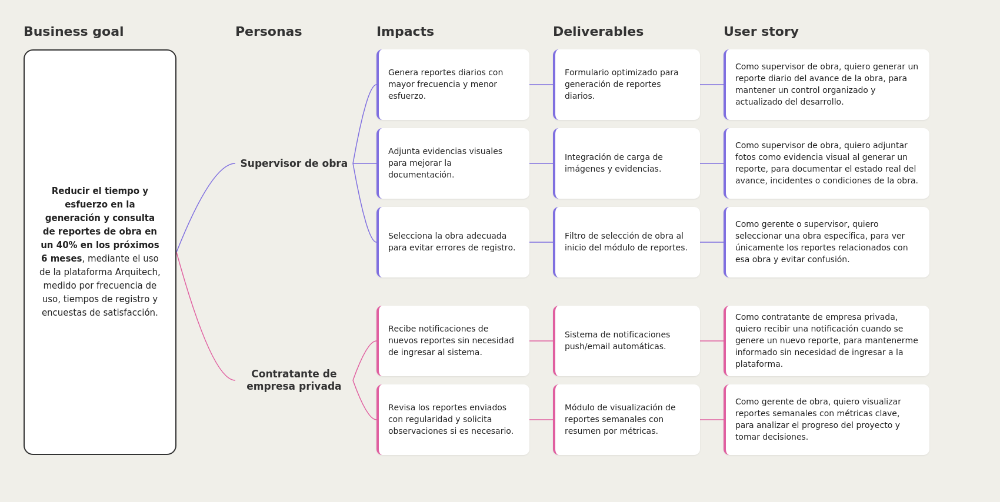

# Capítulo IV: Product Design

## 4.1. Style Guidelines

Esta sección ofrece la estructura que va contener nuestro diseño y los elementos visuales de nuestra aplicación llamada Arquitech. Se presentarán recursos como tipografías del logo y del texto, las paletas de colores que se van a usar en nuestra aplicación y nuestro logo. Todo aquello con el propósito de garantizar una imagen visual coherente y que coincida con el objetivo principal de nuestra startup, que es la de brindar soluciones digitales innovadoras para optimizar la gestión de proyectos de construcción de pequeñas y medianas empresas. Esta sección se divide en General Style Guidelines, Web Style Guidelines y Mobile Style Guidelines y se mostrará la experiencia visual atractiva y accesible que les presentaremos a nuestros usuarios. Es necesario que el diseño sea coherente para facilitar la navegación y mejorar la experiencia del usuario, asegurando la funcionalidad, claridad y alineación con las características que representa Arquitech.

### 4.1.1. General Style Guidelines

Se presentará el diseño conceptual para la landing page como para la aplicación, realizado con el objetivo de lograr una interfaz intuitiva, fácil de usar y mostrar una experiencia estética agradable y cómoda. Se usarán 5 colores, los cuales son el Jet, Sinopia, Fulvous, Selective Yellow y Isabelline. Algunos de estos colores serán usados para el logotipo y para la landing page y la aplicación se alternará entre los 5 colores. Estos colores reflejan nuestra intención de crear un entorno visual digital para mejorar procesos de construcción. A continuación, se detallarán los elementos visuales con mayor precisión.

<ins> **Branding e ícono:** </ins>

**Figura 46**  
_Logo_

<p align="center">
  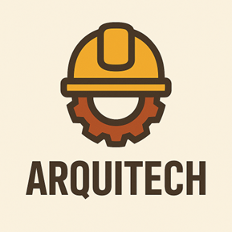
</p>

- Identidad:

  Arquitech representa una fusión entre la construcción tradicional y la innovación tecnológica. La marca proyecta solidez, precisión y modernidad, dirigida a supervisores de obras y contratantes de pequeñas o medianas empresas privadas que valoran la optimización de procesos de las construcciones.

- Paleta de Colores:
  - \#C43508 (Sinopia): Es un color intenso y cálido y transmite fuerza y energía. También refleja estabilidad ya que representa solidez y firmeza.
  - \#DE7F1A (Fulvous): Transmite profundidad, energía y dinamismo.
  - \#FFB627 (Selective yellow): Aporta energía, innovación y enfoque en soluciones.
  - \#F8F5F1 (Isabelline): Sirve para usarlo como fondo ya que aporta neutralidad, elegancia y contraste.
  - \#2F2E2D (Jet): Representa seriedad, profesionalismo y sobriedad.

- Simbolismo:
  - Casco de construcción: Evidencia seguridad, ingeniería y trabajo profesional..
  - Engranaje: Representa tecnología, precisión, procesos y avance constante.
  - El combinar ambos iconos refuerza la idea de una startup que construye con inteligencia y eficiencia e integra lo físico con lo digital para optimizar procesos de construcción.

- Mensaje de la marca:
  - Optimización y eficiencia: Comunica simplicidad y que la startup busca mejorar los procesos constructivos desde la planificación hasta la ejecución, busca eliminar lo innecesario, maximizar recursos y entregar soluciones inteligentes y funcionales.
  - Precisión y confiabilidad: El logo refleja solidez y confianza que Arquitech le brindará a sus clientes. Además, refleja seguridad, calidad y resultados duraderos.
  - Claridad visual y profesionalismo: Representa lo funcional, lo directo y profesional. También, refuerza la idea de una empresa seria, accesible y alineada con las necesidades de la industria actualmente.

- Aplicación del branding:
  - Sitios web (landing page) y app: Interfaz limpia con los colores corporativos, iconos vectoriales y navegación intuitiva.
  - Redes sociales y presentaciones digitales: Plantillas visualmente coherentes con el mensaje de la startup.
  - Identidad visual corporativa: Uso estratégico del logo y la paleta de colores en material gráfico de la startup como las tarjetas de presentación, presentaciones empresariales, o imagen de perfil en aplicaciones de chats para contactar clientes.

<ins> **Tipografía** </ins>  
La tipografía de Arquitech cumple un importante rol en la expresión de la identidad de nuestra marca y brinda una sensación de claridad visual, calidez, acompañamiento para nuestros usuarios. Nuestra empresa eligió una fuente tipográfica que combina lo amigable y lo fluido, asegurando al usuario comodidad y nitidez en la landing page y en la aplicación.

- Tipografía del Logo y Títulos:  
  El logo de Arquitech que se eligió comunica claridad con varios valores clave como el profesionalismo y técnica, por lo que se ha utilizado la tipografía Anton Regular que pertenece a la Anton Font Family. Esta tipografía transmite un aspecto fuerte y serio, lo cual es ideal para una empresa de construcción que busca mejorar los procesos de las obras. Además, las letras son altas y gruesas, lo que da buena visibilidad al nombre de la empresa en el logo y en los títulos. Cabe agregar, que tiene un aire moderno, pero sin dejar de ser profesional.

**Figura 47**  
_Tipografía de logo y títulos_

<p align="center">
  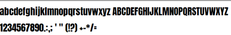
</p>

- Tipografía de Texto Regular:  
  Para el texto de la landing page y la aplicación se ha elegido la tipografía Futura que pertenece a Futura Font Family con el objetivo de que el usuario pueda obtener una cómoda y agradable lectura al visitar nuestras plataformas digitales. Además, esta tipografía representa modernidad, minimalismo, profesionalismo y seriedad. Aquello ayuda a la marca a representar tecnicismo, precisión y avances.

**Figura 48**  
_Tipografía de texto regular_

<p align="center">
  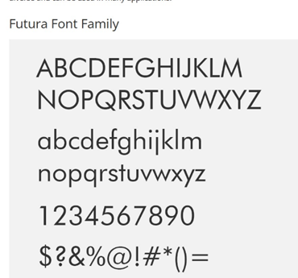
</p>

<ins> **Colores** </ins>  
 Es importante elegir los colores para las plataformas digitales adecuadamente, ya que así se asegura que la experiencia del usuario sea placentera y agradable. Por ello, nos aseguramos que la paleta de colores seleccionada de Arquitech refleje la esencia de la startup en la landing page y en nuestra aplicación.

_Nota_. Elaboración propia.

**Figura 49**  
_Paleta de colores de ArquiTech_

<p align="center">
  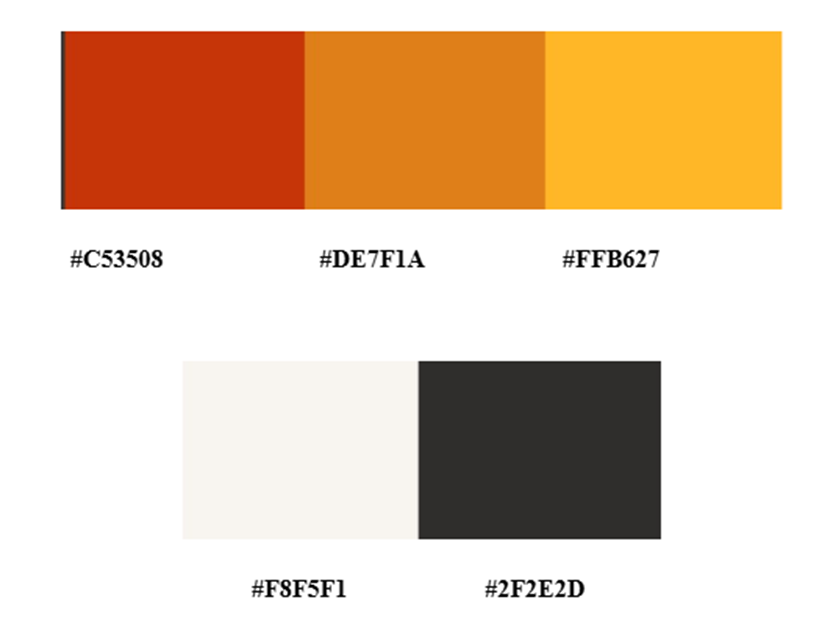
</p>

<ins>**Espaciado**</ins>

- Interlineado: 140%-160% para que los textos sean legibles.
- Padding en botones: Mínimo 12px vertical x 24px horizontal para accesibilidad táctil a nuestros usuarios.
- Margen entre secciones: 34px-64px para mantener un aire visual a los usuarios.
- Grid base: Utilizar un grid de 8px para dar consistencia.

Esto transmite un espaciado limpio y estructurado, ya que se aprecia un orden, claridad y refleja la misión de Arquitech de optimizar procesos, pero en lo visual.

<ins>**Tono de Comunicación y Lenguaje Aplicado**</ins>

- El tono de Arquitech es profesional, preciso, eficiente, tecnológico y accesible y confiable, diseñado para generar confianza, demostrando experiencia en el rubro de la construcción sin recurrir a un lenguaje complicado o inaccesible para nuestros usuarios.
- Arquitech acompaña a los clientes desde el inicio hasta el final del proceso constructivo, comunicando con claridad cómo la innovación tecnológica y la eficiencia operativa pueden realizar la diferencia en cada obra.
- El lenguaje se mantiene preciso y funcional, priorizando la acción. Se evita el exceso de tecnicismos y apuesta por una forma de comunicar que cualquiera dentro del sector pueda entender con facilidad.
- El estilo comunicativo está alineado con los principios de Arquitech que es innovar, optimizar y liderar.

### 4.1.2. Web Style Guidelines

En esta sección, para nuestra aplicación de Arquitech, se ha decidido colocar como fuente SF Pro Display y Poppins. Consideramos que estas fuentes son atractivas e ideales para títulos, encabezados y contenido de texto en cada sección, ya que brinda un estilo claro, moderno y profesional. Además, se ha usado la fuente Inter Regular para los botones, ya que está específicamente diseñada para interfaces digitales. Inter Regular posee un diseño limpio y permite una lectura rápida y concisa, lo cual es vital para elementos interactivos como los botones.  
Los colores que hemos usado para Arquitech, son los mismos anteriormente mencionados. Se ha usado aquellos colores alternándose en cada sección de contenido para ofrecer a nuestros usuarios una experiencia visual agradable y alineada. Se usó el color Isabelline (\#F8F5F1) para el fondo ya que transmite una sensación de calidez, limpieza y simplicidad, lo que permite que los elementos visuales y los textos puedan destacar sin generar distracción. También, se usó el color Jet (\#2F2E2D) en los iconos de botones de agregar para que se pueda resaltar aquellas opciones con mayor facilidad. Para los botones de registrar o que tienen la finalidad de guardar información se le colocó el color Green Pigment (\#2BBA51), ya que es un color que se suele usar para elementos que necesitan llamar la atención, dinamismo y resalta visualmente sobre fondos claros como el nuestro que usamos el color Isabelline.

La interfaz de Arquitech debe ser responsiva y se debe adaptar a diversos tamaños de pantalla a través de un diseño flexible. Por esta razón es importante saber el tamaño de la pantalla que vamos a utilizar y ajustar aquello en otros dispositivos.  
Medidas para Web Responsive:  
Monitor pequeño: 1296x1781px

**Figura 50**

<p align="center">
  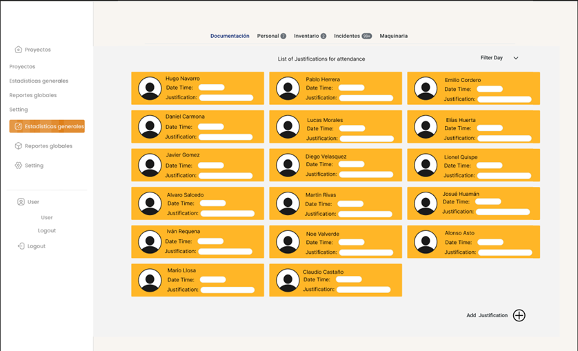
</p>

**Figura 51**

<p align="center">
  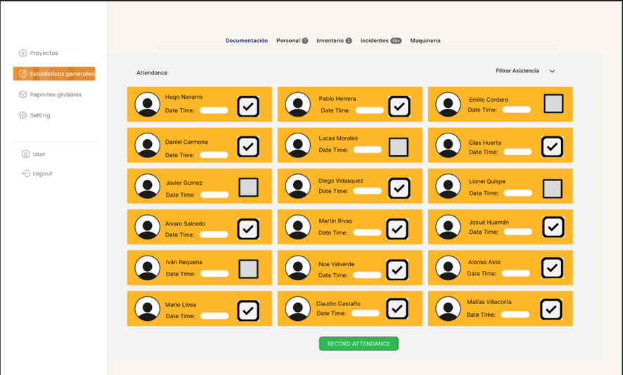
</p>

**Figura 52**

<p align="center">
  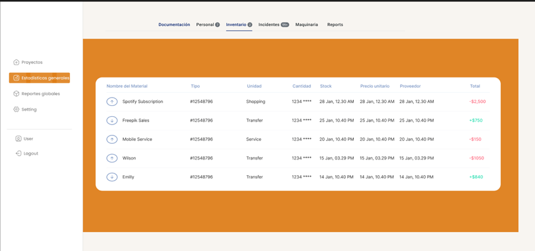
</p>
 
### 4.1.3. Mobile Style Guidelines

Esta sección define los lineamientos visuales y de interacción que deberá seguir la versión móvil de Arquitech, tanto en iOS como en Android. Dado que nuestros usuarios principales (supervisores de obra) suelen operar la aplicación directamente en campo, muchas veces con conectividad limitada, bajo luz solar directa o mientras usan guantes de trabajo, el diseño móvil prioriza elementos táctiles grandes, alto contraste y flujos simples de una sola mano. Se mantiene la identidad visual ya definida para Arquitech (paleta de colores, logotipo y tono de comunicación), adaptando la tipografía, el espaciado y los componentes de interfaz a las convenciones nativas de cada plataforma, con el objetivo de que la aplicación se sienta familiar y fluida para el usuario sin importar su sistema operativo.

Se mantiene la misma paleta de colores de marca (Sinopia \#C43508, Fulvous \#DE7F1A, Selective Yellow \#FFB627, Isabelline \#F8F5F1 y Jet \#2F2E2D), así como el color Green Pigment (\#2BBA51) para acciones de confirmación y guardado, garantizando consistencia visual entre la web y las aplicaciones móviles.

#### 4.1.3.1. iOS Mobile Style Guidelines

La versión iOS de Arquitech sigue las recomendaciones de las Apple Human Interface Guidelines (HIG), priorizando la claridad, la jerarquía visual y el uso de componentes nativos del sistema.

- Tipografía:  
  Se utiliza San Francisco (SF Pro Text / SF Pro Display), la tipografía del sistema de iOS, con soporte de Dynamic Type para que el usuario pueda ajustar el tamaño del texto desde la configuración de su dispositivo sin romper el diseño.

- Íconos:  
  Se emplean SF Symbols para los íconos de navegación y acciones, asegurando consistencia con el resto del ecosistema iOS y compatibilidad automática con distintos pesos y tamaños de texto.

- Áreas táctiles:  
  Todo elemento interactivo (botones, íconos, celdas de lista) respeta un tamaño mínimo de 44x44 pt, conforme a los estándares de accesibilidad táctil de Apple.

- Navegación:  
  Se utiliza un Tab Bar inferior para las secciones principales (Inicio, Reportes, Materiales, Perfil) y una Navigation Bar superior con títulos grandes (Large Titles) para reforzar la jerarquía dentro de cada sección.

- Modo claro y oscuro:  
  La interfaz soporta Light Mode y Dark Mode de forma nativa, adaptando el color Isabelline (\#F8F5F1) como fondo en modo claro y el color Jet (\#2F2E2D) como fondo en modo oscuro, sin perder el contraste de los colores de marca.

- Safe Areas y márgenes:  
  Se respetan los Safe Area Insets definidos por iOS para evitar que el contenido quede oculto detrás del notch, la Dynamic Island o la barra de gestos inferior.

- Gestos:  
  Se habilitan gestos nativos como el swipe-back para retroceder entre pantallas y el pull-to-refresh para actualizar reportes y listados.

#### 4.1.3.2. Android Mobile Style Guidelines

La versión Android de Arquitech se basa en los lineamientos de Material Design 3 (Material You) de Google, adaptados a la paleta de colores de la marca.

- Tipografía:  
  Se utiliza Roboto como tipografía principal del sistema, siguiendo la escala tipográfica de Material Design para títulos, subtítulos y cuerpo de texto.

- Sistema de color Material:  
  Los colores de marca se mapean a los tokens del sistema Material (primary, secondary, surface, background), utilizando Sinopia (\#C43508) como color primario, Fulvous (\#DE7F1A) como color secundario e Isabelline (\#F8F5F1) como superficie base, manteniendo el contraste mínimo exigido por las pautas de accesibilidad de Material Design.

- Áreas táctiles:  
  Todo elemento interactivo respeta un tamaño mínimo de 48x48 dp, conforme a los estándares de accesibilidad táctil de Android.

- Navegación:  
  Se utiliza una Bottom Navigation Bar para las secciones principales de la aplicación y un Navigation Drawer lateral para opciones secundarias (configuración, ayuda, cierre de sesión).

- Elevación y feedback visual:  
  Los componentes utilizan sombras (elevation) para indicar jerarquía entre superficies, y se aplica el efecto ripple en botones e íconos para dar retroalimentación táctil inmediata al usuario.

- Botón de acción flotante (FAB):  
  Se utiliza un Floating Action Button con el color Green Pigment (\#2BBA51) para la acción principal de cada pantalla, como "Nuevo reporte" o "Registrar asistencia".

- Íconos adaptativos:  
  Se emplean adaptive icons para el ícono de la aplicación, asegurando que se vea correctamente en las distintas formas de ícono (círculo, cuadrado, squircle) según el fabricante del dispositivo Android.

- Botón de retroceso del sistema:  
  La navegación respeta el comportamiento nativo del botón de retroceso (back) del sistema operativo, tanto físico como gestual, para mantener la coherencia con el resto de aplicaciones Android.

## 4.2. Information Architecture

### 4.2.1. Organization Systems

En la arquitectura de información de Arquitech, se aplican distintos sistemas de organización para estructurar el contenido de manera clara y funcional, adaptada al contexto de los usuarios del sector construcción.

<ins> **Organización Visual del Contenido** </ins>

1.  Jerárquica (Visual Hierarchy):

        Se aplica principalmente en la vista general del dashboard, donde la información más importante y urgente se muestra primero (como reportes recientes, alertas de bajo inventario y resumen de avances).

    Esta jerarquía ayuda a que el usuario enfoque su atención en lo prioritario al momento de ingresar.

2.  Secuencial (Step-by-Step):

    Se utiliza en procesos como la generación de reportes diarios, donde se guía al usuario paso a paso:
    - Selección de obra

    - Registro de asistencia

    - Registro de materiales utilizados

    - Observaciones finales

    - Adjuntar evidencias

    Esto evita errores y facilita la curva de aprendizaje.

3.  Matricial:

    Se emplea para la vista comparativa de reportes semanales, permitiendo ver columnas con distintas métricas (avance físico, asistencia, materiales) por cada día, en una tabla ordenada que el usuario puede leer horizontal y verticalmente.

<ins> **Esquemas de Categorización del Contenido** </ins>

1. Por tópicos:

   Toda la plataforma está organizada por módulos funcionales:
   - Gestión de personal

   - Control de materiales

   - Reportes

   - Configuración de perfil

   Esto facilita al usuario identificar rápidamente dónde realizar cada acción.

2. Cronológico:

   En los módulos de reportes y asistencia, los datos se organizan por fecha para reflejar la progresión temporal de la obra.

3. Alfabético:

   Utilizado en listas de trabajadores, maquinaria o materiales para facilitar la búsqueda rápida y ordenada.

4. Por audiencia:
   - Los contratantes solo pueden ver y recibir reportes.

   - Los supervisores pueden generar y editar.

   - Los administrativos tienen permisos de configuración y visualización más avanzada.

   Esto mejora la experiencia personalizada según el rol.

### 4.2.2. Labeling Systems

En Arquitech, se ha diseñado un sistema de etiquetado simple y funcional para evitar la sobrecarga cognitiva y facilitar la comprensión inmediata de la interfaz.

- Principios utilizados:
  - Simplicidad y claridad:

    Se prioriza el uso de palabras clave cortas y comunes en obra (ej. "Reporte diario", "Materiales", "Asistencia", "Obreros", "Avance", "Notificaciones").

  - Evitar ambigüedad:

    Se evita el uso de términos técnicos complejos o jerga poco conocida. Por ejemplo, se prefiere "Registro de materiales" en lugar de "Logística de recursos".

  - Consistencia visual:

    Las etiquetas mantienen estilo uniforme en botones, menús y formularios, para que el usuario no dude sobre el significado de cada elemento.

  - Asociaciones entre etiquetas:
    - “Reporte” siempre se relaciona con acciones como “Generar”, “Visualizar”, “Descargar”, “Compartir”.
    - “Materiales” se relaciona con “Entrada”, “Salida”, “Inventario”.
    - “Obreros” se relaciona con “Asistencia”, “Tareas”, “Evaluación”.

### 4.2.3. SEO Tags and Meta Tags

Aquí mostraremos los Meta Tagas y los SEO tags que hemos usado para poder desarrollar el landing page con el objetivo de que sea agradable para los usuarios.

    <!DOCTYPE html>

    <html lang="es">

    </head>

      <meta charset="UTF-8" />

 	 <meta name="viewport" content="width=device-width, initial-scale=1.0" />

<title\> Foundex | Tecnología IoT para Restaurantes Inteligentes</title>

      <meta name="description" content="Foundex ofrece una solución completa de sensores IoT y plataforma web para monitorear alimentos, mejorar la eficiencia operativa y elevar la atención al cliente en restaurantes." />

 	 <meta name="keywords" content="Foundex, IoT para restaurantes, monitoreo de alimentos, sensores de temperatura, gestión de inventario, eficiencia operativa, tecnología gastronómica" />

      <meta name="author" content="Equipo Foundex" />

      <meta name="robots" content="index, follow" />

      <meta property="og:title" content="Foundex | Tecnología IoT para Restaurantes Inteligentes" />

      <meta property="og:description" content="Descubre cómo Foundex ayuda a los dueños y trabajadores de restaurantes a optimizar la conservación de alimentos con sensores IoT y una plataforma web de gestión." />

      <meta property="og:image" content="https://foundex.com/img/logo.png" />

      <meta property="og:url" content="https://foundex.com/" />

      <meta property="og:type" content="website" />

      <meta name="twitter:card" content="summary_large_image" />

      <meta name="twitter:title" content="Foundex | Tecnología IoT para Restaurantes Inteligentes" />

      <meta name="twitter:description" content="Optimiza tu restaurante con Foundex: tecnología IoT, sensores y plataforma web para un mejor control alimentario." />

      <meta name="twitter:image" content="https://foundex.com/img/logo.png" />

      <link rel="icon" href="img/logo.png" type="image/x-icon" />

      <link rel="stylesheet" href="style.css" />

    </head>

### 4.2.4. Searching Systems

Dentro de la plataforma ArquiTech, los sistemas de búsqueda han sido diseñados para facilitar el acceso rápido y eficiente a información crítica relacionada con la gestión de obras. La aplicación contempla un volumen significativo de datos relacionados con proyectos, documentos técnicos, solicitudes, trabajadores, insumos y cronogramas. Por ello, se proyecta la implementación de un sistema de búsqueda integral que ayude a los usuarios a evitar pérdidas de tiempo y a mantener el control operativo en todo momento.

El sistema permitirá a los usuarios buscar información dentro de los distintos módulos del sistema, utilizando:

- Palabras clave (términos técnicos, nombres de obra, actividades específicas, materiales).
- Filtros por categoría (tipo de documento, fase del proyecto, tipo de solicitud, tipo de personal).
- Rangos de fechas (fecha de emisión, entrega, modificación o supervisión).
- Códigos internos asignados a solicitudes, órdenes de servicio, contratistas o áreas constructivas.

Este sistema será particularmente útil para:

- Ahorrar tiempo en la localización de documentos, reportes o actividades específicas, sin necesidad de navegar por múltiples módulos manualmente.
- Encontrar rápidamente registros relacionados con avances de obra, observaciones, solicitudes de materiales o incidencias.
- Apoyar la toma de decisiones sobre ejecución, control de calidad o cumplimiento de cronogramas mediante el acceso inmediato a la información registrada.

Una vez realizada una búsqueda, los resultados se presentarán de forma estructurada en tablas o tarjetas, con opciones para visualizar, editar o exportar la información según los permisos del usuario.

### **_4.2.5. Navigation Systems_**

Los sistemas de navegación implementados en el proyecto ArquiTech han sido diseñados para garantizar una experiencia intuitiva, fluida y orientada a la consecución de objetivos por parte del usuario. Considerando que el público objetivo está conformado principalmente por supervisores de obra, contratistas y personal administrativo de empresas constructoras, se ha priorizado una arquitectura de navegación clara, jerárquica y adaptada al flujo natural de las actividades constructivas.

<ins>**En la Landing Page**</ins>  
La navegación en la landing page tiene una estructura lineal con anclajes internos y botones de acción, facilitando la exploración informativa en orden lógico. Las acciones de navegación se guían mediante:

- Un menú fijo en la parte superior con enlaces directos a secciones como: “¿Qué es ArquiTech?”, “Beneficios”, “Funcionalidades”, “Casos de uso” y “Contacto”.
- Botones con anclas que desplazan suavemente al usuario dentro de la misma página, sin recarga.
- Llamados a la acción (“Conoce la plataforma”, “Solicita una demo”) que direccionan al formulario de contacto o a secciones específicas de interés.

Este diseño permite que los visitantes comprendan rápidamente el propósito de la solución y se dirijan con claridad hacia la acción deseada.

### 4.2.5. Navigation Systems

## 4.3. Landing Page UI Design

<div style="text-align: justify;">

La propuesta de interfaz de usuario del Landing Page de ArquiTech fue desarrollada tomando como base las decisiones establecidas previamente en los lineamientos visuales y en la arquitectura de información. La organización del contenido busca comunicar de manera clara la propuesta de valor de la plataforma, presentar sus principales funcionalidades y facilitar la navegación de los usuarios.

El diseño considera una estructura visual jerárquica, una distribución ordenada de la información y una navegación sencilla, permitiendo que los usuarios comprendan rápidamente qué es ArquiTech, qué beneficios ofrece y cuáles son las principales acciones disponibles dentro del Landing Page.

Asimismo, se mantiene coherencia con la identidad visual definida para el producto mediante el uso consistente de tipografías, componentes, espaciados, elementos gráficos y criterios de diseño responsive, buscando ofrecer una experiencia clara tanto en dispositivos de escritorio como en dispositivos móviles.

</div>

### 4.3.1. Landing Page Wireframe

**Desktop Web Browser**

<p align="center">
  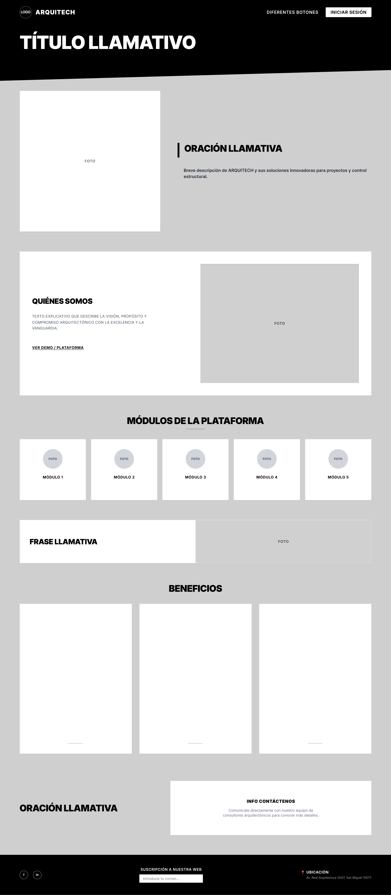
</p>

**Mobile Web Browser**

<p align="center">
  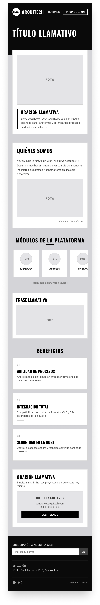
</p>

### 4.3.2. Landing Page Mock-up

**Desktop Web Browser**

<p align="center">
  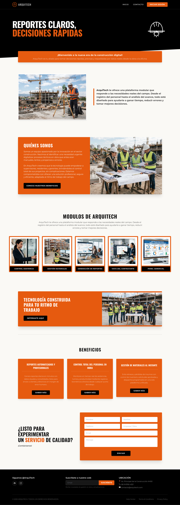
</p>

**Mobile Web Browser**

<p align="center">
  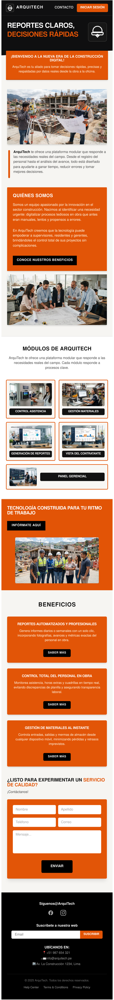
</p>

## 4.4. Mobile Applications UX/UI Design

### 4.4.1. Mobile Applications Wireframes

**Figura XX**  
*Mobile Wireframe Login*

<p align="center">

  

<br>*Nota.* Elaboración propia.

</p>


**Figura XX**  
*Mobile Wireframe Projects*

<p align="center">

  

<br>*Nota.* Elaboración propia.

</p>

**Figura XX**  
*Mobile Wireframe Workers*

<p align="center">

  

<br>*Nota.* Elaboración propia.

</p>


**Figura XX**  
*Mobile Wireframe Materials*

<p align="center">

  

<br>*Nota.* Elaboración propia.

</p>


**Figura XX**  
*Mobile Wireframe Incidents*

<p align="center">

  

<br>*Nota.* Elaboración propia.

</p>


**Figura XX**  
*Mobile Wireframe Machinery*

<p align="center">

  

<br>*Nota.* Elaboración propia.

</p>

### 4.4.2. Mobile Applications Wireflow Diagrams

**Segmento #2: Contratantes de empresas privadas**

**User Goal 1: Supervisión de materiales y personal de obra**

Como usuario, quiero poder visualizar desde la aplicación móvil la lista de proyectos que posee mi empresa junto con la información de materiales y trabajadores asociados, para mantener un mejor control y supervisión de los recursos y del personal de cada obra.

**Wireflow:**

**Figura XX**

<p align="center">

  

<br>*Nota.* Elaboración propia.

</p>

Para obtener la información de materiales y trabajadores que brinda ArquiTech desde la aplicación móvil, el usuario debe acceder primero mediante la pantalla de inicio de sesión. Luego, puede visualizar la lista de proyectos asociados a su empresa desde la pantalla principal de proyectos. A partir de esta vista, el usuario puede dirigirse a la sección de materiales, donde se muestran datos como la cantidad registrada, el stock disponible, el precio y el proveedor. Del mismo modo, puede acceder a la sección de trabajadores, donde se presenta información como el nombre del trabajador, su rol, la fecha de contratación y el proyecto al que se encuentra asociado.

**Segmento #1: Supervisores de obra**

**User Goal 1: Gestión de maquinarias e incidentes**

Como usuario, quiero consultar desde la aplicación móvil las maquinarias utilizadas en los proyectos y los incidentes registrados durante la ejecución de las obras, para mantener una visión general sobre la disponibilidad de los equipos y las situaciones que pueden afectar la seguridad y el desarrollo del proyecto.

**Wireflow:**

**Figura XX**

<p align="center">

  

<br>*Nota.* Elaboración propia.

</p>

Para acceder a las secciones de maquinarias e incidentes desde la aplicación móvil, el supervisor debe iniciar sesión y acceder a la pantalla principal de proyectos. Desde esta vista, puede dirigirse a la sección de incidentes para consultar información como la fecha en la que ocurrió cada evento, su tipo, nivel de severidad y estado de resolución. Asimismo, puede acceder a la sección de maquinaria para visualizar los equipos registrados, incluyendo datos como el nombre de la maquinaria, su licencia o placa, la fecha de registro y su estado de funcionamiento.


### 4.4.3. Mobile Applications Mock-ups

**Figura XX**  
*Mobile Mock-up Login*

<p align="center">

  

<br>*Nota.* Elaboración propia.

</p>

**Figura XX**  
*Mobile Mock-up Projects*

<p align="center">

  

<br>*Nota.* Elaboración propia.

</p>

**Figura XX**  
*Mobile Mock-up Workers*

<p align="center">

  

<br>*Nota.* Elaboración propia.

</p>

**Figura XX**  
*Mobile Mock-up Materials*

<p align="center">

  

<br>*Nota.* Elaboración propia.

</p>

**Figura XX**  
*Mobile Mock-up Incidents*

<p align="center">

  

<br>*Nota.* Elaboración propia.

</p>

**Figura XX**  
*Mobile Mock-up Machinery*

<p align="center">

  

<br>*Nota.* Elaboración propia.

</p>

### 4.4.4. Mobile Applications User Flow Diagrams

**Segmento 1: Supervisores de obra**

**User Goal 1:** Gestionar y controlar materiales de construcción  
**Descripción:** El supervisor desea consultar y controlar desde la aplicación móvil la disponibilidad, stock y demás información de los materiales asociados a una obra para mantener un mejor control de los recursos utilizados durante el desarrollo del proyecto.

**Figura XX**  
*Mobile User Flow 1*

<p align="center">

  

<br>*Nota.* Elaboración propia.

</p>

**User Goal 2:** Controlar la asistencia y roles de los trabajadores  
**Descripción:** El supervisor necesita consultar y gestionar desde la aplicación móvil la información de los trabajadores asignados a la obra, incluyendo sus roles, asistencia, tareas y responsabilidades dentro del proyecto.

**Figura XX**  
*Mobile User Flow 2*

<p align="center">

  

<br>*Nota.* Elaboración propia.

</p>

**User Goal 3:** Consultar incidencias en obra  
**Descripción:** El supervisor desea consultar desde la aplicación móvil los incidentes registrados durante la ejecución de la obra para conocer su tipo, fecha, nivel de severidad y estado de resolución.

**Figura XX**  
*Mobile User Flow 3*

<p align="center">

  

<br>*Nota.* Elaboración propia.

</p>

**Segmento Objetivo #2: Contratantes de Empresas Privadas**

**User Goal 1:** Visualizar el estado y progreso de mis obras contratadas (solo lectura)  
**Descripción:** El contratante necesita consultar desde la aplicación móvil las obras asociadas a su empresa, con acceso a información clara y actualizada sobre el estado general de cada proyecto.

**Figura XX**  
*Mobile User Flow 4*

<p align="center">

  

<br>*Nota.* Elaboración propia.

</p>

**User Goal 2:** Visualizar el uso y estado de la maquinaria asignada a la obra  
**Descripción:** El contratante desea consultar desde la aplicación móvil las maquinarias asociadas a sus obras para conocer los equipos disponibles, su identificación, fecha de registro y estado operativo.

**Figura XX**  
*Mobile User Flow 5*

<p align="center">

  

<br>*Nota.* Elaboración propia.

</p>

**User Goal 3:** Ver detalles del consumo y disponibilidad de materiales (solo lectura)  
**Descripción:** El contratante desea consultar desde la aplicación móvil la información de los materiales asociados a las obras para evaluar la cantidad registrada, el stock disponible, los proveedores y el uso de los recursos del proyecto.

**Figura XX**  
*Mobile User Flow 6*

<p align="center">

  

<br>*Nota.* Elaboración propia.

</p>

### 4.5. Mobile Applications Prototyping

<div style="text-align: justify;">
En esta sección se presentan los prototipos de alta fidelidad para la aplicación móvil de ArquiTech. Estos diseños reflejan la interfaz de usuario (UI) y la experiencia de usuario (UX) proyectada para ser la herramienta principal de los supervisores de obra. Se ha mantenido la identidad visual de la marca (colores corporativos e iconografía) y se han adaptado los componentes visuales para operar de manera nativa y fluida en los dos ecosistemas móviles predominantes: Android e iOS.
</div>

#### 4.5.1. Android Mobile Applications Prototyping

<div style="text-align: justify;">
El prototipo para el sistema operativo Android ha sido estructurado tomando como referencia los lineamientos de diseño de <em>Material Design</em>. Se prioriza una navegación ágil mediante un <em>Bottom Navigation Bar</em>, permitiendo al usuario acceder de manera intuitiva a la gestión de Proyectos, Trabajadores, Materiales, Incidentes y Maquinaria, adaptándose a las resoluciones estándar de los dispositivos Android en campo.
</div>

<br>

- **Enlace a la demostración del prototipo (Android):** [https://upcedupe-my.sharepoint.com/:v:/g/personal/u202411567_upc_edu_pe/IQBpi1MmgSweSpgQaaibmtjpAeptaXy8xzyXBnw7krQtGiQ?e=l46fti&nav=eyJyZWZlcnJhbEluZm8iOnsicmVmZXJyYWxBcHAiOiJTdHJlYW1XZWJBcHAiLCJyZWZlcnJhbFZpZXciOiJTaGFyZURpYWxvZy1MaW5rIiwicmVmZXJyYWxBcHBQbGF0Zm9ybSI6IldlYiIsInJlZmVycmFsTW9kZSI6InZpZXcifX0%3D]

<br>

_Prototipo de Alta Fidelidad - Vistas Principales Android_

<p align="center">
  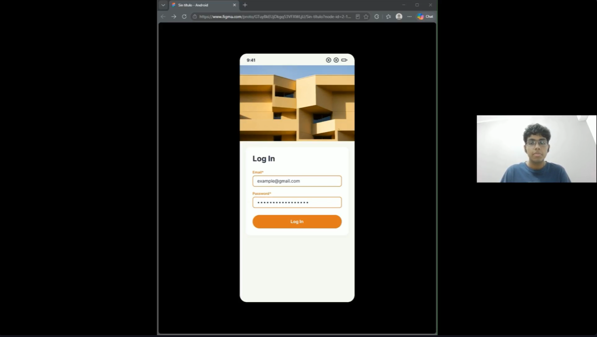
</p>
<p align="center"><em>*Nota.* Elaboración propia.</em></p>

<br>

#### 4.5.2. iOS Mobile Applications Prototyping

<div style="text-align: justify;">
El prototipo para iOS fue diseñado adaptando la interfaz a las <em>Human Interface Guidelines</em> de Apple. Se mantiene la consistencia funcional y gráfica de ArquiTech, pero integrando elementos característicos del ecosistema iOS, como la barra de estado superior nativa y los comportamientos de transición, garantizando una experiencia de uso familiar y eficiente para los supervisores que operan desde un iPhone.
</div>

<br>

- **Enlace a la demostración del prototipo (iOS):** [https://upcedupe-my.sharepoint.com/:v:/g/personal/u202411567_upc_edu_pe/IQApSEZ506tZSq2o1Z-glggZAf4sDV66qbA55-3cd0FrFk8?e=oRYe3I&nav=eyJyZWZlcnJhbEluZm8iOnsicmVmZXJyYWxBcHAiOiJTdHJlYW1XZWJBcHAiLCJyZWZlcnJhbFZpZXciOiJTaGFyZURpYWxvZy1MaW5rIiwicmVmZXJyYWxBcHBQbGF0Zm9ybSI6IldlYiIsInJlZmVycmFsTW9kZSI6InZpZXcifX0%3D]

<br>

_Prototipo de Alta Fidelidad - Vistas Principales iOS_

<p align="center">
  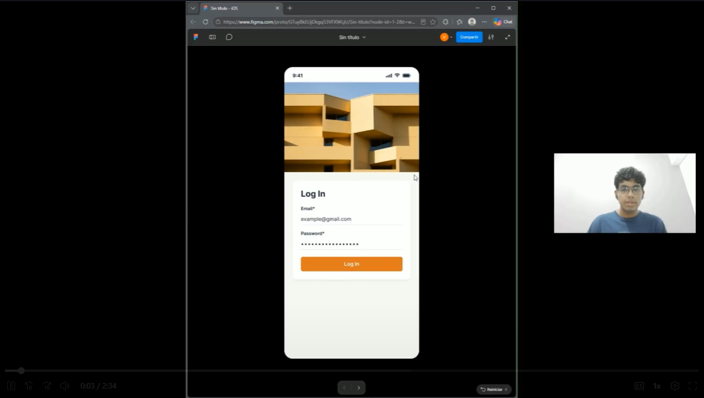
</p>
<p align="center"><em>*Nota.* Elaboración propia.</em></p>

## 4.6. Web Applications UX/UI Design

### 4.6.1. Web Applications Wireframes

**Figura 53**

<p align="center">
  
<br>*Nota.* Elaboración propia. 
</p>
<br>

**Figura 54**

<p align="center">
  
<br>*Nota.* Elaboración propia. 
</p>
<br>

**Figura 55**

<p align="center">
  
<br>*Nota.* Elaboración propia. 
</p>
<br>

**Figura 56**

<p align="center">
  
<br>*Nota.* Elaboración propia.  
</p>
<br>

**Figura 57**

<p align="center">
  
<br>*Nota.* Elaboración propia.  
</p>
<br>

**Figura 58**

<p align="center">
  
<br>*Nota.* Elaboración propia.  
</p>
<br>

### 4.6.2. Web Applications Wireflow Diagrams

**Segmento #2: Contratantes de empresa privadas**
<br>
**User Goal 1: Supervisión de Materiales y personal de obra**
<br>
Como usuario, quiero poder ver la lista de proyectos que posee mi empresa con sus respectivos reportes de materiales y trabajadores para poder obtener un mejor control y supervisión de materiales y personal de cada obra.

**Wire:**
<br>
**Figura 59**

<p align="center">
  
<br>*Nota.* Elaboración propia.  
</p>
<br>
Para poder obtener los reportes anteriormente dichos que brinda Arquitech a cada usuario, debes primero acceder a la app web mediante el login. Luego, podrás observar la lista de trabajadores y materiales cuando presiones “ver detalles” en la página de listado de proyectos. Esto te dirigirá a la sección de materiales donde puedes visualizar campos como la cantidad de materiales, el stock, el precio, el estado del pago, el nombre del material, etc. En cuanto a la sección de trabajadores, logras acceder con la barra lateral donde se muestra aquella sección y se detalla el nombre del trabajador, su rol y la fecha de cuando fue contratado.
<br><br>

**Segmento #1: Supervisores de obra**
<br>
**User Goal 1: Gestión de maquinarias y accidentes**
<br>
Como usuario quiero tener detallado las maquinarias que se usan por cada proyecto y que incidentes suelen ocurrir en las obras para tener una visión panorámica más acertada sobre lo seguro que son las obras y asegurarse de que se cuenta con las máquinas necesarias.

**Wireflow:** <br>
**Figura 60**

<p align="center">
  
<br>*Nota.* Elaboración propia.  
</p>
<br>
Para acceder a las secciones de maquinarias e incidentes debes presionar aquellos botones con los respectivos nombres. En la sección Incidentes, verás un detallado de una lista de los incidentes ocurridos en cada obra,  así podrás estar informado de la fecha en la que ocurrió aquel incidente, el tipo de incidente que ocurrió, la severidad del incidente y el estado de resolución de aquello. Por otro lado, en la sección de Maquinarias, puedes visualizar el nombre de la maquinaria que posee cada obra, la licencia de la maquinaria, la fecha de registro de la maquinaria asignada a la obra y el estado de funcionamiento de aquella.

### 4.6.3. Web Applications Mock-ups

**Figura 61**

<p align="center">
  
	
<br>*Nota.* Elaboración propia. 
</p>
<br>

**Figura 62**

<p align="center">
  
	
<br>*Nota.* Elaboración propia. 
</p>
<br>

**Figura 63**

<p align="center">
  
	
<br>*Nota.* Elaboración propia. 
</p>
<br>

**Figura 64**

<p align="center">
  
	
<br>*Nota.* Elaboración propia. 
</p>
<br>

**Figura 65**

<p align="center">
  
	
<br>*Nota.* Elaboración propia. 
</p>

**Figura 66**

<p align="center">
  
	
<br>*Nota.* Elaboración propia. 
</p>

### 4.6.4. Web Applications User Flow Diagrams

<ins>**Segmento 1: Supervisores de obra**</ins>

**User Goal 1:** Gestionar y controlar materiales de construcción  
**Descripción:** El supervisor desea registrar el ingreso, uso y nivel de materiales en obra para evitar desperdicios y garantizar continuidad en las actividades.

**Figura 67**  
_User flow 1_

<p align="center">
   
	
<br>*Nota.* Elaboración propia. 
</p>

**User Goal 2:** Controlar la asistencia y roles de los trabajadores  
**Descripción:** El supervisor debe tener control total sobre el personal: quién está presente, qué tarea cumple y qué rol desempeña.

**Figura 68**  
_User flow 2_

<p align="center">

	
<br>*Nota.* Elaboración propia.

**User Goal 3:** Reportar incidencias en obra  
**Descripción:** El supervisor reporta eventos importantes en campo (fallas de maquinaria, ausencias masivas, problemas logísticos).

**Figura 69**  
_User flow 3_

<p align="center">


<br>_Nota._ Elaboración propia.

<ins>**Segmento Objetivo #2: Contratantes de Empresas Privadas**</ins>

**User Goal 1:** Visualizar el estado y progreso de mis obras contratadas (solo lectura)  
**Descripción:** El contratante necesita consultar las obras activas donde ha contratado los servicios, con acceso a información clara y actualizada.

**Figura 70**  
_User flow 4_

<p align="center">


<br>_Nota._ Elaboración propia.

**User Goal 2:** Visualizar el uso y estado de la maquinaria asignada a la obra  
**Descripción:** Permitir que el contratante consulte, en tiempo real y de forma clara, qué maquinarias están siendo utilizadas en sus obras, cuál es su estado operativo y cómo impactan en el avance del proyecto.

**Figura 71**  
_User flow 5_

<p align="center">

</p>

_Nota._ Elaboración propia.

**User Goal 3:** Ver detalles del consumo de materiales y reportes de avance (en modo solo lectura)  
**Descripción:** El contratante desea evaluar cómo se están utilizando los recursos materiales y verificar si el avance reportado está alineado con lo esperado.

**Figura 72**  
_User flow 6_

<p align="center">

</p>

_Nota._ Elaboración propia.

## 4.7. Web Applications Prototyping

**Figura 72**  
_Video of Web Applications Prototype of ArquiTech_

<p align="center">
  
</p>

_Nota._ Elaboración propia. Link del video: [https://upcedupe-my.sharepoint.com/:v:/g/personal/u20231a418_upc_edu_pe/IQAZBSS8VPO-Sr1Da7xkzDxSAWar5iNcGeT-RkKH8l7VM8s?nav=eyJyZWZlcnJhbEluZm8iOnsicmVmZXJyYWxBcHAiOiJTdHJlYW1XZWJBcHAiLCJyZWZlcnJhbFZpZXciOiJTaGFyZURpYWxvZy1MaW5rIiwicmVmZXJyYWxBcHBQbGF0Zm9ybSI6IldlYiIsInJlZmVycmFsTW9kZSI6InZpZXcifX0%3D&e=YXHzf3](https://upcedupe-my.sharepoint.com/:v:/g/personal/u20231a418_upc_edu_pe/IQAZBSS8VPO-Sr1Da7xkzDxSAWar5iNcGeT-RkKH8l7VM8s?nav=eyJyZWZlcnJhbEluZm8iOnsicmVmZXJyYWxBcHAiOiJTdHJlYW1XZWJBcHAiLCJyZWZlcnJhbFZpZXciOiJTaGFyZURpYWxvZy1MaW5rIiwicmVmZXJyYWxBcHBQbGF0Zm9ybSI6IldlYiIsInJlZmVycmFsTW9kZSI6InZpZXcifX0%3D&e=YXHzf3)

## 4.8. Domain-Driven Software Architecture

### 4.8.1. Software Architecture Context Diagram

**Figura 73**  
_Software Architecture Context Diagram of ArquiTech_

<p align="center">
  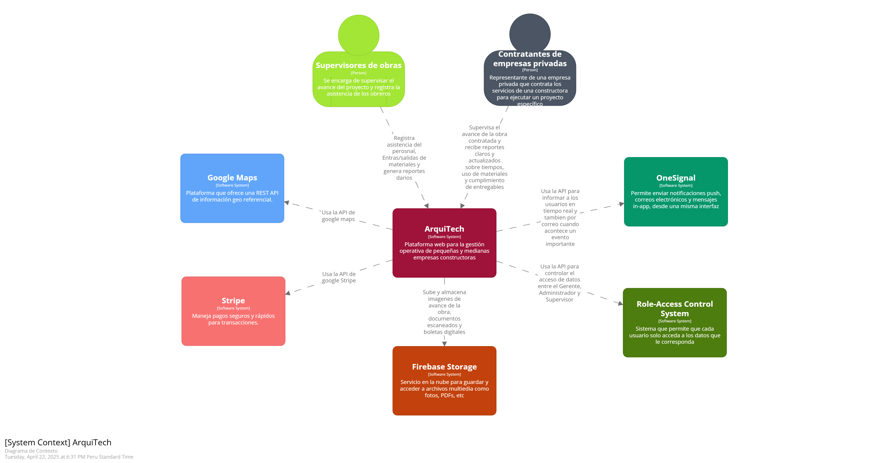
</p>

_Nota._ Elaboración propia.

### 4.8.2. Software Architecture Container Diagrams

**Figura 74**  
_Software Architecture Container Diagram of ArquiTech_

<p align="center">
  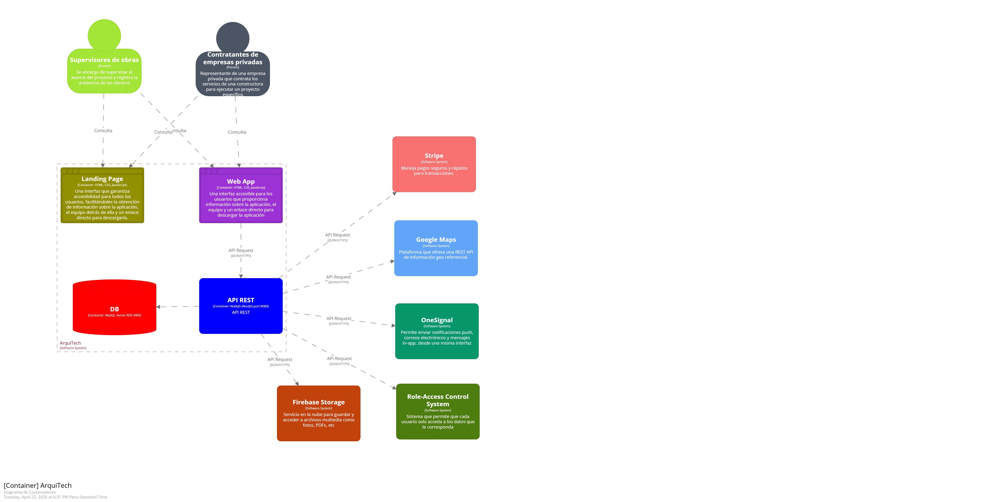
</p>

_Nota._ Elaboración propia.

### 4.8.3. Software Architecture Components Diagrams

**Figura 75**  
_Software Architecture Components Diagram of ArquiTech_

<p align="center">
  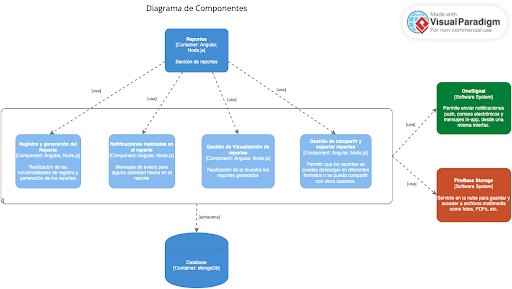
</p>

_Nota._ Elaboración propia.

## 4.9. Software Object-Oriented Design

El diseño orientado a objetos de ArquiTech representa las principales entidades del dominio relacionadas con la gestión y seguimiento de proyectos de construcción. El modelo fue elaborado considerando los requisitos funcionales identificados, las necesidades obtenidas durante el proceso de Needfinding y las funcionalidades definidas mediante las User Stories.

El diseño busca representar de manera coherente las responsabilidades de cada entidad, sus atributos, operaciones y relaciones. Entre los principales conceptos considerados se encuentran los usuarios de la plataforma, proyectos, materiales, movimientos de inventario, maquinaria, trabajadores, asistencia, tareas, incidencias y reportes.

### 4.9.1. Class Diagrams

El Class Diagram de ArquiTech representa la estructura estática del dominio de la aplicación y las relaciones existentes entre sus principales clases.

El modelo se encuentra compuesto por las clases `User`, `Project`, `ProjectMember`, `Material`, `MaterialMovement`, `Machinery`, `Worker`, `Attendance`, `Task`, `Incident` y `Report`.

**Figura X**  
_Class Diagram de ArquiTech_

<p align="center">
  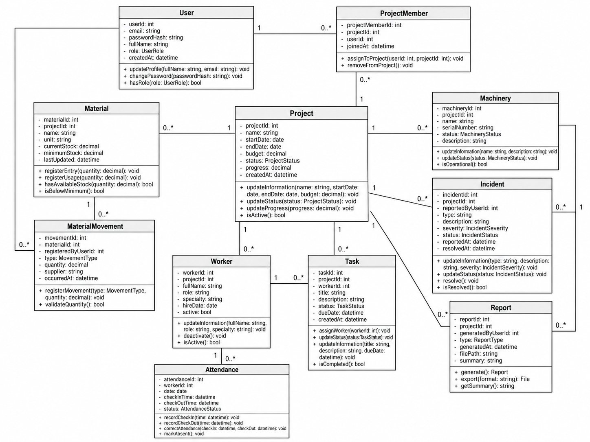
</p>

_Nota._ Elaboración propia.

La clase `User` representa a los usuarios que acceden a ArquiTech, principalmente supervisores de obra y contratantes de empresas privadas. Los usuarios pueden participar en diferentes proyectos, relación que se representa mediante la clase asociativa `ProjectMember`.

La clase `Project` constituye la entidad central del modelo y representa una obra administrada mediante ArquiTech. A partir de un proyecto se organizan los materiales, maquinaria, trabajadores, tareas, incidencias y reportes asociados.

La gestión de materiales se representa mediante `Material` y `MaterialMovement`. `Material` mantiene información acerca del stock disponible de un recurso, mientras que `MaterialMovement` registra las entradas y usos realizados, permitiendo conservar la trazabilidad del inventario.

`Machinery` representa los equipos o maquinarias asignados a una obra, incluyendo su identificación y estado operativo.

La gestión de personal se representa mediante `Worker`, que almacena la información de los trabajadores asignados a cada proyecto. `Attendance` conserva los registros diarios de asistencia, mientras que `Task` representa las actividades asignadas a los trabajadores y su estado de ejecución.

`Incident` permite registrar acontecimientos relevantes ocurridos durante la ejecución de la obra, manteniendo información sobre su descripción, severidad, estado y resolución.

Finalmente, `Report` representa los reportes generados a partir de la información registrada en el proyecto, permitiendo consolidar datos relacionados con avance, materiales, trabajadores, tareas e incidencias.

Las principales relaciones del modelo son las siguientes:

- Un `User` puede participar en múltiples `Project` y un `Project` puede contar con múltiples usuarios mediante `ProjectMember`.
- Un `Project` puede contener múltiples `Material`, `Machinery`, `Worker`, `Task`, `Incident` y `Report`.
- Un `Material` puede registrar múltiples `MaterialMovement`.
- Un `Worker` puede tener múltiples registros de `Attendance`.
- Un `Worker` puede tener múltiples `Task` asignadas.
- Un `Project` puede registrar múltiples incidencias y reportes.

### 4.9.2. Class Dictionary

El Class Dictionary complementa el Class Diagram mediante la descripción de las responsabilidades, atributos y operaciones correspondientes a cada una de las clases identificadas en el dominio de ArquiTech.

#### Clase `User`

Representa a los usuarios registrados en ArquiTech que participan en el seguimiento o gestión de los proyectos.

| Atributo     | Tipo     | Descripción                                                    |
| ------------ | -------- | -------------------------------------------------------------- |
| userId       | int      | Identificador único del usuario.                               |
| email        | string   | Correo electrónico utilizado para acceder a la plataforma.     |
| passwordHash | string   | Representación cifrada de la contraseña del usuario.           |
| fullName     | string   | Nombre completo del usuario.                                   |
| role         | UserRole | Rol del usuario dentro de ArquiTech: Supervisor o Contratante. |
| createdAt    | datetime | Fecha y hora de creación de la cuenta.                         |

| Método                         | Retorno | Descripción                                      |
| ------------------------------ | ------- | ------------------------------------------------ |
| updateProfile(fullName, email) | void    | Actualiza la información personal del usuario.   |
| changePassword(passwordHash)   | void    | Actualiza la contraseña almacenada del usuario.  |
| hasRole(role)                  | bool    | Verifica si el usuario posee un determinado rol. |

#### Clase `Project`

Representa una obra o proyecto de construcción gestionado mediante ArquiTech.

| Atributo  | Tipo          | Descripción                                      |
| --------- | ------------- | ------------------------------------------------ |
| projectId | int           | Identificador único del proyecto.                |
| name      | string        | Nombre del proyecto.                             |
| startDate | date          | Fecha de inicio del proyecto.                    |
| endDate   | date          | Fecha estimada de finalización.                  |
| budget    | decimal       | Presupuesto asignado al proyecto.                |
| status    | ProjectStatus | Estado actual del proyecto.                      |
| progress  | decimal       | Porcentaje de avance registrado.                 |
| createdAt | datetime      | Fecha de creación del proyecto en la plataforma. |

| Método                                 | Retorno | Descripción                                   |
| -------------------------------------- | ------- | --------------------------------------------- |
| updateInformation(name, dates, budget) | void    | Actualiza los datos generales del proyecto.   |
| updateStatus(status)                   | void    | Modifica el estado del proyecto.              |
| updateProgress(progress)               | void    | Actualiza el porcentaje de avance.            |
| isActive()                             | bool    | Determina si el proyecto se encuentra activo. |

#### Clase `ProjectMember`

Representa la asociación entre un usuario y un proyecto.

| Atributo        | Tipo     | Descripción                                       |
| --------------- | -------- | ------------------------------------------------- |
| projectMemberId | int      | Identificador único de la asociación.             |
| projectId       | int      | Identificador del proyecto relacionado.           |
| userId          | int      | Identificador del usuario relacionado.            |
| joinedAt        | datetime | Fecha en que el usuario fue asociado al proyecto. |

| Método                             | Retorno | Descripción                                        |
| ---------------------------------- | ------- | -------------------------------------------------- |
| assignToProject(userId, projectId) | void    | Asocia un usuario con un proyecto.                 |
| removeFromProject()                | void    | Elimina la asociación del usuario con el proyecto. |

#### Clase `Material`

Representa un material disponible dentro del inventario de un proyecto.

| Atributo     | Tipo     | Descripción                                 |
| ------------ | -------- | ------------------------------------------- |
| materialId   | int      | Identificador único del material.           |
| projectId    | int      | Proyecto al que pertenece el material.      |
| name         | string   | Nombre del material.                        |
| unit         | string   | Unidad utilizada para medir el material.    |
| currentStock | decimal  | Cantidad disponible actualmente.            |
| minimumStock | decimal  | Cantidad mínima recomendada.                |
| lastUpdated  | datetime | Fecha de la última actualización del stock. |

| Método                      | Retorno | Descripción                                                     |
| --------------------------- | ------- | --------------------------------------------------------------- |
| registerEntry(quantity)     | void    | Incrementa el stock por una entrada de material.                |
| registerUsage(quantity)     | void    | Reduce el stock por utilización del material.                   |
| hasAvailableStock(quantity) | bool    | Verifica si existe cantidad suficiente para una salida.         |
| isBelowMinimum()            | bool    | Indica si el stock se encuentra por debajo del mínimo definido. |

#### Clase `MaterialMovement`

Representa una transacción de entrada o utilización de un material.

| Atributo           | Tipo         | Descripción                                           |
| ------------------ | ------------ | ----------------------------------------------------- |
| movementId         | int          | Identificador único del movimiento.                   |
| materialId         | int          | Material relacionado con el movimiento.               |
| registeredByUserId | int          | Usuario que registra el movimiento.                   |
| type               | MovementType | Tipo de movimiento: Entry o Usage.                    |
| quantity           | decimal      | Cantidad involucrada.                                 |
| supplier           | string       | Proveedor relacionado cuando se registra una entrada. |
| occurredAt         | datetime     | Fecha y hora del movimiento.                          |

| Método                           | Retorno | Descripción                                    |
| -------------------------------- | ------- | ---------------------------------------------- |
| registerMovement(type, quantity) | void    | Registra un movimiento de material.            |
| validateQuantity()               | bool    | Verifica que la cantidad ingresada sea válida. |

#### Clase `Machinery`

Representa una maquinaria o equipo asignado a un proyecto.

| Atributo     | Tipo            | Descripción                                  |
| ------------ | --------------- | -------------------------------------------- |
| machineryId  | int             | Identificador único de la maquinaria.        |
| projectId    | int             | Proyecto al que se encuentra asignada.       |
| name         | string          | Nombre o tipo de maquinaria.                 |
| serialNumber | string          | Número de serie o código identificador.      |
| status       | MachineryStatus | Estado operativo de la maquinaria.           |
| description  | string          | Información complementaria de la maquinaria. |

| Método                               | Retorno | Descripción                                        |
| ------------------------------------ | ------- | -------------------------------------------------- |
| updateInformation(name, description) | void    | Actualiza la información de la maquinaria.         |
| updateStatus(status)                 | void    | Modifica su estado operativo.                      |
| isOperational()                      | bool    | Comprueba si la maquinaria se encuentra operativa. |

#### Clase `Worker`

Representa a un trabajador asignado a un proyecto de construcción.

| Atributo  | Tipo   | Descripción                               |
| --------- | ------ | ----------------------------------------- |
| workerId  | int    | Identificador único del trabajador.       |
| projectId | int    | Proyecto en el que participa.             |
| fullName  | string | Nombre completo del trabajador.           |
| role      | string | Rol desempeñado dentro de la obra.        |
| specialty | string | Especialidad del trabajador.              |
| hireDate  | date   | Fecha de incorporación.                   |
| active    | bool   | Indica si continúa activo en el proyecto. |

| Método                                       | Retorno | Descripción                              |
| -------------------------------------------- | ------- | ---------------------------------------- |
| updateInformation(fullName, role, specialty) | void    | Actualiza la información del trabajador. |
| deactivate()                                 | void    | Marca al trabajador como inactivo.       |
| isActive()                                   | bool    | Indica si continúa asignado al proyecto. |

#### Clase `Attendance`

Representa un registro diario de asistencia de un trabajador.

| Atributo     | Tipo             | Descripción                          |
| ------------ | ---------------- | ------------------------------------ |
| attendanceId | int              | Identificador único del registro.    |
| workerId     | int              | Trabajador asociado.                 |
| date         | date             | Fecha correspondiente al registro.   |
| checkInTime  | datetime         | Hora de ingreso registrada.          |
| checkOutTime | datetime         | Hora de salida registrada.           |
| status       | AttendanceStatus | Estado de asistencia del trabajador. |

| Método                               | Retorno | Descripción                          |
| ------------------------------------ | ------- | ------------------------------------ |
| recordCheckIn(time)                  | void    | Registra la hora de ingreso.         |
| recordCheckOut(time)                 | void    | Registra la hora de salida.          |
| correctAttendance(checkIn, checkOut) | void    | Corrige un registro de asistencia.   |
| markAbsent()                         | void    | Registra la ausencia del trabajador. |

#### Clase `Task`

Representa una actividad asignada a un trabajador dentro de un proyecto.

| Atributo    | Tipo       | Descripción                            |
| ----------- | ---------- | -------------------------------------- |
| taskId      | int        | Identificador único de la tarea.       |
| projectId   | int        | Proyecto al que pertenece.             |
| workerId    | int        | Trabajador asignado a la tarea.        |
| title       | string     | Nombre de la tarea.                    |
| description | string     | Descripción detallada de la actividad. |
| status      | TaskStatus | Estado de ejecución de la tarea.       |
| dueDate     | datetime   | Fecha límite de la tarea.              |
| createdAt   | datetime   | Fecha en que fue registrada.           |

| Método                                         | Retorno | Descripción                                   |
| ---------------------------------------------- | ------- | --------------------------------------------- |
| assignWorker(workerId)                         | void    | Asigna la tarea a un trabajador.              |
| updateStatus(status)                           | void    | Modifica el estado de la tarea.               |
| updateInformation(title, description, dueDate) | void    | Modifica la información de la tarea.          |
| isCompleted()                                  | bool    | Verifica si la tarea se encuentra finalizada. |

#### Clase `Incident`

Representa una incidencia ocurrida durante el desarrollo de una obra.

| Atributo         | Tipo             | Descripción                                     |
| ---------------- | ---------------- | ----------------------------------------------- |
| incidentId       | int              | Identificador único de la incidencia.           |
| projectId        | int              | Proyecto relacionado.                           |
| reportedByUserId | int              | Usuario que registró la incidencia.             |
| type             | string           | Categoría de la incidencia.                     |
| description      | string           | Descripción de lo sucedido.                     |
| severity         | IncidentSeverity | Nivel de severidad registrado.                  |
| status           | IncidentStatus   | Estado actual de la incidencia.                 |
| reportedAt       | datetime         | Fecha y hora en que fue registrada.             |
| resolvedAt       | datetime         | Fecha y hora de resolución, cuando corresponda. |

| Método                                         | Retorno | Descripción                                 |
| ---------------------------------------------- | ------- | ------------------------------------------- |
| updateInformation(type, description, severity) | void    | Actualiza la información registrada.        |
| updateStatus(status)                           | void    | Cambia el estado de la incidencia.          |
| resolve()                                      | void    | Marca la incidencia como resuelta.          |
| isResolved()                                   | bool    | Comprueba si la incidencia fue solucionada. |

#### Clase `Report`

Representa un reporte generado a partir de la información de un proyecto.

| Atributo          | Tipo       | Descripción                           |
| ----------------- | ---------- | ------------------------------------- |
| reportId          | int        | Identificador único del reporte.      |
| projectId         | int        | Proyecto sobre el cual se genera.     |
| generatedByUserId | int        | Usuario responsable de la generación. |
| type              | ReportType | Tipo de reporte.                      |
| generatedAt       | datetime   | Fecha y hora de generación.           |
| filePath          | string     | Ubicación del archivo generado.       |
| summary           | string     | Resumen general del reporte.          |

| Método         | Retorno | Descripción                                          |
| -------------- | ------- | ---------------------------------------------------- |
| generate()     | Report  | Genera el reporte utilizando los datos del proyecto. |
| export(format) | File    | Exporta el reporte en el formato indicado.           |
| getSummary()   | string  | Retorna el resumen del reporte.                      |

---

## 4.10. Database Design

El diseño de base de datos de ArquiTech se plantea mediante un modelo relacional debido a la naturaleza estructurada de la información gestionada y a la necesidad de mantener relaciones consistentes entre proyectos, usuarios, trabajadores, materiales, tareas e incidencias.

El modelo utiliza claves primarias para identificar cada registro y claves foráneas para mantener la integridad referencial entre las entidades relacionadas.

### 4.10.1. Relational/Non-Relational Database Diagram

El Relational Database Diagram representa las tablas necesarias para persistir la información correspondiente a las entidades definidas en el diseño orientado a objetos.

Las principales tablas consideradas son `users`, `projects`, `project_members`, `materials`, `material_movements`, `machineries`, `workers`, `attendances`, `tasks`, `incidents` y `reports`.

**Figura X**  
_Relational Database Diagram de ArquiTech_

<p align="center">
  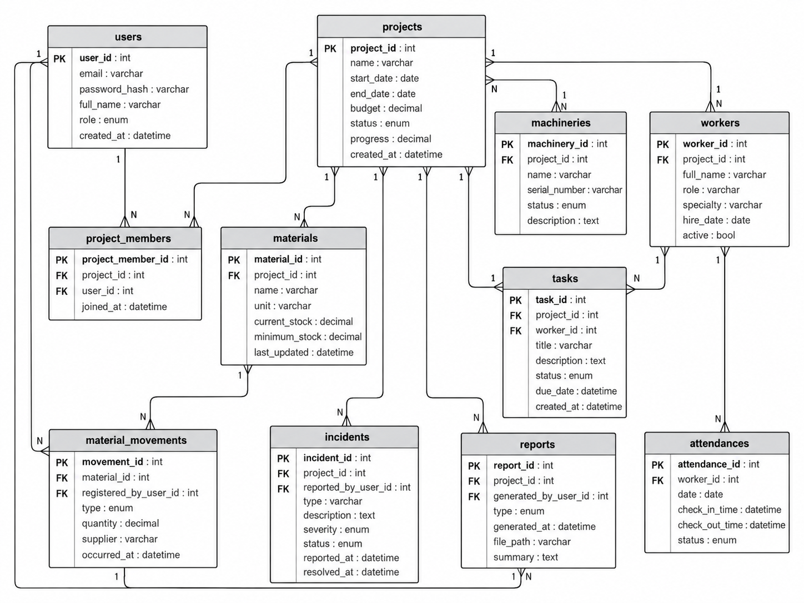
</p>

_Nota._ Elaboración propia.

La tabla `users` almacena la información de autenticación y perfil de los usuarios de ArquiTech. La relación entre los usuarios y los proyectos se representa mediante `project_members`, permitiendo que múltiples usuarios puedan participar en un mismo proyecto y que un usuario pueda estar relacionado con diferentes proyectos.

`projects` constituye la tabla central del modelo y se relaciona con los distintos recursos utilizados durante la ejecución de una obra.

`materials` almacena el inventario actual de materiales correspondiente a cada proyecto, mientras que `material_movements` conserva el historial de entradas y usos realizados. Esta separación permite mantener el stock actual y, al mismo tiempo, preservar la trazabilidad de las operaciones.

`machineries` almacena la información de la maquinaria asignada a cada proyecto.

`workers` registra al personal involucrado en una obra. Los registros diarios de asistencia se almacenan mediante `attendances`, mientras que las actividades asignadas a los trabajadores son gestionadas mediante `tasks`.

`incidents` mantiene el historial de acontecimientos relevantes registrados durante el desarrollo de un proyecto y permite realizar seguimiento de su estado hasta su resolución.

Finalmente, `reports` almacena la información de los reportes generados para cada proyecto.

Las principales relaciones del modelo son de tipo uno a muchos y muchos a muchos. La relación muchos a muchos existente entre usuarios y proyectos se resuelve mediante la tabla intermedia `project_members`.

#### Estructura propuesta de tablas

| Tabla                | Campos principales                                                                                                                     |
| -------------------- | -------------------------------------------------------------------------------------------------------------------------------------- |
| `users`              | `user_id PK`, `email`, `password_hash`, `full_name`, `role`, `created_at`                                                              |
| `projects`           | `project_id PK`, `name`, `start_date`, `end_date`, `budget`, `status`, `progress`, `created_at`                                        |
| `project_members`    | `project_member_id PK`, `project_id FK`, `user_id FK`, `joined_at`                                                                     |
| `materials`          | `material_id PK`, `project_id FK`, `name`, `unit`, `current_stock`, `minimum_stock`, `last_updated`                                    |
| `material_movements` | `movement_id PK`, `material_id FK`, `registered_by_user_id FK`, `type`, `quantity`, `supplier`, `occurred_at`                          |
| `machineries`        | `machinery_id PK`, `project_id FK`, `name`, `serial_number`, `status`, `description`                                                   |
| `workers`            | `worker_id PK`, `project_id FK`, `full_name`, `role`, `specialty`, `hire_date`, `active`                                               |
| `attendances`        | `attendance_id PK`, `worker_id FK`, `date`, `check_in_time`, `check_out_time`, `status`                                                |
| `tasks`              | `task_id PK`, `project_id FK`, `worker_id FK`, `title`, `description`, `status`, `due_date`, `created_at`                              |
| `incidents`          | `incident_id PK`, `project_id FK`, `reported_by_user_id FK`, `type`, `description`, `severity`, `status`, `reported_at`, `resolved_at` |
| `reports`            | `report_id PK`, `project_id FK`, `generated_by_user_id FK`, `type`, `generated_at`, `file_path`, `summary`                             |

# Capítulo V: Product Implementation

## 5.1. Software Configuration Management

Esta sección define las herramientas, prácticas de control de versiones, convenciones de código y procesos de despliegue utilizados para mantener de forma trazable los productos de ArquiTech. La implementación técnica se reutiliza de los repositorios de `osFoundex`, mientras que el informe del curso actual se administra en un repositorio independiente de la organización del curso.

### 5.1.1. Software Development Environment Configuration

#### Project Management y Requirements Management

- **[Trello](https://trello.com/):** permite organizar el Product Backlog, planificar los sprints, asignar responsables y dar seguimiento al estado de las actividades y requisitos del proyecto.
- **[GitHub](https://github.com/):** centraliza los repositorios, el historial de cambios, las revisiones mediante Pull Requests y la trazabilidad entre cambios e incidencias.

#### Product UX/UI Design

- **[Figma](https://www.figma.com/):** se utiliza para elaborar y compartir wireframes, mock-ups, prototipos y especificaciones visuales de la experiencia de usuario.

#### Software Development

- **[WebStorm](https://www.jetbrains.com/webstorm/):** entorno de desarrollo para la Landing Page y el Frontend Web Application basados en Angular y TypeScript.
- **[IntelliJ IDEA](https://www.jetbrains.com/idea/):** entorno de desarrollo para el Backend y los Web Services implementados con Java y Spring Boot.
- **[Angular](https://angular.dev/):** framework basado en componentes. El Frontend Web Application reutilizado emplea Angular 19.2; la Landing Page ubicada en la rama `develop` emplea Angular 20.
- **[TypeScript](https://www.typescriptlang.org/):** lenguaje utilizado por las aplicaciones Angular. El Frontend Web Application emplea TypeScript 5.7 y la Landing Page emplea TypeScript 5.8.
- **[Angular Material](https://material.angular.dev/):** biblioteca de componentes de interfaz utilizada por el Frontend Web Application, en su línea de versión 19.2.
- **[npm](https://www.npmjs.com/):** gestor de dependencias y ejecutor de scripts para los proyectos Angular.
- **[Java](https://www.oracle.com/java/technologies/downloads/#java17):** lenguaje del Backend; el proyecto de la rama `develop` está configurado para Java 17.
- **[Spring Boot](https://spring.io/projects/spring-boot):** framework del Backend, configurado en la versión 3.5.0 con Spring Web, Spring Data JPA, Spring Validation y Spring Security.
- **[Apache Maven](https://maven.apache.org/):** herramienta de construcción y gestión de dependencias del Backend.
- **[MySQL](https://www.mysql.com/):** sistema gestor de base de datos relacional utilizado por el Backend mediante MySQL Connector/J y Spring Data JPA.

#### Software Testing

- **[Jasmine](https://jasmine.github.io/):** framework de pruebas unitarias declarado en los proyectos Angular.
- **[Karma](https://karma-runner.github.io/):** test runner configurado por Angular para ejecutar las pruebas de Jasmine en un navegador.
- **[Spring Boot Test](https://docs.spring.io/spring-boot/reference/testing/index.html):** dependencia de pruebas del Backend para pruebas unitarias y de integración del contexto Spring.

#### Software Deployment

- **[Netlify](https://www.netlify.com/):** plataforma usada en el proyecto reutilizado para publicar la Landing Page y el Frontend Web Application como sitios estáticos.
- **[GitHub Pages](https://pages.github.com/):** alternativa documentada y activa para publicar la Landing Page desde GitHub.
- **[Railway](https://railway.com/):** plataforma documentada para desplegar el Backend Spring Boot y su conexión con MySQL mediante configuración externa.

#### Software Documentation

- **[OpenAPI](https://www.openapis.org/) y [Swagger UI](https://swagger.io/tools/swagger-ui/):** documentación interactiva de la API generada por `springdoc-openapi` 2.8.8 en el Backend.
- **[Markdown](https://www.markdownguide.org/) y [GitHub README](https://docs.github.com/en/repositories/managing-your-repositorys-settings-and-features/customizing-your-repository/about-readmes):** formato y medio utilizados para mantener el Project Report y la documentación técnica junto con su historial de versiones.
- **[Git](https://git-scm.com/):** sistema distribuido de control de versiones utilizado durante todo el ciclo de vida del software.

### 5.1.2. Source Code Management

El equipo utiliza Git para el control de versiones y GitHub para alojar y revisar los cambios. El Project Report del curso actual no debe confundirse con el informe reutilizado: el documento vigente se mantiene en la organización `UPC-1ASI0732-202620-9112-ArquiTech`, mientras que la base técnica procede de `osFoundex`.

Repositorios administrados o utilizados como referencia:

- **Project Report actual:** [ArquiTech-Report](https://github.com/UPC-1ASI0732-202620-9112-ArquiTech/ArquiTech-Report)
- **Project Report reutilizado:** [ArquiTech_ProjectReport](https://github.com/osFoundex/ArquiTech_ProjectReport)
- **Landing Page reutilizada:** [ArquiTech_LandingPage](https://github.com/osFoundex/ArquiTech_LandingPage)
- **Frontend Web Application reutilizado:** [ArquiTech_FrontendWebApp](https://github.com/osFoundex/ArquiTech_FrontendWebApp)
- **Backend / Web Services reutilizado:** [Arquitech_BackendWebApp](https://github.com/osFoundex/Arquitech_BackendWebApp)

#### GitFlow

El flujo de trabajo se basa en GitFlow. Las ramas persistentes y temporales cumplen los siguientes propósitos:

- **`main`:** contiene versiones estables y aptas para producción. Los releases se identifican con etiquetas de versión.
- **`develop`:** integra el trabajo aprobado y representa el estado de la siguiente versión. Las ramas `main` y `develop` existen en los repositorios reutilizados de Landing Page, Frontend y Backend.
- **`feature/*`:** nace desde `develop`, aísla una funcionalidad y vuelve a `develop` mediante Pull Request después de su revisión. Ejemplos: `feature/project-management`, `feature/material-inventory` y `feature/user-authentication`.
- **`release/*`:** nace desde `develop` para estabilizar una versión sin incorporar nuevas funcionalidades; al finalizar se integra en `main` y `develop`. Ejemplo: `release/1.0.0`.
- **`hotfix/*`:** nace desde `main` para corregir un defecto urgente de producción; luego se integra en `main` y `develop`. Ejemplo: `hotfix/1.0.1`.

Los nombres de ramas se escriben en inglés. Los nombres descriptivos de `feature/*` usan `kebab-case`, mientras que `release/*` y `hotfix/*` usan una versión válida.

#### Semantic Versioning

Las versiones siguen [Semantic Versioning 2.0.0](https://semver.org/) con el formato `MAJOR.MINOR.PATCH`:

- `MAJOR` cambia cuando se introducen modificaciones incompatibles.
- `MINOR` cambia cuando se agregan funcionalidades compatibles.
- `PATCH` cambia cuando se corrigen defectos de forma compatible.

Por ejemplo, `1.1.0` identifica una nueva funcionalidad compatible y `1.0.1` una corrección compatible. En `main`, cada release estable debe etiquetarse como `v<version>`, por ejemplo, `v1.0.0`.

#### Conventional Commits

Los mensajes de commit se redactan en inglés y siguen [Conventional Commits](https://www.conventionalcommits.org/) con la estructura:

```text
<type>(<scope>): <description>
```

Se utilizan los tipos `feat`, `fix`, `docs`, `style`, `refactor`, `test` y `chore`. El `scope` identifica el área afectada y la descripción se escribe de forma breve, imperativa y sin punto final.

```text
feat(projects): add project creation form
fix(inventory): correct material stock calculation
docs(report): update software configuration management
```

### 5.1.3. Source Code Style Guide & Conventions

Las convenciones se aplican a las tecnologías presentes en los repositorios reutilizados. Toda nomenclatura de código se escribe en inglés y emplea nombres descriptivos que expresen intención.

#### Convenciones generales

- Usar `camelCase` para variables, funciones y métodos.
- Usar `PascalCase` para clases, interfaces y componentes.
- Usar `UPPER_SNAKE_CASE` para constantes.
- Usar `kebab-case` para nombres de archivos y componentes web cuando corresponda.
- Evitar abreviaturas ambiguas y nombres genéricos como `data`, `item` o `temp` cuando el dominio permita un nombre más preciso.

#### HTML

- Utilizar HTML5 y su declaración `<!DOCTYPE html>`.
- Preferir etiquetas semánticas como `header`, `nav`, `main`, `section`, `article` y `footer`.
- Escribir etiquetas y atributos en minúsculas, con valores entre comillas.
- Incluir atributos de accesibilidad, como `alt` en imágenes y etiquetas asociadas a controles de formulario.
- Evitar estilos inline cuando puedan mantenerse en los archivos de estilo del componente.

#### CSS

- Nombrar las clases en minúsculas y con guiones, por ejemplo, `project-card` y `material-list`.
- Organizar los estilos por componente y mantener selectores con baja especificidad.
- Evitar `!important`, salvo cuando exista una necesidad documentada que no pueda resolverse mediante la cascada.
- Agrupar reglas relacionadas y reutilizar variables o estilos comunes para mantener consistencia visual.

#### TypeScript

- Usar `camelCase` en variables y funciones, `PascalCase` en clases e interfaces y `UPPER_SNAKE_CASE` en constantes globales.
- Declarar tipos apropiados para propiedades, parámetros y valores de retorno; evitar `any` salvo integración justificada con datos sin tipo.
- Preferir `const` cuando no exista reasignación y `let` cuando sea necesaria; no usar `var`.
- Mantener funciones pequeñas, responsabilidades claras e importaciones ordenadas.

#### Angular

- Nombrar los archivos de componentes y servicios en `kebab-case` y con el sufijo que identifica su responsabilidad:

```text
project-list.component.ts
project-list.component.html
project-list.component.css
project.service.ts
```

- Nombrar las clases de componentes en `PascalCase` con el sufijo `Component`, por ejemplo, `ProjectListComponent`.
- Nombrar los servicios en `PascalCase` con el sufijo `Service`, por ejemplo, `ProjectService`.
- Agrupar componentes, servicios, modelos y rutas por feature; mantener la lógica de acceso a datos fuera de los componentes.

#### Java

- Usar `PascalCase` para clases, records y enums; `camelCase` para variables y métodos; y `UPPER_SNAKE_CASE` para constantes.
- Escribir los packages completamente en minúsculas y organizarlos de acuerdo con los bounded contexts y responsabilidades del proyecto.
- Mantener una clase pública principal por archivo y usar nombres que representen conceptos del dominio.

#### Spring Boot

- Emplear los sufijos `Controller`, `Service`, `Repository`, `Entity`, `Resource` y `Assembler` para hacer explícita la responsabilidad de cada clase.
- Diseñar recursos REST con sustantivos plurales y una versión de API, por ejemplo, `/api/v1/users` y `/api/v1/projects`.
- Utilizar los verbos HTTP y códigos de estado de acuerdo con la operación ejecutada.
- Validar las entradas y centralizar el manejo de errores; los controladores no deben contener reglas de negocio ni acceso directo a persistencia.
- Proporcionar secretos, credenciales y configuración específica del entorno mediante variables de entorno; nunca incluirlos en el código fuente.

#### Gherkin

- Organizar las especificaciones con `Feature`, `Scenario`, `Given`, `When` y `Then`.
- Redactar escenarios y pasos en inglés, con lenguaje claro y centrado en el comportamiento observable.
- Evitar detalles de implementación y mantener cada escenario independiente y verificable.

```gherkin
Feature: Project management
  Scenario: Contractor creates a project with valid information
    Given the contractor is authenticated
    When the contractor submits the project information
    Then the project is added to the project list
```

#### Comentarios

Los comentarios deben explicar decisiones, restricciones o comportamientos que no sean evidentes a partir del código. Se evitan comentarios redundantes que solo repitan una instrucción, así como código comentado que deba eliminarse o recuperarse desde el historial de Git.

### 5.1.4. Software Deployment Configuration

Antes de desplegar, los cambios deben superar la revisión, la construcción y las pruebas correspondientes. Los valores sensibles no se almacenan en el repositorio ni se escriben en esta documentación.

#### Landing Page

La Landing Page reutilizada se encuentra en [ArquiTech_LandingPage](https://github.com/osFoundex/ArquiTech_LandingPage). Su rama `develop` contiene un proyecto Angular 20 administrado con npm; por ello, su instalación y construcción se realizan con los scripts declarados en `package.json`:

```bash
git clone https://github.com/osFoundex/ArquiTech_LandingPage.git
cd ArquiTech_LandingPage
git checkout develop
npm install
npm run build
```

El resultado optimizado se genera dentro de `dist/` según la configuración de Angular. El proyecto reutilizado documenta dos publicaciones que se mantienen accesibles:

- **GitHub Pages:** [https://osfoundex.github.io/ArquiTech_LandingPage/](https://osfoundex.github.io/ArquiTech_LandingPage/)
- **Netlify:** [https://incredible-meringue-eb1ec4.netlify.app/](https://incredible-meringue-eb1ec4.netlify.app/)

Para GitHub Pages se publica el contenido construido en la fuente configurada en el repositorio. En Netlify se vincula el repositorio, se define `npm run build` como Build command y se selecciona como Publish directory la carpeta de salida generada dentro de `dist/`.

#### Frontend Web Application

El Frontend reutilizado se encuentra en [ArquiTech_FrontendWebApp](https://github.com/osFoundex/ArquiTech_FrontendWebApp). La rama `develop` declara Angular 19.2, TypeScript 5.7, Angular Material 19.2 y los scripts `build` y `test`:

```bash
git clone https://github.com/osFoundex/ArquiTech_FrontendWebApp.git
cd ArquiTech_FrontendWebApp
git checkout develop
npm install
npm test -- --watch=false
npm run build
```

`npm run build` ejecuta `ng build` y utiliza por defecto la configuración de producción. De forma explícita también puede ejecutarse:

```bash
npx ng build --configuration production
```

La salida se genera en `dist/arquitech`, tal como establece `angular.json`. En Netlify se configura `npm run build` como Build command y `dist/arquitech/browser` como Publish directory para el builder de aplicación de Angular. El despliegue reutilizado se encuentra en [https://precious-bavarois-d27735.netlify.app/](https://precious-bavarois-d27735.netlify.app/).

#### Backend / Web Services

El Backend reutilizado se encuentra en [Arquitech_BackendWebApp](https://github.com/osFoundex/Arquitech_BackendWebApp). El módulo Maven está ubicado en `arquitech-back-end` y su rama `develop` incluye Maven Wrapper, Java 17, Spring Boot 3.5.0, MySQL Connector/J, Spring Security y `springdoc-openapi`.

En Linux o macOS:

```bash
git clone https://github.com/osFoundex/Arquitech_BackendWebApp.git
cd Arquitech_BackendWebApp/arquitech-back-end
./mvnw test
./mvnw clean package
```

En Windows:

```powershell
git clone https://github.com/osFoundex/Arquitech_BackendWebApp.git
cd Arquitech_BackendWebApp\arquitech-back-end
mvnw.cmd test
mvnw.cmd clean package
```

El comando `test` ejecuta las pruebas configuradas con Spring Boot Test. `clean package` recompila el proyecto, ejecuta las pruebas y genera el artefacto JAR dentro de `target/`. Railway puede construir el servicio desde el repositorio o ejecutar el JAR generado, exponer el puerto asignado por la plataforma y conectarlo con una instancia MySQL.

La configuración de producción se proporciona mediante variables de entorno. Como mínimo se administran nombres como los siguientes, sin registrar sus valores en Git:

```text
DATABASE_URL
PROD_DB_USERNAME
PROD_DB_PASSWORD
```

Estas variables se asignan a las propiedades de datasource de Spring Boot en la configuración del entorno de Railway. Cualquier clave JWT, token u otro secreto también debe mantenerse exclusivamente en el gestor de variables de la plataforma. `springdoc-openapi` genera la especificación OpenAPI y Swagger UI permite consultar y probar los endpoints una vez desplegado el servicio. Las URLs históricas de Railway y Swagger documentadas por el proyecto reutilizado no se consignan como enlaces activos porque actualmente no responden con la interfaz de la API.

#### Flujo de promoción

```text
Development
↓
feature/*
↓
develop
↓
Testing and Verification
↓
release/*
↓
main
↓
Production Deployment
```

## 5.2. Product Implementation & Deployment

### 5.2.1. Sprint Backlogs

<div style="text-align: justify;">
Para el control y seguimiento de las actividades del proyecto ArquiTech, se definieron y asignaron las tareas a través del backlog. Dado que este primer sprint se enfoca en la fase de concepción, diseño UX/UI y documentación de la arquitectura, una gran parte de las actividades corresponde a la configuración y documentación del proyecto. Las tareas orientadas a diseño, infraestructura y despliegue se han vinculado a las Epics, User Stories y Spike Stories correspondientes definidas en el Product Backlog. A continuación, se presenta la estructura detallada del Sprint Backlog.
</div>

<br>

_Vista del Sprint Backlog en Jira - Parte 1 (Fases de Setup, Análisis y UX)_

<p align="center">
  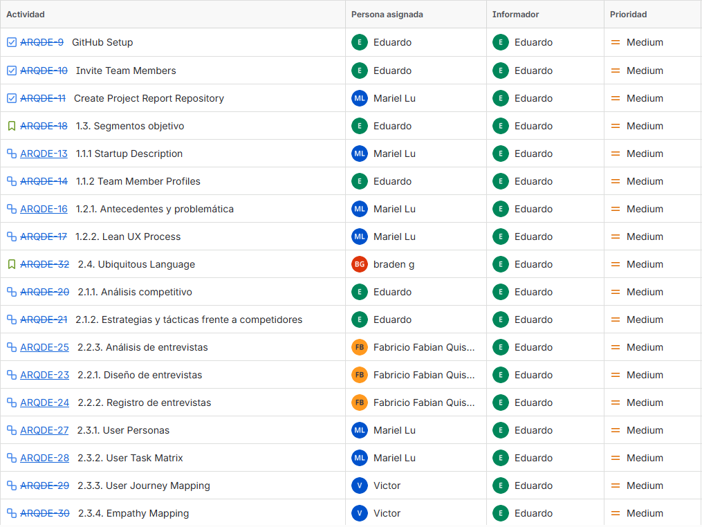
</p>
<p align="center"><em>*Nota.* Elaboración propia (Tablero de Jira Cloud).</em></p>

<br>

_Vista del Sprint Backlog en Jira - Parte 2 (Fases de Diseño, Arquitectura y Despliegue)_

<p align="center">
  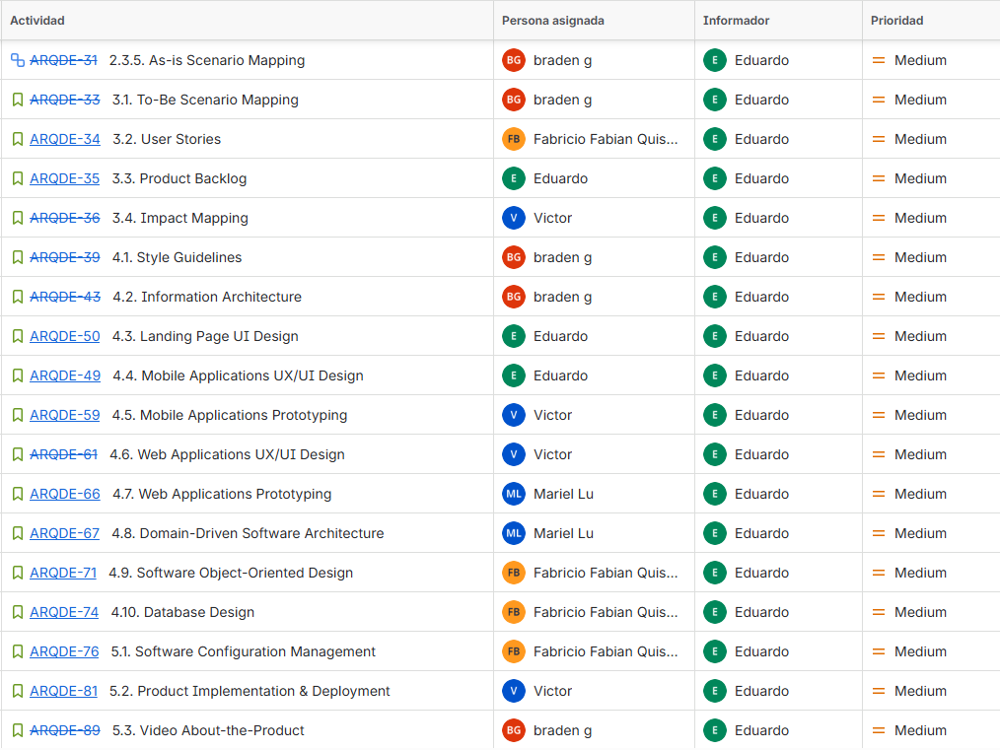
</p>
<p align="center"><em>*Nota.* Elaboración propia (Tablero de Jira Cloud).</em></p>

<br>

**Sprint #1 - Sprint Backlog (Fase de Documentación y Diseño)**

| User Story Id | User Story Title                | Work-Item/Task Id | Work-Item/Task Title           | Description                                        | Estimation (Hours) | Assigned To        | Status |
| :------------ | :------------------------------ | :---------------- | :----------------------------- | :------------------------------------------------- | :----------------- | :----------------- | :----- |
| **-**         | Project Setup                   | **ARQDE-9**       | GitHub Setup                   | Configuración del repositorio y ramas principales. | 2                  | Eduardo Chacaliaza | Done   |
| **-**         | Project Setup                   | **ARQDE-10**      | Invite Team Members            | Asignación de accesos a herramientas de gestión.   | 1                  | Eduardo Chacaliaza | Done   |
| **-**         | Project Setup                   | **ARQDE-11**      | Create Project Report...       | Creación del entorno y estructura para el informe. | 1                  | Mariel Mendoza     | Done   |
| **-**         | Project Documentation           | **ARQDE-13**      | 1.1.1 Startup Description      | Redacción del perfil y misión de la startup.       | 2                  | Mariel Mendoza     | Done   |
| **-**         | Project Documentation           | **ARQDE-14**      | 1.1.2 Team Member Profiles     | Redacción de perfiles técnicos del equipo.         | 2                  | Eduardo Chacaliaza | Done   |
| **-**         | Project Documentation           | **ARQDE-16**      | 1.2.1. Antecedentes y...       | Análisis del problema y contexto a resolver.       | 3                  | Mariel Mendoza     | Done   |
| **-**         | Project Documentation           | **ARQDE-17**      | 1.2.2. Lean UX Process         | Planteamiento de la metodología Lean y Canvas.     | 3                  | Mariel Mendoza     | Done   |
| **-**         | Project Documentation           | **ARQDE-18**      | 1.3. Segmentos objetivo        | Definición de los segmentos de usuarios.           | 3                  | Eduardo Chacaliaza | Done   |
| **-**         | Project Documentation           | **ARQDE-20**      | 2.1.1. Análisis competitivo    | Investigación de competidores y mercado.           | 4                  | Eduardo Chacaliaza | Done   |
| **-**         | Project Documentation           | **ARQDE-21**      | 2.1.2. Estrat. y tácticas...   | Definición de ventajas competitivas.               | 3                  | Eduardo Chacaliaza | Done   |
| **-**         | Project Documentation           | **ARQDE-23**      | 2.2.1. Diseño de entrevistas   | Redacción del guion de preguntas (Needfinding).    | 2                  | Fabricio Quispe    | Done   |
| **-**         | Project Documentation           | **ARQDE-24**      | 2.2.2. Registro de entrevistas | Grabación y transcripción de entrevistas.          | 5                  | Fabricio Quispe    | Done   |
| **-**         | Project Documentation           | **ARQDE-25**      | 2.2.3. Análisis de entrevistas | Resumen de insights y hallazgos clave.             | 3                  | Fabricio Quispe    | Done   |
| **-**         | Project Documentation           | **ARQDE-27**      | 2.3.1. User Personas           | Diseño de arquetipos de usuario.                   | 4                  | Mariel Mendoza     | Done   |
| **-**         | Project Documentation           | **ARQDE-28**      | 2.3.2. User Task Matrix        | Matriz de tareas frecuentes de los usuarios.       | 3                  | Mariel Mendoza     | Done   |
| **-**         | Project Documentation           | **ARQDE-29**      | 2.3.3. User Journey Mapping    | Mapeo del recorrido de los perfiles.               | 4                  | Victor Espino      | Done   |
| **-**         | Project Documentation           | **ARQDE-30**      | 2.3.4. Empathy Mapping         | Creación de mapas de empatía.                      | 3                  | Victor Espino      | Done   |
| **-**         | Project Documentation           | **ARQDE-31**      | 2.3.5. As-is Scenario Mapping  | Diagramación del escenario actual.                 | 3                  | Braden Garcia      | Done   |
| **-**         | Project Documentation           | **ARQDE-32**      | 2.4. Ubiquitous Language       | Documentación de la terminología del negocio.      | 2                  | Braden Garcia      | Done   |
| **-**         | Project Documentation           | **ARQDE-33**      | 3.1. To-Be Scenario Mapping    | Diagramación del escenario propuesto.              | 3                  | Braden Garcia      | Done   |
| **-**         | Project Documentation           | **ARQDE-34**      | 3.2. User Stories              | Redacción técnica de las historias de usuario.     | 5                  | Fabricio Quispe    | Done   |
| **-**         | Project Documentation           | **ARQDE-35**      | 3.3. Product Backlog           | Estructuración inicial del backlog ágil.           | 3                  | Eduardo Chacaliaza | Done   |
| **-**         | Project Documentation           | **ARQDE-36**      | 3.4. Impact Mapping            | Alineación de funcionalidades y negocio.           | 4                  | Victor Espino      | Done   |
| **EP04**      | Landing Page y comunicación     | **ARQDE-39**      | 4.1. Style Guidelines          | Definición de identidad visual (UI) corporativa.   | 3                  | Braden Garcia      | Done   |
| **EP08**      | Integración y evolución técnica | **ARQDE-43**      | 4.2. Information Architecture  | Creación del mapa de sitio web/móvil.              | 3                  | Braden Garcia      | Done   |
| **HU11**      | Conocer ArquiTech               | **ARQDE-50**      | 4.3. Landing Page UI Design    | Diseño de interfaz de la página de aterrizaje.     | 4                  | Eduardo Chacaliaza | Done   |
| **EP01**      | Gestión de inventarios y mat.   | **ARQDE-49**      | 4.4. Mobile App UX/UI Design   | Diseño de pantallas para la aplicación móvil.      | 6                  | Eduardo Chacaliaza | Done   |
| **EP01**      | Gestión de inventarios y mat.   | **ARQDE-59**      | 4.5. Mobile App Prototyping    | Interacciones del prototipo móvil en Figma.        | 3                  | Victor Espino      | Done   |
| **EP02**      | Gestión de trabajadores y tar.  | **ARQDE-61**      | 4.6. Web App UX/UI Design      | Diseño de mockups de la aplicación web.            | 8                  | Victor Espino      | Done   |
| **EP02**      | Gestión de trabajadores y tar.  | **ARQDE-66**      | 4.7. Web App Prototyping       | Interacciones y flujos del prototipo web.          | 3                  | Mariel Mendoza     | Done   |
| **EP08**      | Integración y evolución técnica | **ARQDE-67**      | 4.8. Domain-Driven Arch.       | Diseño de arquitectura impulsada por el dominio.   | 4                  | Mariel Mendoza     | Done   |
| **EP08**      | Integración y evolución técnica | **ARQDE-71**      | 4.9. Object-Oriented Design    | Elaboración de diagramas de clases y objetos.      | 5                  | Fabricio Quispe    | Done   |
| **EP08**      | Integración y evolución técnica | **ARQDE-74**      | 4.10. Database Design          | Modelado de la base de datos relacional.           | 5                  | Fabricio Quispe    | Done   |
| **EP08**      | Integración y evolución técnica | **ARQDE-76**      | 5.1. Config Management         | Definición de ramas y control de versiones.        | 2                  | Fabricio Quispe    | Done   |
| **SP-04**     | Validar despliegue integrado    | **ARQDE-81**      | 5.2. Impl. & Deployment        | Evidencias de implementación y despliegue.         | 4                  | Victor Espino      | Done   |
| **EP04**      | Landing Page y comunicación     | **ARQDE-89**      | 5.3. Video About-the-Product   | Grabación y edición del video pitch.               | 6                  | Braden Garcia      | Done   |

### 5.2.2. Implemented Landing Page Evidence

<div style="text-align: justify;">
En esta sección se evidencian los avances correspondientes a la implementación de la Landing Page de ArquiTech. La página fue estructurada y desarrollada utilizando el framework Angular (TypeScript, HTML5 y CSS3) como línea base del producto, y ha sido configurada en su respectivo repositorio para el control de versiones y despliegue continuo.
</div>

**Execution Evidence (Capturas de Pantalla)**

<div style="text-align: justify;">
A continuación, se presenta la evidencia visual del software en ejecución, demostrando la integración de la propuesta de diseño y la identidad visual de ArquiTech en el entorno de producción.
</div>

<br>

_Vista de la Landing Page implementada (Sección Inicio)_

<p align="center">
  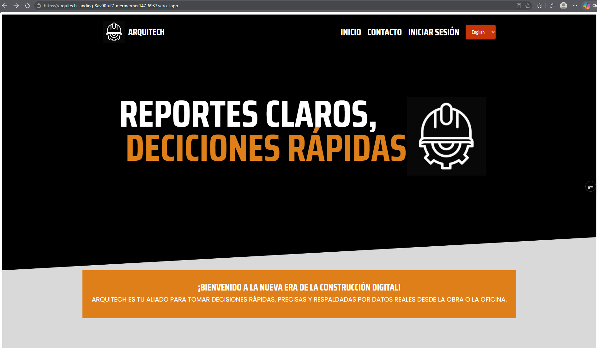
</p>
<p align="center"><em>*Nota.* Elaboración propia (Software en ejecución).</em></p>

<br>

### 5.2.3. Implemented Frontend-Web Application Evidence

<div style="text-align: justify;">
Esta sección evidencia la implementación de la Frontend Web Application de ArquiTech, el entorno principal para supervisores y contratantes. A continuación, se presenta el software en ejecución en su entorno de producción, evidenciando las vistas principales con datos dinámicos y soporte i18n.
</div>

<br>

_Vista de la Aplicación Web en Producción (Módulo de Materiales)_

<p align="center">
  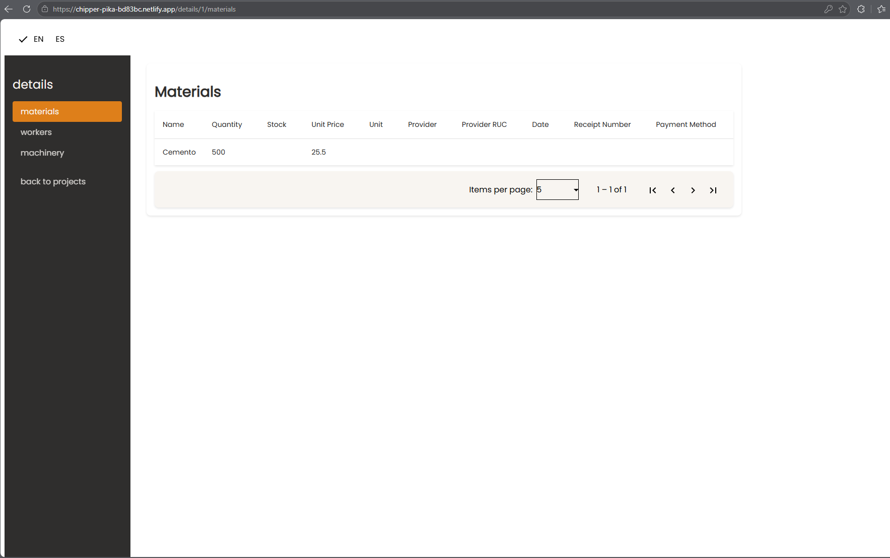
</p>
<p align="center"><em>*Nota.* Elaboración propia (Software en ejecución).</em></p>

<br>

### 5.2.4. Implemented Native-Mobile Application Evidence

### 5.2.5. Implemented RESTful API and/or Serverless Backend Evidence

### 5.2.6. RESTful API documentation

### 5.2.7. Team Collaboration Insights

## 5.3. Video About-the-Product

En esta sección, presentamos el Video About the Product, diseñado para captar la atención de los visitantes de nuestro Landing Page y los usuarios de nuestras aplicaciones, ofreciendo una visión clara y atractiva del modelo de negocio y las características principales de nuestra solución de software, Arquitech. Este video tiene como objetivo principal comunicar cómo nuestra plataforma facilita procesos clave como la creación de usuarios de manera eficiente y segura. Dirigido tanto a potenciales clientes interesados en conocer las capacidades de nuestro producto como a usuarios que desean realizar tareas relacionadas con la gestión de usuarios, el video adopta un tono profesional, innovador y accesible, alineado con la identidad de nuestra plataforma. A través de una demostración dinámica de las funcionalidades, el video resalta la facilidad de uso y la integración con una base de datos. Además, incluye un testimonio positivo de un usuario participante en las entrevistas de validación, reforzando la credibilidad y el valor de nuestra solución. Este contenido busca inspirar confianza y motivar a los espectadores a explorar y adoptar nuestra plataforma para optimizar sus procesos.

**Figura 117**  
_Video About-the-product_

<p align="center">
  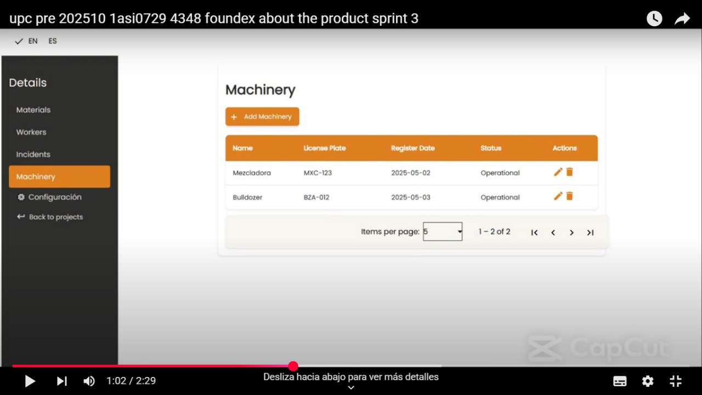
</p>

[https://www.youtube.com/watch?v=k3Z0771Au1Y](https://www.youtube.com/watch?v=k3Z0771Au1Y)

# Conclusiones

# Bibliografia

# Anexo
