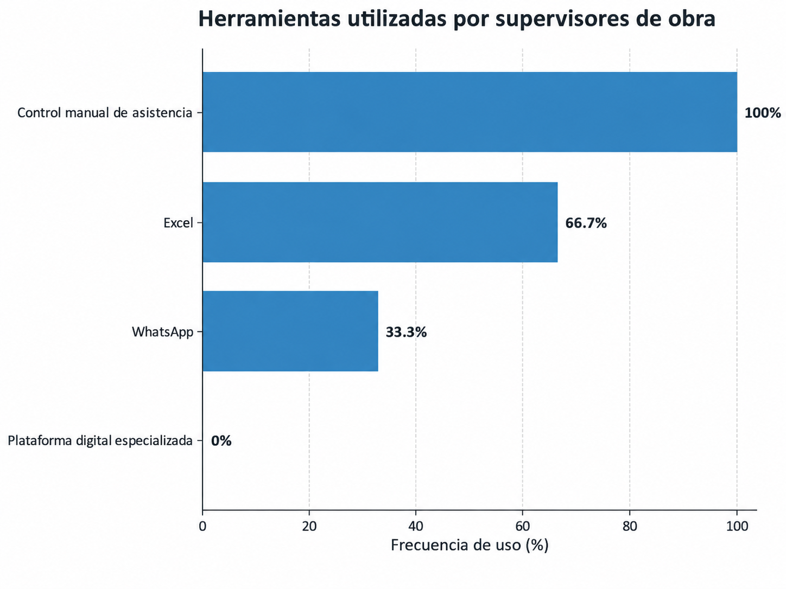
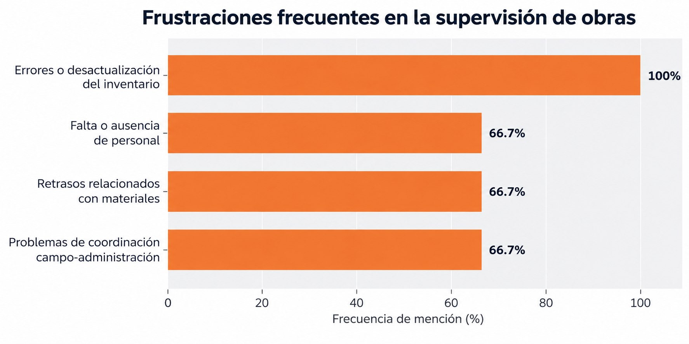
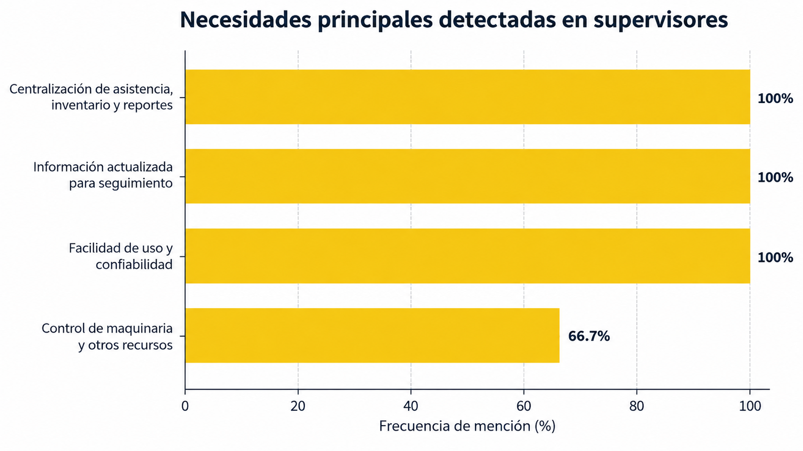
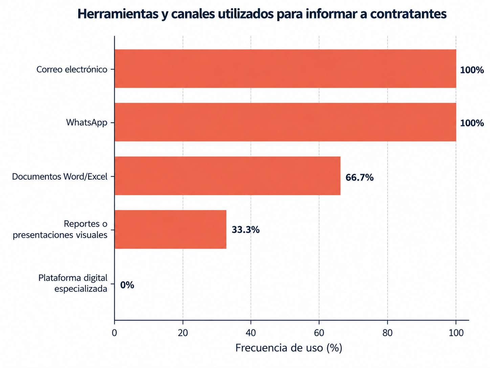
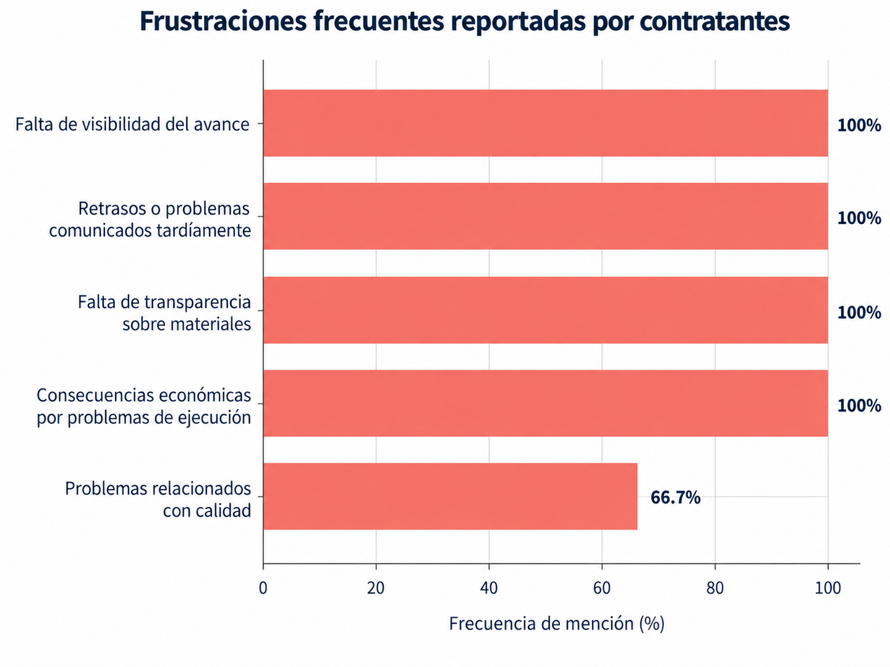
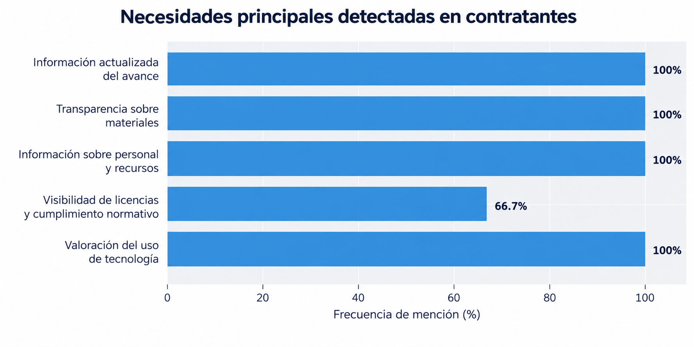

**Carrera**: Ingeniería de Software

**Periodo**: 2026-20

**Curso**: Diseño de Experimentos

**NRC**: 9112

**Profesor**: Lennin Percy Cenas Vasquez

**Informe deL Trabajo Final**

**Startup**: Foundex 

**Producto**: ArquiTech

**Integrantes**:

Chacaliaza Minaya, Eduardo Fabian - 

Espino Rossi, Victor Manuel - 

Garcia Cerpa, Braden Raid - 

Mendoza Moreano, Mariel Lucero  - u20231a418

Quispe Barzola, Fabricio Fabian

**Agosto, 2026**

# Registro de Versiones del Informe

| Versión | Fecha | Autor | Descripción de modificación |
| :--- | :--- | :--- | :--- |
| TB1 | 24/04/2025 | Mariel Lucero Mendoza Moreano  I2  I3  I4  I5 | blablabla |

# Project Report Collaboration Insights

A continuación, capturas del procesos, commits  y elaboración de nuestro proyecto en cada entrega.

**Entrega Nº1: TB1**

# Contenido

## Tabla de contenido

### [Capítulo I: Introducción](#capítulo-i-introducción)

* [1.1. Startup Profile](#11-startup-profile)

    - [1.1.1. Descripción de la Startup](#111-descripción-de-la-startup)

    - [1.1.2. Perfiles de integrantes del equipo](#112-perfiles-de-integrantes-del-equipo)

* [1.2. Solution Profile](#12-solution-profile)

    - [1.2.1. Antecedentes y problemática](#121-antecedentes-y-problemática)

    - [1.2.2. Lean UX Process](#122-lean-ux-process)

        - [1.2.2.1. Lean UX Problem Statements](#1221-lean-ux-problem-statements)

        - [1.2.2.2. Lean UX Assumptions](#1222-lean-ux-assumptions)

        - [1.2.2.3. Lean UX Hypothesis Statements](#1223-lean-ux-hypothesis-statements)

        - [1.2.2.4. Lean UX Canvas](#1224-lean-ux-canvas)

* [1.3. Segmentos objetivo](#13-segmentos-objetivo)

### [Capítulo II: Requirements Elicitation & Analysis](#capítulo-ii-requirements-elicitation--analysis)

* [2.1. Competidores](#21-competidores)

    - [2.1.1. Análisis competitivo](#211-análisis-competitivo)

    - [2.1.2. Estrategias y tácticas frente a competidores](#212-estrategias-y-tácticas-frente-a-competidores)

* [2.2. Entrevistas](#22-entrevistas)

    - [2.2.1. Diseño de entrevistas](#221-diseño-de-entrevistas)

    - [2.2.2. Registro de entrevistas](#222-registro-de-entrevistas)

    - [2.2.3. Análisis de entrevistas](#223-análisis-de-entrevistas)

* [2.3. Needfinding](#23-needfinding)

    - [2.3.1. User Personas](#231-user-personas)

    - [2.3.2. User Task Matrix](#232-user-task-matrix)

    - [2.3.3. User Journey Mapping](#233-user-journey-mapping)

    - [2.3.4. Empathy Mapping](#234-empathy-mapping)

    - [2.3.5. As-is Scenario Mapping](#235-as-is-scenario-mapping)

* [2.4. Ubiquitous Language](#24-ubiquitous-language)

### [Capítulo III: Requirements Specification](#capítulo-iii-requirements-specification)

* [3.1. To-Be Scenario Mapping](#31-to-be-scenario-mapping)

* [3.2. User Stories](#32-user-stories)

* [3.3. Product Backlog](#33-product-backlog)

* [3.4. Impact Mapping](#34-impact-mapping)

### [Capítulo IV: Product Design](#capítulo-iv-product-design)

* [4.1. Style Guidelines](#41-style-guidelines)

    - [4.1.1. General Style Guidelines](#411-general-style-guidelines)

    - [4.1.2. Web Style Guidelines](#412-web-style-guidelines)

    - [4.1.3. Mobile Style Guidelines](#413-mobile-style-guidelines)

        - [4.1.3.1. iOS Mobile Style Guidelines](#4131-ios-mobile-style-guidelines)

        - [4.1.3.2. Android Mobile Style Guidelines](#4132-android-mobile-style-guidelines)

* [4.2. Information Architecture](#42-information-architecture)

    - [4.2.1. Organization Systems](#421-organization-systems)

    - [4.2.2. Labeling Systems](#422-labeling-systems)

    - [4.2.3. SEO Tags and Meta Tags](#423-seo-tags-and-meta-tags)

    - [4.2.4. Searching Systems](#424-searching-systems)

    - [4.2.5. Navigation Systems](#425-navigation-systems)

* [4.3. Landing Page UI Design](#43-landing-page-ui-design)

    - [4.3.1. Landing Page Wireframe](#431-landing-page-wireframe)

    - [4.3.2. Landing Page Mock-up](#432-landing-page-mock-up)

* [4.4. Mobile Applications UX/UI Design](#44-mobile-applications-uxui-design)

    - [4.4.1. Mobile Applications Wireframes](#441-mobile-applications-wireframes)

    - [4.4.2. Mobile Applications Wireflow Diagrams](#442-mobile-applications-wireflow-diagrams)

    - [4.4.3. Mobile Applications Mock-ups](#443-mobile-applications-mock-ups)

    - [4.4.4. Mobile Applications User Flow Diagrams](#444-mobile-applications-user-flow-diagrams)

* [4.5. Mobile Applications Prototyping](#45-mobile-applications-prototyping)

    - [4.5.1. Android Mobile Applications Prototyping](#451-android-mobile-applications-prototyping)

    - [4.5.2. iOS Mobile Applications Prototyping](#452-ios-mobile-applications-prototyping)

* [4.6. Web Applications UX/UI Design](#46-web-applications-uxui-design)

    - [4.6.1. Web Applications Wireframes](#461-web-applications-wireframes)

    - [4.6.2. Web Applications Wireflow Diagrams](#462-web-applications-wireflow-diagrams)

    - [4.6.3. Web Applications Mock-ups](#463-web-applications-mock-ups)

    - [4.6.4. Web Applications User Flow Diagrams](#464-web-applications-user-flow-diagrams)

* [4.7. Web Applications Prototyping](#47-web-applications-prototyping)

* [4.8. Domain-Driven Software Architecture](#48-domain-driven-software-architecture)

    - [4.8.1. Software Architecture Context Diagram](#481-software-architecture-context-diagram)

    - [4.8.2. Software Architecture Container Diagrams](#482-software-architecture-container-diagrams)

    - [4.8.3. Software Architecture Components Diagrams](#483-software-architecture-components-diagrams)

* [4.9. Software Object-Oriented Design](#49-software-object-oriented-design)

    - [4.9.1. Class Diagrams](#491-class-diagrams)

    - [4.9.2. Class Dictionary](#492-class-dictionary)

* [4.10. Database Design](#410-database-design)

    - [4.10.1. Relational/Non-Relational Database Diagram](#4101-relationalnon-relational-database-diagram)

### [Capítulo V: Product Implementation](#capítulo-v-product-implementation)

* [5.1. Software Configuration Management](#51-software-configuration-management)

    - [5.1.1. Software Development Environment Configuration](#511-software-development-environment-configuration)

    - [5.1.2. Source Code Management](#512-source-code-management)

    - [5.1.3. Source Code Style Guide & Conventions](#513-source-code-style-guide--conventions)

    - [5.1.4. Software Deployment Configuration](#514-software-deployment-configuration)

* [5.2. Product Implementation & Deployment](#52-product-implementation--deployment)

    - [5.2.1. Sprint Backlogs](#521-sprint-backlogs)

    - [5.2.2. Implemented Landing Page Evidence](#522-implemented-landing-page-evidence)

    - [5.2.3. Implemented Frontend-Web Application Evidence](#523-implemented-frontend-web-application-evidence)

    - [5.2.4. Acuerdo de Servicio - SaaS](#524-acuerdo-de-servicio---saas)

    - [5.2.5. Implemented Native-Mobile Application Evidence](#525-implemented-native-mobile-application-evidence)

    - [5.2.6. Implemented RESTful API and/or Serverless Backend Evidence](#526-implemented-restful-api-andor-serverless-backend-evidence)

    - [5.2.7. RESTful API documentation](#527-restful-api-documentation)

    - [5.2.8. Team Collaboration Insights](#528-team-collaboration-insights)

* [5.3. Video About-the-Product](#53-video-about-the-product)

### [Conclusion](#conclusiones)

### [Bibliografía](#bibliografia)

### [Anexos](#anexo)

# Student Outcome

Student Outcome ABET: **ABET – EAC - Student Outcome 4**   Criterio: _La capacidad de reconocer responsabilidades éticas y profesionales en
situaciones de ingeniería y hacer juicios informados, que deben considerar el
impacto de las soluciones de ingeniería en contextos globales, económicos,
ambientales y sociales._

| Criterio específico | Acciones realizadas | Conclusiones |
| :--- | :--- | :--- |
| Reconoce responsabilidad ética y profesional en situaciones de ingeniería de software | Mendoza Moreano, Mariel Lucero av1: blablablabla.  Integrante 2 av1: blablablabla  Integrante 3 av1: blablabla  Integrante 4 av1: blablablabla  Integrante 5 av1: blablabla | av1: blablablabla |
| Emite juicios informados considerando el impacto de las soluciones de ingeniería de software... | Mendoza Moreano, Mariel Lucero av1: blablabla  Integrante 2 av1: blablablabla | av1: blablbalbla |

# Capítulo I: Introducción

## 1.1. Startup Profile

### 1.1.1 Descripción de la Startup

Foundex es una startup impulsada por jóvenes universitarios de la Universidad Peruana de Ciencias Aplicadas (UPC), orientada a facilitar la gestión eficiente de proyectos de construcción en pequeñas y medianas empresas constructoras, así como para el personal encargado de su administración. A través de ArquiTech, nuestra herramienta digital, los usuarios podrán gestionar solicitudes de servicios, monitorear el avance de las obras y controlar los gastos asociados a cada proyecto.

La solución busca facilitar la administración y mejorar la transparencia de los procesos constructivos mediante la gestión de trabajadores, materiales, presupuestos y tiempos de ejecución, además del seguimiento en tiempo real del progreso de cada obra.

En Foundex, consideramos que la digitalización de estos procesos es fundamental para agilizar la gestión de las obras, reducir los tiempos de ejecución, optimizar los recursos y facilitar la toma de decisiones informadas. Por ello, apostamos por la tecnología como una herramienta para transformar el sector de la construcción y permitir que las pequeñas y medianas empresas accedan a una gestión más organizada, eficiente y profesional.

Misión: Brindar soluciones digitales innovadoras que permitan optimizar la gestión de proyectos de construcción en pequeñas y medianas empresas, facilitando la administración de recursos, el seguimiento de avances, el control de gastos y otros procesos relacionados, con el propósito de impulsar la eficiencia, la transparencia y la toma de decisiones estratégicas en el sector construcción.

Visión: Ser la plataforma líder en Latinoamérica en la digitalización de procesos constructivos para pequeñas y medianas empresas, transformando la manera en que se gestionan las obras mediante una tecnología accesible, eficaz y enfocada en las necesidades de nuestros usuarios.

### 1.1.2. Perfiles de integrantes del equipo

| Foto | Integrante |
| :---: | :--- |
|  | Alumno — Código de Estudiante: . Blablabla |
| | Alumno — Código de Estudiante: .   |
|  | Alumno — Código de Estudiante: . Blablabla |
|  | Alumno — Código de Estudiante: . Blablabla |
|  | Alumno — Código de Estudiante: . Blablabla |

## 1.2. Solution Profile

### 1.2.1. Antecedentes y problemática

En el contexto actual del sector construcción en Lima Metropolitana, muchas pequeñas y medianas empresas enfrentan dificultades al momento de administrar sus proyectos de forma eficiente. La mayoría de estos procesos, como la gestión de materiales, personal, presupuestos y avances de obra, aún se realizan de manera manual o a través de herramientas poco integradas, como hojas de cálculo, notas físicas o mensajería informal, lo que genera desorganización, pérdida de información y errores costosos.

Particularmente, los supervisores de obra (quienes en muchos casos también cumplen funciones de jefes de obra) se enfrentan a múltiples retos. Deben coordinar equipos, controlar recursos, reportar avances y tomar decisiones en tiempo real, todo esto con herramientas limitadas y en entornos que no siempre cuentan con buena conectividad. Por otro lado, los contratantes de empresas privadas necesitan transparencia, cumplimiento normativo y visibilidad del progreso de la obra, pero suelen recibir información fragmentada y poco clara, lo que puede generar desconfianza y retrasos en los pagos o decisiones.

Frente a este panorama, surge la necesidad de una solución digital adaptada a esta realidad: accesible, intuitiva, y enfocada en automatizar tareas críticas como el control de inventario, la gestión de personal, y la generación de reportes. Una herramienta que no solo ayude a optimizar procesos, sino que también facilite la toma de decisiones estratégicas, mejore la comunicación y permita a estas empresas competir en un mercado cada vez más exigente.

**What (¿Qué problema existe?)**

El principal problema que enfrentan muchas pequeñas y medianas empresas del sector construcción es la falta de una herramienta digital centralizada que permita gestionar eficientemente sus obras. Actualmente, gran parte de la gestión operativa , como el control de inventario, la asistencia del personal, el avance del proyecto y la generación de reportes, se realiza de forma manual o desorganizada, utilizando hojas de cálculo, aplicaciones no integradas o canales de mensajería informal. Esta situación genera desorden, pérdida de información, errores administrativos y retrasos en la toma de decisiones.

**Why (¿Por qué es importante gestionar bien una obra?)**

Porque una buena gestión de obra garantiza que los proyectos se desarrollen dentro del presupuesto, en el tiempo estimado y cumpliendo los estándares de calidad y seguridad. Cuando estos procesos no se administran adecuadamente, se corre el riesgo de incurrir en sobrecostos, retrasos, accidentes laborales, reclamos de los contratantes y una menor rentabilidad del proyecto. Además, una gestión eficiente fortalece la transparencia y la confianza entre los supervisores de obra y los contratantes, lo cual es clave para futuras oportunidades de negocio.

**When (¿Cuándo ocurre?)**

Este problema ocurre principalmente durante las etapas de ejecución y supervisión de las obras, donde se requiere una coordinación constante entre personal, materiales, plazos y reportes. Sucede tanto al inicio del día (planificación y distribución de tareas), como durante el desarrollo del proyecto (seguimiento en campo) y al cierre del día (informes de avance).

**Where (¿Dónde sucede?)**

Principalmente en obras ubicadas en zonas urbanas y semiurbanas de Lima Metropolitana, como San Juan de Lurigancho, Villa El Salvador, Ate y San Martín de Porres. Estas áreas concentran una alta actividad de pequeñas y medianas empresas constructoras que aún no han adoptado herramientas digitales especializadas.

**Who (¿A quién afecta?)**

Afecta directamente a los supervisores de obra, quienes deben cumplir múltiples roles en la gestión operativa, y a los contratantes de empresas privadas, quienes exigen cumplimiento de plazos, transparencia y seguridad en la ejecución del proyecto. También impacta a los trabajadores administrativos que deben organizar, comunicar y reportar toda la información relacionada con los avances de la obra.

**How (¿Cómo se manifiesta el problema?)**

Se manifiesta mediante la falta de control en el inventario, errores en la asistencia de personal, demoras en la entrega de reportes, dificultades en la comunicación entre actores involucrados y poca capacidad para tomar decisiones basadas en datos. Además, el uso de canales informales como WhatsApp o Excel disperso impide centralizar la información y genera retrabajo.

**How much (¿Qué tan grave es?)**

La gravedad del problema radica en que una gestión deficiente de los recursos puede generar consecuencias económicas y operativas para las empresas constructoras. Según Michue Francia (2025), las deficiencias y la falta de control sobre los suministros y proveedores tienen un impacto directo en la ejecución de los proyectos, ocasionando retrasos en los plazos de entrega, incrementos imprevistos de los costos y no conformidades técnicas en la obra. Estas situaciones pueden traducirse en pérdidas económicas, compras innecesarias por un inadecuado control de materiales, menor productividad del personal y descontento de los clientes.

Asimismo, las soluciones existentes en el mercado, como Procore o Buildertrend, ofrecen funcionalidades para la gestión de proyectos de construcción, pero sus costos pueden representar una barrera de acceso para determinadas pequeñas y medianas empresas. Esto evidencia una oportunidad para desarrollar una solución digital accesible y adaptada a las necesidades de este segmento.

### 1.2.2. Lean UX Process

#### 1.2.2.1. Lean UX Problem Statements

El estado actual del sector de la gestión de proyectos de construcción se caracteriza por el uso de herramientas poco integradas para administrar obras. Las pequeñas y medianas empresas constructoras, junto con sus supervisores, jefes de obra y personal administrativo, enfrentan dificultades para gestionar trabajadores, materiales, presupuestos, avances y tiempos de ejecución. Muchas de estas actividades se realizan mediante Excel, documentos físicos o canales de comunicación informales, generando desorganización, pérdida de información, retrasos y dificultades para tomar decisiones oportunamente.

Las soluciones existentes no siempre se adaptan a las necesidades de este segmento, debido a sus costos, complejidad de uso o falta de adecuación a la realidad de las pequeñas y medianas empresas. Frente a esta brecha, Foundex, mediante ArquiTech, propone una solución digital accesible e intuitiva que permita centralizar la información de las obras, controlar sus principales recursos y realizar un seguimiento oportuno de los proyectos.

Nuestro enfoque inicial estará dirigido a pequeñas y medianas empresas constructoras de Lima Metropolitana que actualmente utilizan herramientas no integradas para gestionar sus obras. Consideraremos como usuarios a los responsables de la supervisión y al personal administrativo. Sabremos que la solución es exitosa cuando los usuarios la utilicen de manera recurrente para registrar y consultar información, realizar seguimiento de avances y recursos, generar reportes y reducir la dependencia de herramientas dispersas.

¿Cómo podríamos facilitar la gestión de proyectos de construcción para que las pequeñas y medianas empresas puedan centralizar la información de sus obras, controlar sus recursos y realizar un seguimiento oportuno de sus avances?

#### 1.2.2.2. Lean UX Assumptions

**Assumptions worksheet**

**Business Assumptions:**

1. **Creemos que nuestros clientes necesitan** reducir errores y pérdidas por desorganización en obra al momento de gestionar el inventario, personal y obreros.
2. **Estas necesidades se pueden resolver con** un seguimiento personalizado para cada uno de estos aspectos del proyecto.
3. **Mis clientes iniciales son** supervisores de obra de proyectos medianos de construcción.
4. **El valor #1 que mi cliente quiere de mi servicio es** ahorrar tiempo y dinero al centralizar la gestión operativa al optimizar los procesos con una buena organización.
5. **El cliente también puede obtener el beneficio adicional de** tener mayor visibilidad y control sobre recursos y personal en tiempo real y una mejor toma de decisiones gracias a datos precisos y actualizados.
6. **Voy a adquirir la mayoría de mis clientes a través de** marketing digital localizado y pruebas gratuitas de 30 días con soporte personalizado para atraer usuarios.
7. **Haré dinero a través de** suscripciones mensuales escalables.
8. **Mi competencia principal en el mercado serán** otras aplicaciones de gestión de proyectos.
9. **Los venceremos debido a que** nuestros planes tienen precios más bajos y son flexibles, nuestro enfoque es específico en operaciones diarias (inventario, personal, obreros) y la adaptación será rápida debido a la fácil implementación del sistema que cuenta con soporte localizado.
10. **Mi mayor riesgo de producto es** la resistencia inicial a la adopción tecnológica en empresas acostumbradas a métodos manuales.
11. **Resolveremos esto a través de** capacitaciones gratuitas y videos tutoriales que estarán disponibles en todo momento a través de la web de la empresa.

**User Assumptions:**

- **¿Quién es el usuario?**

    Nuestros principales clientes serán los supervisores de obra y contratantes de empresas privadas que se encuentran en un rango de edad de 28 a 50 años que pueden ser de clase media-alta, estos quieren encontrar una manera eficiente de llevar la administración de sus proyectos de construcción para evitar pérdidas.

- **¿Dónde encaja nuestro producto en su trabajo o vida?**

    Nuestro producto encaja al momento de iniciar la supervisión de un aspecto del proyecto que se está administrando en ese momento o se quiere revisar el avance y buen manejo.

- **¿Qué problemas tiene nuestro producto y cómo se pueden resolver?**

    - La dependencia del internet en la obra para poder utilizar el aplicativo el cual se puede solucionar incluyendo un modo offline que sincronice datos al reconectarse a una red de internet. 
    - El soporte técnico insuficiente para picos de demanda, en caso de un aumento repentino de usuarios se podría saturar el soporte técnico, frustrando a clientes que esperan respuestas rápidas. Este problema lo podremos solucionar creando una base de conocimientos con videos y guías para resolver dudas comunes y evitar un número masivo de consultas.

- **¿Cómo y cuándo es usado nuestro producto?**

    Nuestro producto puede ser usado al inicio del día para planificar (confirmar asistencia, revisar inventario), durante el día para monitorear (actualizar avances) y al final para generar y/o revisar reportes.

- **¿Qué características son importantes?**

    Nuestro producto debe contar con una interfaz intuitiva, fácil de usar y aprender por nuestros usuarios, también debe contar con una buena sincronización de datos para poder tener un buen seguimiento de los distintos aspectos de la obra.

- **¿Cómo debe verse nuestro producto y cómo comportarse?**

    La interfaz de nuestro producto debe ser intuitiva y resposive con un diseño que transmita confianza y profesionalismo y que sea de respuesta rápida.

#### 1.2.2.3. Lean UX Hypothesis Statements

Creemos que ofrecer una plataforma web centralizada para supervisores y asistentes administrativos que integre la gestión de inventario, personal y obreros resultará en una reducción del tiempo dedicado a tareas administrativas, y lo sabremos porque el tiempo promedio para generar reportes diarios disminuirá de 60 minutos a 15 minutos en las primeras cuatro semanas de uso.

Creemos que proporcionar un modo offline que sincronice datos de inventario y asistencia una vez conectado para supervisores en obras sin internet resultará en un uso continuo en entornos remotos, y lo sabremos porque el 90% de las actualizaciones offline se sincronizará correctamente en las primeras 24 horas.

Creemos que proporcionar un onboarding interactivo con videos cortos para supervisores y asistentes resultará en una curva de aprendizaje más corta, y lo sabremos porque el 75% de los nuevos usuarios realizarán al menos tres acciones clave (registrar asistencia, actualizar inventario, generar reporte) en su primera semana.

#### 1.2.2.4. Lean UX Canvas

## 1.3. Segmentos objetivo

# Capítulo II: Requirements Elicitation & Analysis

## 2.1. Competidores

### 2.1.1. Análisis competitivo

### 2.1.2. Estrategias y tácticas frente a competidores

## 2.2. Entrevistas

### 2.2.1. Diseño de entrevistas

Para el proceso de investigación de ArquiTech se diseñó un conjunto de entrevistas dirigido a representantes de los dos segmentos objetivo identificados: supervisores de obra** y **contratantes de empresas privadas.

El objetivo de estas entrevistas es comprender las actividades que actualmente realizan los participantes durante la gestión y seguimiento de proyectos de construcción, las herramientas que utilizan, las principales dificultades que enfrentan y sus necesidades respecto al acceso, organización y comunicación de la información de una obra.

Las preguntas fueron organizadas en cuatro grupos principales: **introducción y contexto, procesos actuales, puntos de dolor, necesidades y expectativas**, además de preguntas de cierre. Esta estructura permite recopilar información relacionada con el contexto del participante, sus actividades habituales, problemas experimentados durante la ejecución o seguimiento de una obra y su percepción respecto al uso de herramientas digitales.

Para mantener la consistencia del proceso de investigación, todos los participantes pertenecientes a un mismo segmento serán entrevistados utilizando el mismo conjunto de preguntas. De esta manera, las respuestas podrán ser posteriormente comparadas e interpretadas en el análisis de entrevistas para identificar patrones y características recurrentes dentro de cada segmento objetivo.

#### Segmento objetivo #1: Supervisores de obra

**Introducción y contexto**

- ¿Cuál es tu nombre?
- ¿Cuántos años tiene?
- ¿En qué distrito reside?
- ¿Puedes contarme sobre tu rol como supervisor? ¿Qué haces en un día típico?
- ¿Cuántos obreros y qué tipo de materiales gestionas en una obra promedio?

**Procesos actuales**

- ¿Cómo confirmas la asistencia de los obreros cada día? ¿Qué haces si alguien falta?
- ¿Cómo llevas el control del inventario de materiales? ¿Qué herramientas usas?
- ¿Cómo registras los avances de la obra y preparas reportes? ¿Cuánto tiempo te toma?

**Puntos de dolor**

- ¿Qué es lo más frustrante o lento en la gestión de obreros o materiales? Dame un ejemplo reciente.
- ¿Alguna vez has tenido problemas por errores en inventario o reportes? ¿Qué pasó?
- ¿Qué tan fácil o difícil es coordinar con otros roles, como asistentes administrativos?

**Necesidades y expectativas**

- Si tuvieras una herramienta que centralizará asistencia, inventario y reportes ¿te ayudaría? ¿de qué manera?
- ¿Qué tan importante es tener información en tiempo real desde la obra? ¿Por qué?
- ¿Qué te haría confiar en una nueva plataforma digital? ¿Qué te preocuparía?

**Cierre**

- ¿Hay algo que no hayamos tocado que te gustaría que una herramienta como esta resolviera?
- ¿Estarías dispuesto a probar una plataforma como ArquiTech? ¿Qué necesitarías para convencerte?

#### Segmento objetivo #2: Contratantes de empresas privadas

**Introducción y contexto**

- ¿Cuál es tu nombre?
- ¿Cuántos años tiene?
- ¿En qué distrito reside?
- ¿Qué tipo de proyectos de construcción contratas normalmente (ej. locales, edificios)?
- ¿Cómo es el proceso para elegir una constructora? ¿Qué buscas en ellas?

**Procesos actuales**

- ¿Cómo te mantienes informado sobre el avance de una obra? ¿Qué información recibes y con qué frecuencia?
- ¿Qué herramientas o métodos usa la constructora para reportarte?
- ¿Cómo verificas que se cumplan licencias, normas de seguridad o plazos?

**Puntos de dolor**

- ¿Qué problemas has tenido con constructoras en el pasado? Por ejemplo, retrasos o falta de claridad.
- ¿Qué tan frustrante es no tener visibilidad completa sobre el uso de materiales o el personal en obra?
- ¿Alguna vez has perdido dinero por demoras o errores en un proyecto? ¿Qué pasó?

**Necesidades y expectativas**

- Si pudieras acceder a una plataforma que te muestre en tiempo real el avance, materiales y personal de la obra, ¿cómo te ayudaría?
- ¿Qué tan importante es para ti que la constructora use tecnología moderna? ¿Por qué?
- ¿Qué características de una herramienta digital te harían confiar más en una constructora?

**Cierre**

- ¿Hay algo que las constructoras podrían mejorar para darte más tranquilidad?
- Si una constructora usará una plataforma como ArquiTech para reportarte, ¿influiría en tu decisión de contratarla? ¿Por qué?

#### Preguntas complementarias de caracterización para ambos segmentos

Las siguientes preguntas complementarias serán aplicadas a todos los entrevistados de ambos segmentos objetivo antes del desarrollo del guion principal correspondiente. Su propósito es recopilar características objetivas y subjetivas.

- ¿Con qué género se identifica?
- ¿Cuál es su estado civil?
- ¿Tiene responsabilidades familiares que influyan en su rutina o decisiones?
- ¿Cuál es su ocupación o cargo actual?
- ¿Cuántos años de experiencia tiene en el sector construcción o contratando
  proyectos de construcción?
- ¿Cómo describiría brevemente su forma de trabajar o tomar decisiones?
- ¿Qué habilidades considera más importantes para desarrollar sus actividades?
- ¿Qué personas, empresas, marcas o referentes influyen en sus decisiones
  relacionadas con proyectos de construcción?
- ¿Qué dispositivo utiliza principalmente para actividades relacionadas con su
  trabajo o proyectos: smartphone, laptop, tablet u otro?
- ¿Qué aplicaciones o canales digitales utiliza con mayor frecuencia para
  comunicarse o gestionar información?
- ¿Qué navegador utiliza habitualmente?
- ¿Cuál es su principal objetivo cuando participa en la gestión o seguimiento
  de una obra?
- ¿Cuál es la principal frustración que experimenta durante dicho proceso?
- ¿Podría contarme brevemente sobre su trayectoria y experiencia relacionada con proyectos de construcción?

### 2.2.2. Registro de entrevistas

Como parte del proceso de investigación de ArquiTech, se realizaron entrevistas a representantes de los dos segmentos objetivo definidos: **supervisores de obra** y **contratantes de empresas privadas**. Se realizaron tres entrevistas por cada segmento, obteniendo un total de seis entrevistas.

Todas las sesiones fueron registradas en video y posteriormente consolidadas en un único video de evidencia de Needfinding. Para cada participante se registra su información de identificación, un cuadro representativo de su participación en el video, el momento de inicio y duración de su entrevista, así como un resumen descriptivo de la información obtenida.

Los resúmenes consideran tanto las respuestas al guion principal como la información obtenida mediante las preguntas complementarias de caracterización. Esto permite identificar características demográficas, experiencia, personalidad, habilidades, influencias, hábitos tecnológicos, dispositivos, canales digitales, objetivos y frustraciones que serán utilizadas posteriormente para el análisis de entrevistas y la construcción de los User Personas.

**Video consolidado de entrevistas:** [ENLACE DE MICROSOFT STREAM / CLIPCHAMP]

**Nombre del video:** `upc-pre-202610-1asi0732-9112-Foundex-needfinding-sprint-1.mp4`

---

#### Segmento objetivo #1: Supervisores de obra

##### Entrevista #1

**Datos del entrevistado**

- **Nombres y apellidos:** [NOMBRE Y APELLIDOS]
- **Edad:** [EDAD]
- **Distrito de residencia:** [DISTRITO]
- **Segmento objetivo:** Supervisor de obra
- **Fecha de entrevista:** [YYYY-MM-DD]
- **Timing de inicio:** [00:00:00]
- **Duración:** [00:00]
- **Video:** [ENLACE DEL VIDEO CONSOLIDADO]

**Figura X**  
*Cuadro de video del entrevistado #1 del segmento Supervisores de obra.*

  

*Nota.* Elaboración propia a partir de la entrevista realizada.

**Resumen de la entrevista**

[NOMBRE] explicó las principales responsabilidades que desempeña durante la supervisión de una obra y describió cómo organiza sus actividades diarias. Durante la entrevista se deberá registrar específicamente qué tareas realiza, con qué cantidad de trabajadores suele coordinar y qué tipos de materiales administra con mayor frecuencia.

En relación con el control del personal, deberá describirse el procedimiento que utiliza para registrar la asistencia y las acciones que realiza cuando se producen ausencias. También deberá indicarse de qué manera controla el inventario de materiales, qué herramientas utiliza y cómo registra entradas, salidas o requerimientos.

Respecto al seguimiento de la obra, deberá consignarse cómo registra los avances, con qué frecuencia prepara reportes y cuánto tiempo dedica aproximadamente a esas actividades. Se deberán registrar los principales problemas mencionados por el entrevistado, especialmente los relacionados con personal, materiales, inventario, reportes o coordinación entre las áreas operativas y administrativas.

Asimismo, el resumen deberá recoger su opinión respecto a disponer de una plataforma que centralice asistencia, inventario y reportes, la importancia que atribuye al acceso a información actualizada y las condiciones que le generarían confianza o preocupación al adoptar una nueva herramienta digital.

A partir de las preguntas complementarias, se deberá registrar su ocupación y trayectoria profesional, responsabilidades familiares cuando correspondan, características de su forma de trabajar o tomar decisiones, habilidades que considera relevantes, referentes o influencias, dispositivos que utiliza, aplicaciones y canales digitales habituales, navegador de preferencia, así como sus principales objetivos y frustraciones relacionadas con la supervisión de obras.

---

##### Entrevista #2

**Datos del entrevistado**

- **Nombres y apellidos:** [NOMBRE Y APELLIDOS]
- **Edad:** [EDAD]
- **Distrito de residencia:** [DISTRITO]
- **Segmento objetivo:** Supervisor de obra
- **Fecha de entrevista:** [YYYY-MM-DD]
- **Timing de inicio:** [00:00:00]
- **Duración:** [00:00]
- **Video:** [ENLACE DEL VIDEO CONSOLIDADO]

**Figura X**  
*Cuadro de video del entrevistado #2 del segmento Supervisores de obra.*

  

*Nota.* Elaboración propia a partir de la entrevista realizada.

**Resumen de la entrevista**

[NOMBRE] describió su experiencia en la supervisión de obras y las actividades que desarrolla durante una jornada habitual. En el resumen final deberá precisarse cuáles son sus principales responsabilidades, cómo coordina al equipo de trabajo y qué recursos o materiales debe controlar.

Se deberá explicar cómo registra actualmente la asistencia del personal, cómo gestiona las ausencias y qué medios utiliza para mantener actualizado el inventario. De igual manera, deberá detallarse cómo verifica el avance físico de una obra, cómo prepara la información que posteriormente se convierte en reportes y con qué frecuencia realiza estas actividades.

El registro deberá recoger los principales problemas experimentados por el participante, incluyendo errores de inventario, retrasos de materiales, disponibilidad de trabajadores, actualización de registros o dificultades de coordinación con personal técnico y administrativo cuando estos sean mencionados.

Asimismo, deberá documentarse su percepción acerca de centralizar la información de asistencia, materiales y reportes en una plataforma digital, así como sus expectativas sobre información en tiempo real, facilidad de uso, confiabilidad y correcta utilización del sistema.

Finalmente, deberán incorporarse los datos provenientes de la caracterización complementaria: background profesional, personalidad o forma de tomar decisiones, habilidades, influencias, tecnología empleada, dispositivo preferido, aplicaciones y canales digitales, navegador, objetivos y frustraciones.

---

##### Entrevista #3

**Datos del entrevistado**

- **Nombres y apellidos:** [NOMBRE Y APELLIDOS]
- **Edad:** [EDAD]
- **Distrito de residencia:** [DISTRITO]
- **Segmento objetivo:** Supervisor de obra
- **Fecha de entrevista:** [YYYY-MM-DD]
- **Timing de inicio:** [00:00:00]
- **Duración:** [00:00]
- **Video:** [ENLACE DEL VIDEO CONSOLIDADO]

**Figura X**  
*Cuadro de video del entrevistado #3 del segmento Supervisores de obra.*

  

*Nota.* Elaboración propia a partir de la entrevista realizada.

**Resumen de la entrevista**

[NOMBRE] explicó cómo organiza y supervisa las actividades que se desarrollan diariamente en una obra. El registro deberá indicar el tamaño aproximado del equipo con el que trabaja, los tipos de materiales que gestiona y la forma en que se comunica con otras áreas involucradas en el proyecto.

Deberá documentarse cómo controla la asistencia, mediante qué herramientas registra las incidencias o ausencias, cómo mantiene actualizado el inventario y qué dificultades encuentra al utilizar herramientas manuales o digitales durante el trabajo en campo.

El resumen también deberá explicar cómo documenta el avance de las actividades, qué herramientas utiliza para generar reportes y cuáles son los principales factores que ocasionan retrasos, errores o trabajo adicional.

Se deberá recoger su valoración sobre la posibilidad de centralizar información de trabajadores, materiales y avances en ArquiTech, señalando qué beneficios espera obtener, qué información considera importante consultar en tiempo real y qué factores influirían en la adopción de la plataforma.

Finalmente, se incorporarán los resultados de la caracterización complementaria referentes a trayectoria, personalidad, habilidades, referentes, dispositivos, aplicaciones utilizadas, canales digitales, navegador, objetivos profesionales y principales frustraciones.

---

#### Segmento objetivo #2: Contratantes de empresas privadas

##### Entrevista #4

**Datos del entrevistado**

- **Nombres y apellidos:** [NOMBRE Y APELLIDOS]
- **Edad:** [EDAD]
- **Distrito de residencia:** [DISTRITO]
- **Segmento objetivo:** Contratante de empresa privada
- **Fecha de entrevista:** [YYYY-MM-DD]
- **Timing de inicio:** [00:00:00]
- **Duración:** [00:00]
- **Video:** [ENLACE DEL VIDEO CONSOLIDADO]

**Figura X**  
*Cuadro de video del entrevistado #1 del segmento Contratantes de empresas privadas.*

  

*Nota.* Elaboración propia a partir de la entrevista realizada.

**Resumen de la entrevista**

[NOMBRE] explicó qué tipos de proyectos de construcción suele contratar y cuáles son los principales criterios que utiliza para seleccionar una empresa constructora. El registro deberá indicar la importancia que atribuye a factores como experiencia, cumplimiento de plazos, costos, transparencia, calidad y antecedentes de trabajos anteriores.

También deberá describirse cómo recibe actualmente información acerca del avance de una obra, con qué frecuencia obtiene actualizaciones y qué herramientas o canales utiliza la constructora para mantenerlo informado.

El resumen deberá incluir el procedimiento utilizado por el participante para comprobar licencias, normas de seguridad, plazos u otras obligaciones asociadas a la ejecución de la obra, así como las dificultades que haya experimentado anteriormente con constructoras.

Se deberán documentar situaciones relacionadas con retrasos, falta de claridad, problemas de calidad, deficiencias de comunicación o pérdidas económicas cuando el entrevistado las mencione, así como el impacto que dichas situaciones hayan tenido sobre sus actividades.

Asimismo, deberá recogerse su percepción acerca de disponer de una plataforma que permita consultar avances, materiales y personal, el valor que atribuye al uso de tecnología por parte de una constructora y las características que le generarían mayor confianza.

El registro se complementará con información sobre su ocupación, background, personalidad y toma de decisiones, habilidades, personas o marcas que influyen en sus decisiones, dispositivos, aplicaciones, canales digitales, navegador, objetivos y frustraciones.

---

##### Entrevista #5

**Datos del entrevistado**

- **Nombres y apellidos:** [NOMBRE Y APELLIDOS]
- **Edad:** [EDAD]
- **Distrito de residencia:** [DISTRITO]
- **Segmento objetivo:** Contratante de empresa privada
- **Fecha de entrevista:** [YYYY-MM-DD]
- **Timing de inicio:** [00:00:00]
- **Duración:** [00:00]
- **Video:** [ENLACE DEL VIDEO CONSOLIDADO]

**Figura X**  
*Cuadro de video del entrevistado #2 del segmento Contratantes de empresas privadas.*

  

*Nota.* Elaboración propia a partir de la entrevista realizada.

**Resumen de la entrevista**

[NOMBRE] describió su experiencia contratando proyectos de construcción y los criterios utilizados al evaluar empresas constructoras. El resumen deberá especificar qué aspectos considera indispensables antes de contratar, tales como experiencia, cumplimiento normativo, plazos, transparencia o control del presupuesto cuando sean mencionados.

Deberá explicarse cómo recibe actualmente reportes sobre el proyecto, qué herramientas se emplean, con qué frecuencia recibe información y si complementa estos reportes mediante visitas presenciales u otros mecanismos de seguimiento.

También deberán registrarse los procedimientos que utiliza para verificar licencias, seguridad y cumplimiento de las obligaciones de la empresa constructora. Las experiencias negativas mencionadas por el participante deberán documentarse señalando sus causas y consecuencias.

El resumen recogerá especialmente su percepción sobre la transparencia de los proyectos y la necesidad de disponer de información actualizada sobre avances, materiales y trabajadores. Asimismo, deberá registrar la relevancia que concede al uso de herramientas digitales y sus requisitos de confianza, facilidad de uso y seguridad.

La información obtenida mediante la caracterización complementaria deberá incorporar experiencia previa, personalidad, forma de tomar decisiones, habilidades, influencias, dispositivos utilizados, canales de interacción, aplicaciones, navegador, objetivos y frustraciones.

---

##### Entrevista #6

**Datos del entrevistado**

- **Nombres y apellidos:** [NOMBRE Y APELLIDOS]
- **Edad:** [EDAD]
- **Distrito de residencia:** [DISTRITO]
- **Segmento objetivo:** Contratante de empresa privada
- **Fecha de entrevista:** [YYYY-MM-DD]
- **Timing de inicio:** [00:00:00]
- **Duración:** [00:00]
- **Video:** [ENLACE DEL VIDEO CONSOLIDADO]

**Figura X**  
*Cuadro de video del entrevistado #3 del segmento Contratantes de empresas privadas.*

  

*Nota.* Elaboración propia a partir de la entrevista realizada.

**Resumen de la entrevista**

[NOMBRE] explicó los tipos de proyectos que suele contratar y las características que considera prioritarias al seleccionar una constructora. Deberán documentarse específicamente los criterios mencionados durante la entrevista y las experiencias previas que hayan influido en su forma de elegir proveedores.

El registro deberá describir cómo recibe actualmente la información relacionada con el avance de una obra, los formatos y canales utilizados y las dificultades que encuentra para conocer el estado real del proyecto.

También se deberá indicar cómo verifica licencias y cumplimiento normativo, así como las situaciones problemáticas que haya experimentado debido a retrasos, planificación deficiente, información incompleta, materiales, personal u otros factores.

El resumen deberá recoger su opinión respecto a disponer de información actualizada sobre avances, recursos y trabajadores, así como la importancia que atribuye a que una empresa constructora utilice herramientas digitales modernas.

Finalmente, se documentarán las características obtenidas mediante las preguntas complementarias de caracterización: trayectoria, personalidad, habilidades, influencias, tecnología, dispositivos, canales digitales, aplicaciones utilizadas, navegador, objetivos y frustraciones.

---

### 2.2.3. Análisis de entrevistas

A partir de las entrevistas registradas se realizó un análisis independiente para cada uno de los segmentos objetivo de ArquiTech: supervisores de obra y contratantes de empresas privadas. El propósito fue identificar los patrones más frecuentes relacionados con sus procesos actuales, herramientas utilizadas, principales frustraciones, necesidades y expectativas.

Para cada segmento se consideraron tres entrevistas. Por ello, una característica identificada en un participante representa aproximadamente el 33.3 %, una característica presente en dos participantes representa el 66.7 %, y una coincidencia entre los tres participantes representa el 100 % del segmento analizado.

Los resultados estadísticos presentados se obtienen a partir de la información registrada en las entrevistas y sirven como base para identificar las características más representativas que posteriormente serán utilizadas en la construcción de los User Personas y demás artefactos de Needfinding.

#### Segmento objetivo #1: Supervisores de obra

##### Herramientas y métodos utilizados actualmente

Los resultados muestran una fuerte dependencia de mecanismos manuales y herramientas de propósito general para la gestión cotidiana de las obras. El 100 % de los supervisores entrevistados utiliza algún mecanismo manual para registrar la asistencia del personal, como hojas de tareo o firmas.

En cuanto al control de materiales, el 66.7 % mencionó expresamente el uso de Excel, mientras que el resto utiliza otros mecanismos de registro, como Cardex o documentos de control de almacén. Asimismo, el 33.3 % manifestó utilizar WhatsApp como apoyo para comunicar incidencias relacionadas con el personal.

Ninguno de los participantes, equivalente al 0 %, señaló utilizar actualmente una plataforma digital especializada que centralice asistencia, inventario, avance y reportes de obra.

**Figura X**  
*Herramientas utilizadas por supervisores de obra*

<!-- INSERTAR GRÁFICA AQUÍ:
Control manual de asistencia: 100 %
Excel: 66.7 %
WhatsApp: 33.3 %
Plataforma digital especializada: 0 %
-->

  

*Nota.* Elaboración propia a partir de las entrevistas realizadas.

Estos resultados evidencian que la gestión de información continúa dependiendo principalmente de mecanismos separados entre sí. Los registros físicos, hojas de cálculo y medios de comunicación utilizados no conforman un sistema centralizado, por lo que la información requiere ser consolidada posteriormente y puede presentar retrasos o inconsistencias.

##### Frustraciones frecuentes en la supervisión de obras

Los problemas relacionados con el control de inventario aparecen como la dificultad más recurrente. El 100 % de los participantes señaló situaciones relacionadas con errores, desactualización o dificultades para mantener un registro preciso de los materiales utilizados en obra.

La ausencia o disponibilidad insuficiente de personal fue mencionada explícitamente por el 66.7 % de los participantes. De igual manera, el 66.7 % señaló que los retrasos asociados con materiales y proveedores afectan el desarrollo normal de las actividades.

Por otro lado, el 66.7 % evidenció dificultades relacionadas con la coordinación entre el trabajo realizado en campo y las áreas administrativas. Esta situación puede ocasionar demoras en la transmisión de información y diferencias entre los registros operativos y administrativos.

**Figura X**  
*Frustraciones frecuentes en la supervisión de obras*

<!-- INSERTAR GRÁFICA AQUÍ:
Errores o desactualización del inventario: 100 %
Falta o ausencia de personal: 66.7 %
Retrasos relacionados con materiales: 66.7 %
Problemas de coordinación campo-administración: 66.7 %
-->

  

*Nota.* Elaboración propia a partir de las entrevistas realizadas.

Los resultados permiten observar que las principales frustraciones se originan en actividades que requieren información constantemente actualizada. Un registro incorrecto del inventario, una ausencia no comunicada o un retraso en la disponibilidad de materiales puede alterar la planificación diaria y posteriormente afectar los reportes y el avance general de la obra.

##### Necesidades principales detectadas en supervisores

La necesidad con mayor coincidencia está relacionada con la centralización de la gestión operativa. El 100 % de los participantes manifestó interés en disponer de una herramienta que permita integrar información relacionada con asistencia, inventario y seguimiento de los avances o reportes.

Del mismo modo, el 100 % considera importante disponer de información actualizada que facilite el seguimiento de lo ocurrido en la obra y reduzca la dependencia de registros dispersos.

El 66.7 % manifestó además interés en ampliar el control hacia otros recursos de la obra, como maquinaria, combustible u otros elementos complementarios.

Finalmente, la facilidad de adopción constituye una condición importante. El 100 % de los participantes manifestó directa o indirectamente preocupación por que una solución digital pueda utilizarse de forma sencilla, confiable y sin generar una carga operativa adicional.

**Figura X**  
*Necesidades principales detectadas en supervisores*

<!-- INSERTAR GRÁFICA AQUÍ:
Centralización de asistencia, inventario y reportes: 100 %
Información actualizada para seguimiento: 100 %
Facilidad de uso y confiabilidad: 100 %
Control de maquinaria y otros recursos: 66.7 %
-->

  

*Nota.* Elaboración propia a partir de las entrevistas realizadas.

En este segmento se evidencia, por tanto, una necesidad predominante de reducir la fragmentación de los procesos operativos. Los supervisores requieren controlar trabajadores, materiales y avances desde una fuente de información común que les permita consultar el estado de la obra y generar información de manera más oportuna.

##### Características objetivas y subjetivas del segmento

Además de los procesos y dificultades identificados, las preguntas complementarias de caracterización permiten determinar las características objetivas y subjetivas predominantes del segmento, tales como rango de edad, distrito, ocupación, experiencia, responsabilidades familiares, personalidad, habilidades, influencias, dispositivo preferido, canales digitales, navegador, objetivos y frustraciones.

**Figura X**  
*Características objetivas predominantes en supervisores de obra*

<!-- INSERTAR GRÁFICA CON LOS PORCENTAJES OBTENIDOS
DE LAS NUEVAS ENTREVISTAS:
rango de edad, ocupación/background, distrito,
situación familiar, dispositivo principal, etc.
-->

  

*Nota.* Elaboración propia a partir de las entrevistas realizadas.

**Figura X**  
*Características subjetivas predominantes en supervisores de obra*

<!-- INSERTAR GRÁFICA CON LOS PORCENTAJES OBTENIDOS
DE LAS NUEVAS ENTREVISTAS:
personalidad, habilidades, influencias, canales digitales,
objetivos, frustraciones, etc.
-->

  

*Nota.* Elaboración propia a partir de las entrevistas realizadas.

Estas características complementarán los patrones operativos anteriormente identificados y permitirán construir un arquetipo sustentado directamente en la información recolectada.

#### Segmento objetivo #2: Contratantes de empresas privadas

##### Herramientas y canales utilizados para el seguimiento de obras

Los contratantes presentan una dependencia significativa de canales de comunicación convencionales para mantenerse informados sobre el desarrollo de sus proyectos.

El 100 % de los participantes señaló utilizar correo electrónico para recibir información relacionada con la obra, mientras que el 100 % también manifestó utilizar WhatsApp como canal para comunicaciones, fotografías o actualizaciones rápidas.

El 66.7 % recibe información mediante archivos Word o Excel y el **33.3 % indicó haber recibido en alguna oportunidad reportes o presentaciones con información visual más estructurada.

Sin embargo, ninguno de los entrevistados, equivalente al 0 %, indicó disponer actualmente de una plataforma digital especializada desde la cual pueda consultar directamente el estado general de sus proyectos.

**Figura X**  
*Herramientas y canales utilizados para informar a contratantes*

<!-- INSERTAR GRÁFICA AQUÍ:
Correo electrónico: 100 %
WhatsApp: 100 %
Documentos Word/Excel: 66.7 %
Reportes o presentaciones visuales: 33.3 %
Plataforma digital especializada: 0 %
-->

  

*Nota.* Elaboración propia a partir de las entrevistas realizadas.

Los resultados muestran que la información se distribuye entre distintos canales y documentos. Aunque estos medios permiten mantener cierto nivel de comunicación, no proporcionan necesariamente una visión centralizada ni una trazabilidad continua del proyecto.

##### Frustraciones frecuentes reportadas por contratantes

La falta de visibilidad sobre el estado de la obra aparece en el 100 % de los casos analizados. Los participantes manifestaron dificultades para conocer de forma directa y actualizada lo que sucede durante la ejecución del proyecto.

Asimismo, el 100 % reportó experiencias relacionadas con retrasos o situaciones que no fueron comunicadas con la anticipación esperada. La falta de transparencia relacionada con materiales y recursos también estuvo presente en el 100 % de las entrevistas.

Los problemas relacionados con la calidad de la ejecución o de los materiales aparecieron en el 66.7 % de los casos.

Además, el 100 % de los participantes describió consecuencias económicas relacionadas con retrasos, problemas de planificación o deficiencias durante la ejecución de proyectos.

**Figura X**  
*Frustraciones frecuentes reportadas por contratantes*

<!-- INSERTAR GRÁFICA AQUÍ:
Falta de visibilidad del avance: 100 %
Retrasos o problemas comunicados tardíamente: 100 %
Falta de transparencia sobre materiales: 100 %
Consecuencias económicas por problemas de ejecución: 100 %
Problemas relacionados con calidad: 66.7 %
-->

  

*Nota.* Elaboración propia a partir de las entrevistas realizadas.

Estos resultados indican que el problema principal no se limita a recibir pocos reportes, sino a la dificultad de comprobar oportunamente el estado real de la obra. La ausencia de información clara y actualizada incrementa la incertidumbre y puede retrasar decisiones que afectan tanto la ejecución del proyecto como las actividades económicas del contratante.

##### Necesidades principales detectadas en contratantes

El 100 % de los participantes manifestó interés en contar con información actualizada acerca del avance de sus proyectos.

También existe coincidencia absoluta respecto a la necesidad de mejorar la transparencia sobre los materiales utilizados: el 100 % considera relevante disponer de mayor visibilidad sobre este aspecto.

De igual manera, el 100 % mostró interés en conocer información relacionada con el personal y los recursos involucrados en la obra.

El cumplimiento de licencias, permisos o normativas también representa un aspecto relevante. El 66.7 % manifestó expresamente interés en contar con mecanismos que faciliten la verificación de este tipo de información.

Finalmente, el 100 % relacionó el uso de herramientas digitales por parte de una constructora con una mayor percepción de organización, transparencia, profesionalismo o confianza.

**Figura X**  
*Necesidades principales detectadas en contratantes*

<!-- INSERTAR GRÁFICA AQUÍ:
Información actualizada del avance: 100 %
Transparencia sobre materiales: 100 %
Información sobre personal y recursos: 100 %
Valoración del uso de tecnología: 100 %
Visibilidad de licencias y cumplimiento normativo: 66.7 %
-->

  

*Nota.* Elaboración propia a partir de las entrevistas realizadas.

Los resultados evidencian que los contratantes buscan principalmente reducir la incertidumbre durante el desarrollo de una obra. Para ello necesitan información clara, organizada y actualizada que les permita comprobar avances, conocer el uso de los recursos y detectar problemas antes de que estos produzcan consecuencias mayores.

##### Características objetivas y subjetivas del segmento

Las preguntas complementarias permitirán complementar estos patrones con las características necesarias para construir el User Persona correspondiente al segmento, incluyendo aspectos demográficos, experiencia previa, personalidad, habilidades, influencias, preferencias tecnológicas, dispositivos, canales digitales, navegador, objetivos y frustraciones.

**Figura X**  
*Características objetivas predominantes en contratantes de empresas privadas*

<!-- INSERTAR GRÁFICA CON LOS PORCENTAJES OBTENIDOS
DE LAS NUEVAS ENTREVISTAS:
rango de edad, ocupación/background, distrito,
situación familiar, dispositivo principal, etc.
-->

  

*Nota.* Elaboración propia a partir de las entrevistas realizadas.

**Figura X**  
*Características subjetivas predominantes en contratantes de empresas privadas*

<!-- INSERTAR GRÁFICA CON LOS PORCENTAJES OBTENIDOS
DE LAS NUEVAS ENTREVISTAS:
personalidad, habilidades, influencias, canales digitales,
objetivos, frustraciones, etc.
-->

  

*Nota.* Elaboración propia a partir de las entrevistas realizadas.

Estas características permitirán complementar el análisis funcional con información sobre el comportamiento y perfil de los participantes, asegurando que el arquetipo resultante represente patrones efectivamente encontrados en las entrevistas.

#### Síntesis del análisis

Los resultados permiten distinguir claramente las prioridades de ambos segmentos.

En los supervisores de obra, el principal problema se concentra en la gestión operativa. El 100 % utiliza mecanismos manuales para controlar asistencia, el 100 % presenta dificultades relacionadas con el inventario y el 100 % muestra interés en centralizar la información necesaria para controlar la operación y realizar seguimiento del proyecto.

Por otro lado, los contratantes de empresas privadas presentan una necesidad principalmente vinculada con la transparencia y el acceso a información. El 100 % utiliza correo electrónico y WhatsApp para mantenerse informado, el 100 % manifiesta falta de visibilidad suficiente sobre el avance y el 100 % considera importante mejorar la transparencia sobre materiales y disponer de información actualizada del proyecto.

## 2.3. Needfinding

### 2.3.1. User Personas

### 2.3.2. User Task Matrix

### 2.3.3. User Journey Mapping

### 2.3.4. Empathy Mapping

### 2.3.5. As-is Scenario Mapping

## 2.4. Ubiquitous Language

# Capítulo III: Requirements Specification

## 3.1. To-Be Scenario Mapping

## 3.2. User Stories

## 3.3. Product Backlog

## 3.4. Impact Mapping

# Capítulo IV: Product Design

## 4.1. Style Guidelines

### 4.1.1. General Style Guidelines

### 4.1.2. Web Style Guidelines

### 4.1.3. Mobile Style Guidelines

#### 4.1.3.1. iOS Mobile Style Guidelines

#### 4.1.3.2. Android Mobile Style Guidelines

## 4.2. Information Architecture

### 4.2.1. Organization Systems

### 4.2.2. Labeling Systems

### 4.2.3. SEO Tags and Meta Tags

### 4.2.4. Searching Systems

### 4.2.5. Navigation Systems

## 4.3. Landing Page UI Design

### 4.3.1. Landing Page Wireframe

### 4.3.2. Landing Page Mock-up

## 4.4. Mobile Applications UX/UI Design

### 4.4.1. Mobile Applications Wireframes

### 4.4.2. Mobile Applications Wireflow Diagrams

### 4.4.3. Mobile Applications Mock-ups

### 4.4.4. Mobile Applications User Flow Diagrams

## 4.5. Mobile Applications Prototyping

### 4.5.1. Android Mobile Applications Prototyping

### 4.5.2. iOS Mobile Applications Prototyping

## 4.6. Web Applications UX/UI Design

### 4.6.1. Web Applications Wireframes

### 4.6.2. Web Applications Wireflow Diagrams

### 4.6.3. Web Applications Mock-ups

### 4.6.4. Web Applications User Flow Diagrams

## 4.7. Web Applications Prototyping

## 4.8. Domain-Driven Software Architecture

### 4.8.1. Software Architecture Context Diagram

### 4.8.2. Software Architecture Container Diagrams

### 4.8.3. Software Architecture Components Diagrams

## 4.9. Software Object-Oriented Design

### 4.9.1. Class Diagrams

### 4.9.2. Class Dictionary

## 4.10. Database Design

### 4.10.1. Relational/Non-Relational Database Diagram

# Capítulo V: Product Implementation

## 5.1. Software Configuration Management

### 5.1.1. Software Development Environment Configuration

### 5.1.2. Source Code Management

### 5.1.3. Source Code Style Guide & Conventions

### 5.1.4. Software Deployment Configuration

## 5.2. Product Implementation & Deployment

### 5.2.1. Sprint Backlogs

### 5.2.2. Implemented Landing Page Evidence

### 5.2.3. Implemented Frontend-Web Application Evidence

### 5.2.4. Acuerdo de Servicio - SaaS

### 5.2.5. Implemented Native-Mobile Application Evidence

### 5.2.6. Implemented RESTful API and/or Serverless Backend Evidence

### 5.2.7. RESTful API documentation

### 5.2.8. Team Collaboration Insights

## 5.3. Video About-the-Product

# Conclusiones

# Bibliografia

# Anexo