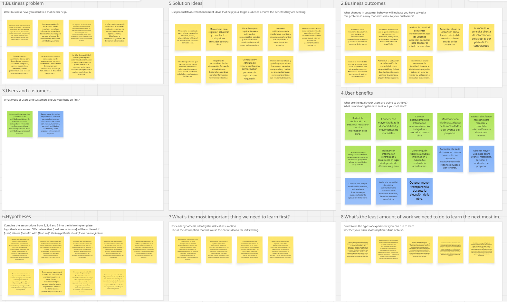
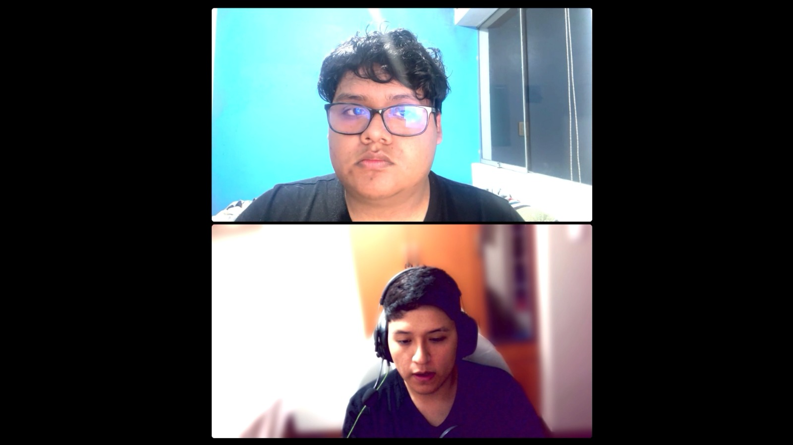
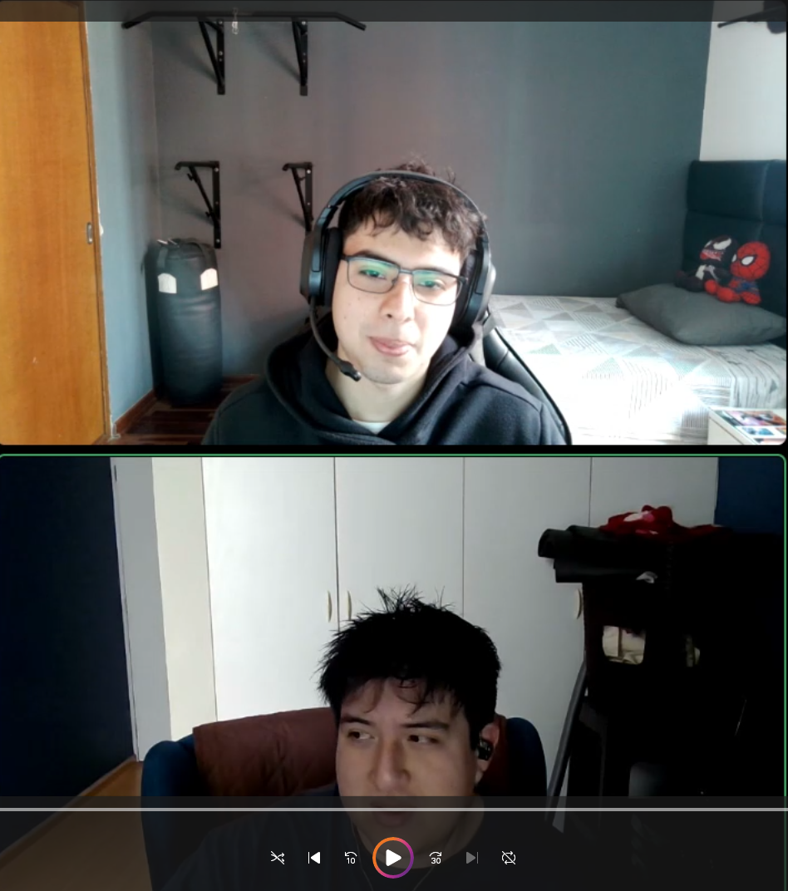
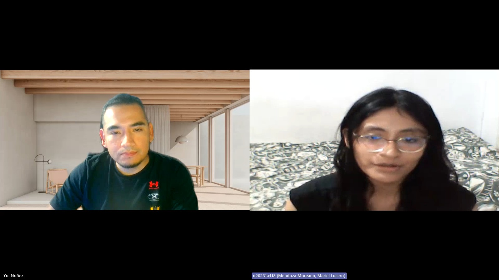
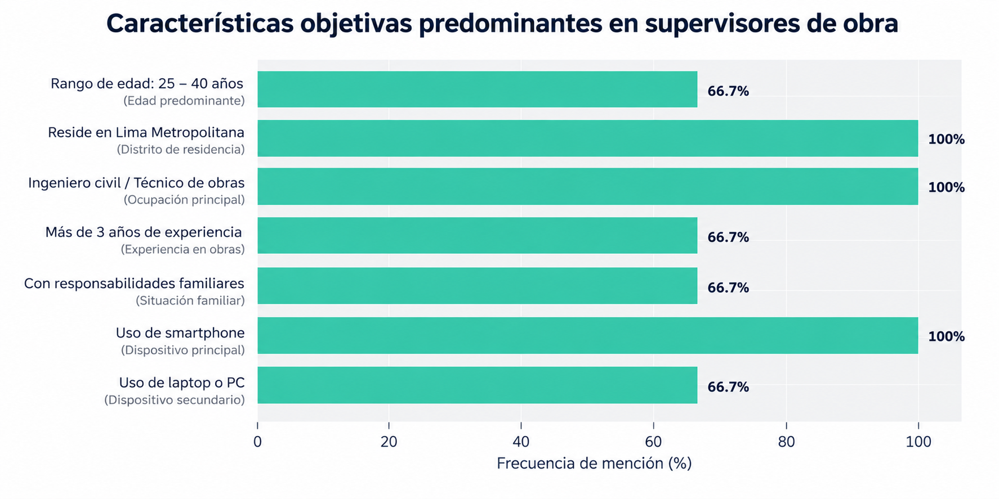
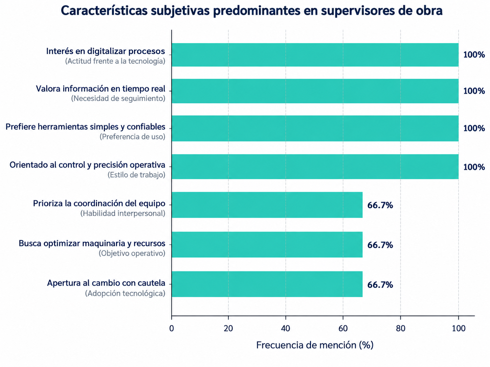
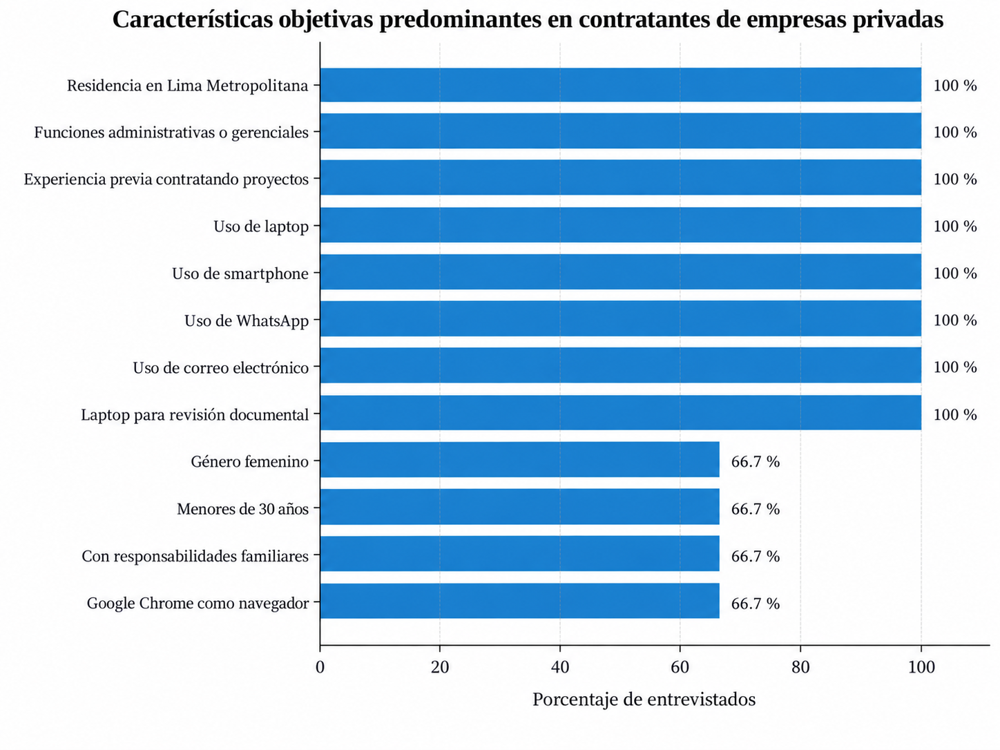
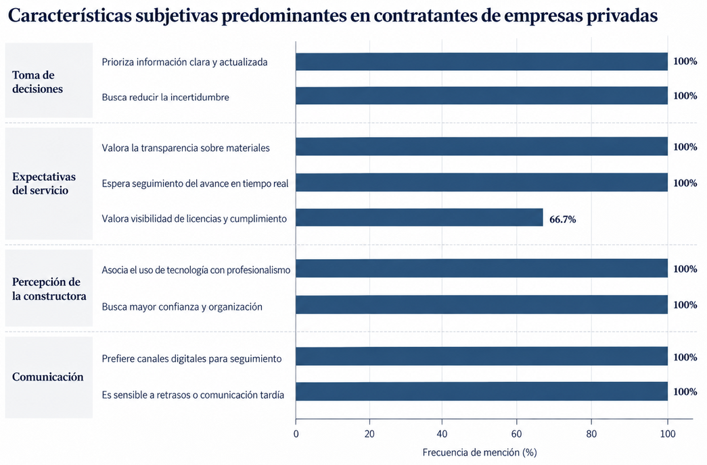

**Carrera**: Ingeniería de Software

**Periodo**: 2026-20

**Curso**: Diseño de Experimentos

**NRC**: 9112

**Profesor**: Lennin Percy Cenas Vasquez

**Informe deL Trabajo Final**

**Startup**: Foundex 

**Producto**: ArquiTech

**Integrantes**:

Chacaliaza Minaya, Eduardo Fabian - U202324129

Espino Rossi, Victor Manuel - U202411567

Garcia Cerpa, Braden Raid - U202415618

Mendoza Moreano, Mariel Lucero  - u20231a418

Quispe Barzola, Fabricio Fabian - U202320442

**Septiembre, 2026**

# Registro de Versiones del Informe

| Versión | Fecha | Autor | Descripción de modificación |
| :---: | :---: | :--- | :--- |
| 1.0.0 | 14/09/2026 | Mendoza Moreano, Mariel Lucero | Elaboración de las secciones 1.1.1 Descripción de la Startup, 1.1.2 Perfiles de integrantes del equipo, 1.2.1 Antecedentes y problemática, 1.2.2 Lean UX Process, 2.3.1 User Personas, 2.3.2 User Task Matrix, 4.7 Web Applications Prototyping y 4.8 Domain-Driven Software Architecture. |
| 1.0.1 | 14/09/2026 | Chacaliaza Minaya, Eduardo Fabian | Elaboración de las secciones 1.3 Segmentos objetivo, 2.1.1 Análisis competitivo, 2.1.2 Estrategias y tácticas frente a competidores, 3.3 Product Backlog, 4.3 Landing Page UI Design y 4.4 Mobile Applications UX/UI Design. |
| 1.0.2 | 14/09/2026 | Quispe Barzola, Fabricio Fabian | Elaboración de las secciones 2.2.1 Diseño de entrevistas, 2.2.2 Registro de entrevistas, 2.2.3 Análisis de entrevistas, 3.2 User Stories, 4.9 Software Object-Oriented Design, 4.10 Database Design y 5.1 Software Configuration Management. |
| 1.0.3 | 14/09/2026 | Espino Rossi, Victor Manuel | Elaboración de las secciones 2.3.3 User Journey Mapping, 2.3.4 Empathy Mapping, 3.4 Impact Mapping, 4.5 Mobile Applications Prototyping, 4.6 Web Applications UX/UI Design y 5.2 Product Implementation & Deployment. |
| 1.0.4 | 14/09/2026 | Garcia Cerpa, Braden Raid | Elaboración de las secciones 2.3.5 As-is Scenario Mapping, 2.4 Ubiquitous Language, 3.1 To-Be Scenario Mapping, 4.1 Style Guidelines, 4.2 Information Architecture y 5.3 Video About-the-Product. |

# Project Report Collaboration Insights

A continuación, capturas del procesos, commits  y elaboración de nuestro proyecto en cada entrega.

**Entrega Nº1: TB1**

# Contenido

## Tabla de contenido

### [Capítulo I: Introducción](#capítulo-i-introducción)

* [1.1. Startup Profile](#11-startup-profile)

    - [1.1.1. Descripción de la Startup](#111-descripción-de-la-startup)

    - [1.1.2. Perfiles de integrantes del equipo](#112-perfiles-de-integrantes-del-equipo)

* [1.2. Solution Profile](#12-solution-profile)

    - [1.2.1. Antecedentes y problemática](#121-antecedentes-y-problemática)

    - [1.2.2. Lean UX Process](#122-lean-ux-process)

        - [1.2.2.1. Lean UX Problem Statements](#1221-lean-ux-problem-statements)

        - [1.2.2.2. Lean UX Assumptions](#1222-lean-ux-assumptions)

        - [1.2.2.3. Lean UX Hypothesis Statements](#1223-lean-ux-hypothesis-statements)

        - [1.2.2.4. Lean UX Canvas](#1224-lean-ux-canvas)

* [1.3. Segmentos objetivo](#13-segmentos-objetivo)

### [Capítulo II: Requirements Elicitation & Analysis](#capítulo-ii-requirements-elicitation--analysis)

* [2.1. Competidores](#21-competidores)

    - [2.1.1. Análisis competitivo](#211-análisis-competitivo)

    - [2.1.2. Estrategias y tácticas frente a competidores](#212-estrategias-y-tácticas-frente-a-competidores)

* [2.2. Entrevistas](#22-entrevistas)

    - [2.2.1. Diseño de entrevistas](#221-diseño-de-entrevistas)

    - [2.2.2. Registro de entrevistas](#222-registro-de-entrevistas)

    - [2.2.3. Análisis de entrevistas](#223-análisis-de-entrevistas)

* [2.3. Needfinding](#23-needfinding)

    - [2.3.1. User Personas](#231-user-personas)

    - [2.3.2. User Task Matrix](#232-user-task-matrix)

    - [2.3.3. User Journey Mapping](#233-user-journey-mapping)

    - [2.3.4. Empathy Mapping](#234-empathy-mapping)

    - [2.3.5. As-is Scenario Mapping](#235-as-is-scenario-mapping)

* [2.4. Ubiquitous Language](#24-ubiquitous-language)

### [Capítulo III: Requirements Specification](#capítulo-iii-requirements-specification)

* [3.1. To-Be Scenario Mapping](#31-to-be-scenario-mapping)

* [3.2. User Stories](#32-user-stories)

* [3.3. Product Backlog](#33-product-backlog)

* [3.4. Impact Mapping](#34-impact-mapping)

### [Capítulo IV: Product Design](#capítulo-iv-product-design)

* [4.1. Style Guidelines](#41-style-guidelines)

    - [4.1.1. General Style Guidelines](#411-general-style-guidelines)

    - [4.1.2. Web Style Guidelines](#412-web-style-guidelines)

    - [4.1.3. Mobile Style Guidelines](#413-mobile-style-guidelines)

        - [4.1.3.1. iOS Mobile Style Guidelines](#4131-ios-mobile-style-guidelines)

        - [4.1.3.2. Android Mobile Style Guidelines](#4132-android-mobile-style-guidelines)

* [4.2. Information Architecture](#42-information-architecture)

    - [4.2.1. Organization Systems](#421-organization-systems)

    - [4.2.2. Labeling Systems](#422-labeling-systems)

    - [4.2.3. SEO Tags and Meta Tags](#423-seo-tags-and-meta-tags)

    - [4.2.4. Searching Systems](#424-searching-systems)

    - [4.2.5. Navigation Systems](#425-navigation-systems)

* [4.3. Landing Page UI Design](#43-landing-page-ui-design)

    - [4.3.1. Landing Page Wireframe](#431-landing-page-wireframe)

    - [4.3.2. Landing Page Mock-up](#432-landing-page-mock-up)

* [4.4. Mobile Applications UX/UI Design](#44-mobile-applications-uxui-design)

    - [4.4.1. Mobile Applications Wireframes](#441-mobile-applications-wireframes)

    - [4.4.2. Mobile Applications Wireflow Diagrams](#442-mobile-applications-wireflow-diagrams)

    - [4.4.3. Mobile Applications Mock-ups](#443-mobile-applications-mock-ups)

    - [4.4.4. Mobile Applications User Flow Diagrams](#444-mobile-applications-user-flow-diagrams)

* [4.5. Mobile Applications Prototyping](#45-mobile-applications-prototyping)

    - [4.5.1. Android Mobile Applications Prototyping](#451-android-mobile-applications-prototyping)

    - [4.5.2. iOS Mobile Applications Prototyping](#452-ios-mobile-applications-prototyping)

* [4.6. Web Applications UX/UI Design](#46-web-applications-uxui-design)

    - [4.6.1. Web Applications Wireframes](#461-web-applications-wireframes)

    - [4.6.2. Web Applications Wireflow Diagrams](#462-web-applications-wireflow-diagrams)

    - [4.6.3. Web Applications Mock-ups](#463-web-applications-mock-ups)

    - [4.6.4. Web Applications User Flow Diagrams](#464-web-applications-user-flow-diagrams)

* [4.7. Web Applications Prototyping](#47-web-applications-prototyping)

* [4.8. Domain-Driven Software Architecture](#48-domain-driven-software-architecture)

    - [4.8.1. Software Architecture Context Diagram](#481-software-architecture-context-diagram)

    - [4.8.2. Software Architecture Container Diagrams](#482-software-architecture-container-diagrams)

    - [4.8.3. Software Architecture Components Diagrams](#483-software-architecture-components-diagrams)

* [4.9. Software Object-Oriented Design](#49-software-object-oriented-design)

    - [4.9.1. Class Diagrams](#491-class-diagrams)

    - [4.9.2. Class Dictionary](#492-class-dictionary)

* [4.10. Database Design](#410-database-design)

    - [4.10.1. Relational/Non-Relational Database Diagram](#4101-relationalnon-relational-database-diagram)

### [Capítulo V: Product Implementation](#capítulo-v-product-implementation)

* [5.1. Software Configuration Management](#51-software-configuration-management)

    - [5.1.1. Software Development Environment Configuration](#511-software-development-environment-configuration)

    - [5.1.2. Source Code Management](#512-source-code-management)

    - [5.1.3. Source Code Style Guide & Conventions](#513-source-code-style-guide--conventions)

    - [5.1.4. Software Deployment Configuration](#514-software-deployment-configuration)

* [5.2. Product Implementation & Deployment](#52-product-implementation--deployment)

    - [5.2.1. Sprint Backlogs](#521-sprint-backlogs)

    - [5.2.2. Implemented Landing Page Evidence](#522-implemented-landing-page-evidence)

    - [5.2.3. Implemented Frontend-Web Application Evidence](#523-implemented-frontend-web-application-evidence)

    - [5.2.4. Acuerdo de Servicio - SaaS](#524-acuerdo-de-servicio---saas)

    - [5.2.5. Implemented Native-Mobile Application Evidence](#525-implemented-native-mobile-application-evidence)

    - [5.2.6. Implemented RESTful API and/or Serverless Backend Evidence](#526-implemented-restful-api-andor-serverless-backend-evidence)

    - [5.2.7. RESTful API documentation](#527-restful-api-documentation)

    - [5.2.8. Team Collaboration Insights](#528-team-collaboration-insights)

* [5.3. Video About-the-Product](#53-video-about-the-product)

### [Conclusion](#conclusiones)

### [Bibliografía](#bibliografia)

### [Anexos](#anexo)

# Student Outcome

El curso contribuye al cumplimiento del siguiente Student Outcome ABET:

**ABET – EAC - Student Outcome 4**  
Criterio: *La capacidad de reconocer responsabilidades éticas y profesionales en situaciones de ingeniería y hacer juicios informados, que deben considerar el impacto de las soluciones de ingeniería en contextos globales, económicos, ambientales y sociales.*

<table style="width:100%; table-layout:fixed; border-collapse:collapse;">
  <colgroup><col style="width:18%;"><col style="width:60%;"><col style="width:22%;"></colgroup>
  <thead><tr><th align="center" style="text-align:center !important;">Criterio específico</th><th align="center" style="text-align:center !important;">Acciones realizadas</th><th align="center" style="text-align:center !important;">Conclusiones</th></tr></thead>
  <tbody>
    <tr>
      <td valign="middle" style="text-align:justify; vertical-align:middle !important; padding:8px;"><strong>4.c.1 Reconoce responsabilidad ética y profesional en situaciones de ingeniería de software</strong></td>
      <td style="text-align:justify; vertical-align:top; padding:8px;"><strong>Mendoza Moreano, Mariel Lucero</strong> <strong>AV1:</strong> Participó en la elaboración de la descripción de la startup, perfiles de integrantes, antecedentes y problemática, Lean UX Process, User Personas, User Task Matrix, Web Applications Prototyping y Domain-Driven Software Architecture. Estas actividades permitieron identificar de manera responsable las necesidades de los usuarios, evitar diseñar funcionalidades basadas únicamente en supuestos y plantear una solución alineada con los problemas reales del dominio de construcción.  <strong>Chacaliaza Minaya, Eduardo Fabian</strong> <strong>AV1:</strong> Elaboró los segmentos objetivo, el análisis competitivo, las estrategias y tácticas frente a competidores, el Product Backlog, Landing Page UI Design y Mobile Applications UX/UI Design. Estas actividades implicaron documentar de manera transparente las fortalezas y limitaciones de ArquiTech frente a otras soluciones, priorizar requisitos de acuerdo con las necesidades de los usuarios y considerar criterios de claridad, accesibilidad y responsabilidad en el diseño de las interfaces.  <strong>Quispe Barzola, Fabricio Fabian</strong> <strong>AV1:</strong> Desarrolló el diseño, registro y análisis de entrevistas, User Stories, Software Object-Oriented Design, Database Design y Software Configuration Management. La realización de entrevistas permitió obtener información directamente de los segmentos objetivo y reducir decisiones basadas en suposiciones. Asimismo, la definición de requisitos, modelos de datos y prácticas de configuración contribuyó a una documentación responsable y trazable del sistema.  <strong>Espino Rossi, Victor Manuel</strong> <strong>AV1:</strong> Elaboró User Journey Mapping, Empathy Mapping, Impact Mapping, Mobile Applications Prototyping, Web Applications UX/UI Design y Product Implementation &amp; Deployment. Estas actividades permitieron representar de forma responsable las necesidades, frustraciones y experiencias de los usuarios, evitando que el diseño de la solución se centre únicamente en aspectos técnicos y considerando la experiencia de los distintos actores involucrados.  <strong>Garcia Cerpa, Braden Raid</strong> <strong>AV1:</strong> Elaboró As-is Scenario Mapping, Ubiquitous Language, To-Be Scenario Mapping, Style Guidelines, Information Architecture y Video About-the-Product. Estas actividades contribuyeron a mantener una comunicación clara y sin ambigüedades dentro del proyecto, así como a diseñar una experiencia comprensible y consistente para los usuarios, considerando principios de accesibilidad, claridad de información y comunicación responsable del producto.</td>
      <td valign="middle" style="text-align:justify; vertical-align:middle !important; padding:8px;"><strong>AV1:</strong> Durante el desarrollo del primer avance, el equipo reconoció que la construcción de ArquiTech no debe limitarse a implementar funcionalidades, sino que requiere comprender las consecuencias de las decisiones tomadas durante el ciclo de vida del software. La investigación con usuarios, la definición responsable de requisitos, la documentación de decisiones y el diseño orientado a la accesibilidad permitieron reducir suposiciones y establecer una base ética para el desarrollo de la solución. El equipo concluye que la responsabilidad profesional implica mantener transparencia sobre las capacidades y limitaciones del producto, proteger la información gestionada y priorizar las necesidades reales de los usuarios.</td>
    </tr>
    <tr>
      <td valign="middle" style="text-align:justify; vertical-align:middle !important; padding:8px;"><strong>4.c.2 Emite juicios informados considerando el impacto de las soluciones de ingeniería de software en contextos globales, económicos, ambientales y sociales</strong></td>
      <td style="text-align:justify; vertical-align:top; padding:8px;"><strong>Mendoza Moreano, Mariel Lucero</strong> <strong>AV1:</strong> Mediante el análisis de la problemática, Lean UX Process, User Personas y User Task Matrix, identificó cómo los procesos manuales utilizados actualmente pueden afectar la productividad y coordinación de las obras. Sus aportes permitieron considerar el impacto social de facilitar el trabajo de supervisores y personal administrativo, así como el impacto económico asociado a una mejor gestión del tiempo y de los recursos utilizados en los proyectos.  <strong>Chacaliaza Minaya, Eduardo Fabian</strong> <strong>AV1:</strong> A través del análisis de segmentos, competidores, estrategias competitivas y Product Backlog, evaluó el contexto económico en el que ArquiTech busca posicionarse. El análisis permitió reconocer la necesidad de ofrecer una solución accesible para pequeñas y medianas empresas constructoras, así como considerar el impacto económico de reducir errores de inventario, mejorar el seguimiento de proyectos y evitar el uso innecesario de recursos.  <strong>Quispe Barzola, Fabricio Fabian</strong> <strong>AV1:</strong> Mediante las entrevistas y el análisis de los datos obtenidos de los usuarios, identificó problemas relacionados con duplicidad de información, retrasos en reportes y dificultades de coordinación. Estos hallazgos permiten emitir juicios sobre el impacto social y económico de la solución, debido a que una gestión más eficiente puede reducir pérdidas de tiempo, errores administrativos y decisiones basadas en información desactualizada.  <strong>Espino Rossi, Victor Manuel</strong> <strong>AV1:</strong> Mediante User Journey Mapping, Empathy Mapping e Impact Mapping, analizó cómo la solución podría modificar la experiencia de los usuarios y generar cambios en la forma en que supervisores y contratantes acceden a la información. Estos artefactos permitieron considerar impactos sociales relacionados con la comunicación y transparencia entre los actores del proyecto, además de impactos económicos derivados de una toma de decisiones más oportuna.  <strong>Garcia Cerpa, Braden Raid</strong> <strong>AV1:</strong> A través del As-is Scenario Mapping y To-Be Scenario Mapping, comparó la situación actual con la experiencia propuesta mediante ArquiTech. Esta comparación permitió identificar posibles mejoras en la eficiencia operativa y en la reducción del uso de documentos físicos, considerando tanto el impacto económico como el ambiental asociado a la digitalización de procesos. Asimismo, las decisiones de Information Architecture y Style Guidelines contribuyeron a considerar el impacto social de ofrecer una plataforma comprensible y accesible para diferentes tipos de usuarios.</td>
      <td valign="middle" style="text-align:justify; vertical-align:middle !important; padding:8px;"><strong>AV1:</strong> El equipo concluye que ArquiTech puede generar impactos positivos en diferentes dimensiones. En el contexto económico, puede contribuir a disminuir errores de inventario, duplicidad de compras y tiempo invertido en tareas administrativas. En el contexto social, puede mejorar la coordinación y transparencia entre supervisores, áreas administrativas y contratantes. Desde una perspectiva ambiental, la digitalización de registros y reportes puede reducir el uso de documentos físicos, aunque también deberá considerarse posteriormente el consumo de recursos tecnológicos asociado a la plataforma. En el contexto global, el equipo reconoce que una solución digital orientada al sector construcción debe considerar escalabilidad, protección de información, accesibilidad e internacionalización para poder adaptarse a distintos contextos y usuarios.</td>
    </tr>
  </tbody>
</table>

# Capítulo I: Introducción

## 1.1. Startup Profile

### 1.1.1 Descripción de la Startup

Foundex es una startup impulsada por jóvenes universitarios de la Universidad Peruana de Ciencias Aplicadas (UPC), orientada a facilitar la gestión eficiente de proyectos de construcción en pequeñas y medianas empresas constructoras, así como para el personal encargado de su administración. A través de ArquiTech, nuestra herramienta digital, los usuarios podrán gestionar solicitudes de servicios, monitorear el avance de las obras y controlar los gastos asociados a cada proyecto.

La solución busca facilitar la administración y mejorar la transparencia de los procesos constructivos mediante la gestión de trabajadores, materiales, presupuestos y tiempos de ejecución, además del seguimiento en tiempo real del progreso de cada obra.

En Foundex, consideramos que la digitalización de estos procesos es fundamental para agilizar la gestión de las obras, reducir los tiempos de ejecución, optimizar los recursos y facilitar la toma de decisiones informadas. Por ello, apostamos por la tecnología como una herramienta para transformar el sector de la construcción y permitir que las pequeñas y medianas empresas accedan a una gestión más organizada, eficiente y profesional.

**Misión:** Brindar soluciones digitales innovadoras que permitan optimizar la gestión de proyectos de construcción en pequeñas y medianas empresas, facilitando la administración de recursos, el seguimiento de avances, el control de gastos y otros procesos relacionados, con el propósito de impulsar la eficiencia, la transparencia y la toma de decisiones estratégicas en el sector construcción.

**Visión:** Ser la plataforma líder en Latinoamérica en la digitalización de procesos constructivos para pequeñas y medianas empresas, transformando la manera en que se gestionan las obras mediante una tecnología accesible, eficaz y enfocada en las necesidades de nuestros usuarios.

### 1.1.2. Perfiles de integrantes del equipo

| Foto | Integrante |
| ----- | -------------------------------------------------------------------------------------------------------------------------------------------------------------------------------------------------------------------------------------------------------------------------------------------------------------------------------------------------------------------------------------------------------------------------------------------------------------------------------------------------------------------------------------------------------------------------------------------------------------------------------------------------- |
|  | 
<strong>Chacaliaza Minaya, Eduardo Fabian - U202324129</strong> Estudiante de Ingeniería de Software, interesado en el desarrollo de aplicaciones y soluciones tecnológicas orientadas a resolver necesidades reales de los usuarios. Me caracterizo por tener un enfoque analítico, capacidad para adaptarme a nuevos entornos y disposición para aprender nuevas tecnologías y herramientas de desarrollo. En este proyecto, busco contribuir en el análisis, diseño y definición de soluciones que mejoren la experiencia de los usuarios.
 |
|  | 
<strong>Espino Rossi, Victor Manuel - U202411567</strong> Estudiante de Ingeniería de Software en la Universidad Peruana de Ciencias Aplicadas, con interés en el desarrollo de aplicaciones, diseño de soluciones digitales y nuevas tecnologías. Me encuentro en constante aprendizaje y busco fortalecer mis conocimientos técnicos y habilidades de trabajo colaborativo. En este proyecto, aporto en la elaboración de artefactos de experiencia de usuario, prototipado y desarrollo de la solución.
 |
|  | 
<strong>Garcia Cerpa, Braden Raid - U202415618</strong> Estudiante de Ingeniería de Software con interés en el desarrollo de soluciones tecnológicas orientadas a resolver problemas reales. Me caracterizo por mantener una actitud responsable, organizada y colaborativa durante el desarrollo de proyectos. Asimismo, busco fortalecer mis conocimientos en diseño de software, experiencia de usuario y desarrollo de aplicaciones, aportando ideas que contribuyan a obtener soluciones funcionales y de calidad.
 |
|  | 
<strong>Mendoza Moreano, Mariel Lucero - U20231A418</strong> Estudiante de Ingeniería de Software con interés en el análisis de problemas, diseño de soluciones centradas en el usuario y arquitectura de software. Me caracterizo por mantener una actitud responsable, organizada y orientada al aprendizaje continuo. En este proyecto, busco aportar en la definición de las necesidades de los usuarios, el diseño de la solución y la estructuración de los principales componentes de ArquiTech.
 |
|  | 
<strong>Quispe Barzola, Fabricio Fabian - U202320442</strong> Estudiante de Ingeniería de Software con interés en el desarrollo de aplicaciones y soluciones tecnológicas orientadas a resolver problemas reales. Me caracterizo por tener disposición para aprender nuevas herramientas y tecnologías, así como por mantener un enfoque responsable y organizado durante el desarrollo de proyectos. Asimismo, busco fortalecer mis conocimientos en programación, diseño de software y buenas prácticas de desarrollo, contribuyendo activamente en el trabajo en equipo y en la elaboración de soluciones funcionales, eficientes y de calidad.
 |

## 1.2. Solution Profile

### 1.2.1. Antecedentes y problemática

En el contexto actual del sector construcción en Lima Metropolitana, muchas pequeñas y medianas empresas enfrentan dificultades al momento de administrar sus proyectos de forma eficiente. La mayoría de estos procesos, como la gestión de materiales, personal, presupuestos y avances de obra, aún se realizan de manera manual o a través de herramientas poco integradas, como hojas de cálculo, notas físicas o mensajería informal, lo que genera desorganización, pérdida de información y errores costosos.

Particularmente, los supervisores de obra (quienes en muchos casos también cumplen funciones de jefes de obra) se enfrentan a múltiples retos. Deben coordinar equipos, controlar recursos, reportar avances y tomar decisiones en tiempo real, todo esto con herramientas limitadas y en entornos que no siempre cuentan con buena conectividad. Por otro lado, los contratantes de empresas privadas necesitan transparencia, cumplimiento normativo y visibilidad del progreso de la obra, pero suelen recibir información fragmentada y poco clara, lo que puede generar desconfianza y retrasos en los pagos o decisiones.

Frente a este panorama, surge la necesidad de una solución digital adaptada a esta realidad: accesible, intuitiva, y enfocada en automatizar tareas críticas como el control de inventario, la gestión de personal, y la generación de reportes. Una herramienta que no solo ayude a optimizar procesos, sino que también facilite la toma de decisiones estratégicas, mejore la comunicación y permita a estas empresas competir en un mercado cada vez más exigente.

**What (¿Qué problema existe?)**

El principal problema que enfrentan muchas pequeñas y medianas empresas del sector construcción es la falta de una herramienta digital centralizada que permita gestionar eficientemente sus obras. Actualmente, gran parte de la gestión operativa , como el control de inventario, la asistencia del personal, el avance del proyecto y la generación de reportes, se realiza de forma manual o desorganizada, utilizando hojas de cálculo, aplicaciones no integradas o canales de mensajería informal. Esta situación genera desorden, pérdida de información, errores administrativos y retrasos en la toma de decisiones.

**Why (¿Por qué es importante gestionar bien una obra?)**

Porque una buena gestión de obra garantiza que los proyectos se desarrollen dentro del presupuesto, en el tiempo estimado y cumpliendo los estándares de calidad y seguridad. Cuando estos procesos no se administran adecuadamente, se corre el riesgo de incurrir en sobrecostos, retrasos, accidentes laborales, reclamos de los contratantes y una menor rentabilidad del proyecto. Además, una gestión eficiente fortalece la transparencia y la confianza entre los supervisores de obra y los contratantes, lo cual es clave para futuras oportunidades de negocio.

**When (¿Cuándo ocurre?)**

Este problema ocurre principalmente durante las etapas de ejecución y supervisión de las obras, donde se requiere una coordinación constante entre personal, materiales, plazos y reportes. Sucede tanto al inicio del día (planificación y distribución de tareas), como durante el desarrollo del proyecto (seguimiento en campo) y al cierre del día (informes de avance).

**Where (¿Dónde sucede?)**

Principalmente en obras ubicadas en zonas urbanas y semiurbanas de Lima Metropolitana, como San Juan de Lurigancho, Villa El Salvador, Ate y San Martín de Porres. Estas áreas concentran una alta actividad de pequeñas y medianas empresas constructoras que aún no han adoptado herramientas digitales especializadas.

**Who (¿A quién afecta?)**

Afecta directamente a los supervisores de obra, quienes deben cumplir múltiples roles en la gestión operativa, y a los contratantes de empresas privadas, quienes exigen cumplimiento de plazos, transparencia y seguridad en la ejecución del proyecto. También impacta a los trabajadores administrativos que deben organizar, comunicar y reportar toda la información relacionada con los avances de la obra.

**How (¿Cómo se manifiesta el problema?)**

Se manifiesta mediante la falta de control en el inventario, errores en la asistencia de personal, demoras en la entrega de reportes, dificultades en la comunicación entre actores involucrados y poca capacidad para tomar decisiones basadas en datos. Además, el uso de canales informales como WhatsApp o Excel disperso impide centralizar la información y genera retrabajo.

**How much (¿Qué tan grave es?)**

La gravedad del problema radica en que una gestión deficiente de los recursos puede generar consecuencias económicas y operativas para las empresas constructoras. Según Michue Francia (2025), las deficiencias y la falta de control sobre los suministros y proveedores tienen un impacto directo en la ejecución de los proyectos, ocasionando retrasos en los plazos de entrega, incrementos imprevistos de los costos y no conformidades técnicas en la obra. Estas situaciones pueden traducirse en pérdidas económicas, compras innecesarias por un inadecuado control de materiales, menor productividad del personal y descontento de los clientes.

Asimismo, las soluciones existentes en el mercado, como Procore o Buildertrend, ofrecen funcionalidades para la gestión de proyectos de construcción, pero sus costos pueden representar una barrera de acceso para determinadas pequeñas y medianas empresas. Esto evidencia una oportunidad para desarrollar una solución digital accesible y adaptada a las necesidades de este segmento.

### 1.2.2. Lean UX Process

#### 1.2.2.1. Lean UX Problem Statements

El estado actual del sector de la gestión de proyectos de construcción se caracteriza por el uso de herramientas poco integradas para administrar obras. Las pequeñas y medianas empresas constructoras, junto con sus supervisores, jefes de obra y personal administrativo, enfrentan dificultades para gestionar trabajadores, materiales, presupuestos, avances y tiempos de ejecución. Muchas de estas actividades se realizan mediante hojas de cálculo, documentos físicos o canales de comunicación informales, lo que puede generar desorganización, pérdida de información, retrasos y dificultades para tomar decisiones oportunamente.

Las soluciones existentes no siempre se adaptan a las necesidades de este segmento, ya que pueden presentar barreras relacionadas con el costo, la complejidad de uso o un alcance mayor al requerido por pequeñas y medianas empresas. Frente a esta brecha, Foundex, mediante ArquiTech, propone una solución digital accesible e intuitiva que permita centralizar la información de las obras, gestionar trabajadores, materiales, presupuestos y avances, y realizar un seguimiento oportuno de los proyectos.

Nuestro enfoque inicial estará dirigido a pequeñas y medianas empresas constructoras de Lima Metropolitana que actualmente utilizan herramientas no integradas para gestionar sus obras. Consideraremos como usuarios principales a los supervisores de obra, responsables de la gestión operativa, y al personal administrativo encargado de registrar, organizar y comunicar la información de los proyectos.

Sabremos que la solución está generando valor cuando los usuarios la utilicen de manera recurrente para registrar y consultar información, realizar seguimiento de trabajadores, materiales y avances, generar reportes y reducir la dependencia de herramientas dispersas utilizadas durante la gestión de las obras.

**¿Cómo podríamos facilitar la gestión de proyectos de construcción para que las pequeñas y medianas empresas puedan centralizar la información de sus obras, gestionar sus recursos y realizar un seguimiento oportuno de sus avances mediante una plataforma accesible e intuitiva?**

#### 1.2.2.2. Lean UX Assumptions

**Assumptions worksheet**

**Business Assumptions:**

1. **Creemos que nuestros clientes necesitan** reducir errores y pérdidas por desorganización en obra al momento de gestionar el inventario, personal y obreros.
2. **Estas necesidades se pueden resolver con** un seguimiento personalizado para cada uno de estos aspectos del proyecto.
3. **Mis clientes iniciales son** supervisores de obra de proyectos medianos de construcción.
4. **El valor #1 que mi cliente quiere de mi servicio es** ahorrar tiempo y dinero al centralizar la gestión operativa al optimizar los procesos con una buena organización.
5. **El cliente también puede obtener el beneficio adicional de** tener mayor visibilidad y control sobre recursos y personal en tiempo real y una mejor toma de decisiones gracias a datos precisos y actualizados.
6. **Voy a adquirir la mayoría de mis clientes a través de** marketing digital localizado y pruebas gratuitas de 30 días con soporte personalizado para atraer usuarios.
7. **Haré dinero a través de** suscripciones mensuales escalables.
8. **Mi competencia principal en el mercado serán** otras aplicaciones de gestión de proyectos.
9. **Los venceremos debido a que** nuestros planes tienen precios más bajos y son flexibles, nuestro enfoque es específico en operaciones diarias (inventario, personal, obreros) y la adaptación será rápida debido a la fácil implementación del sistema que cuenta con soporte localizado.
10. **Mi mayor riesgo de producto es** la resistencia inicial a la adopción tecnológica en empresas acostumbradas a métodos manuales.
11. **Resolveremos esto a través de** capacitaciones gratuitas y videos tutoriales que estarán disponibles en todo momento a través de la web de la empresa.

**User Assumptions:**

- **¿Quién es el usuario?**

    Nuestros principales clientes serán los supervisores de obra y contratantes de empresas privadas que se encuentran en un rango de edad de 28 a 50 años que pueden ser de clase media-alta, estos quieren encontrar una manera eficiente de llevar la administración de sus proyectos de construcción para evitar pérdidas.

- **¿Dónde encaja nuestro producto en su trabajo o vida?**

    Nuestro producto encaja al momento de iniciar la supervisión de un aspecto del proyecto que se está administrando en ese momento o se quiere revisar el avance y buen manejo.

- **¿Qué problemas tiene nuestro producto y cómo se pueden resolver?**

    - La dependencia del internet en la obra para poder utilizar el aplicativo el cual se puede solucionar incluyendo un modo offline que sincronice datos al reconectarse a una red de internet. 
    - El soporte técnico insuficiente para picos de demanda, en caso de un aumento repentino de usuarios se podría saturar el soporte técnico, frustrando a clientes que esperan respuestas rápidas. Este problema lo podremos solucionar creando una base de conocimientos con videos y guías para resolver dudas comunes y evitar un número masivo de consultas.

- **¿Cómo y cuándo es usado nuestro producto?**

    Nuestro producto puede ser usado al inicio del día para planificar (confirmar asistencia, revisar inventario), durante el día para monitorear (actualizar avances) y al final para generar y/o revisar reportes.

- **¿Qué características son importantes?**

    Nuestro producto debe contar con una interfaz intuitiva, fácil de usar y aprender por nuestros usuarios, también debe contar con una buena sincronización de datos para poder tener un buen seguimiento de los distintos aspectos de la obra.

- **¿Cómo debe verse nuestro producto y cómo comportarse?**

    La interfaz de nuestro producto debe ser intuitiva y resposive con un diseño que transmita confianza y profesionalismo y que sea de respuesta rápida.

#### 1.2.2.3. Lean UX Hypothesis Statements

Creemos que ofrecer una plataforma web centralizada para supervisores y asistentes administrativos que integre la gestión de inventario, personal y obreros resultará en una reducción del tiempo dedicado a tareas administrativas, y lo sabremos porque el tiempo promedio para generar reportes diarios disminuirá de 60 minutos a 15 minutos en las primeras cuatro semanas de uso.

Creemos que proporcionar un modo offline que sincronice datos de inventario y asistencia una vez conectado para supervisores en obras sin internet resultará en un uso continuo en entornos remotos, y lo sabremos porque el 90% de las actualizaciones offline se sincronizará correctamente en las primeras 24 horas.

Creemos que proporcionar un onboarding interactivo con videos cortos para supervisores y asistentes resultará en una curva de aprendizaje más corta, y lo sabremos porque el 75% de los nuevos usuarios realizarán al menos tres acciones clave (registrar asistencia, actualizar inventario, generar reporte) en su primera semana.

#### 1.2.2.4. Lean UX Canvas

## 1.3. Segmentos objetivo

Para garantizar que nuestra solución tecnológica responda de manera efectiva a las necesidades presentes en la gestión de proyectos de construcción, hemos identificado y analizado dos segmentos clave que participan directamente en el desarrollo y seguimiento de las obras.

A continuación, se detallan los perfiles estratégicos que integran el modelo de negocio de ArquiTech, profundizando en sus características demográficas, geográficas y psicográficas, así como en los principales problemas y necesidades que presentan dentro del dominio de la construcción.

**Segmento objetivo #1: Supervisores de obra**

Representa a los profesionales o responsables encargados de supervisar y coordinar las actividades realizadas durante la ejecución de una obra. Entre sus principales responsabilidades se encuentran el control del personal, la asistencia de los trabajadores, la gestión de materiales, el seguimiento del avance de la construcción y la comunicación con las áreas administrativas.

Aspectos demográficos:

- **Sexo:** Masculino y femenino.

- **Rango de edad:** 28 años a más.

- **Nivel socioeconómico:** Principalmente clase media.

- **Ocupación:** Supervisores de obra, residentes de obra, jefes de obra, asistentes de obra y profesionales relacionados con la supervisión de proyectos de construcción.

Aspectos geográficos:

- **Nacionalidad:** Peruana.

- **Zona geográfica:** Principalmente zonas urbanas de Lima Metropolitana y otros sectores con presencia de proyectos de construcción.

Aspectos psicográficos:

- **Dolor principal:** Dificultad para mantener actualizada y centralizada la información relacionada con la asistencia del personal, el inventario de materiales y el avance de la obra, debido al uso de diferentes medios como registros físicos, hojas de cálculo, documentos y aplicaciones de mensajería.

- **Intereses:** Mejorar el control de las actividades realizadas en obra, reducir errores en el registro de información, optimizar el uso de materiales y facilitar la comunicación entre el personal de campo y las áreas administrativas.

- **Actitudes:** Buscan soluciones prácticas, rápidas y fáciles de utilizar que puedan incorporarse a sus actividades diarias sin requerir conocimientos técnicos avanzados.

- **Necesidades clave:** Contar con información centralizada sobre trabajadores, materiales y avances de obra, generar reportes de manera más eficiente y disponer de alertas que permitan identificar oportunamente ausencias de trabajadores o problemas con el abastecimiento de materiales.

**Segmento objetivo #2: Contratantes de empresas privadas**

Representa a las personas, empresarios, administradores o representantes de organizaciones privadas que contratan empresas constructoras para desarrollar proyectos como locales comerciales, oficinas, viviendas, remodelaciones u otras obras de infraestructura.

Este segmento necesita conocer el estado de los proyectos contratados y verificar que la empresa constructora cumpla con los plazos, recursos y condiciones establecidas durante la ejecución de la obra.

Aspectos demográficos:

- **Sexo:** Masculino y femenino.

- **Rango de edad:** 30 años a más.

- **Nivel socioeconómico:** Principalmente clase media y media-alta.

- **Ocupación:** Empresarios, administradores, propietarios de inmuebles, representantes de empresas privadas o responsables de la contratación y seguimiento de proyectos de construcción.

Aspectos geográficos:

- **Nacionalidad:** Peruana.

- **Zona geográfica:** Principalmente zonas urbanas de Lima Metropolitana y otros sectores donde se desarrollen proyectos privados de construcción.

Aspectos psicográficos:

- **Dolor principal:** Falta de visibilidad constante sobre el avance real de la obra y dependencia de reportes proporcionados posteriormente por la empresa constructora, lo que puede generar incertidumbre respecto al cumplimiento del proyecto.

- **Intereses:** Cumplimiento de los plazos establecidos, transparencia en el uso de materiales y recursos, seguimiento del avance del proyecto y reducción de riesgos económicos asociados a retrasos o errores.

- **Actitudes:** Valoran la transparencia, la información clara y actualizada, y las herramientas que les permitan realizar seguimiento de sus proyectos sin tener que solicitar información constantemente a la constructora.

- **Necesidades clave:** Visualizar el progreso de la obra, consultar información relacionada con materiales y personal, verificar el cumplimiento de los plazos establecidos y disponer de reportes comprensibles que faciliten la toma de decisiones.

# Capítulo II: Requirements Elicitation & Analysis

## 2.1. Competidores

### 2.1.1. Análisis competitivo
Para poder conocer y analizar mejor a nuestros posibles competidores, realizamos el siguiente Landscape:

<table style="background-color:transparent; border-collapse:collapse; width:100%; table-layout:fixed; font-family:Arial,sans-serif; font-size:12px; line-height:16px; color:inherit; border:1px solid currentColor;">
  <colgroup>
    <col style="width:12%;">
    <col style="width:10%;">
    <col style="width:10%;">
    <col style="width:17%;">
    <col style="width:17%;">
    <col style="width:17%;">
    <col style="width:17%;">
  </colgroup>

  <tr style="background-color:transparent; ">
    <th colspan="7" style="background-color:transparent; color:inherit; border:1px solid currentColor; padding:0 7px; text-align:left; height:17px;">
      Competitive Analysis Landscape
    </th>
  </tr>
  <tr style="background-color:transparent; height:49px;">
    <td colspan="2" style="background-color:transparent; color:inherit; border:1px solid currentColor; padding:0 7px; vertical-align:middle; text-align:center;">
      ¿Por qué llevar a cabo este análisis?
    </td>
    <td colspan="5" style="background-color:transparent; color:inherit; border:1px solid currentColor; padding:0 7px; vertical-align:middle; text-align:justify;">Determinar las ventajas competitivas de ArquiTech frente a otras plataformas orientadas a la gestión de proyectos de construcción, con el objetivo de identificar oportunidades de diferenciación en la gestión de personal, materiales, avances y reportes. Este análisis permitirá reconocer las fortalezas y debilidades de nuestra propuesta y de los principales competidores, facilitando la definición de estrategias dirigidas a supervisores de obra y contratantes de empresas privadas.</td>
  </tr>

  <tr style="background-color:transparent; height:50px;">
    <td colspan="3" style="background-color:transparent; color:inherit; border:1px solid currentColor; padding:0 7px; vertical-align:middle;">
      &nbsp;
    </td>
    <td style="background-color:transparent; color:inherit; border:1px solid currentColor; padding:0 7px; vertical-align:middle; text-align:center;">ArquiTech </td>
    <td style="background-color:transparent; color:inherit; border:1px solid currentColor; padding:0 7px; vertical-align:middle; text-align:center;">Procore </td>
    <td style="background-color:transparent; color:inherit; border:1px solid currentColor; padding:0 7px; vertical-align:middle; text-align:center;">Buildertrend </td>
    <td style="background-color:transparent; color:inherit; border:1px solid currentColor; padding:0 7px; vertical-align:middle; text-align:center;">Buildwise </td>
  </tr>

  <tr style="background-color:transparent; height:65px;">
    <td rowspan="2" style="background-color:transparent; color:inherit; border:1px solid currentColor; text-align:center; vertical-align:middle;">
      Perfil
    </td>
    <td colspan="2" style="background-color:transparent; color:inherit; border:1px solid currentColor; padding:0 7px; vertical-align:middle; text-align:center;">Overview</td>
    <td style="background-color:transparent; color:inherit; border:1px solid currentColor; padding:0 7px; vertical-align:middle; text-align:justify;">ArquiTech es una plataforma digital orientada a la gestión de proyectos de construcción. Permite centralizar información relacionada con asistencia del personal, inventario de materiales, avances de obra y reportes, facilitando la coordinación entre supervisores, áreas administrativas y contratantes.</td>
    <td style="background-color:transparent; color:inherit; border:1px solid currentColor; padding:0 7px; vertical-align:middle; text-align:justify;">Procore es una plataforma integral para la gestión de proyectos de construcción que permite administrar procesos relacionados con proyectos, documentos, costos, recursos, calidad y seguridad.</td>
    <td style="background-color:transparent; color:inherit; border:1px solid currentColor; padding:0 7px; vertical-align:middle; text-align:justify;">Buildertrend es una plataforma de gestión de construcción orientada principalmente a constructores de viviendas, remodeladores y contratistas. Integra herramientas relacionadas con planificación, presupuestos, clientes, pagos y seguimiento de proyectos.</td>
    <td style="background-color:transparent; color:inherit; border:1px solid currentColor; padding:0 7px; vertical-align:middle; text-align:justify;">Buildwise es una plataforma orientada a la gestión de proyectos de construcción que facilita el seguimiento de presupuestos, costos, gastos, facturación y cambios producidos durante la ejecución de una obra.</td>
  </tr>
  <tr style="background-color:transparent; height:82px;">
    <td colspan="2" style="background-color:transparent; color:inherit; border:1px solid currentColor; padding:0 7px; vertical-align:middle; text-align:center;">
      Ventaja competitiva ¿Qué valor ofrece a los clientes?
    </td>
    <td style="background-color:transparent; color:inherit; border:1px solid currentColor; padding:0 7px; vertical-align:middle; text-align:justify;">Centraliza las principales actividades operativas de una obra en una solución sencilla y accesible. Busca reducir el uso de registros físicos y herramientas dispersas, facilitando la gestión cotidiana de pequeñas y medianas empresas constructoras.</td>
    <td style="background-color:transparent; color:inherit; border:1px solid currentColor; padding:0 7px; vertical-align:middle; text-align:justify;">Plataforma robusta y escalable que integra múltiples procesos asociados a la construcción y permite gestionar proyectos de diferente complejidad desde una solución centralizada.</td>
    <td style="background-color:transparent; color:inherit; border:1px solid currentColor; padding:0 7px; vertical-align:middle; text-align:justify;">Integra gestión de proyectos, clientes, presupuestos y operaciones dentro de una misma plataforma, con un enfoque especializado en construcción residencial y remodelaciones.</td>
    <td style="background-color:transparent; color:inherit; border:1px solid currentColor; padding:0 7px; vertical-align:middle; text-align:justify;">Facilita el control financiero y administrativo de las obras mediante herramientas para seguimiento de costos, presupuestos, gastos y órdenes de cambio.</td>
  </tr>

  <tr style="background-color:transparent; height:66px;">
    <td rowspan="2" style="background-color:transparent; color:inherit; border:1px solid currentColor; text-align:center; vertical-align:middle;">
      Perfil de Marketing
    </td>
    <td colspan="2" style="background-color:transparent; color:inherit; border:1px solid currentColor; padding:0 7px; vertical-align:middle; text-align:center;">Mercado objetivo</td>
    <td style="background-color:transparent; color:inherit; border:1px solid currentColor; padding:0 7px; vertical-align:middle; text-align:justify;">Supervisores de obra y contratantes de empresas privadas, principalmente vinculados con pequeñas y medianas empresas constructoras que necesitan mejorar el control y seguimiento de sus proyectos.</td>
    <td style="background-color:transparent; color:inherit; border:1px solid currentColor; padding:0 7px; vertical-align:middle; text-align:justify;">Empresas constructoras, contratistas generales, gerentes de proyectos, desarrolladores inmobiliarios y organizaciones que gestionan proyectos de construcción.</td>
    <td style="background-color:transparent; color:inherit; border:1px solid currentColor; padding:0 7px; vertical-align:middle; text-align:justify;">Constructores de viviendas, remodeladores, contratistas especializados y pequeñas y medianas empresas dedicadas principalmente a construcción residencial.</td>
    <td style="background-color:transparent; color:inherit; border:1px solid currentColor; padding:0 7px; vertical-align:middle; text-align:justify;">Constructores, remodeladores y empresas que requieren herramientas digitales para gestionar presupuestos, costos y ejecución de proyectos.</td>
  </tr>
  <tr style="background-color:transparent; height:66px;">
    <td colspan="2" style="background-color:transparent; color:inherit; border:1px solid currentColor; padding:0 7px; vertical-align:middle; text-align:center;">Estrategias de marketing</td>
    <td style="background-color:transparent; color:inherit; border:1px solid currentColor; padding:0 7px; vertical-align:middle; text-align:justify;">Pruebas gratuitas, precios accesibles, demostraciones de la plataforma, contenido digital relacionado con la gestión eficiente de obras, presencia en redes sociales y atención personalizada a potenciales clientes.</td>
    <td style="background-color:transparent; color:inherit; border:1px solid currentColor; padding:0 7px; vertical-align:middle; text-align:justify;">Marketing de contenidos, demostraciones empresariales, casos de éxito, participación en eventos del sector construcción y alianzas estratégicas con organizaciones relacionadas con la industria.</td>
    <td style="background-color:transparent; color:inherit; border:1px solid currentColor; padding:0 7px; vertical-align:middle; text-align:justify;">Marketing digital, contenido educativo, recursos para empresas constructoras, demostraciones del producto, posicionamiento web y presencia en redes sociales.</td>
    <td style="background-color:transparent; color:inherit; border:1px solid currentColor; padding:0 7px; vertical-align:middle; text-align:justify;">Marketing digital dirigido a constructores y remodeladores, demostraciones de funcionalidades y comunicación enfocada en la simplificación del control financiero de los proyectos.</td>
  </tr>

  <tr style="background-color:transparent; height:66px;">
    <td rowspan="3" style="background-color:transparent; color:inherit; border:1px solid currentColor; text-align:center; vertical-align:middle;">
      Perfil de Producto
    </td>
    <td colspan="2" style="background-color:transparent; color:inherit; border:1px solid currentColor; padding:0 7px; vertical-align:middle; text-align:center;">Productos &amp; Servicios</td>
    <td style="background-color:transparent; color:inherit; border:1px solid currentColor; padding:0 7px; vertical-align:middle; text-align:justify;">Gestión de proyectos de construcción, registro de asistencia, gestión de personal, control de inventario y materiales, seguimiento del avance de obra, generación de reportes y alertas relacionadas con trabajadores o disponibilidad de materiales.</td>
    <td style="background-color:transparent; color:inherit; border:1px solid currentColor; padding:0 7px; vertical-align:middle; text-align:justify;">Gestión de proyectos, administración financiera, documentos, planificación, calidad, seguridad, recursos y herramientas colaborativas para los participantes de una obra.</td>
    <td style="background-color:transparent; color:inherit; border:1px solid currentColor; padding:0 7px; vertical-align:middle; text-align:justify;">Planificación de proyectos, presupuestos, gestión de clientes, facturación, pagos, órdenes de cambio, comunicación con clientes y generación de informes.</td>
    <td style="background-color:transparent; color:inherit; border:1px solid currentColor; padding:0 7px; vertical-align:middle; text-align:justify;">Gestión de presupuestos, estimaciones, gastos, órdenes de cambio, facturación y seguimiento financiero de los proyectos de construcción.</td>
  </tr>
  <tr style="background-color:transparent; height:49px;">
    <td colspan="2" style="background-color:transparent; color:inherit; border:1px solid currentColor; padding:0 7px; vertical-align:middle; text-align:center;">Precios &amp; Costos</td>
    <td style="background-color:transparent; color:inherit; border:1px solid currentColor; padding:0 7px; vertical-align:middle; text-align:justify;">Modelo de suscripción orientado principalmente a pequeñas y medianas empresas constructoras, considerando un periodo de prueba que permita conocer las funcionalidades de la plataforma antes de contratar el servicio.</td>
    <td style="background-color:transparent; color:inherit; border:1px solid currentColor; padding:0 7px; vertical-align:middle; text-align:justify;">Modelo de precios personalizado de acuerdo con las características de la empresa, el volumen de construcción y los productos o funcionalidades requeridos.</td>
    <td style="background-color:transparent; color:inherit; border:1px solid currentColor; padding:0 7px; vertical-align:middle; text-align:justify;">Modelo de precios personalizado según las características, tamaño y necesidades particulares de cada empresa constructora.</td>
    <td style="background-color:transparent; color:inherit; border:1px solid currentColor; padding:0 7px; vertical-align:middle; text-align:justify;">Modelo de costos asociado a las funcionalidades y necesidades de gestión de cada empresa o proyecto.</td>
  </tr>
  <tr style="background-color:transparent; height:66px;">
    <td colspan="2" style="background-color:transparent; color:inherit; border:1px solid currentColor; padding:0 7px; vertical-align:middle; text-align:center;">
      Canales de distribución (Web y/o Móvil)
    </td>
    <td style="background-color:transparent; color:inherit; border:1px solid currentColor; padding:0 7px; vertical-align:middle; text-align:justify;">Landing Page, plataforma web y aplicación móvil orientada a supervisores, personal relacionado con la obra y contratantes responsables del seguimiento de los proyectos.</td>
    <td style="background-color:transparent; color:inherit; border:1px solid currentColor; padding:0 7px; vertical-align:middle; text-align:justify;">Plataforma web, aplicación móvil, canales de venta empresarial e integraciones con plataformas y servicios externos.</td>
    <td style="background-color:transparent; color:inherit; border:1px solid currentColor; padding:0 7px; vertical-align:middle; text-align:justify;">Plataforma web, aplicación móvil, canales digitales de venta y servicios de soporte y capacitación para sus clientes.</td>
    <td style="background-color:transparent; color:inherit; border:1px solid currentColor; padding:0 7px; vertical-align:middle; text-align:justify;">Plataforma web para la administración y seguimiento de la información financiera y operativa de los proyectos.</td>
  </tr>

  <tr style="background-color:transparent; height:66px;">
    <td rowspan="4" style="background-color:transparent; color:inherit; border:1px solid currentColor; text-align:center; vertical-align:middle;">
      Análisis SWOT
    </td>
    <td colspan="2" style="background-color:transparent; color:inherit; border:1px solid currentColor; padding:0 7px; vertical-align:middle; text-align:center;">Fortalezas</td>
    <td style="background-color:transparent; color:inherit; border:1px solid currentColor; padding:0 7px; vertical-align:middle; text-align:justify;">Enfoque en las necesidades de supervisores de obra; centralización de información; facilidad de uso; gestión de personal, materiales y avances desde una misma plataforma; orientación a pequeñas y medianas empresas constructoras.</td>
    <td style="background-color:transparent; color:inherit; border:1px solid currentColor; padding:0 7px; vertical-align:middle; text-align:justify;">Marca consolidada; amplia variedad de funcionalidades; escalabilidad; capacidad de integración con otras soluciones y experiencia en proyectos de construcción de gran tamaño.</td>
    <td style="background-color:transparent; color:inherit; border:1px solid currentColor; padding:0 7px; vertical-align:middle; text-align:justify;">Especialización en construcción residencial; integración de ventas y operaciones; variedad de herramientas de gestión y disponibilidad de recursos de capacitación.</td>
    <td style="background-color:transparent; color:inherit; border:1px solid currentColor; padding:0 7px; vertical-align:middle; text-align:justify;">Enfoque en el control financiero de proyectos; administración de costos, presupuestos y gastos desde una solución centralizada.</td>
  </tr>
  <tr style="background-color:transparent; height:50px;">
    <td colspan="2" style="background-color:transparent; color:inherit; border:1px solid currentColor; padding:0 7px; vertical-align:middle; text-align:center;">Debilidades</td>
    <td style="background-color:transparent; color:inherit; border:1px solid currentColor; padding:0 7px; vertical-align:middle; text-align:justify;">Producto en etapa inicial; menor reconocimiento de marca; necesidad de incrementar la validación con usuarios reales y recursos más limitados en comparación con competidores internacionales consolidados.</td>
    <td style="background-color:transparent; color:inherit; border:1px solid currentColor; padding:0 7px; vertical-align:middle; text-align:justify;">La amplitud de funcionalidades y complejidad de la plataforma puede resultar excesiva para pequeñas empresas que únicamente necesitan herramientas básicas para gestionar sus obras.</td>
    <td style="background-color:transparent; color:inherit; border:1px solid currentColor; padding:0 7px; vertical-align:middle; text-align:justify;">Puede presentar una curva de aprendizaje inicial y disponer de funcionalidades que no sean necesarias para empresas constructoras pequeñas.</td>
    <td style="background-color:transparent; color:inherit; border:1px solid currentColor; padding:0 7px; vertical-align:middle; text-align:justify;">Menor amplitud funcional en comparación con plataformas integrales y menor reconocimiento internacional frente a soluciones consolidadas.</td>
  </tr>
  <tr style="background-color:transparent; height:49px;">
    <td colspan="2" style="background-color:transparent; color:inherit; border:1px solid currentColor; padding:0 7px; vertical-align:middle; text-align:center;">Oportunidades</td>
    <td style="background-color:transparent; color:inherit; border:1px solid currentColor; padding:0 7px; vertical-align:middle; text-align:justify;">Crecimiento de la digitalización del sector construcción; necesidad de reemplazar procesos manuales; aumento del uso de dispositivos móviles y oportunidad de atender pequeñas y medianas empresas que buscan herramientas sencillas y accesibles.</td>
    <td style="background-color:transparent; color:inherit; border:1px solid currentColor; padding:0 7px; vertical-align:middle; text-align:justify;">Expansión hacia nuevos mercados, incorporación de nuevas tecnologías y desarrollo de integraciones adicionales con servicios relacionados con la gestión de construcción.</td>
    <td style="background-color:transparent; color:inherit; border:1px solid currentColor; padding:0 7px; vertical-align:middle; text-align:justify;">Crecimiento del mercado de construcción residencial, remodelaciones y aumento de la adopción de herramientas digitales por parte de contratistas y empresas constructoras.</td>
    <td style="background-color:transparent; color:inherit; border:1px solid currentColor; padding:0 7px; vertical-align:middle; text-align:justify;">Incremento de la digitalización financiera y administrativa de pequeñas y medianas empresas relacionadas con el sector construcción.</td>
  </tr>
  <tr style="background-color:transparent; height:49px;">
    <td colspan="2" style="background-color:transparent; color:inherit; border:1px solid currentColor; padding:0 7px; vertical-align:middle; text-align:center;">Amenazas</td>
    <td style="background-color:transparent; color:inherit; border:1px solid currentColor; padding:0 7px; vertical-align:middle; text-align:justify;">Entrada de competidores internacionales con mayores recursos; resistencia al cambio de empresas acostumbradas a procesos manuales y aparición de nuevas soluciones digitales de gestión de construcción.</td>
    <td style="background-color:transparent; color:inherit; border:1px solid currentColor; padding:0 7px; vertical-align:middle; text-align:justify;">Aparición de plataformas especializadas con menores costos y evolución constante de nuevas tecnologías aplicadas al sector construcción.</td>
    <td style="background-color:transparent; color:inherit; border:1px solid currentColor; padding:0 7px; vertical-align:middle; text-align:justify;">Entrada de nuevos competidores con soluciones más económicas y funcionalidades especializadas para pequeñas empresas y contratistas.</td>
    <td style="background-color:transparent; color:inherit; border:1px solid currentColor; padding:0 7px; vertical-align:middle; text-align:justify;">Competencia de plataformas integrales, herramientas financieras especializadas y nuevas soluciones digitales de menor costo.</td>
  </tr>
</table>

### 2.1.2. Estrategias y tácticas frente a competidores

ArquiTech se diferenciará de competidores como Procore, Buildertrend y Buildwise mediante una propuesta enfocada en las necesidades operativas de pequeñas y medianas empresas constructoras. Frente a la amplia variedad de funcionalidades, escalabilidad y posicionamiento que poseen estas plataformas, nuestra estrategia será priorizar una solución más sencilla y especializada en actividades frecuentes de obra, como la gestión de personal, control de asistencia, inventario de materiales, seguimiento de avances y generación de reportes.

Para aprovechar las debilidades identificadas en soluciones de mayor alcance, ArquiTech aplicará una estrategia de adopción simplificada. La plataforma contará con una interfaz intuitiva, recursos de capacitación breves y un periodo de prueba que permita conocer sus principales funcionalidades antes de contratar el servicio. De esta manera, se busca reducir la resistencia al cambio de empresas que todavía administran parte de sus operaciones mediante registros físicos, hojas de cálculo, documentos y aplicaciones de mensajería.

Asimismo, ArquiTech aprovechará la oportunidad generada por la creciente digitalización del sector construcción mediante funcionalidades orientadas a problemas cotidianos de la obra. Entre ellas se consideran alertas relacionadas con la disponibilidad de materiales, registro y seguimiento de asistencia, actualización del progreso de los proyectos y centralización de información. Esta especialización permitirá brindar mayor utilidad a los supervisores de obra y, al mismo tiempo, ofrecer a los contratantes una mayor visibilidad sobre el estado de los proyectos.

Como táctica comercial, se ofrecerán planes escalables de acuerdo con las necesidades de cada empresa, considerando factores como la cantidad de obras activas, usuarios y funcionalidades requeridas. Esto permitirá que pequeñas y medianas empresas comiencen utilizando las funciones necesarias para su operación y amplíen posteriormente el servicio conforme aumenten sus proyectos, evitando contratar desde el inicio una solución sobredimensionada.

Para afrontar la amenaza representada por plataformas internacionales con mayor reconocimiento y recursos, ArquiTech buscará diferenciarse mediante una atención más cercana y adaptada al contexto de sus segmentos objetivo. Se brindará soporte mediante canales digitales, demostraciones de la plataforma y contenido educativo relacionado con la digitalización y gestión de obras. Para los supervisores de obra, la comunicación se enfocará en la centralización del personal, materiales y avances; mientras que para los contratantes de empresas privadas se destacará la transparencia, el seguimiento de los proyectos y el acceso a información actualizada.

Finalmente, ArquiTech mantendrá un proceso de mejora continua basado en las necesidades identificadas en sus usuarios y en los cambios del sector construcción. Esto permitirá incorporar progresivamente nuevas funcionalidades sin perder el enfoque en facilidad de uso, accesibilidad y gestión centralizada, buscando construir una ventaja competitiva sostenible frente a soluciones de mayor complejidad.

## 2.2. Entrevistas

### 2.2.1. Diseño de entrevistas

Para el proceso de investigación de ArquiTech se diseñó un conjunto de entrevistas dirigido a representantes de los dos segmentos objetivo identificados: **supervisores de obra** y **contratantes de empresas privadas**.

El objetivo de estas entrevistas es comprender las actividades que actualmente realizan los participantes durante la gestión y seguimiento de proyectos de construcción, las herramientas que utilizan, las principales dificultades que enfrentan y sus necesidades respecto al acceso, organización y comunicación de la información de una obra.

Las preguntas fueron organizadas en cuatro grupos principales: **introducción y contexto, procesos actuales, puntos de dolor, necesidades y expectativas**, además de preguntas de cierre. Esta estructura permite recopilar información relacionada con el contexto del participante, sus actividades habituales, problemas experimentados durante la ejecución o seguimiento de una obra y su percepción respecto al uso de herramientas digitales.

Para mantener la consistencia del proceso de investigación, todos los participantes pertenecientes a un mismo segmento serán entrevistados utilizando el mismo conjunto de preguntas. De esta manera, las respuestas podrán ser posteriormente comparadas e interpretadas en el análisis de entrevistas para identificar patrones y características recurrentes dentro de cada segmento objetivo.

#### Segmento objetivo #1: Supervisores de obra

**Introducción y contexto**

- ¿Cuál es su nombre y apellido?
- ¿Cuántos años tiene?
- ¿En qué distrito reside?
- ¿Podría contarme sobre su rol como supervisor de obra y las actividades que realiza durante un día habitual de trabajo?
- ¿Aproximadamente cuántos trabajadores y qué tipos de materiales suele gestionar en una obra?

**Procesos actuales**

- ¿Cómo realiza actualmente el control de asistencia de los trabajadores? ¿Qué procedimiento sigue cuando alguien falta?
- ¿Cómo lleva actualmente el control del inventario de materiales? ¿Qué herramientas o métodos utiliza?
- ¿Cómo registra los avances de una obra y prepara los reportes correspondientes? ¿Cuánto tiempo suele dedicar a estas actividades?
- ¿Cómo comparte actualmente la información relacionada con el avance de la obra con otras personas involucradas en el proyecto?

**Puntos de dolor**

- ¿Qué actividades relacionadas con la gestión de trabajadores, materiales o avances considera más complicadas o demandantes? ¿Podría contarme un caso reciente?
- ¿Ha tenido problemas relacionados con errores en el inventario, asistencia o reportes? ¿Qué ocurrió y cómo lo resolvió?
- ¿Qué dificultades suele encontrar al coordinar con otros roles involucrados en la gestión de la obra, como asistentes administrativos o responsables del proyecto?
- ¿Hay alguna información que normalmente necesite durante la obra y que resulte difícil obtener o mantener actualizada?

**Necesidades y expectativas**

- ¿Cómo considera que podría mejorarse actualmente la gestión de asistencia, inventario y reportes de una obra?
- ¿Qué información considera más importante consultar durante la ejecución de una obra y con qué frecuencia necesita acceder a ella?
- ¿Qué características debería tener una herramienta digital para resultarle útil en la gestión y seguimiento de una obra?
- ¿Qué condiciones o características le generarían confianza al utilizar una nueva plataforma digital?
- ¿Qué aspectos podrían dificultar o impedir que utilice una herramienta de este tipo?

**Cierre**

- ¿Hay algún problema o necesidad relacionada con la gestión de obras que no hayamos mencionado y que considere importante resolver?
- ¿Qué condiciones tendrían que cumplirse para que considere probar una plataforma digital orientada a la gestión de una obra?

#### Segmento objetivo #2: Contratantes de empresas privadas

**Introducción y contexto**

- ¿Cuál es su nombre y apellido?
- ¿Cuántos años tiene?
- ¿En qué distrito reside?
- ¿Qué tipo de proyectos de construcción suele contratar, por ejemplo, locales comerciales, oficinas, edificios u otros?
- ¿Cómo realiza normalmente el proceso de selección de una empresa constructora? ¿Qué aspectos toma en cuenta para elegirla?

**Procesos actuales**

- ¿Cómo se mantiene informado actualmente sobre el avance de una obra que ha contratado?
- ¿Qué tipo de información recibe sobre el proyecto y con qué frecuencia?
- ¿Qué herramientas o medios utiliza normalmente la constructora para comunicarle el avance de la obra?
- ¿Cómo verifica actualmente el cumplimiento de aspectos como plazos, licencias, normas de seguridad u otras condiciones del proyecto?
- ¿Cómo realiza el seguimiento del uso de materiales y del personal involucrado en la obra?

**Puntos de dolor**

- ¿Qué dificultades ha experimentado anteriormente al trabajar con empresas constructoras? ¿Podría contarme algún caso?
- ¿Qué nivel de visibilidad suele tener sobre el uso de materiales, el personal y el avance de una obra?
- ¿Ha tenido alguna dificultad debido a información incompleta, desactualizada o poco clara durante un proyecto? ¿Qué ocurrió?
- ¿Ha experimentado retrasos, errores o situaciones que hayan generado costos adicionales durante una obra? ¿Cómo afectaron al proyecto?
- ¿Qué aspectos del seguimiento de una obra le generan actualmente mayor preocupación o incertidumbre?

**Necesidades y expectativas**

- ¿Qué información considera más importante recibir durante el desarrollo de una obra?
- ¿Con qué frecuencia considera necesario recibir información sobre el avance del proyecto?
- ¿Qué aspectos podrían mejorar la forma en que una constructora comunica y presenta la información de una obra?
- ¿Qué papel considera que pueden tener las herramientas digitales en el seguimiento de un proyecto de construcción?
- ¿Qué características debería tener una herramienta digital para aumentar su confianza en la información proporcionada por una constructora?
- ¿Qué aspectos podrían generarle desconfianza o dificultar el uso de una plataforma de este tipo?

**Cierre**

- ¿Qué considera que podrían mejorar las empresas constructoras para brindarle mayor tranquilidad durante el desarrollo de una obra?
- ¿Qué condiciones deberían cumplirse para que el uso de una plataforma digital por parte de una constructora influya positivamente en su decisión de contratarla?
- ¿Hay algún aspecto relacionado con el seguimiento de una obra que no hayamos mencionado y que considere importante?

#### Preguntas complementarias de caracterización para ambos segmentos

Las siguientes preguntas complementarias serán aplicadas a todos los entrevistados de ambos segmentos objetivo antes del desarrollo del guion principal correspondiente. Su propósito es recopilar características objetivas y subjetivas que permitan comprender mejor el perfil, contexto, comportamiento y preferencias de los participantes.

- ¿Con qué género se identifica?
- ¿Cuál es su estado civil?
- ¿Tiene responsabilidades familiares que influyan en su rutina o en la forma en que toma decisiones?
- ¿Cuál es su ocupación o cargo actual?
- ¿Cuántos años de experiencia tiene en el sector construcción o contratando proyectos de construcción?
- ¿Cómo describiría su personalidad y su forma habitual de trabajar o tomar decisiones?
- ¿Qué habilidades considera más importantes para desarrollar sus actividades?
- ¿Qué personas, empresas, marcas o referentes suelen influir en sus decisiones relacionadas con proyectos de construcción?
- ¿Qué dispositivo utiliza principalmente para realizar actividades relacionadas con su trabajo o con el seguimiento de proyectos: smartphone, laptop, tablet u otro? ¿Cuál prefiere utilizar y por qué?
- ¿Qué aplicaciones o canales digitales utiliza con mayor frecuencia para comunicarse o gestionar información relacionada con su trabajo?
- ¿Qué navegador web utiliza habitualmente?
- ¿Cuál es su principal objetivo cuando participa en la gestión o seguimiento de una obra?
- ¿Cuál es la principal dificultad o frustración que experimenta durante dicho proceso?
- ¿Podría contarme brevemente sobre su trayectoria y experiencia relacionada con proyectos de construcción?

### 2.2.2. Registro de entrevistas

Como parte del proceso de investigación de ArquiTech, se contemplan entrevistas a representantes de los dos segmentos objetivo definidos: supervisores de obra y contratantes de empresas privadas. Para esta etapa se consideran tres participantes por cada segmento, obteniendo un total de seis entrevistas.

Cada entrevista será registrada en video como evidencia del proceso de investigación. Posteriormente, las seis entrevistas serán consolidadas en un único video editado de Needfinding, utilizando Clipchamp y publicándolo en Microsoft Stream mediante un enlace privado. Para cada participante se registran sus nombres y apellidos, edad, distrito de residencia, segmento objetivo, fecha de entrevista, un cuadro representativo del video, el timing exacto en el que inicia su participación dentro del video consolidado y la duración correspondiente.

El video consolidado incluirá una pantalla inicial de presentación, elementos visuales relacionados con la identidad de Foundex y ArquiTech, una secuencia coherente entre entrevistas y títulos que identifiquen al participante, el segmento objetivo y la fecha de realización de cada entrevista. La edición considerará aproximadamente entre tres y cinco minutos por participante.

Los resúmenes presentados para cada entrevista recogen las principales respuestas obtenidas mediante el guion principal y las preguntas complementarias de caracterización. Se consideran tanto características objetivas como subjetivas, incluyendo información demográfica, ocupación, trayectoria, personalidad, habilidades, marcas e influencias, tecnología utilizada, dispositivos de preferencia, canales digitales de interacción, navegador, objetivos, frustraciones, procesos actuales, dificultades, necesidades y expectativas.

Esta información servirá posteriormente como fuente para el análisis estadístico de entrevistas y para la construcción de los User Personas, manteniendo trazabilidad entre las características incorporadas en los arquetipos y la información obtenida durante las entrevistas.

**Video consolidado de Needfinding:** [ENLACE PRIVADO DE MICROSOFT STREAM]

**Nombre del video:** `upc-pre-202610-1asi0732-9112-Foundex-needfinding-sprint-1.mp4`

**Formato:** `.mp4`

**Duración total:** [HH:MM:SS]

---

#### Segmento objetivo #1: Supervisores de obra

##### Entrevista #1

**Datos del entrevistado**

- **Nombres y apellidos:** [NOMBRES Y APELLIDOS]
- **Edad:** 61 años
- **Distrito de residencia:** [DISTRITO]
- **Segmento objetivo:** Supervisor de obra
- **Fecha de entrevista:** [DD/MM/AAAA]
- **Timing de inicio:** [HH:MM:SS]
- **Duración:** [MM:SS]
- **Video consolidado:** [ENLACE PRIVADO DE MICROSOFT STREAM]

**Figura X**  
*Cuadro de video del entrevistado #1 del segmento Supervisores de obra.*

  

*Nota.* Elaboración propia a partir de la entrevista realizada.

**Resumen de la entrevista**

[NOMBRE] es un supervisor de obra de 61 años, identificado con el género masculino, casado y con responsabilidades familiares que influyen en la organización de su tiempo. Cuenta con más de treinta años de experiencia en el sector construcción y ha participado principalmente en edificaciones, ampliaciones y proyectos de infraestructura, desempeñando actividades relacionadas con supervisión, control técnico y administración de recursos.

Durante una jornada habitual inicia revisando las actividades programadas y verificando la disponibilidad del personal y los materiales necesarios. También comprueba que los trabajos sean ejecutados de acuerdo con el expediente técnico, coordina con el residente de obra y realiza seguimiento de metrados, calidad y avance. Dependiendo de la magnitud del proyecto, trabaja con diferentes cuadrillas y gestiona materiales como cemento, acero, agregados, ladrillo y concreto.

Para controlar la asistencia utiliza hojas de tareo en las que se registra la presencia y las horas trabajadas. Cuando algún trabajador falta, la situación es comunicada al responsable de la cuadrilla y se evalúa si es necesario realizar un reemplazo. El inventario se controla mediante Kardex y registros de movimientos de almacén, utilizados para registrar entradas y salidas de materiales.

El avance es medido principalmente mediante metrados diarios y posteriormente consolidado en reportes semanales y mensuales. La preparación y revisión de estos documentos puede tomar varias horas debido a que la información proviene de diferentes registros. Para compartirla con otros responsables utiliza reuniones, reportes, correo electrónico y WhatsApp.

Entre sus principales dificultades se encuentra mantener actualizada toda la información operativa. Indicó que la ausencia de trabajadores o los retrasos de proveedores pueden modificar inmediatamente la planificación. También ha experimentado inconsistencias entre el stock registrado y el stock físico cuando las salidas de materiales no son registradas oportunamente. Asimismo, considera que pueden producirse diferencias entre campo y administración cuando la información no se comunica a tiempo.

Su principal objetivo es lograr que la obra sea ejecutada de acuerdo con el expediente técnico, dentro de los plazos establecidos y utilizando adecuadamente los recursos. Su principal frustración es trabajar con información desactualizada o detectar demasiado tarde la falta de algún material o recurso.

Considera que la gestión podría mejorarse mediante la centralización de asistencia, inventario, metrados y reportes. Necesita consultar diariamente información relacionada con avance, stock y disponibilidad de personal. Espera que una herramienta digital sea sencilla, confiable y evite la duplicación de trabajo. También considera valiosas funciones relacionadas con el control de maquinaria y combustible y con la generación de reportes valorizados.

Respecto a la adopción de tecnología, considera importante que existan permisos diferenciados para los usuarios, registros confiables y trazabilidad sobre quién realiza cada actualización. Una herramienta excesivamente complicada o que requiera más tiempo de registro que el procedimiento actual constituiría una barrera para su utilización.

En cuanto a sus características personales, se describe como una persona metódica y cuidadosa que prefiere verificar la información antes de tomar decisiones. Considera especialmente importantes las habilidades de organización, supervisión, comunicación, interpretación de documentación técnica, control de recursos y resolución de imprevistos.

Entre sus principales influencias profesionales menciona las buenas prácticas difundidas por CAPECO y SENCICO, además de la experiencia de otros ingenieros con los que ha trabajado. En cuanto a tecnología, utiliza smartphone y laptop, aunque prefiere la laptop para revisar documentos y elaborar reportes. Emplea principalmente WhatsApp, correo electrónico y herramientas de Microsoft Office, y utiliza Google Chrome como navegador habitual.

Finalmente, considera que una solución digital también debería permitir comparar automáticamente lo planificado con lo ejecutado y con los recursos consumidos. Estaría dispuesto a probar una plataforma orientada a la gestión de obras siempre que sea fácil de implementar y reduzca efectivamente el trabajo administrativo.

---

##### Entrevista #2

**Datos del entrevistado**

- **Nombres y apellidos:** [NOMBRES Y APELLIDOS]
- **Edad:** 55 años
- **Distrito de residencia:** [DISTRITO]
- **Segmento objetivo:** Supervisora de obra
- **Fecha de entrevista:** [DD/MM/AAAA]
- **Timing de inicio:** [HH:MM:SS]
- **Duración:** [MM:SS]
- **Video consolidado:** [ENLACE PRIVADO DE MICROSOFT STREAM]

**Figura X**  
*Cuadro de video del entrevistado #2 del segmento Supervisores de obra.*

  

*Nota.* Elaboración propia a partir de la entrevista realizada.

**Resumen de la entrevista**

[NOMBRE] es una ingeniera civil de 55 años que se identifica con el género femenino, es casada y tiene responsabilidades familiares. Cuenta con aproximadamente veinticinco años de experiencia en construcción y ha trabajado supervisando distintas etapas de proyectos, especialmente en actividades relacionadas con control de calidad, seguridad y ejecución de trabajos.

Durante una jornada habitual revisa las actividades programadas, verifica la calidad de los materiales y las condiciones de seguridad, supervisa el uso adecuado de equipos de protección personal y comprueba el cumplimiento de las funciones asignadas al equipo técnico. La cantidad de trabajadores y materiales que debe gestionar varía de acuerdo con las actividades programadas para cada jornada.

El control de asistencia se realiza mediante hojas de tareo administradas principalmente por el asistente técnico y el maestro de obra. Cuando se produce una ausencia, esta debe comunicarse inmediatamente debido a que puede afectar una actividad crítica del proyecto.

Para el control del inventario se utilizan notas de entrada y salida que posteriormente son registradas en Excel. El avance se controla mediante valorizaciones físicas y reportes semanales y mensuales. La información es compartida mediante reuniones, correo electrónico, documentos digitales y WhatsApp.

Entre las principales dificultades menciona la coordinación de recursos y la necesidad de mantener actualizada la información. Los retrasos en el registro de entradas o salidas pueden generar diferencias en el inventario. Asimismo, considera fundamental que técnicos, residentes, personal administrativo y responsables de almacén trabajen utilizando información consistente.

La información que considera más difícil de mantener actualizada es el inventario y el estado de los requerimientos de materiales. Su principal objetivo es asegurar que las actividades sean desarrolladas correctamente y con el nivel de calidad requerido, mientras que sus principales frustraciones están relacionadas con los retrasos en materiales y las inconsistencias en los registros.

Considera que la gestión podría mejorar mediante una herramienta que integre asistencia, almacén, requerimientos y reportes. Necesita consultar diariamente información relacionada con avance, materiales y disponibilidad del personal. Espera que una plataforma digital sea integral pero sencilla y que permita generar diferentes tipos de reportes según las necesidades de cada responsable.

Para confiar en una herramienta digital considera necesario que la información esté protegida, que los responsables de cada registro estén identificados y que pueda verificarse cuándo se actualizó cada dato. Una interfaz complicada o la falta de orientación inicial al personal podrían dificultar su adopción.

Se describe como una persona organizada, preventiva y rigurosa con los procedimientos. Entre sus principales habilidades reconoce la comunicación, liderazgo, coordinación, control de calidad e interpretación de documentación técnica.

Entre sus referentes profesionales se encuentran SENCICO, CAPECO y las normas técnicas aplicables al sector construcción. Utiliza principalmente laptop y smartphone, aunque prefiere la laptop para actividades documentales. Entre sus herramientas y canales digitales habituales se encuentran Excel, Outlook y WhatsApp, y utiliza Google Chrome como navegador.

Finalmente, considera importante que una plataforma permita realizar seguimiento al estado de los requerimientos de materiales, identificando si se encuentran pendientes, aprobados o atendidos. Estaría dispuesta a utilizar una solución digital si facilita las actividades y centraliza la información relevante de la obra.

---

##### Entrevista #3

**Datos del entrevistado**

- **Nombres y apellidos:** [NOMBRES Y APELLIDOS]
- **Edad:** 31 años
- **Distrito de residencia:** [DISTRITO]
- **Segmento objetivo:** Supervisora de obra
- **Fecha de entrevista:** [DD/MM/AAAA]
- **Timing de inicio:** [HH:MM:SS]
- **Duración:** [MM:SS]
- **Video consolidado:** [ENLACE PRIVADO DE MICROSOFT STREAM]

**Figura X**  
*Cuadro de video del entrevistado #3 del segmento Supervisores de obra.*

  

*Nota.* Elaboración propia a partir de la entrevista realizada.

**Resumen de la entrevista**

[NOMBRE] es una ingeniera civil de 31 años que se identifica con el género femenino y es soltera. No tiene personas que dependan económicamente de ella. Cuenta con aproximadamente siete años de experiencia en el sector construcción y ha participado principalmente en proyectos de edificaciones y remodelaciones.

Su jornada habitual comprende la organización de actividades, supervisión de cuadrillas, revisión de materiales y coordinación con el área administrativa al finalizar el día. Dependiendo del proyecto, suele trabajar con aproximadamente entre diez y dieciocho trabajadores y gestionar materiales como ladrillo, cemento, fierro y concreto premezclado.

La asistencia del personal se registra mediante firmas y las ausencias suelen comunicarse a través de WhatsApp. Para controlar el inventario utiliza Excel y, en determinadas situaciones, cuadernos físicos. El avance de la obra es documentado mediante fotografías y posteriormente se elaboran reportes en Word.

La información relacionada con la obra es compartida mediante WhatsApp, correo electrónico y documentos digitales compartidos. Una de sus principales dificultades es mantener toda la información actualizada mientras desarrolla actividades en campo.

Ha experimentado situaciones de compras duplicadas debido a que los registros de inventario no fueron actualizados oportunamente. También identifica dificultades en la coordinación entre campo y administración, debido a que la información generada en obra no siempre llega inmediatamente a la oficina.

La información que necesita con mayor rapidez se encuentra relacionada con stock de materiales, ausencias del personal y avance de las actividades. Su principal objetivo es mantener organizadas las operaciones y evitar interrupciones innecesarias, mientras que sus principales frustraciones son registrar repetidamente la misma información y trabajar con datos desactualizados.

Considera que la gestión podría mejorar mediante una herramienta que pueda utilizar directamente desde el smartphone y que centralice la información de obra. Entre las características que considera especialmente importantes se encuentran las alertas por ausencias o niveles bajos de materiales, reportes resumidos y una interfaz sencilla.

Para confiar en una solución digital espera que sea intuitiva, confiable y que almacene adecuadamente la información. Entre las posibles barreras identifica la dependencia de una buena conexión a Internet y un rendimiento lento de la aplicación.

Se describe como una persona práctica, dinámica y orientada a resolver problemas. Considera importantes las habilidades de organización, comunicación, resolución de problemas y manejo de herramientas digitales.

Entre sus influencias se encuentran contenidos técnicos de **SENCICO**, experiencias compartidas por colegas y comunidades profesionales. También utiliza herramientas de Microsoft Office y Autodesk.

Utiliza smartphone y laptop. En actividades realizadas directamente en campo prefiere el smartphone, mientras que para preparar reportes prefiere la laptop. Sus aplicaciones y canales más utilizados son WhatsApp, Excel, Word y Google Drive. Su navegador habitual es Google Chrome.

Finalmente, considera que sería útil recibir alertas automáticas ante eventos relevantes. Estaría dispuesta a utilizar una plataforma de gestión siempre que pueda emplearla fácilmente durante las actividades desarrolladas en campo.

---

#### Segmento objetivo #2: Contratantes de empresas privadas

##### Entrevista #4

**Datos del entrevistado**

- **Nombres y apellidos:** [NOMBRES Y APELLIDOS]
- **Edad:** 27 años
- **Distrito de residencia:** Cercado de Lima
- **Segmento objetivo:** Contratante de empresa privada
- **Fecha de entrevista:** [DD/MM/AAAA]
- **Timing de inicio:** [HH:MM:SS]
- **Duración:** [MM:SS]
- **Video consolidado:** [ENLACE PRIVADO DE MICROSOFT STREAM]

**Figura X**  
*Cuadro de video del entrevistado #1 del segmento Contratantes de empresas privadas.*

  

*Nota.* Elaboración propia a partir de la entrevista realizada.

**Resumen de la entrevista**

[NOMBRE] es una administradora de un pequeño negocio comercial de 27 años, residente en Cercado de Lima. Se identifica con el género femenino, es soltera y no tiene hijos ni personas que dependan económicamente de ella. Cuenta con aproximadamente cuatro años de experiencia contratando proyectos relacionados con remodelaciones y adecuaciones de locales comerciales.

Suele contratar principalmente remodelaciones de locales comerciales, oficinas y pequeños almacenes. Para seleccionar una empresa constructora revisa recomendaciones, trabajos anteriores, presupuesto y cumplimiento de plazos.

Actualmente se mantiene informada sobre sus proyectos mediante WhatsApp y correo electrónico. Recibe principalmente fotografías y listados semanales, aunque considera que esta información puede ser informal y no siempre permite determinar con claridad cuánto se ha avanzado.

Para verificar licencias y condiciones normativas revisa la documentación con apoyo de un abogado y, cuando lo considera necesario, contrata inspecciones externas. En relación con materiales y personal, depende principalmente de la información proporcionada por la constructora y de las visitas realizadas a la obra.

Entre sus experiencias negativas menciona retrasos, acabados con una calidad menor a la esperada y reportes poco claros. En una experiencia previa, el retraso en una obra ocasionó aproximadamente S/ 10 000 de pérdidas debido a que no pudo abrir un negocio en la fecha programada.

Su principal objetivo es que los proyectos finalicen dentro del plazo y presupuesto establecidos. Su principal frustración es no conocer con claridad lo que está ocurriendo durante la ejecución hasta que aparece un problema.

Considera especialmente importante disponer de información sobre avance, materiales, personal e incidentes. Le gustaría poder consultar esta información cuando la necesite y recibir adicionalmente un resumen semanal.

Considera que las constructoras deberían comunicar los problemas con mayor claridad y anticipación. Una herramienta digital podría permitirle consultar directamente la información sin solicitar actualizaciones constantemente. Para confiar en una plataforma espera disponer de reportes claros, fotografías, seguimiento de materiales y personal e información sobre licencias. Los datos desactualizados o la falta de trazabilidad sobre el origen de la información le generarían desconfianza.

Se describe como una persona práctica que compara alternativas y revisa referencias antes de tomar decisiones, debido a que busca reducir riesgos. Considera importantes las habilidades de organización, negociación y revisión de presupuestos.

Entre sus principales influencias se encuentran las recomendaciones de otros empresarios, referencias de clientes anteriores y el portafolio de trabajos realizados por las constructoras.

Utiliza smartphone y laptop. Prefiere el smartphone para comunicaciones rápidas y la laptop para revisar documentos. Entre sus principales canales y aplicaciones digitales se encuentran WhatsApp, Gmail y Google Drive. Su navegador habitual es Google Chrome.

Finalmente, considera que una empresa constructora que utilice herramientas digitales para ofrecer mayor transparencia y organización generaría mayor confianza e influiría positivamente en su decisión de contratación.

---

##### Entrevista #5

**Datos del entrevistado**

- **Nombres y apellidos:** [NOMBRES Y APELLIDOS]
- **Edad:** 35 años
- **Distrito de residencia:** San Martín de Porres
- **Segmento objetivo:** Contratante de empresa privada
- **Fecha de entrevista:** [DD/MM/AAAA]
- **Timing de inicio:** [HH:MM:SS]
- **Duración:** [MM:SS]
- **Video consolidado:** [ENLACE PRIVADO DE MICROSOFT STREAM]

**Figura X**  
*Cuadro de video del entrevistado #2 del segmento Contratantes de empresas privadas.*

  

*Nota.* Elaboración propia a partir de la entrevista realizada.

**Resumen de la entrevista**

[NOMBRE] es un gerente de operaciones de 35 años, residente en San Martín de Porres. Se identifica con el género masculino, es casado y tiene responsabilidades familiares, aspecto que influye en la organización de sus horarios y en la precaución con la que evalúa decisiones que pueden representar riesgos económicos.

Cuenta con aproximadamente ocho años de experiencia participando en proyectos relacionados con remodelaciones industriales, oficinas y almacenes. Para seleccionar una empresa constructora considera principalmente la experiencia específica, el cumplimiento normativo, la transparencia, el presupuesto y los plazos.

Actualmente recibe reportes sobre el avance mediante correo electrónico aproximadamente cada diez días. Esta información se complementa con fotografías y visitas quincenales, mientras que para las comunicaciones rápidas utiliza WhatsApp. Algunas constructoras proporcionan gráficos, aunque una parte importante continúa utilizando documentos básicos elaborados en Word o Excel.

Para verificar licencias y normas de seguridad recurre al equipo legal de su empresa y, cuando es necesario, solicita la participación de un ingeniero especializado. A pesar de ello, no cuenta con visibilidad directa y permanente sobre los materiales y personal, por lo que depende en gran medida de los reportes y visitas.

Entre las principales dificultades que ha experimentado se encuentran una planificación deficiente de materiales, retrasos y comunicación tardía de los problemas. También ha recibido reportes que ya no representaban adecuadamente la situación actual de la obra.

En determinados proyectos, las penalidades y acciones necesarias para acelerar la ejecución han generado aproximadamente S/ 15 000 de costos adicionales. También ha experimentado situaciones en las que se utilizaron materiales de calidad inferior a la acordada.

Su principal objetivo es que los proyectos sean ejecutados dentro del presupuesto y cronograma establecidos. Su principal frustración es enterarse tarde de riesgos que podrían haber sido gestionados previamente.

Considera indispensable consultar información sobre avance, presupuesto, materiales, personal, incidentes y licencias. Para él, la información crítica debería estar disponible permanentemente.

Considera que una plataforma digital podría aportar trazabilidad y permitirle consultar información sin esperar al siguiente reporte por correo. Para confiar en una herramienta de este tipo considera necesarios mecanismos de seguridad, historial de cambios, registros detallados y responsables claramente identificados. La posibilidad de que cualquier usuario modifique información o la presencia de datos desactualizados le generarían desconfianza.

Se describe como una persona analítica que evalúa costos, riesgos e impacto sobre el cronograma antes de tomar decisiones. Entre las habilidades que considera más importantes se encuentran planificación, negociación, análisis presupuestal y gestión de riesgos.

Sus decisiones están influenciadas principalmente por su equipo técnico, asesores legales, otros gerentes y referencias proporcionadas por empresas que hayan trabajado anteriormente con una constructora.

Utiliza laptop y smartphone, aunque prefiere la laptop para desarrollar sus actividades profesionales. Entre sus herramientas y canales digitales se encuentran Outlook, Microsoft Teams, WhatsApp y Excel. Su navegador habitual es Microsoft Edge.

Finalmente, considera que una plataforma de seguimiento podría influir positivamente en su decisión de contratar una constructora, debido a que representaría una señal de mayor organización y madurez en sus procesos. También considera valioso disponer de alertas automáticas ante eventos críticos.

---

##### Entrevista #6

**Datos del entrevistado**

- **Nombres y apellidos:** [NOMBRES Y APELLIDOS]
- **Edad:** 28 años
- **Distrito de residencia:** San Juan de Miraflores
- **Segmento objetivo:** Contratante de empresa privada
- **Fecha de entrevista:** [DD/MM/AAAA]
- **Timing de inicio:** [HH:MM:SS]
- **Duración:** [MM:SS]
- **Video consolidado:** [ENLACE PRIVADO DE MICROSOFT STREAM]

**Figura X**  
*Cuadro de video del entrevistado #3 del segmento Contratantes de empresas privadas.*

  

*Nota.* Elaboración propia a partir de la entrevista realizada.

**Resumen de la entrevista**

[NOMBRE] es una administradora de una pequeña empresa de 28 años, residente en San Juan de Miraflores. Se identifica con el género femenino, es conviviente y tiene responsabilidades familiares, ya que contribuye económicamente en su hogar. Esta situación influye en la precaución con la que toma decisiones financieras.

Cuenta con aproximadamente cinco años de experiencia contratando remodelaciones y adecuaciones de locales. Los proyectos que suele contratar incluyen remodelaciones, pequeños locales comerciales y edificaciones de hasta tres pisos.

Para seleccionar una empresa constructora considera principalmente la experiencia, cumplimiento de plazos, presupuesto y transparencia. Actualmente recibe reportes semanales por correo electrónico y fotografías ocasionales mediante WhatsApp. Los reportes son elaborados principalmente en Word o Excel.

Para verificar licencias y cumplimiento normativo solicita la documentación mediante correo electrónico y complementa este proceso con verificaciones presenciales de su equipo. No obstante, reconoce que no tiene capacidad para verificar directamente y de manera continua el uso de materiales y el personal presente en obra, por lo que depende en gran medida de la información proporcionada por la constructora.

Entre las principales dificultades que ha experimentado se encuentran la comunicación poco proactiva, informes incompletos y poca claridad sobre el uso de materiales. También ha experimentado situaciones en las que se comunicaron retrasos después de que estos ya habían afectado considerablemente el cronograma.

En una experiencia anterior, problemas relacionados con planificación y comunicación impidieron entregar una obra dentro del plazo establecido, lo que ocasionó la pérdida de un contrato y el pago de una penalidad.

Su principal objetivo es comprobar que la obra avance de acuerdo con lo acordado. Su mayor frustración es recibir información sobre los problemas cuando estos ya han ocurrido y existen menos posibilidades de corregirlos.

Considera especialmente importante disponer de información sobre avance, materiales, personal, incidentes, retrasos y actividades pendientes. Le gustaría poder consultar estos datos en cualquier momento y recibir, además, un resumen semanal del estado general del proyecto.

Considera que la comunicación podría mejorar mediante la centralización de la información y el envío de avisos cuando ocurra algún evento importante. Una herramienta digital podría proporcionarle una visión más estructurada y reducir su dependencia de mensajes aislados.

Para confiar en una plataforma considera importante disponer de evidencias, fechas de actualización, responsables identificados y reportes comprensibles. Una plataforma complicada o con datos desactualizados disminuiría su disposición a utilizarla.

Se describe como una persona organizada y precavida que prefiere conocer los problemas con anticipación antes de tomar decisiones. Considera importantes las habilidades de organización, control de gastos, comunicación y negociación.

Sus decisiones están influenciadas principalmente por recomendaciones de personas conocidas, referencias de otros clientes y evidencia de trabajos anteriores desarrollados por la constructora.

Utiliza laptop y smartphone, prefiriendo la laptop para la revisión de documentos. Sus principales herramientas y canales digitales son correo electrónico, WhatsApp, Excel y Google Drive. Utiliza Google Chrome como navegador habitual.

Finalmente, considera que una empresa constructora que permita realizar un seguimiento transparente mediante una plataforma digital generaría mayor confianza e influiría positivamente en su decisión de contratación. También considera útil contar con alertas automáticas ante eventos importantes sin necesidad de revisar constantemente el sistema.

---

### 2.2.3. Análisis de entrevistas

A partir de las entrevistas registradas se realizó un análisis independiente para cada uno de los segmentos objetivo de ArquiTech: supervisores de obra y contratantes de empresas privadas. El propósito del análisis es identificar, con sustento estadístico, las características objetivas y subjetivas más recurrentes de cada segmento que serán utilizadas posteriormente para la construcción de los arquetipos de usuario.

Para cada segmento se consideran tres entrevistas. Por ello, una característica identificada en un participante representa el 33.3 %, una característica identificada en dos participantes representa el 66.7 % y una característica identificada en los tres participantes representa el 100 % del segmento analizado.

Todos los resultados presentados en esta sección provienen directamente de las entrevistas registradas y de los resúmenes elaborados para cada participante.

---

#### Segmento objetivo #1: Supervisores de obra

##### Características objetivas

Los tres participantes pertenecen al segmento de supervisores de obra y cuentan con experiencia práctica en actividades relacionadas con la supervisión y gestión de proyectos de construcción, lo que representa el 100 % del segmento analizado.

En cuanto a la edad, dos de los tres participantes tienen más de 50 años, representando el 66.7 %, mientras que el 33.3 % restante se encuentra entre los 30 y 39 años.

Respecto a las herramientas y métodos empleados durante sus actividades, el 100 % utiliza mecanismos manuales para registrar la asistencia de los trabajadores, mediante hojas de tareo o firmas.

Para el control de materiales e inventario, el 66.7 % utiliza Excel, mientras que el 33.3 % utiliza mecanismos como Kardex y registros de movimientos de almacén. Asimismo, el 33.3 % utiliza WhatsApp para comunicar incidencias relacionadas con el personal.

Ninguno de los participantes indicó utilizar actualmente una plataforma digital especializada que centralice la asistencia, inventario, avance y reportes de obra, representando un 0 % del segmento.

*Cuadro estadístico de características objetivas del segmento Supervisores de obra.*

  

*Nota.* Elaboración propia a partir de las entrevistas realizadas.

Las características correspondientes a distrito de residencia, estado civil, responsabilidades familiares, dispositivo principal y navegador habitual deberán incorporarse cuando estos datos sean obtenidos mediante las nuevas entrevistas.

##### Características subjetivas

Los principales patrones subjetivos identificados se encuentran relacionados con las dificultades experimentadas durante la gestión diaria de una obra, sus objetivos y las expectativas frente al uso de herramientas digitales.

Los problemas relacionados con errores, desactualización o dificultades en el control del inventario aparecen en el 100 % de las entrevistas.

La ausencia o disponibilidad insuficiente de trabajadores fue mencionada por el 66.7 % de los participantes. De igual manera, el 66.7 % señaló problemas relacionados con retrasos en la disponibilidad o entrega de materiales.

La coordinación entre los distintos responsables de la obra es considerada importante por el 100 % de los entrevistados. Sin embargo, las dificultades explícitas relacionadas con la comunicación entre campo y administración fueron reportadas por el 33.3 %.

El 100 % manifestó interés en disponer de una herramienta digital que permita centralizar información relacionada con asistencia, inventario y reportes. Asimismo, el 66.7 % manifestó explícitamente la necesidad de disponer de información actualizada o en tiempo real.

El 66.7 % expresó preocupación por el correcto registro de los datos y el uso adecuado de una eventual plataforma por parte del personal. Por otro lado, el 33.3 % señaló específicamente que la facilidad de uso y una baja necesidad de capacitación serían factores importantes para adoptar una solución digital.

Finalmente, el 33.3 % manifestó interés explícito en ampliar el control hacia otros recursos utilizados en la obra, como maquinaria y combustible.

*Cuadro estadístico de características subjetivas del segmento Supervisores de obra.*

  

*Nota.* Elaboración propia a partir de las entrevistas realizadas.

Los resultados muestran que el segmento de supervisores de obra se caracteriza principalmente por la necesidad de mantener control sobre trabajadores, materiales y avances del proyecto. La dependencia de mecanismos manuales y herramientas independientes dificulta mantener la información actualizada y centralizada.

Las características correspondientes a personalidad, habilidades y marcas o referentes de influencia deberán incorporarse al análisis cuando sean obtenidas mediante las preguntas complementarias de las nuevas entrevistas.

---

#### Segmento objetivo #2: Contratantes de empresas privadas

##### Características objetivas

Los tres participantes cuentan con experiencia contratando proyectos de construcción para fines empresariales, lo que representa el 100 % del segmento.

Respecto a la edad, dos participantes se encuentran entre los 20 y 29 años, equivalentes al 66.7 %, mientras que un participante se encuentra entre los 30 y 39 años, representando el 33.3 %.

En cuanto al distrito de residencia, los participantes se distribuyen entre Cercado de Lima, San Martín de Porres y San Juan de Miraflores. Al existir un participante por cada distrito, cada ubicación representa el 33.3 % del segmento.

El 100 % utiliza correo electrónico para recibir información relacionada con los proyectos y el 100 % utiliza WhatsApp para recibir fotografías, actualizaciones o comunicaciones rápidas.

El 66.7 % recibe información mediante documentos Word o Excel, mientras que el 33.3 % ha recibido reportes con elementos visuales más estructurados.

Asimismo, el 100 % realiza algún tipo de verificación de licencias, permisos o cumplimiento normativo mediante apoyo legal, técnico, documentación o visitas a la obra.

Ninguno de los entrevistados indicó disponer actualmente de una plataforma especializada desde la cual pueda realizar directamente el seguimiento integral de sus proyectos, representando un 0 % del segmento.

*Cuadro estadístico de características objetivas del segmento Contratantes de empresas privadas.*

  

*Nota.* Elaboración propia a partir de las entrevistas realizadas.

Las características correspondientes a estado civil, responsabilidades familiares, dispositivo principal y navegador habitual deberán incorporarse cuando sean obtenidas mediante las nuevas entrevistas.

##### Características subjetivas

Los contratantes presentan características recurrentes relacionadas principalmente con la transparencia, el control del proyecto y la reducción de riesgos durante la contratación y ejecución de una obra.

El 100 % considera importante la experiencia previa de la empresa constructora al momento de seleccionarla. Asimismo, el 100 % considera relevante el cumplimiento de los plazos y busca disponer de información clara y actualizada sobre el estado del proyecto.

La falta de visibilidad suficiente sobre el desarrollo de la obra aparece en el 100 % de las entrevistas. De igual manera, el 100 % manifestó haber experimentado retrasos durante proyectos anteriores.

Los tres participantes describieron consecuencias económicas derivadas de problemas durante la ejecución de una obra, representando el 100 % del segmento.

La necesidad de disponer de mayor transparencia sobre materiales y recursos también aparece en el 100 % de las entrevistas. Los problemas relacionados específicamente con la calidad de acabados o materiales fueron reportados por el 66.7 %.

El 100 % considera útil disponer de información actualizada sobre el avance, materiales y personal involucrado en la obra.

Asimismo, el 100 % valora positivamente que una empresa constructora utilice herramientas digitales, relacionando su utilización con una mayor percepción de profesionalismo, organización, transparencia o confianza.

El 66.7 % manifestó explícitamente interés en disponer de mecanismos que faciliten la consulta o validación de información relacionada con licencias, normas o cumplimiento de obligaciones.

Finalmente, el 33.3 % manifestó explícitamente preocupación por la seguridad de los datos administrados mediante una plataforma digital.

*Cuadro estadístico de características subjetivas del segmento Contratantes de empresas privadas.*

  

*Nota.* Elaboración propia a partir de las entrevistas realizadas.

Los resultados muestran que el segmento de contratantes de empresas privadas busca principalmente reducir la incertidumbre durante la ejecución de una obra mediante un mayor nivel de transparencia y acceso a información actualizada. Para este segmento resulta importante poder comprobar el avance del proyecto, conocer el uso de materiales y personal y detectar oportunamente situaciones que puedan producir retrasos o pérdidas económicas.

Las características correspondientes a personalidad, habilidades y marcas o referentes de influencia deberán incorporarse al análisis cuando sean obtenidas mediante las preguntas complementarias de las nuevas entrevistas.

## 2.3. Needfinding

### 2.3.1. User Personas

### 2.3.2. User Task Matrix

### 2.3.3. User Journey Mapping

### 2.3.4. Empathy Mapping

### 2.3.5. As-is Scenario Mapping

## 2.4. Ubiquitous Language

# Capítulo III: Requirements Specification

## 3.1. To-Be Scenario Mapping

## 3.2. User Stories

En esta sección se presentan los Epics, User Stories, Technical Stories y Spike Stories definidos para ArquiTech. Las historias funcionales representan las necesidades de los principales segmentos de usuario del producto digital: supervisores de obra, contratantes y visitantes de la Landing Page. Las Technical Stories representan capacidades técnicas necesarias para soportar dichas funcionalidades y utilizan el rol `Developer`. Finalmente, las Spike Stories representan actividades de investigación, análisis o validación técnica necesarias para reducir incertidumbre antes de realizar modificaciones o extensiones sobre el producto.

Dentro del contexto de ArquiTech se mantiene un lenguaje ubicuo consistente empleando términos como Proyecto, Supervisor de Obra, Contratante, Material, Movimiento de Material, Trabajador, Tarea, Maquinaria, Incidencia y Reporte Semanal. Estos términos se utilizan de manera uniforme en las historias y representan conceptos propios del dominio de gestión y seguimiento de obras de construcción.

Los Acceptance Criteria se expresan mediante la estructura Given-When-Then (Dado-Cuando-Entonces), utilizando tiempo presente y tercera persona. Para las historias relacionadas con APIs REST, los criterios representan escenarios de interacción request/response. Para las Spike Stories, los criterios establecen los resultados verificables que determinan la finalización de la investigación.

La numeración conserva la trazabilidad con el backlog del proyecto reutilizado. Por este motivo existen saltos entre algunos identificadores, correspondientes a historias previamente eliminadas, fusionadas o reclasificadas.

| Story ID | User | Priority | Epic | Title | Description | Acceptance Criteria |
|---|---|---|---|---|---|---|
| EP01 | — | Alta | — | Gestión de inventarios y materiales | Agrupa las funcionalidades relacionadas con materiales, movimientos de inventario y maquinaria utilizada en los proyectos. | — |
| HU01 | Supervisor de obra | Alta | EP01 | Registrar entrada de materiales | Como supervisor de obra, deseo registrar la entrada de materiales para mantener actualizado el inventario de una obra. | AC1: Dado que el supervisor gestiona un proyecto válido, cuando registra una entrada de material con datos válidos, entonces el sistema almacena el movimiento y actualiza la disponibilidad del material.  AC2: Dado que la información requerida para la entrada es inválida o incompleta, cuando el supervisor intenta registrar el movimiento, entonces el sistema rechaza la operación y conserva el inventario sin modificaciones. |
| HU02 | Supervisor de obra | Alta | EP01 | Registrar uso o salida de materiales | Como supervisor de obra, deseo registrar los materiales utilizados en una obra para mantener actualizado el stock disponible. | AC1: Dado que un material posee stock suficiente, cuando el supervisor registra una cantidad utilizada válida, entonces el sistema descuenta dicha cantidad y registra la salida correspondiente.  AC2: Dado que la cantidad solicitada supera el stock disponible, cuando el supervisor intenta registrar la salida, entonces el sistema rechaza la operación y conserva el stock existente. |
| HU04 | Supervisor de obra | Alta | EP01 | Consultar historial de movimientos de materiales | Como supervisor de obra, deseo consultar las entradas y salidas de materiales para realizar seguimiento de los movimientos del inventario. | AC1: Dado que existen movimientos asociados al proyecto, cuando el supervisor consulta el historial, entonces el sistema presenta las entradas y salidas registradas con su información correspondiente.  AC2: Dado que el proyecto no posee movimientos registrados, cuando el supervisor consulta el historial, entonces el sistema devuelve un resultado vacío sin alterar la información existente. |
| HU05 | Supervisor de obra | Alta | EP01 | Registrar maquinaria | Como supervisor de obra, deseo registrar maquinaria asociada a una obra para mantener control sobre los recursos utilizados en el proyecto. | AC1: Dado que el proyecto existe, cuando el supervisor registra una maquinaria con información válida, entonces el sistema almacena la maquinaria asociada al proyecto.  AC2: Dado que los datos de la maquinaria no cumplen las condiciones requeridas, cuando se solicita su registro, entonces el sistema rechaza la operación y no crea el recurso. |
| HU28 | Supervisor de obra | Alta | EP01 | Consultar materiales | Como supervisor de obra, deseo consultar los materiales registrados en una obra para conocer su disponibilidad e información asociada. | AC1: Dado que existen materiales registrados, cuando el supervisor consulta los materiales de una obra, entonces el sistema devuelve la información correspondiente a los materiales disponibles.  AC2: Dado que no existen materiales asociados, cuando el supervisor realiza la consulta, entonces el sistema devuelve un resultado vacío sin generar modificaciones. |
| HU29 | Supervisor de obra | Alta | EP01 | Actualizar información de materiales | Como supervisor de obra, deseo actualizar la información de un material para mantener correctos los datos del inventario. | AC1: Dado que el material existe, cuando el supervisor proporciona nuevos datos válidos, entonces el sistema actualiza la información del material.  AC2: Dado que el material no existe o los nuevos datos son inválidos, cuando se solicita la actualización, entonces el sistema rechaza la operación y conserva la información previa. |
| HU30 | Supervisor de obra | Alta | EP01 | Consultar maquinaria | Como supervisor de obra, deseo consultar la maquinaria registrada en una obra para conocer los recursos disponibles y su estado. | AC1: Dado que existe maquinaria asociada al proyecto, cuando el supervisor realiza la consulta, entonces el sistema devuelve la información de las maquinarias registradas.  AC2: Dado que no existe maquinaria asociada, cuando el supervisor realiza la consulta, entonces el sistema devuelve un resultado vacío. |
| HU31 | Supervisor de obra | Alta | EP01 | Actualizar información de maquinaria | Como supervisor de obra, deseo actualizar la información de una maquinaria para mantener vigente su información operativa. | AC1: Dado que la maquinaria existe, cuando el supervisor proporciona información válida, entonces el sistema actualiza sus datos.  AC2: Dado que la maquinaria no existe o la información es inválida, cuando se solicita la actualización, entonces el sistema rechaza la operación y conserva la información existente. |
| HU40 | Contratante | Alta | EP01 | Consultar materiales de una obra | Como contratante, deseo consultar los materiales asociados a una obra para conocer los recursos registrados en el proyecto. | AC1: Dado que el contratante tiene acceso al proyecto, cuando consulta sus materiales, entonces el sistema devuelve los materiales asociados al proyecto.  AC2: Dado que no existen materiales registrados, cuando el contratante realiza la consulta, entonces el sistema devuelve un resultado vacío. |
| HU41 | Contratante | Alta | EP01 | Consultar maquinaria de una obra | Como contratante, deseo consultar la maquinaria asociada a una obra para conocer los recursos utilizados en el proyecto. | AC1: Dado que el contratante tiene acceso al proyecto, cuando consulta la maquinaria, entonces el sistema devuelve los recursos de maquinaria asociados.  AC2: Dado que no existe maquinaria registrada, cuando se realiza la consulta, entonces el sistema devuelve un resultado vacío. |
| HU47 | Supervisor de obra | Alta | EP01 | Eliminar material | Como supervisor de obra, deseo eliminar un material que ya no debe formar parte del registro para mantener actualizado el inventario. | AC1: Dado que el material existe y puede eliminarse, cuando el supervisor solicita su eliminación, entonces el sistema elimina el material registrado.  AC2: Dado que el material no existe, cuando se solicita su eliminación, entonces el sistema rechaza la operación y no modifica el inventario. |
| HU48 | Supervisor de obra | Alta | EP01 | Eliminar maquinaria | Como supervisor de obra, deseo eliminar una maquinaria que ya no debe permanecer registrada para mantener actualizados los recursos de la obra. | AC1: Dado que la maquinaria existe, cuando el supervisor solicita su eliminación, entonces el sistema elimina el registro correspondiente.  AC2: Dado que la maquinaria no existe, cuando se solicita su eliminación, entonces el sistema informa que el recurso no se encuentra disponible y no realiza modificaciones. |
| EP02 | — | Alta | — | Gestión de trabajadores y tareas | Agrupa las funcionalidades relacionadas con trabajadores y las actividades asignadas durante la ejecución de los proyectos. | — |
| HU06 | Supervisor de obra | Alta | EP02 | Registrar trabajadores | Como supervisor de obra, deseo registrar trabajadores para mantener actualizada la información del personal asociado a las obras. | AC1: Dado que existe un proyecto válido, cuando el supervisor registra un trabajador con información válida, entonces el sistema almacena al trabajador asociado al proyecto.  AC2: Dado que la información del trabajador es inválida o incompleta, cuando se solicita su registro, entonces el sistema rechaza la operación y no crea el trabajador. |
| HU07 | Supervisor de obra | Alta | EP02 | Asignar tareas a trabajadores | Como supervisor de obra, deseo asignar tareas a los trabajadores para organizar las actividades necesarias durante la ejecución de la obra. | AC1: Dado que el trabajador está registrado, cuando el supervisor crea una tarea válida asociada al trabajador, entonces el sistema registra la tarea y su asignación.  AC2: Dado que el trabajador no existe o la información de la tarea es inválida, cuando se intenta realizar la asignación, entonces el sistema rechaza la operación. |
| HU08 | Supervisor de obra | Alta | EP02 | Consultar tareas | Como supervisor de obra, deseo consultar las tareas registradas para conocer sus responsables, fechas y estado de ejecución. | AC1: Dado que existen tareas registradas, cuando el supervisor consulta las tareas, entonces el sistema devuelve la información correspondiente a cada actividad.  AC2: Dado que no existen tareas asociadas, cuando se realiza la consulta, entonces el sistema devuelve un resultado vacío. |
| HU10 | Supervisor de obra | Alta | EP02 | Consultar trabajadores de una obra | Como supervisor de obra, deseo consultar los trabajadores asociados a una obra para conocer el personal participante en el proyecto. | AC1: Dado que existen trabajadores asociados al proyecto, cuando el supervisor realiza la consulta, entonces el sistema devuelve la información del personal registrado.  AC2: Dado que el proyecto no posee trabajadores registrados, cuando se realiza la consulta, entonces el sistema devuelve un resultado vacío. |
| HU32 | Supervisor de obra | Alta | EP02 | Actualizar información de trabajadores | Como supervisor de obra, deseo actualizar la información de un trabajador para mantener correctos los datos del personal. | AC1: Dado que el trabajador existe, cuando el supervisor proporciona datos válidos actualizados, entonces el sistema modifica la información correspondiente.  AC2: Dado que el trabajador no existe o los datos son inválidos, cuando se solicita la modificación, entonces el sistema rechaza la operación y conserva los datos previos. |
| HU42 | Contratante | Alta | EP02 | Consultar trabajadores de una obra | Como contratante, deseo consultar los trabajadores asociados a una obra para conocer el personal registrado en el proyecto. | AC1: Dado que el contratante posee acceso al proyecto, cuando consulta los trabajadores, entonces el sistema devuelve el personal asociado a la obra.  AC2: Dado que no existen trabajadores registrados, cuando se realiza la consulta, entonces el sistema devuelve un resultado vacío. |
| HU43 | Contratante | Alta | EP02 | Consultar tareas de una obra | Como contratante, deseo consultar las tareas asociadas a una obra para conocer las actividades registradas y su estado. | AC1: Dado que existen tareas asociadas al proyecto, cuando el contratante las consulta, entonces el sistema devuelve sus datos y estado actual.  AC2: Dado que no existen tareas asociadas, cuando el contratante realiza la consulta, entonces el sistema devuelve un resultado vacío. |
| HU49 | Supervisor de obra | Alta | EP02 | Eliminar trabajador | Como supervisor de obra, deseo eliminar el registro de un trabajador que ya no corresponde a la obra para mantener actualizado el personal del proyecto. | AC1: Dado que el trabajador existe y puede eliminarse, cuando el supervisor solicita su eliminación, entonces el sistema elimina el registro correspondiente.  AC2: Dado que el trabajador no existe, cuando se solicita su eliminación, entonces el sistema rechaza la operación y conserva los datos existentes. |
| HU50 | Supervisor de obra | Alta | EP02 | Eliminar tarea | Como supervisor de obra, deseo eliminar una tarea que ya no corresponde al plan de trabajo para mantener actualizadas las actividades de la obra. | AC1: Dado que la tarea existe, cuando el supervisor solicita su eliminación, entonces el sistema elimina la tarea registrada.  AC2: Dado que la tarea no existe, cuando se solicita su eliminación, entonces el sistema no modifica las tareas existentes. |
| HU53 | Supervisor de obra | Alta | EP02 | Actualizar tarea | Como supervisor de obra, deseo actualizar la información y estado de una tarea para reflejar correctamente el avance de las actividades. | AC1: Dado que la tarea existe, cuando el supervisor proporciona información válida actualizada, entonces el sistema modifica los datos y estado de la tarea.  AC2: Dado que la tarea no existe o los nuevos datos son inválidos, cuando se solicita la actualización, entonces el sistema rechaza la operación y conserva la información anterior. |
| EP03 | — | Alta | — | Gestión de proyectos | Agrupa las funcionalidades necesarias para registrar y consultar proyectos de construcción y sus responsables. | — |
| HU09 | Supervisor de obra | Alta | EP03 | Registrar proyecto de construcción | Como supervisor de obra, deseo registrar un proyecto para gestionar la información correspondiente a una nueva obra. | AC1: Dado que los responsables y la información del proyecto son válidos, cuando el supervisor registra el proyecto, entonces el sistema almacena la nueva obra con sus datos correspondientes.  AC2: Dado que la información obligatoria es inválida o incompleta, cuando se intenta registrar el proyecto, entonces el sistema rechaza la operación y no crea el proyecto. |
| HU22 | Supervisor de obra | Alta | EP03 | Consultar proyectos bajo supervisión | Como supervisor de obra, deseo consultar los proyectos asociados a mi gestión para realizar seguimiento de las obras bajo mi responsabilidad. | AC1: Dado que existen proyectos asociados al supervisor, cuando este consulta sus proyectos, entonces el sistema devuelve las obras correspondientes.  AC2: Dado que no existen proyectos asociados, cuando el supervisor realiza la consulta, entonces el sistema informa que no existen proyectos registrados para dicho usuario. |
| HU33 | Contratante | Alta | EP03 | Consultar proyectos contratados | Como contratante, deseo consultar los proyectos asociados a mi participación para realizar seguimiento de las obras contratadas. | AC1: Dado que existen proyectos asociados al contratante, cuando este consulta sus proyectos, entonces el sistema devuelve las obras correspondientes.  AC2: Dado que no existen proyectos asociados, cuando se realiza la consulta, entonces el sistema devuelve un resultado sin proyectos disponibles. |
| EP04 | — | Media | — | Landing Page y comunicación | Agrupa las historias relacionadas con la presentación pública de ArquiTech, sus características, propuesta de valor y canales de comunicación. | — |
| HU11 | Visitante | Media | EP04 | Conocer ArquiTech | Como visitante, deseo conocer la propuesta de ArquiTech para comprender el propósito de la solución y los problemas que busca resolver. | AC1: Dado que el visitante accede al contenido público de ArquiTech, cuando consulta la información de la solución, entonces el sistema presenta su propósito y propuesta de valor.  AC2: Dado que el visitante desea obtener mayor contexto sobre la solución, cuando consulta la información institucional, entonces el sistema presenta información que permite comprender el enfoque de ArquiTech. |
| HU12 | Visitante | Media | EP04 | Consultar medios de contacto | Como visitante, deseo conocer los medios de contacto de ArquiTech para disponer de canales mediante los cuales comunicarme con el equipo responsable. | AC1: Dado que el visitante desea contactar a ArquiTech, cuando consulta la información de contacto, entonces el sistema proporciona los medios de comunicación disponibles.  AC2: Dado que el visitante consulta la información pública de contacto, cuando revisa los datos disponibles, entonces el sistema mantiene accesible información de contacto comprensible y vigente. |
| HU13 | Visitante | Media | EP04 | Explorar características y beneficios | Como visitante, deseo conocer las principales características y beneficios de ArquiTech para evaluar si la solución responde a mis necesidades. | AC1: Dado que el visitante desea conocer las capacidades de ArquiTech, cuando consulta la información del producto, entonces el sistema presenta sus principales características.  AC2: Dado que el visitante evalúa el valor de la solución, cuando consulta sus beneficios, entonces el sistema presenta información sobre los resultados que ArquiTech busca aportar a la gestión de obras. |
| HU34 | Visitante | Media | EP04 | Acceder a la plataforma desde la Landing Page | Como visitante, deseo acceder a la plataforma de ArquiTech desde el sitio público para comenzar a utilizar el producto digital. | AC1: Dado que el visitante decide utilizar ArquiTech, cuando solicita acceder a la plataforma, entonces el sistema lo dirige al punto de acceso de la aplicación web.  AC2: Dado que el visitante accede al producto digital, cuando se completa la navegación desde el sitio público, entonces la aplicación web queda disponible para continuar con el proceso de autenticación. |
| EP05 | — | Media | — | Perfil, preferencias y accesibilidad | Agrupa las funcionalidades relacionadas con información personal, preferencias de visualización, accesibilidad e idioma del producto. | — |
| HU16 | Usuario registrado | Media | EP05 | Actualizar información del perfil | Como usuario registrado, deseo actualizar la información de mi perfil para mantener mis datos personales configurados de acuerdo con mis preferencias. | AC1: Dado que el usuario posee información de perfil disponible, cuando proporciona nuevos datos válidos, entonces el sistema conserva la información actualizada.  AC2: Dado que el usuario vuelve a utilizar el producto desde el mismo entorno, cuando consulta su configuración de perfil, entonces el sistema recupera la información previamente conservada. |
| HU19 | Usuario registrado | Media | EP05 | Configurar preferencias de accesibilidad | Como usuario registrado, deseo configurar preferencias de accesibilidad para adaptar la experiencia de uso a mis necesidades. | AC1: Dado que el usuario requiere una configuración visual diferente, cuando modifica una preferencia de accesibilidad disponible, entonces el sistema aplica la configuración seleccionada.  AC2: Dado que una preferencia ha sido configurada, cuando el usuario continúa utilizando el producto, entonces el sistema mantiene la configuración aplicable al entorno actual. |
| HU46 | Usuario del producto digital | Media | EP05 | Cambiar idioma del producto | Como usuario del producto digital, deseo cambiar el idioma disponible para comprender el contenido de ArquiTech en el idioma de mi preferencia. | AC1: Dado que el contenido dispone de traducciones compatibles, cuando el usuario selecciona otro idioma, entonces el sistema presenta el contenido traducido al idioma seleccionado.  AC2: Dado que el usuario cambia el idioma durante su interacción, cuando continúa utilizando el producto, entonces el sistema conserva el contexto funcional disponible. |
| EP06 | — | Alta | — | Incidencias y reportes | Agrupa las funcionalidades relacionadas con el registro y seguimiento de incidencias y con la generación y consulta de reportes de proyecto. | — |
| HU20 | Contratante | Alta | EP06 | Consultar reporte semanal de una obra | Como contratante, deseo consultar un reporte semanal de una obra para conocer los principales acontecimientos y avances registrados durante la semana. | AC1: Dado que existen datos correspondientes a la semana actual, cuando el contratante consulta el reporte de un proyecto, entonces el sistema consolida la información principal del proyecto, tareas completadas, entradas y salidas de materiales e incidencias registradas.  AC2: Dado que alguna categoría no posee registros durante la semana, cuando se genera el reporte, entonces el sistema presenta la información disponible sin impedir la consulta del reporte. |
| HU35 | Supervisor de obra | Alta | EP06 | Registrar incidencia | Como supervisor de obra, deseo registrar una incidencia ocurrida durante la ejecución del proyecto para mantener evidencia de los problemas de la obra. | AC1: Dado que existe un proyecto válido, cuando el supervisor registra una incidencia con información válida, entonces el sistema almacena la incidencia asociada a la obra.  AC2: Dado que la información requerida es inválida o incompleta, cuando se intenta registrar una incidencia, entonces el sistema rechaza la operación y no crea el registro. |
| HU36 | Supervisor de obra | Alta | EP06 | Actualizar incidencia | Como supervisor de obra, deseo actualizar una incidencia para mantener vigente su información, severidad y estado. | AC1: Dado que la incidencia existe, cuando el supervisor proporciona información válida actualizada, entonces el sistema modifica los datos de la incidencia.  AC2: Dado que la incidencia no existe o los datos son inválidos, cuando se solicita la actualización, entonces el sistema rechaza la operación y conserva la información anterior. |
| HU37 | Supervisor de obra | Alta | EP06 | Consultar incidencias | Como supervisor de obra, deseo consultar las incidencias registradas para realizar seguimiento de los problemas ocurridos en una obra. | AC1: Dado que existen incidencias registradas, cuando el supervisor las consulta, entonces el sistema devuelve su información, severidad y estado.  AC2: Dado que no existen incidencias, cuando se realiza la consulta, entonces el sistema devuelve un resultado vacío. |
| HU39 | Contratante | Alta | EP06 | Consultar incidencias de una obra | Como contratante, deseo consultar las incidencias de una obra para conocer los problemas registrados durante la ejecución del proyecto. | AC1: Dado que existen incidencias asociadas al proyecto, cuando el contratante las consulta, entonces el sistema devuelve la información disponible.  AC2: Dado que no existen incidencias registradas, cuando el contratante realiza la consulta, entonces el sistema devuelve un resultado vacío. |
| HU51 | Supervisor de obra | Alta | EP06 | Eliminar incidencia | Como supervisor de obra, deseo eliminar una incidencia registrada incorrectamente para mantener consistente la información del proyecto. | AC1: Dado que la incidencia existe y puede eliminarse, cuando el supervisor solicita su eliminación, entonces el sistema elimina el registro correspondiente.  AC2: Dado que la incidencia no existe, cuando se solicita su eliminación, entonces el sistema no modifica la información disponible. |
| HU52 | Contratante | Alta | EP06 | Descargar reporte semanal | Como contratante, deseo descargar el reporte semanal de una obra para conservar una copia de la información consolidada del proyecto. | AC1: Dado que el reporte semanal ha sido generado con información disponible, cuando el contratante solicita su descarga, entonces el sistema genera un documento que contiene la información del reporte.  AC2: Dado que el proceso de generación concluye correctamente, cuando el documento es producido, entonces el sistema proporciona el reporte en un formato portable para su conservación. |
| EP07 | — | Alta | — | Autenticación y seguridad | Agrupa las funcionalidades relacionadas con autenticación, autorización, sesión y acceso a recursos según el rol del usuario. | — |
| HU23 | Usuario registrado | Alta | EP07 | Iniciar sesión de forma segura | Como usuario registrado, deseo iniciar sesión de forma segura para acceder a las funcionalidades correspondientes a mi cuenta. | AC1: Dado que el usuario proporciona credenciales válidas, cuando solicita iniciar sesión, entonces el sistema autentica al usuario y establece una sesión válida.  AC2: Dado que las credenciales proporcionadas son inválidas, cuando el usuario intenta iniciar sesión, entonces el sistema rechaza la autenticación y no establece una sesión. |
| HU27 | Usuario registrado | Alta | EP07 | Acceder a funcionalidades según el rol | Como usuario registrado, deseo acceder únicamente a las funcionalidades autorizadas para mi rol para utilizar ArquiTech de acuerdo con mis responsabilidades. | AC1: Dado que el usuario se encuentra autenticado con un rol autorizado, cuando solicita acceder a una funcionalidad permitida, entonces el sistema concede el acceso.  AC2: Dado que el rol del usuario no posee autorización, cuando solicita acceder a una funcionalidad restringida, entonces el sistema impide el acceso al recurso. |
| HU44 | Usuario registrado | Alta | EP07 | Cerrar sesión | Como usuario registrado, deseo cerrar mi sesión para finalizar de forma segura el acceso a mi cuenta. | AC1: Dado que existe una sesión autenticada, cuando el usuario solicita finalizarla, entonces el sistema elimina la información utilizada para mantener la sesión activa.  AC2: Dado que la sesión ha finalizado, cuando se intenta acceder nuevamente a un recurso protegido, entonces el sistema requiere una nueva autenticación. |
| EP08 | — | Alta | — | Integración y evolución técnica | Agrupa capacidades y actividades técnicas transversales necesarias para integrar, validar, documentar y evolucionar los componentes reutilizados de ArquiTech. | — |
| TS01 | Developer | Alta | EP01 | Implementar servicio para registrar entradas de materiales | Como Developer, deseo disponer de servicios REST para registrar entradas de materiales y mantener actualizado el inventario del proyecto. | AC1: Dado que una solicitud autenticada contiene información válida de una entrada, cuando el servicio procesa la solicitud, entonces crea el registro y devuelve la información resultante.  AC2: Dado que la solicitud contiene información inválida, cuando el servicio la procesa, entonces devuelve una respuesta de error y no modifica el inventario. |
| TS02 | Developer | Alta | EP01 | Implementar servicio para registrar uso de materiales | Como Developer, deseo disponer de un servicio REST para registrar salidas de materiales y actualizar el stock disponible. | AC1: Dado que existe stock suficiente, cuando el servicio recibe una solicitud válida de salida, entonces registra el movimiento y actualiza el stock.  AC2: Dado que no existe stock suficiente, cuando el servicio procesa la solicitud, entonces devuelve una respuesta de error y conserva el stock anterior. |
| TS03 | Developer | Alta | EP01 | Validar disponibilidad de stock | Como Developer, deseo validar la disponibilidad de materiales antes de procesar una salida para mantener la consistencia del inventario. | AC1: Dado que la cantidad solicitada es menor o igual al stock disponible, cuando se procesa la operación, entonces la validación permite continuar con la salida.  AC2: Dado que la cantidad solicitada supera el stock disponible, cuando se ejecuta la validación, entonces la operación es rechazada antes de modificar los datos. |
| TS04 | Developer | Alta | EP01 | Implementar consulta de movimientos de materiales | Como Developer, deseo disponer de servicios REST para consultar movimientos de materiales y recuperar el historial del inventario. | AC1: Dado que existen movimientos almacenados, cuando se realiza una solicitud de consulta válida, entonces el servicio devuelve los movimientos correspondientes.  AC2: Dado que no existen movimientos para el criterio solicitado, cuando se realiza la consulta, entonces el servicio devuelve una colección vacía válida. |
| TS05 | Developer | Alta | EP01 | Implementar registro de maquinaria | Como Developer, deseo disponer de un servicio REST para registrar maquinaria asociada a proyectos. | AC1: Dado que la solicitud contiene información válida, cuando el servicio procesa el registro, entonces crea la maquinaria y devuelve el recurso creado.  AC2: Dado que la solicitud contiene datos incompatibles o inválidos, cuando se procesa, entonces el servicio devuelve una respuesta de error y no crea la maquinaria. |
| TS24 | Developer | Alta | EP01 | Implementar consulta de materiales | Como Developer, deseo disponer de servicios REST para recuperar los materiales registrados. | AC1: Dado que existen materiales almacenados, cuando se realiza una solicitud de consulta válida, entonces el servicio devuelve los recursos correspondientes.  AC2: Dado que no existen materiales, cuando se realiza la consulta, entonces el servicio devuelve una colección vacía válida. |
| TS25 | Developer | Alta | EP01 | Implementar actualización de materiales | Como Developer, deseo disponer de un servicio REST para actualizar materiales existentes. | AC1: Dado que el material existe y la solicitud contiene datos válidos, cuando el servicio procesa la actualización, entonces modifica el recurso y devuelve su nueva información.  AC2: Dado que el material no existe o la solicitud es inválida, cuando se procesa la actualización, entonces el servicio devuelve una respuesta de error y no altera el recurso. |
| TS26 | Developer | Alta | EP01 | Implementar consulta de maquinaria | Como Developer, deseo disponer de servicios REST para recuperar la maquinaria registrada. | AC1: Dado que existen recursos de maquinaria, cuando se realiza una solicitud válida, entonces el servicio devuelve los recursos correspondientes.  AC2: Dado que un identificador solicitado no corresponde a una maquinaria existente, cuando se realiza la consulta individual, entonces el servicio devuelve una respuesta indicando que el recurso no existe. |
| TS27 | Developer | Alta | EP01 | Implementar actualización de maquinaria | Como Developer, deseo disponer de un servicio REST para actualizar la información de maquinaria existente. | AC1: Dado que la maquinaria existe y los datos son válidos, cuando se procesa la solicitud de actualización, entonces el servicio modifica y devuelve el recurso actualizado.  AC2: Dado que la maquinaria no existe o los datos son inválidos, cuando se procesa la solicitud, entonces el servicio devuelve una respuesta de error sin alterar la información existente. |
| TS34 | Developer | Alta | EP01 | Implementar eliminación de materiales | Como Developer, deseo disponer de un servicio REST para eliminar materiales cuando la operación se encuentre autorizada. | AC1: Dado que el material existe, cuando se procesa una solicitud válida de eliminación, entonces el servicio elimina el recurso y devuelve una respuesta satisfactoria.  AC2: Dado que el material no existe, cuando se solicita su eliminación, entonces el servicio devuelve una respuesta de error y no modifica otros recursos. |
| TS35 | Developer | Alta | EP01 | Implementar eliminación de maquinaria | Como Developer, deseo disponer de un servicio REST para eliminar registros de maquinaria existentes. | AC1: Dado que la maquinaria existe, cuando el servicio procesa una solicitud válida de eliminación, entonces elimina el recurso y confirma la operación.  AC2: Dado que la maquinaria no existe, cuando se solicita su eliminación, entonces el servicio devuelve una respuesta indicando que el recurso no se encuentra disponible. |
| TS06 | Developer | Alta | EP02 | Implementar registro de trabajadores | Como Developer, deseo disponer de un servicio REST para registrar trabajadores asociados a proyectos. | AC1: Dado que la solicitud posee información válida de un trabajador, cuando el servicio procesa el registro, entonces crea y devuelve el trabajador correspondiente.  AC2: Dado que la información enviada es inválida, cuando se procesa la solicitud, entonces el servicio rechaza el registro y no crea el recurso. |
| TS07 | Developer | Alta | EP02 | Implementar gestión de creación y asignación de tareas | Como Developer, deseo disponer de servicios REST para crear tareas y asociarlas al personal correspondiente. | AC1: Dado que los recursos asociados son válidos, cuando se procesa una solicitud de creación de tarea, entonces el servicio almacena la tarea con su información correspondiente.  AC2: Dado que los datos de la tarea o sus referencias no son válidos, cuando se procesa la solicitud, entonces el servicio rechaza la operación. |
| TS08 | Developer | Alta | EP02 | Implementar consulta de tareas | Como Developer, deseo disponer de servicios REST para recuperar las tareas registradas. | AC1: Dado que existen tareas registradas, cuando se realiza una solicitud válida, entonces el servicio devuelve las tareas correspondientes.  AC2: Dado que no existen tareas para el criterio solicitado, cuando se realiza la consulta, entonces el servicio devuelve una colección vacía válida. |
| TS10 | Developer | Alta | EP02 | Implementar consulta de trabajadores | Como Developer, deseo disponer de servicios REST para recuperar trabajadores y permitir su asociación con los proyectos. | AC1: Dado que existen trabajadores registrados, cuando se realiza una solicitud válida, entonces el servicio devuelve la información correspondiente.  AC2: Dado que el trabajador solicitado no existe, cuando se realiza una consulta individual, entonces el servicio devuelve una respuesta indicando que el recurso no se encuentra disponible. |
| TS28 | Developer | Alta | EP02 | Implementar actualización de trabajadores | Como Developer, deseo disponer de un servicio REST para modificar información de trabajadores existentes. | AC1: Dado que el trabajador existe y los datos son válidos, cuando el servicio procesa la actualización, entonces modifica y devuelve el recurso actualizado.  AC2: Dado que el trabajador no existe o la información es inválida, cuando se procesa la solicitud, entonces el servicio devuelve una respuesta de error. |
| TS29 | Developer | Alta | EP02 | Implementar actualización de tareas | Como Developer, deseo disponer de un servicio REST para actualizar los datos y estado de una tarea. | AC1: Dado que la tarea existe, cuando se procesa una actualización válida, entonces el servicio modifica y devuelve la información actualizada.  AC2: Dado que la tarea no existe o los datos son inválidos, cuando se solicita la actualización, entonces el servicio devuelve una respuesta de error y conserva la información anterior. |
| TS36 | Developer | Alta | EP02 | Implementar eliminación de trabajadores | Como Developer, deseo disponer de un servicio REST para eliminar trabajadores existentes cuando corresponda. | AC1: Dado que el trabajador existe, cuando se procesa una solicitud válida de eliminación, entonces el servicio elimina el recurso.  AC2: Dado que el trabajador no existe, cuando se solicita su eliminación, entonces el servicio devuelve una respuesta de error sin modificar otros trabajadores. |
| TS37 | Developer | Alta | EP02 | Implementar eliminación de tareas | Como Developer, deseo disponer de un servicio REST para eliminar tareas que ya no deban mantenerse registradas. | AC1: Dado que la tarea existe, cuando se procesa una solicitud válida de eliminación, entonces el servicio elimina la tarea.  AC2: Dado que la tarea no existe, cuando se procesa la solicitud, entonces el servicio devuelve una respuesta indicando que el recurso solicitado no se encuentra disponible. |
| TS09 | Developer | Alta | EP03 | Implementar registro de proyectos | Como Developer, deseo disponer de un servicio REST para registrar proyectos de construcción. | AC1: Dado que la solicitud contiene información válida del proyecto y sus responsables, cuando el servicio procesa el registro, entonces crea el proyecto y devuelve el recurso creado.  AC2: Dado que la información requerida es inválida, cuando se procesa la solicitud, entonces el servicio rechaza la operación y no crea el proyecto. |
| TS13 | Developer | Alta | EP03 | Implementar consulta de proyectos | Como Developer, deseo disponer de servicios REST para recuperar proyectos registrados y permitir su consulta según el usuario correspondiente. | AC1: Dado que existen proyectos compatibles con el criterio solicitado, cuando se realiza la consulta, entonces el servicio devuelve los proyectos correspondientes.  AC2: Dado que no existen proyectos compatibles, cuando se realiza la consulta, entonces el servicio devuelve un resultado válido sin proyectos disponibles. |
| TS11 | Developer | Alta | EP06 | Implementar consulta de incidencias | Como Developer, deseo disponer de servicios REST para recuperar las incidencias registradas y permitir su seguimiento. | AC1: Dado que existen incidencias almacenadas, cuando se realiza una solicitud de consulta válida, entonces el servicio devuelve los recursos correspondientes.  AC2: Dado que no existen incidencias, cuando se realiza la consulta, entonces el servicio devuelve una colección vacía válida. |
| TS30 | Developer | Alta | EP06 | Implementar registro de incidencias | Como Developer, deseo disponer de un servicio REST para registrar incidencias asociadas a proyectos. | AC1: Dado que la solicitud contiene información válida, cuando el servicio procesa el registro, entonces crea la incidencia y devuelve el recurso correspondiente.  AC2: Dado que la información de la incidencia es inválida, cuando se procesa la solicitud, entonces el servicio devuelve una respuesta de error y no crea el recurso. |
| TS31 | Developer | Alta | EP06 | Implementar actualización de incidencias | Como Developer, deseo disponer de un servicio REST para actualizar la información y estado de incidencias existentes. | AC1: Dado que la incidencia existe y los datos son válidos, cuando el servicio procesa la actualización, entonces modifica y devuelve la incidencia actualizada.  AC2: Dado que la incidencia no existe o los datos son inválidos, cuando se solicita la actualización, entonces el servicio devuelve una respuesta de error. |
| TS38 | Developer | Alta | EP06 | Implementar eliminación de incidencias | Como Developer, deseo disponer de un servicio REST para eliminar incidencias cuando corresponda. | AC1: Dado que la incidencia existe, cuando el servicio procesa una solicitud válida de eliminación, entonces elimina el recurso y confirma la operación.  AC2: Dado que la incidencia no existe, cuando se solicita su eliminación, entonces el servicio devuelve una respuesta de error sin modificar otros registros. |
| TS14 | Developer | Alta | EP07 | Implementar autenticación mediante JWT | Como Developer, deseo generar tokens de autenticación para identificar de manera segura las solicitudes realizadas por usuarios autenticados. | AC1: Dado que las credenciales son válidas, cuando el servicio procesa una solicitud de autenticación, entonces genera un token asociado al usuario autenticado y devuelve la información necesaria para establecer la sesión.  AC2: Dado que las credenciales son inválidas, cuando se procesa la solicitud, entonces el servicio rechaza la autenticación y no genera un token válido. |
| TS15 | Developer | Alta | EP07 | Implementar gestión de roles y permisos | Como Developer, deseo disponer de roles y permisos diferenciados para controlar las operaciones autorizadas a cada tipo de usuario. | AC1: Dado que un usuario posee un rol registrado, cuando se evalúa una operación protegida, entonces el sistema considera las autorizaciones correspondientes al rol.  AC2: Dado que el rol no posee autorización para la operación solicitada, cuando se evalúa el acceso, entonces el sistema rechaza la operación. |
| TS16 | Developer | Alta | EP07 | Integrar autenticación entre frontend y backend | Como Developer, deseo integrar el cliente web con el servicio de autenticación para mantener una sesión coherente entre ambos componentes. | AC1: Dado que el backend devuelve una autenticación válida, cuando el frontend procesa la respuesta, entonces conserva la información necesaria para las siguientes solicitudes autenticadas.  AC2: Dado que el servicio de autenticación devuelve una respuesta inválida o de error, cuando el frontend la procesa, entonces no establece una sesión autenticada. |
| TS17 | Developer | Alta | EP07 | Implementar gestión de sesión | Como Developer, deseo gestionar el estado de autenticación en el cliente para mantener la sesión del usuario durante el uso autorizado de la aplicación. | AC1: Dado que existe una autenticación válida, cuando el usuario continúa utilizando recursos protegidos, entonces el cliente conserva la información necesaria para identificar la sesión.  AC2: Dado que la sesión se finaliza, cuando se procesa el cierre, entonces el cliente elimina la información utilizada para identificar la sesión. |
| TS20 | Developer | Alta | EP07 | Validar JWT en solicitudes protegidas | Como Developer, deseo validar los tokens enviados en solicitudes protegidas para rechazar accesos no autenticados o con tokens inválidos. | AC1: Dado que una solicitud contiene un token válido, cuando el backend procesa el recurso protegido, entonces permite continuar con la autenticación de la solicitud.  AC2: Dado que el token es inválido, inexistente o no puede validarse, cuando se procesa la solicitud, entonces el sistema rechaza el acceso al recurso protegido. |
| TS21 | Developer | Alta | EP07 | Proteger rutas y funcionalidades según rol | Como Developer, deseo proteger los recursos del producto según el rol del usuario para impedir accesos no autorizados. | AC1: Dado que un usuario autenticado posee el rol requerido, cuando solicita acceder a un recurso protegido, entonces el sistema permite continuar con el acceso.  AC2: Dado que el usuario no posee el rol requerido, cuando solicita acceder al recurso, entonces el sistema impide la operación. |
| TS32 | Developer | Media | EP07 | Implementar servicio de registro de usuarios | Como Developer, deseo disponer de un servicio REST de registro de usuarios para permitir la creación técnica de cuentas con la información correspondiente. | AC1: Dado que una solicitud de registro contiene información válida y no duplicada, cuando el servicio la procesa, entonces crea el usuario y devuelve la información permitida del recurso creado.  AC2: Dado que la solicitud contiene información inválida o incompatible con una cuenta existente, cuando se procesa, entonces el servicio rechaza la creación. |
| TS33 | Developer | Media | EP07 | Implementar consulta de usuarios | Como Developer, deseo disponer de servicios REST para recuperar información de usuarios requerida por otras funcionalidades del producto. | AC1: Dado que el usuario solicitado existe, cuando se realiza una consulta válida, entonces el servicio devuelve la información permitida del usuario.  AC2: Dado que el usuario solicitado no existe, cuando se realiza la consulta, entonces el servicio devuelve una respuesta indicando que el recurso no se encuentra disponible. |
| TS39 | Developer | Media | EP08 | Documentar la API REST mediante OpenAPI | Como Developer, deseo disponer de documentación OpenAPI de los servicios REST para facilitar la comprensión y validación de los contratos expuestos por el backend. | AC1: Dado que los controladores REST se encuentran disponibles, cuando se genera la documentación de la API, entonces se describen los recursos y operaciones expuestos por el backend.  AC2: Dado que se modifica un contrato REST documentado, cuando se actualiza la definición correspondiente, entonces la documentación refleja el contrato vigente. |
| SP-01 | Developer | Alta | EP08 | Analizar compatibilidad de contratos REST entre frontend y backend | Como Developer, deseo analizar los contratos utilizados por el frontend y los expuestos por el backend para determinar las incompatibilidades que deben resolverse antes de extender el producto. | AC1: Dado que existen servicios consumidos por el frontend y endpoints expuestos por el backend, cuando se comparan rutas, parámetros, payloads y respuestas, entonces se produce una matriz de compatibilidad con los hallazgos identificados y las acciones recomendadas. |
| SP-02 | Developer | Alta | EP07 | Validar estrategia de autorización por roles | Como Developer, deseo validar el comportamiento de autenticación y autorización por roles para determinar si la estrategia existente protege correctamente los recursos antes de incorporar nuevas funcionalidades. | AC1: Dado que existen los roles Supervisor y Contratante y recursos protegidos asociados, cuando se ejecutan pruebas de acceso permitido y denegado, entonces se documentan los resultados, riesgos encontrados y recomendaciones técnicas. |
| SP-03 | Developer | Media | EP05 | Evaluar persistencia de perfil y preferencias de accesibilidad | Como Developer, deseo evaluar la estrategia utilizada para conservar la información de perfil y las preferencias de accesibilidad para determinar si resulta adecuada para la evolución del producto. | AC1: Dado que el producto conserva información de perfil y preferencias en el entorno del cliente, cuando se evalúan persistencia, seguridad, alcance y recuperación de la información, entonces se documenta una conclusión técnica y una recomendación para el siguiente incremento. |
| SP-04 | Developer | Alta | EP08 | Validar despliegue integrado de los componentes de ArquiTech | Como Developer, deseo validar la integración desplegada entre Landing Page, Frontend Web App y Backend Web App para determinar si los tres componentes pueden utilizarse como línea base del nuevo ciclo de desarrollo. | AC1: Dado que existen los tres componentes desplegables del producto, cuando se ejecuta una prueba de navegación e integración de extremo a extremo, entonces se documentan el resultado de la prueba, las dependencias encontradas, los problemas detectados y las acciones requeridas antes de continuar con nuevas funcionalidades. |

La definición anterior constituye la línea base funcional y técnica del producto reutilizado. Las User Stories representan comportamientos con interacción directa de los usuarios finales; las Technical Stories representan capacidades técnicas, principalmente servicios REST, autenticación, autorización e integración; y las Spike Stories formalizan las investigaciones que deben realizarse para reducir incertidumbre antes de evolucionar el sistema.

Las historias heredadas que correspondían únicamente a detalles de implementación, manejo genérico de errores, conexión frontend-backend o correcciones de código no se mantienen como User Stories independientes. Esos elementos se encuentran representados como Technical Stories cuando constituyen una capacidad técnica verificable o, cuando corresponda, deben gestionarse posteriormente como Work-items del Sprint Backlog. Asimismo, funcionalidades previamente separadas pero que representan un mismo objetivo de usuario se consolidan mediante sus Acceptance Criteria, evitando duplicidad en el Product Backlog.

Esta estructura permite mantener trazabilidad entre el producto ya desarrollado —Landing Page, Frontend Web App y Backend Web App— y el trabajo que se realice durante el curso actual. Las nuevas funcionalidades que se deriven posteriormente del Needfinding, de los experimentos o de las hipótesis validadas deberán incorporarse como nuevas User Stories, Technical Stories o Spike Stories sin alterar artificialmente el alcance de la línea base reutilizada.

## 3.3. Product Backlog

## 3.4. Impact Mapping

# Capítulo IV: Product Design

## 4.1. Style Guidelines

### 4.1.1. General Style Guidelines

### 4.1.2. Web Style Guidelines

### 4.1.3. Mobile Style Guidelines

#### 4.1.3.1. iOS Mobile Style Guidelines

#### 4.1.3.2. Android Mobile Style Guidelines

## 4.2. Information Architecture

### 4.2.1. Organization Systems

### 4.2.2. Labeling Systems

### 4.2.3. SEO Tags and Meta Tags

### 4.2.4. Searching Systems

### 4.2.5. Navigation Systems

## 4.3. Landing Page UI Design

### 4.3.1. Landing Page Wireframe

### 4.3.2. Landing Page Mock-up

## 4.4. Mobile Applications UX/UI Design

### 4.4.1. Mobile Applications Wireframes

### 4.4.2. Mobile Applications Wireflow Diagrams

### 4.4.3. Mobile Applications Mock-ups

### 4.4.4. Mobile Applications User Flow Diagrams

## 4.5. Mobile Applications Prototyping

### 4.5.1. Android Mobile Applications Prototyping

### 4.5.2. iOS Mobile Applications Prototyping

## 4.6. Web Applications UX/UI Design

### 4.6.1. Web Applications Wireframes

### 4.6.2. Web Applications Wireflow Diagrams

### 4.6.3. Web Applications Mock-ups

### 4.6.4. Web Applications User Flow Diagrams

## 4.7. Web Applications Prototyping

## 4.8. Domain-Driven Software Architecture

### 4.8.1. Software Architecture Context Diagram

### 4.8.2. Software Architecture Container Diagrams

### 4.8.3. Software Architecture Components Diagrams

## 4.9. Software Object-Oriented Design

### 4.9.1. Class Diagrams

### 4.9.2. Class Dictionary

## 4.10. Database Design

### 4.10.1. Relational/Non-Relational Database Diagram

# Capítulo V: Product Implementation

## 5.1. Software Configuration Management

### 5.1.1. Software Development Environment Configuration

### 5.1.2. Source Code Management

### 5.1.3. Source Code Style Guide & Conventions

### 5.1.4. Software Deployment Configuration

## 5.2. Product Implementation & Deployment

### 5.2.1. Sprint Backlogs

### 5.2.2. Implemented Landing Page Evidence

### 5.2.3. Implemented Frontend-Web Application Evidence

### 5.2.4. Acuerdo de Servicio - SaaS

### 5.2.5. Implemented Native-Mobile Application Evidence

### 5.2.6. Implemented RESTful API and/or Serverless Backend Evidence

### 5.2.7. RESTful API documentation

### 5.2.8. Team Collaboration Insights

## 5.3. Video About-the-Product

# Conclusiones

# Bibliografia

# Anexo
